# Engineering metrics collector

A comprehensive tool to collect GitHub engineering metrics and upload them to BigQuery. This tool can be used as a standalone application or as a GitHub Action to track various development workflow metrics.

## Supported Metrics

```mermaid
---
title: Software development life cycle (SDLC)
---
graph TD
  requirements[Understand the why]
  design[Design solution]
  implement[Implement code]

  subgraph Time_to_Merge["⏱️ Time to Merge"]
    subgraph Time_to_First_Review["⏱️ Time to First Review"]
        pr_ready_for_review[PR ready for review]
        first_review[Receive first review]
    end
    first_review --> rework["Changes requested &<br/>re-review (optional)"]
    rework --> code_approved[Code approved]
    code_approved --> pr_merged[Merge pull request]
  end

  testing[QA]
  ready_for_release[Ready for release]
  release[Release]
  monitoring[Monitoring & feedback]

  requirements --> design
  design --> implement
  implement --> pr_ready_for_review
  pr_ready_for_review --> first_review
  pr_merged --> testing
  testing --> ready_for_release
  ready_for_release --> release
  release --> monitoring
```



This tool collects the following engineering metrics:

### 1. Time to First Review
Previously known as "PR Pickup Time" - measures the time between when a PR is marked as "Ready for Review" and when a reviewer has submitted a review.

- **Start Time**: When a PR is marked as "Ready for Review" - this can be:
  - When a PR is created as a non-draft PR
  - When a draft PR is converted to ready for review
  - If multiple ready_for_review events exist, the tool uses the most recent one that occurred before the first review
- **End Time**: When the first review submission occurs (comment, approval, or changes requested)
- **Metric**: The time difference between these two events, excluding weekends

### 2. Time to Merge
Measures the time from when a PR is marked as "Ready for Review" to when it is merged.

- **Start Time**: When a PR is marked as "Ready for Review"
- **End Time**: When the PR is merged into the target branch
- **Metric**: The time difference between these two events, excluding weekends

### 3. User Group Management
Extracts GitHub usernames from a product groups markdown file and syncs them to BigQuery for team analytics.

- **Source**: Markdown file containing product group tables with GitHub usernames
- **Processing**: Validates GitHub usernames and creates dual group membership (specific group + engineering)
- **Storage**: Syncs to BigQuery `user_group` table with differential updates
- **Groups**: Supports MDM, Orchestration, and Software groups with automatic engineering group inclusion

### 4. Time to QA Ready (Planned)
Measures the time from issue reaching "In Progress" status to when it reaches "Awaiting QA" status in GitHub Projects.

- **Start Time**: When an issue is moved to "In Progress"
- **End Time**: When the issue status changes to "Awaiting QA" or "Ready for release" in GitHub Projects
- **Metric**: The time difference between these two events, excluding weekends

### 5. Time to Production Ready (Planned)
Measures the time from issue reaching "In Progress" status to when it reaches "Ready for Release" status in GitHub Projects.

- **Start Time**: When an issue is moved to "In Progress"
- **End Time**: When the issue status changes to "Ready for Release" in GitHub Projects
- **Metric**: The time difference between these two events, excluding weekends

## Current Implementation Status

- ✅ **Time to First Review**: Fully implemented and active
- ✅ **Time to Merge**: Fully implemented and active
- ✅ **User Group Management**: Fully implemented and active
- 🚧 **Time to QA Ready**: Planned for future implementation
- 🚧 **Time to Production Ready**: Planned for future implementation

## Features

- Collects engineering metrics from GitHub repositories
- Uploads metrics to Google BigQuery for analysis
- Configurable via JSON file and environment variables
- Can run as a standalone application or as a GitHub Action
- Supports multiple repositories (not tested)
- Only tracks PRs targeting the main branch
- Excludes weekends from time calculations
- Supports print-only mode for testing without BigQuery

## Prerequisites

- Node.js 20 or higher
- A GitHub token with `public_repo` scope or `repo` scope (for private repos)
- A Google Cloud project with BigQuery enabled
- A Google Cloud service account with BigQuery permissions

## Installation

```bash
# Clone the repo and go here
git clone <repo.git>
cd <repo_dir>/.github/actions/eng-metrics

# Install dependencies
npm install
```

## Configuration

### Configuration File

Create a `config.json` file with the following structure:

```json
{
  "repositories": [
    "owner/repo1",
    "owner/repo2"
  ],
  "targetBranch": "main",
  "bigQueryDatasetId": "github_metrics",
  "lookbackDays": 5,
  "serviceAccountKeyPath": "./service-account-key.json",
  "printOnly": false,
  "userGroupEnabled": true,
  "userGroupFilepath": "../../../handbook/company/product-groups.md",
  "metrics": {
    "timeToFirstReview": {
      "enabled": true,
      "tableName": "pr_first_review"
    },
    "timeToMerge": {
      "enabled": true,
      "tableName": "pr_merge"
    }
  }
}
```

### Environment Variables

You can also configure the tool using environment variables:

- `GITHUB_TOKEN`: GitHub token with repo scope
- `REPOSITORIES`: Comma-separated list of repositories to track (optional, overrides config.json)
- `BIGQUERY_DATASET_ID`: BigQuery dataset ID (optional, defaults to config.json)
- `SERVICE_ACCOUNT_KEY_PATH`: Path to the service account key file (optional, overrides config.json)
- `TARGET_BRANCH`: Target branch to track PRs for (optional, default: main)
- `PRINT_ONLY`: Set to 'true' to print metrics to console instead of uploading to BigQuery
- `ENABLED_METRICS`: Comma-separated list of metrics to collect (e.g., "time_to_first_review,time_to_merge")
- `TIME_TO_FIRST_REVIEW_TABLE`: Override table name for Time to First Review metrics (optional, defaults to "pr_first_review")
- `TIME_TO_MERGE_TABLE`: Override table name for Time to Merge metrics (optional, defaults to "pr_merge")
- `USER_GROUP_ENABLED`: Set to 'true' to enable user group processing (optional, defaults to false)
- `USER_GROUP_FILEPATH`: Path to the product groups markdown file (optional, defaults to "../../../handbook/company/product-groups.md")

Create a `.env` file based on the provided `.env.example` to set these variables.

### Configuration Priority

The tool uses the following configuration priority order (highest priority overrides lower priority):

1. **Environment Variables** (highest priority) - Values from `.env` file or system environment
2. **JSON Configuration File** (medium priority) - Values from `config.json` or specified config file
3. **Default Configuration** (lowest priority) - Built-in default values

This means that environment variables will always override values in the JSON configuration file, and both will override any default values. For example, if you have `"printOnly": false` in your `config.json` file but set `PRINT_ONLY=true` in your `.env` file, the tool will run in print-only mode.

## Usage

### As a Standalone Application

```bash
# Run with default config.json
npm start

# Run with a custom config file
npm start -- path/to/config.json

# Run in print-only mode (no BigQuery upload)
npm start -- --print-only

# Run with a custom config file in print-only mode
npm start -- path/to/config.json --print-only
```

### As a GitHub Action

See example in .github/workflows/collect-eng-metrics.yml

#### How the GitHub Action Works

1. **Service Account Key Handling**:
   - The workflow writes the `ENG_METRICS_GCP_SERVICE_ACCOUNT_KEY` secret directly to a file
   - It verifies that the file contains valid JSON using `jq`
   - It then sets the `SERVICE_ACCOUNT_KEY_PATH` environment variable to point to this file
   - The application uses this environment variable to locate the service account key file

   **Important**: The service account key should be stored as a JSON string in the GitHub secret. Copy the entire contents of your service account key JSON file to the secret value.

2. **Configuration**:
   - The workflow passes configuration values as environment variables
   - Environment variables are used directly by the application

Make sure to set the following secrets in your repository:

- `GITHUB_TOKEN`: GitHub token with repo scope (automatically provided by GitHub Actions)
- `ENG_METRICS_GCP_SERVICE_ACCOUNT_KEY`: JSON service account key as a string

## BigQuery Schema

### Multi-Table Architecture

The tool uses separate BigQuery tables for different metric types to optimize performance and enable independent analysis:

#### Table 1: `pr_first_review` (Time to First Review)

| Field               | Type      | Description                                                                  |
|---------------------|-----------|------------------------------------------------------------------------------|
| review_date         | DATE      | Date when the reviewer started looking at the PR                             |
| pr_creator          | STRING    | GitHub username of the PR creator (cluster key)                              |
| pr_url              | STRING    | HTTP link to the PR                                                          |
| pickup_time_seconds | INTEGER   | Time in seconds from "Ready for Review" to first review (excluding weekends) |
| repository          | STRING    | Repository name (owner/repo)                                                 |
| pr_number           | INTEGER   | PR number (cluster key)                                                      |
| target_branch       | STRING    | Branch the PR is targeting (always "main")                                   |
| ready_time          | TIMESTAMP | Timestamp when PR was marked ready for review                                |
| first_review_time   | TIMESTAMP | Timestamp of first review activity (partition key)                           |

#### Table 2: `pr_merge` (Time to Merge)

| Field              | Type      | Description                                                           |
|--------------------|-----------|-----------------------------------------------------------------------|
| merge_date         | DATE      | Date when the PR was merged                                           |
| pr_creator         | STRING    | GitHub username of the PR creator (cluster key)                       |
| pr_url             | STRING    | HTTP link to the PR                                                   |
| merge_time_seconds | INTEGER   | Time in seconds from "Ready for Review" to merge (excluding weekends) |
| repository         | STRING    | Repository name (owner/repo)                                          |
| pr_number          | INTEGER   | PR number (cluster key)                                               |
| target_branch      | STRING    | Branch the PR is targeting (always "main")                            |
| ready_time         | TIMESTAMP | Timestamp when PR was marked ready for review                         |
| merge_time         | TIMESTAMP | Timestamp when PR was merged (partition key)                          |

#### Table 3: `user_group` (User Group Management)

| Field    | Type   | Description                                                          |
|----------|--------|----------------------------------------------------------------------|
| group    | STRING | Group name (mdm, orchestration, software, engineering) - cluster key |
| username | STRING | GitHub username                                                      |

**Table Optimizations:**
- `user_group` table is clustered by `group` for efficient group-based queries
- Supports dual group membership (specific group + engineering group for all users)
- Uses differential sync to minimize BigQuery operations
- Records are managed through intelligent insert/delete operations
- Due to BigQuery buffering, records cannot be updated/deleted within a 90-minute timeframe. This is OK as this update should run once per day.

**Multi-Table Optimizations:**
- `pr_first_review` table is partitioned by `DATE(first_review_time)` for efficient date-range queries
- `pr_merge` table is partitioned by `DATE(merge_time)` for efficient date-range queries
- `pr_first_review` and `pr_merge` tables are clustered by `pr_creator` and `pr_number` for efficient user-based analysis
- Each table uses `pr_number` as unique identifier (enforced at application level)
- Records are insert-only (no updates) to preserve historical data integrity

## Print-Only Mode

The tool supports a print-only mode that prints metrics to the console instead of uploading them to BigQuery. This is useful for testing without setting up BigQuery.

To enable print-only mode:

1. Set `printOnly: true` in your config.json file, OR
2. Set the `PRINT_ONLY=true` environment variable, OR
3. Use the `--print-only` command line flag

When running in print-only mode, you don't need to provide BigQuery credentials or configuration.

## Development

### Running Tests

```bash
npm test
```

### Linting

```bash
npm run lint
```

## Contributing

When contributing to this project, please:

1. Update tests for any new metrics or functionality
2. Update documentation to reflect changes
3. Follow the existing code style and patterns
4. Consider backward compatibility for BigQuery schema changes
