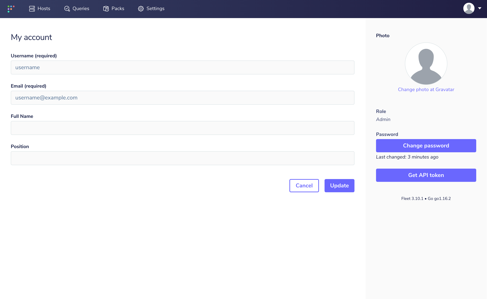

## Filing issues

### Bug report

When filing an issue, make sure to answer these five questions:

#### 1. What version of Fleet are you using? 

Copy the version from the "My account" page in the Fleet UI (located below the "Get API token" button) or by run the `fleetctl version --full` command.

#### 2. What operating system are you using?

#### 3. What did you do?

#### 4. What did you expect to happen?

#### 5. What happened instead?

#### 6. Is this an issue with the Fleet UI?

If the answer is no, you can leave this blank.

If yes, please provide a summary or screenshots of your browser's JavaScript console and your browser's network requests. Why? The information revealed in the browser's console and network requests kickstarts the debugging efforts and thus helps us resolve your issue faster!

To open your browser's **Javascript console**, press Control Shift J (Windows, Linux, ChromeOS) or Command Option J (macOS).

To open your browser's **network requests**, press Control Shift J (Windows, Linux, ChromeOS) or Command Option J (macOS). Then select the "Network" tab.

### Report a security vulnerability

Sensitive security-related issues should be reported to
[fleetdm.com/contact](https://fleetdm.com/contact) before a public issue is made.

## Contributing to documentation

Fleet currently uses GitHub as the central location for documentation.

### Markdown links

Due to the structure of the Fleet documentation and GitHub's unique markdown files, there are several practices we'd like to call out if you're documentation changes include links to other locations within the Fleet docs. 

#### Relative links

When including a link to a different file in the Fleet documentation please use relative links when possible. 

For example, let's say you're working on changes in the Contribution docs and you'd like to add a link to the REST API docs. The relative link would look something like `../01-Using-Fleet/03-REST-API.md`.

#### Special characters in anchor links

There are certain characters GitHub doesn't support in the use of anchor links in markdown files. The general rule we've found is to only use a-z or A-Z characters in anchor links. All other characters should be removed.

For example, consider the section title *How do I connect to the Mailhog simulated server?*. The valid GitHub anchor link for this section is #how-do-i-connect-to-the-mailhog-simulated-server. Notice the *?* character is removed.
