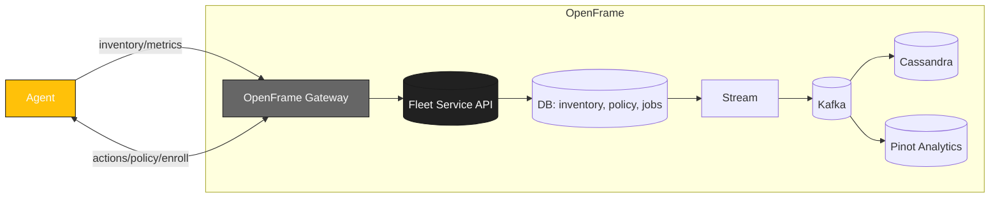

<div align="center">
  <picture>
    <!-- Dark theme -->
    <source media="(prefers-color-scheme: dark)" srcset="docs/assets/logo-openframe-full-dark-bg.png">
    <!-- Light theme -->
    <source media="(prefers-color-scheme: light)" srcset="docs/assets/logo-openframe-full-light-bg.png">
    <!-- Default / fallback -->
    
  </picture>

  <h1>Fleet</h1>

  <p><b>Device & software fleet management that integrates with OpenFrame — provisioning, updates, inventory, policy, and remote actions across Windows, macOS, and Linux.</b></p>

  <p>
    <a href="LICENSE.md">
      
    </a>
    <a href="https://www.flamingo.run/knowledge-base">
      
    </a>
    <a href="https://www.openmsp.ai/">
      
    </a>
  </p>
</div>

---

## Quick Links
- [Highlights](#highlights)
- [Quick Start](#quick-start)
  - [Prerequisites](#prerequisites)
  - [OpenFrame Integration](#openframe-integration)
  - [Architecture](#architecture)
- [Security](#security)
- [Contributing](#contributing)
- [License](#license)  

---

## Highlights

- Cross-platform device management (Windows, macOS, Linux)  
- Zero-touch provisioning (bootstrap scripts / enrollment tokens)  
- Inventory & health (hardware, OS, software, services)  
- Policy engine (baseline hardening, schedule, constraints)  
- Software catalog & updates (install, pin, rollback)  
- Remote actions (scripts, services, processes, files)  
- Compliance reporting (drift, remediation, audit)  
- Integrations: OpenFrame Gateway, Stream (Kafka), Analytics (Pinot), Auth (OIDC/JWT)  
- API-first (REST/GraphQL gateway), web console (operator UI)

---

## Quick Start

### Prerequisites

**For OpenFrame Integration:**
- Kubernetes cluster with kubectl
- Telepresence (for local access to services)

---

### OpenFrame Integration

Fleet is integrated into OpenFrame as **FleetMDM** for device management via osquery.

---

### Architecture

Fleet runs as a service in OpenFrame and talks to endpoint agents via Gateway. Events flow into Stream and Analytics for compliance and dashboards.



#### Deployment

FleetMDM is deployed automatically as part of OpenFrame via ArgoCD app-of-apps pattern:

```yaml
# manifests/apps/values.yaml
apps:
  fleetmdm: 
    enabled: true
    project: integrated-tools
    namespace: integrated-tools
    syncWave: "3"  # Deployed after microservices
```

**Deploy complete OpenFrame stack:**
```bash
# Install with ArgoCD
helm install openframe ./manifests/app-of-apps

# FleetMDM will be deployed automatically along with:
# - MySQL and Redis (StatefulSets)
# - Fleet server with auto-initialization
# - Tool registration job for OpenFrame integration
```

**Access Fleet UI:**
```bash
# Connect to integrated-tools namespace
telepresence connect --namespace integrated-tools

# Fleet UI will be available at:
# http://fleetmdm-server.integrated-tools.svc.cluster.local:8070
```

**For standalone FleetMDM deployment** (not recommended - registration job will fail):
```bash
helm install fleetmdm ./manifests/integrated-tools/fleetmdm
```

#### Integration Features

**Auto-initialization:**
- Creates organization "OpenFrame"  
- Sets up admin and API-only users
- Persists API token at `/etc/fleet/api_token.txt`
- Registers as integrated tool in OpenFrame

**Configuration** is managed via Helm chart at `manifests/integrated-tools/fleetmdm/`.

#### Using Fleet Java SDK

```java
import com.openframe.sdk.fleetmdm.FleetMdmClient;
import com.openframe.sdk.fleetmdm.model.Host;
import com.openframe.sdk.fleetmdm.model.HostSearchRequest;
import com.openframe.sdk.fleetmdm.model.QueryResult;

@Service
public class DeviceManagementService {
    
    private final FleetMdmClient fleetClient;
    
    public DeviceManagementService() {
        this.fleetClient = new FleetMdmClient(
            "http://fleetmdm-server.integrated-tools.svc.cluster.local:8070",
            System.getenv("FLEET_API_TOKEN")
        );
    }
    
    // Get device by ID
    public Host getDevice(long hostId) throws IOException, InterruptedException {
        return fleetClient.getHostById(hostId);
    }
    
    // Search devices
    public List<Host> searchDevices(String query) throws IOException, InterruptedException {
        return fleetClient.searchHosts(query);
    }
    
    // Search with pagination
    public List<Host> searchDevicesPaginated(String query, int page, int perPage) 
            throws IOException, InterruptedException {
        HostSearchRequest request = new HostSearchRequest(query, page, perPage);
        return fleetClient.searchHosts(request);
    }
    
    // Execute osquery on specific device
    public QueryResult executeQuery(long hostId, String sqlQuery) 
            throws IOException, InterruptedException {
        return fleetClient.runQuery(hostId, sqlQuery);
    }
    
    // Example: Get Chrome extensions on device
    public QueryResult getChromeExtensions(long hostId) 
            throws IOException, InterruptedException {
        String query = "SELECT * FROM chrome_extensions";
        return fleetClient.runQuery(hostId, query);
    }
    
    // Get enroll secret for new devices
    public String getEnrollSecret() throws IOException, InterruptedException {
        return fleetClient.getEnrollSecret();
    }
}
```

#### Troubleshooting

**Check deployment status:**
```bash
kubectl get pods -n integrated-tools -l app=fleetmdm-server
kubectl logs -f fleetmdm-server-0 -n integrated-tools
```

**Access Fleet services via Telepresence:**
```bash
# Connect to cluster
telepresence connect --namespace integrated-tools

# Access Fleet UI directly
open http://fleetmdm-server.integrated-tools.svc.cluster.local:8070

# Access MySQL for debugging
mysql -h fleetmdm-mysql-0.fleetmdm-mysql.integrated-tools.svc.cluster.local -u fleet -p

# Access Redis for debugging
redis-cli -h fleetmdm-redis.integrated-tools.svc.cluster.local
```

**Get API token manually:**
```bash
kubectl exec -it fleetmdm-server-0 -n integrated-tools -- \
  cat /etc/fleet/api_token.txt
```

**Reinitialize if needed:**
```bash
kubectl delete pod fleetmdm-server-0 -n integrated-tools
# StatefulSet will recreate automatically
```

For complete documentation:
- [Fleet Official Docs](https://fleetdm.com/docs)
- [osquery Tables Reference](https://osquery.io/schema)
- [OpenFrame Java SDK](https://github.com/flamingo-stack/openframe-oss-lib/tree/main/sdk/fleetmdm)

---

## Security

- All communication is encrypted with TLS 1.2
- OAuth2/OIDC → JWT for authentication (via Gateway)  
- Minimal client-side privileges required  
- Safeguards against unsafe command execution  

Found a vulnerability? Email **security@flamingo.run** instead of opening a public issue.  

---

## Contributing

We welcome PRs! Please follow these guidelines:  
- Use branching strategy: `feature/...`, `bugfix/...`  
- Add descriptions to the **CHANGELOG**  
- Follow consistent Go code style (`go fmt`, linters)  
- Keep documentation updated in `docs/`  

---

## License

This project is licensed under the **Flamingo Unified License v1.0** ([LICENSE.md](LICENSE.md)).

---

<div align="center">
  <table border="0" cellspacing="0" cellpadding="0">
    <tr>
      <td align="center">
        Built with 💛 by the <a href="https://www.flamingo.run/about"><b>Flamingo</b></a> team
      </td>
      <td align="center">
        <a href="https://www.flamingo.run">Website</a> • 
        <a href="https://www.flamingo.run/knowledge-base">Knowledge Base</a> • 
        <a href="https://www.linkedin.com/showcase/openframemsp/about/">LinkedIn</a> • 
        <a href="https://www.openmsp.ai/">Community</a>
      </td>
    </tr>
  </table>
</div>
