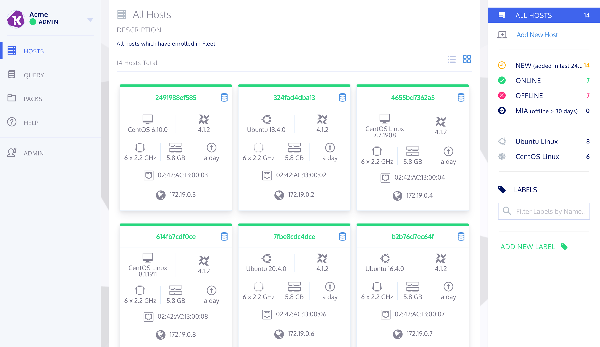
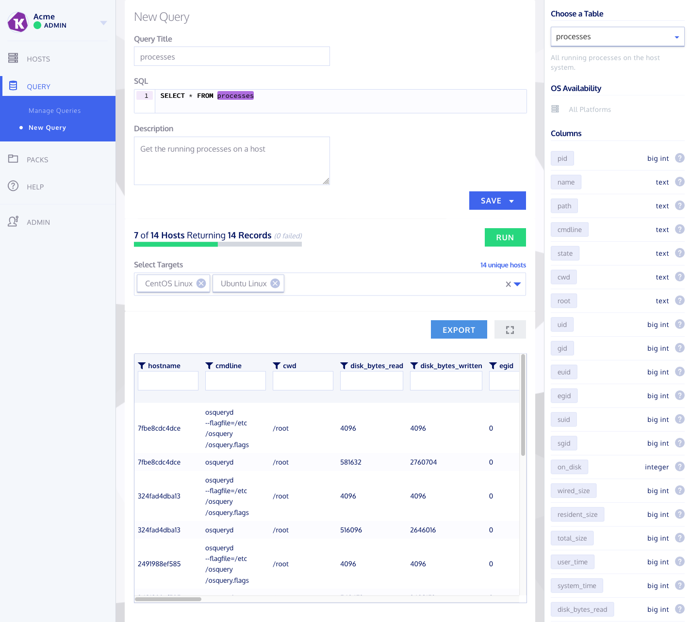
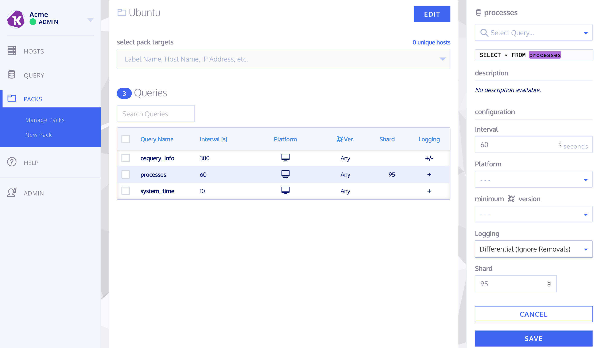

# Fleet [](https://circleci.com/gh/fleetdm/fleet/tree/master) [](https://goreportcard.com/report/github.com/fleetdm/fleet)

Fleet is the most widely used open source osquery manager.  Deploying osquery with Fleet enables programmable live queries, streaming logs, and effective management of osquery across 50,000+ servers, containers, and laptops.  It's especially useful for talking to multiple devices at the same time.


:tada: Announcing the transition of Fleet to a new independent entity :tada:

Please check out [the blog post](https://medium.com/fleetdm/a-new-fleet-d4096c7de978) to understand what is happening with Fleet and our commitment to improving the product.  To upgrade from Fleet ≤3.2.0, just grab the latest release from this repository (it'll work out of the box).

## Preview Fleet

#### Get the latest release of the fleetctl CLI tool

With [node installed](https://nodejs.org/en/download/):
```
npm install -g fleetctl
```

#### Set up a preview deployment of the Fleet server

With [docker installed](https://docs.docker.com/get-docker/):
```
fleetctl preview
```

Preview Fleet at https://localhost:8412.

#### Add containerized hosts to your preview deployment
The [`osquery`](./osquery) directory contains a `docker-compose.yml` and
additional configuration files to start containerized osquery agents. To start
osquery, first retrieve the "Enroll Secret" from Fleet (by clicking the "Add New
Host") button in the Fleet dashboard.

With your "Enroll Secret" copied:
``` shell
cd fleet-preview/osquery
ENROLL_SECRET=<copy from fleet> docker-compose up
```
Refresh the page to see the containerized hosts populate the Fleet dashboard.

## Query editor


<!-- todo: update other screenshots
**Fleet Dashboard**


**Live Queries**


**Scheduled Query/Pack Editor**

-->
## Documentation

Documentation for Fleet can be found [here on GitHub](./docs/README.md).

## Community

#### Chat

Please join us in the #fleet channel on [osquery Slack](https://osquery.slack.com/join/shared_invite/zt-h29zm0gk-s2DBtGUTW4CFel0f0IjTEw#/).

#### Community Projects

Below are some projects created by Fleet community members. Please submit a pull request if you'd like your project featured.

- [Kolide](https://kolide.com) is a cloud-hosted, user-driven security SaaS application.  To be clear: Kolide ≠ Fleet.  Kolide is well-executed, a great commercial tool, and they offer a 30-day free trial.
- [davidrecordon/terraform-aws-kolide-fleet](https://github.com/davidrecordon/terraform-aws-kolide-fleet) - Deploy Fleet into AWS using Terraform.
- [deeso/fleet-deployment](https://github.com/deeso/fleet-deployment) - Install Fleet on a Ubuntu box.
- [gjyoung1974/kolide-fleet-chart](https://github.com/gjyoung1974/kolide-fleet-chart) - Kubernetes Helm chart for deploying Fleet.

