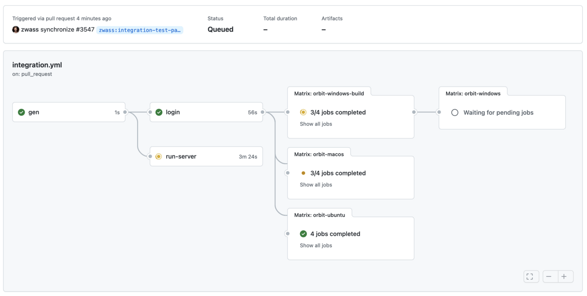

# 4 tips for GitHub Actions usability (+2 bonus tips for debugging)


Here at Fleet, we make [extensive use of GitHub Actions](https://github.com/fleetdm/fleet/tree/main/.github/workflows), and we want to share some tips that we’ve learned along the way. These tips can help save time and money while getting the most value from GitHub Actions.

## 1. Fan out matrix jobs



The [build matrix](https://docs.github.com/en/actions/using-workflows/about-workflows#using-a-build-matrix) is a convenient way to run across combinations of environments. Try performing preparatory work in a separate job that only runs once per workflow, then fanning out to the build matrix

Consider the naive matrix strategy (pseudocode):

```
for each environment combination:
  install dependencies
  build frontend
  build backend
  run integration tests
```

In a complex project like Fleet, installing and building takes a substantial portion of the execution time. That execution time is multiplied across each environment. For our projects using Go, it’s easy to cross-compile for various platforms, meaning that only the `run integration tests` step needs to be run on each platform.

Instead, we can use the improved strategy (pseudocode):

```
install dependencies
build frontend
build backend
upload artifacts

for each environment combination:
  download artifacts
  run integration tests
```

We have found uploading and downloading artifacts to be very fast, and we’ve seen substantial reductions in the total time taken by our workflows when using this strategy. Check out the [GitHub documentation on artifacts](https://docs.github.com/en/actions/advanced-guides/storing-workflow-data-as-artifacts) to see how to achieve this.

## 2. Do work concurrently in the background

You can save time in your job by pulling dependencies while performing other work. In our end-to-end testing job, we [start Docker dependencies while building the code](https://github.com/fleetdm/fleet/blob/ab664e5304cc5f350ecb758a08b1ef0019c83666/.github/workflows/test.yml#L31-L34) so that the network requests can complete in the background and the containers are ready for the tests to begin.

Note that background processes do not exit at the end of the step — They keep running until the whole job completes. With `docker compose`, using the `-d` flag runs the containers in the background. For any other bash command, use `&` to run in the background. For example:

```
- name: Start Docker Compose (background)
  run: docker compose up -d
- name: Other work (background)
  run: ./do-work.sh &
```

## 3. Expose a server to the internet
It’s often helpful to expose a server running inside the job to the internet. We do this for manual QA from our web browser, or to connect clients from one job to a server running in another job. [localtunnel](https://github.com/localtunnel/localtunnel) makes this easy.

To start a tunnel on port 1337 in the background, use `&` as described above.

```
- name: Start tunnel
  run: |
    npm install -g localtunnel
    lt --port 1337 &
```

Look in the step output for the assigned hostname, or consider using the `--subdomain` flag to request a consistent hostname so that other jobs can connect.

## 4. Avoid duplicate runs with `push` and `pull_request`

This configuration will cause the Action to run twice for every push to a pull request, doubling the cost if you pay for GitHub Actions:

```
on:
  push:
  pull_request:
```


*One commit, two Workflow runs*

Instead, consider running only on pushes to the default branch (`main`/`master`):

```
on:
  push:
    branches:
    - main
  pull_request:
```

## 5. Scrollback is only available for output since the UI was opened

If you’ve ever tried to debug a long-running job step but couldn’t see the output you need for debugging, this seems to be a [known issue](https://github.community/t/how-to-see-the-full-log-while-a-workflow-is-in-progress/17455/2) with GitHub Actions. You can work around it by canceling the step or waiting for it to complete.


*Where is the output for Steps 1 & 2?*


*After cancel, full output is available.*

## 6. SSH into runners for debugging

Sometimes getting a shell on the machine is the easiest way to figure out why things are going wrong. Use `mxschmitt/action-tmate` to SSH into the GitHub Actions runner. It’s a simple addition to the job steps:

```
- name: Debug via SSH
  uses: mxschmitt/action-tmate@8b4e4ac71822ed7e0ad5fb3d1c33483e9e8fb270 # v3.11
```

https://github.com/mxschmitt/action-tmate

When the Action reaches this step, an SSH server starts, and connection information is printed to the output in the Checks tab every 5 seconds (the repetitive output is intended to work around the scrollback issue described above).

For security, consider using the [SSH public key authentication option](https://github.com/mxschmitt/action-tmate#use-registered-public-ssh-keys). You can also [continue the workflow](https://github.com/mxschmitt/action-tmate#continue-a-workflow) while connected.

It’s also possible to start the SSH server at the end of the job when one of the steps has failed:

```
- name: Debug on failure
  if: failure()
  uses: mxschmitt/action-tmate@8b4e4ac71822ed7e0ad5fb3d1c33483e9e8fb270 # v3.11
```

---

Fleet is building an open future for device management, starting with the [most widely deployed osquery fleet manager](https://fleetdm.com/).

Are you interested in working full-time in [Fleet’s public GitHub repository](https://github.com/fleetdm/fleet)? We’re [hiring remote engineers](https://fleetdm.com/jobs), worldwide.


<meta name="category" value="engineering">
<meta name="authorGitHubUsername" value="zwass">
<meta name="authorFullName" value="Zach Wasserman">
<meta name="publishedOn" value="2022-01-03">
<meta name="articleTitle" value="4 tips for GitHub Actions usability (+2 bonus tips for debugging)">
<meta name="articleImageUrl" value="../website/assets/images/articles/4-tips-for-github-actions-usability-cover-1600x900@2x.jpg">