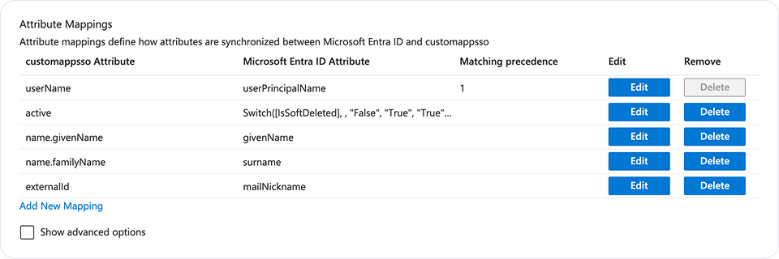

# Add user information from identity provider (IdP) to host

_Available in Fleet Premium._

Learn how to connect your identity provider (IdP) to retrieve end-user information and map it to a
host. Fleet uses [SCIM](https://scim.cloud/) protocol.

Below you can learn how to connect [Okta](https://www.okta.com/), [Microsoft Entra ID](https://www.microsoft.com/en-us/security/business/identity-access/microsoft-entra-id) or [Authentik](https://goauthentik.io/).


## Connect Okta

To connect Okta to Fleet, follow these steps:

1. Head to Okta admin dashboard
2. Select **Applications > Applications** in the main menu, then select **Create App Integration**.
3. Select **SAML 2.0** option and select **Next**.
4. On **General Settings** page, add friendly **App name** (e.g Fleet SCIM), and select **Next**.
5. On **SAML Settings** page, add any URL to **Single sign-on URL** and **Audience URI (SP Entity ID)** fields, and select **Next**.
>Okta requires to setup SAML settings in order to setup SCIM integration. Since we don't need SSO, URL can be anything.
6. On **Feedback** page, provide feedback if you want, and select **Finish**.
7. Select **General** tab of the newly created app, then select **Edit** in **App Settings**.
8. For **Provisioning**, select **SCIM**, and select **Save**.
9. Select **Provisioning** tab, then in **SCIM Connection**, select **Edit**.
10. In **SCIM connector base URL**, enter `https://<your_fleet_server_url>/api/v1/fleet/scim`.
11. In **Unique identifier field for users**, enter `userName`.
12. For **Supported provisioning actions**, select **Push New Users**, **Push Profile Updates**, and **Push Groups**.
13. For **Authentication Mode** select **HTTP Header**.
14. Create Fleet API-only user with maintainer permissions, copy API token for that user, and paste it to Okta, in **Authorization** field.
15. Select **Test Connector Configuration** button. You should see success message in Okta.
16. Head to Fleet, select **Settings > Integrations > Identity provider (IdP)** and verify that Fleet successfully received the request from IdP.
17. Back in Okta, select **Save**
18. Under **Provisioning** tab, select **To App**, then select **Edit** in **Provisioning to App** section. Enable **Create Users**, **Update User Attributes**, and **Deactivate Users**, then select **Save**.
19. On the same page, make sure that `givenName` and `familyName` have Okta value assigned to it.
    Currently, Fleet support `userName`, `givenName`, and `familyName` SCIM attributes and they are
    required as well. Delete the rest of the attributes.


### Assign users and groups to Fleet

To send users and groups information to Fleet, you have to assign them to SCIM app that you created previously.

1. Select **Directory > Groups** in the main menu, then select **Add group**. Name it so you know that users from this group will be provisioned to Fleet (e.g "Fleet human-device mapping").
2. On the same page, select **Rules** tab. Create rule that will assign users from groups that you want to provision to Fleet to newly created "Fleet human-device mapping" group.

3. Select **Applications > Applications** in the main menu, select app that you created previously, then select **Assignements** tab.
4. Select **Assign > Assign to Groups**, then click **Assign** next to the "Fleet human-device mapping" group, then select **Done**. Now all users that you assigned to "Fleet human-device mapping" group via rule will be provisioned to Fleet. It may take a while if you have many users.
5. On the same page, select **Push Groups** tab, then select **Push Groups > Find groups by name**,
   and add all groups that you assigned via rule to "Fleet human-device mapping" group previously (make sure that
   **Push group memberships immediately** is selected). All groups will be provisioned to
   Fleet, and Fleet will map those groups to already provisioned users .


## Connect Microsoft Entra ID

To connect Entra ID to Fleet, follow these steps:

1. Head to [Microsoft Entra admin](https://entra.microsoft.com/).
2. Select **Applications > Enterprise applications** in the main menu, select **+ New
   application**, then select **+Create your own application**.
3. Add a friendly name of the app (e.g Fleet SCIM), select **Integrate any other application you
   don't find in the gallery (Non-gallery)**, then select **Create**.
4. Select **Provisioning** from the side menu.
5. In **Get started with application provisioning** section, select **Connect your application**.
6. In **Tenant URL**, enter `https://<your_fleet_server_url>/api/v1/fleet/scim`.
7. Create Fleet API-only user with maintainer permissions, copy API token for that user, and paste
   it in **Secret token** field.
8. Select **Test connection** button. You should see success message.
9. Select **Create** and after successfull creation, you'll be redirected to the overview page.
10. Select **Attribute mapping** from the side menu, then select **Provision Microsoft Entra ID
    Groups**.
11. Ensure that the attributes `displayName`, `members`, and `externalId` are
    mapped to **Microsoft Entra ID Attribute**. Currently, Fleet support only these attributes and they are required as well. Delete the rest of the attributes, select **Save**, and after it's
    saved, select close icon on the top right corner.
    
12. Select **Provision Microsoft Entra ID Users**.
13. Ensure that the attributes `userName`, `givenName`, `familyName`, `active`, and `externalId` are
    mapped to **Microsoft Entra ID Attribute**. Currently, Fleet support only these attributes and
    they are required as well. Delete the rest of the attributes, select **Save**, and after it's
    saved, select close icon on the top right corner.
  
14. Select **Users and groups** from the side menu, select **+ Add user/group**, then select
    **None Selected** link.
    
15. Select users and groups that you want to add to Fleet, then select
    **Assign**. 
16. Select **Overview** from the side menu and select **Start provisioning**.

> After you started provisioning Microsoft Entra ID sends data to Fleet immediately. Subsequent
> requests are triggered every 20-40 minutes. If you edit user information in Entra, it might
> take up to 40 minutes to see the change in Fleet.

## Connect Google Workspace

Google Workspace doesn't support SCIM provisioning, so we suggest using [authentik](https://goauthentik.io/) to import users from Google Workspace and then add users to Fleet via SCIM protocol.

### Prerequisites

- [Install](https://docs.goauthentik.io/docs/install-config/install/aws) and run authentik
- Google Workspace Business Plus plan (or one of the plans listed in [Google Secure LDAP](https://support.google.com/a/answer/9048516?hl=en&ref_topic=9048334&sjid=5482490660946222035-EU) article)

### How to connect

- [Add LDAP client in Google Admin console](#1-add-ldap-client-in-google-admin-console)
- [Add LDAP authentication certificate to authentik](#2-add-ldap-authentication-certificate-to-authentik)
- [Add custom LDAP property mappings to authentik](#3-add-custom-ldap-property-mappings-to-authentik)
- [Configure LDAP connection in authentik](#4-configure-ldap-connection-in-authentik)
- [Configure SCIM provider and application in authentik to add users to Fleet](#5-add-users-from-authentik-to-fleet)

Below you can learn how to do each step above.

#### 1. Add LDAP client in Google Admin console

1. Head to [Google Admin console](https://admin.google.com/)
2. Select **Apps > LDAP** from the side menu.
3. Select **ADD CLIENT**, add friendly name (e.g. authentik) and description, then select **CONTINUE**.
4. Select **Entire domain** in **Verify user credentials** and **Read user information** sections.
5. Toggle switch under **Read group information** to **On,** and select **ADD LDAP CLIENT**.
6. Select **Download certificate**, and select **CONTINUE TO CLIENT DETAILS**.
7. Select **Authentication card**, select **GENERATE NEW CREDENTIALS**.
8. Save **Username** and **Password**, beacuse we'll need those together with downloaded certificate in the next sections, to connect authentik to Google LDAP.


#### 2. Add LDAP authentication certificate to authentik

1. Navigate to your authentik admin dashboard
2. Select **System > Certificates** from the side menu.
3. Select Create, and add friendly name (e.g. Google LDAP certificate).
4. Now find downloaded certificate on your computer, unarchive it, then open `.crt` with text editor (e.g. TextEdit), copy its content and paste to **Certificate** field.
5. Open `.key` file with text editor and copy its content to **Private key** field, then select **Create**.

#### 3. Add custom LDAP property mappings to authentik

1. In authentik, select **Customization > Propery Mappings** from the side menu.
2. Select **Create**, then select **LDAP Source Property Mapping** from the list, and select **Next**.
3. You need to repeat this few times and add each of these property mappings below:

- **Name**: Google LDAP objectSid > ldap_uniq
- **Expression**:
    ```
    return {
        "attributes": {
            "ldap_uniq": ldap.get("objectSid"),
        },
    }
    ```

- **Name**: Google LDAP objectSid > ldap_uniq  
- **Expression**:
    ```
    return {
        "username": ldap.get("mail"),
    }
    ```

- **Name**: Google LDAP mail > email  
- **Expression**:
    ```
    return {
        "email": ldap.get("mail"),
    }
    ```

- **Name**: Google LDAP givenName > first_name
- **Expression**:
    ```
    return {
        "attributes": {
            "first_name": ldap.get("givenName"),
        },
    }
    ```


- **Name**: Google LDAP sn > last_name
- **Expression**:
    ```
    return {
        "attributes": {
            "last_name": ldap.get("sn"),
        },
    }
    ```

- **Name**: Google LDAP displayName > name
- **Expression**:
    ```
    return {
        "name": ldap.get("displayName")
    }
    ```

- **Name**: Google LDAP displayName > name
- **Expression**:
    ```
    return {
        "name": ldap.get("displayName")
    }
    ```

- **Name**: Google LDAP displayName to name (group)
- **Expression**:
    ```
    return {
        "name": ldap.get("displayName")
    }
    ```

- **Name**: Google LDAP objectSid to ldap_uniq (group)
- **Expression**:
    ```
    return {
        "attributes": {
            "ldap_uniq": ldap.get("objectSid"),
        },
    }
    ```

#### 4. Configure LDAP connection in authentik

1. Select **Directory > Federation and Social login** from the side menu.
2. Select **Create**, then select **LDAP Source**, and select **Next**.
3. Add friendly name (e.g. Google LDAP)
4. Make sure that **Enable**, **Sync users** and **Sync groups** are toggled on.
5. In **Server URL** enter `ldap://ldap.google.com`.
6. For **TLS client authentication certificate** select certificate created in 2nd section (Google LDAP certificate)
7. For **Bind CN** enter userneame that you saved in the first section, and for **Bind Password** enter password that you saved.
8. In **Base DN**, enter your Google Workspace domain in a DN format (e.g. dn=yourcompany,dn=com).
9. For **User Property Mappings,** remove all selected properties by clicking "X" icon, and select all user properties that we created in the section above in the left box and select ">" icon between boxes.
10. For **Group Property Mappings**, remove all selected properties by clicking "X" icon, and select all group properties that we created in the section above in the left box and select ">" icon between boxes.
11. Under **Additional settings** enter values below.
12. **User object filter** > `(objectClass=person)`,  **Group object filter** > `(objectClass= groupOfNames)`, **Group membership field** > `member`, **Object uniqueness field** > `objectSid`
13. Select **Finish** to save configuration. 
14. After few minutes, on **Directory > Users** page you should see users from your Google Workspace.

#### 5. Add users from authentik to Fleet

1. Select **Applications > Providers** from the side menu, select **Create**, then select **SCIM Provider**, and select **Next**.
2. Add friendly name (e.g. Fleet SCIM provider).
3. In **URL**, enter `https://<your_fleet_server_url>/api/v1/fleet/scim`.
4. Create Fleet API-only user with maintainer permissions, copy API token for that user, and paste it to authentik, in **Token** field.
5. Select **Finish** to save provider.
6. Now, select **Applications > Applications** from the side menu, and select **Create**.
7. Add friendly name (e.g. Fleet SCIM app) and slug (e.g. fleet-scim-app).
8. For **Backchannel Providers**,** **select provider created above (Fleet SCIM provider).
9. Select **Create** to add application.
10. After few minutes, you should see that users are added in Fleet, if you go to Fleet and navigate
    to **Settings > Integrations > Identity Provider (IdP)**. 


## Verify connection in Fleet

After following steps above, you should be able to see latest requests from Okta to Fleet if you
navigate to **Settings > Integrations > Identity Provider (IdP)**. 

To verify that user information is added to a hosts, go to the host that has IdP email assigned, and
verify that **Full name (IdP)** and **Groups (IdP)** are populated correctly.

### Troubleshoot errors

If you find that information from IdP (e.g full name or groups) is missing on the host, and host has
IdP email assigned to it, follow steps below to resolve.

1. Please first go to Okta, select **Directory > People**, find user that is
missing information and make sure that it has all fields required by Fleet (username, first name and
last name).
2. If all required fields are present, then go to **Applications > Applications > fleet_scim_application > Provisioning > To App**, then scroll on the bottom of the page and make sure that `userName`, `givenName`, and `familyName` has value assigned to it.
3. Otherwise make sure that all settings from instructions above were set correctly.

<meta name="authorGitHubUsername" value="marko-lisica">
<meta name="authorFullName" value="Marko Lisica">
<meta name="publishedOn" value="2025-04-11">
<meta name="articleTitle" value="Add user information from identity provider (IdP) to host">
<meta name="category" value="guides">