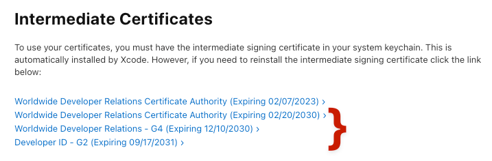

# Apple developer certificates on Linux for configuration profile signing


Streamlining development processes across different operating systems is more crucial than ever. Ensuring the integrity and security of your software and, in this example, configuration profiles is paramount whether for iOS, macOS, watchOS, tvOS, or visionOS. This is where signing assets with an Apple Developer identity comes into play. By leveraging Apple Developer certificates, developers can sign code, applications, and configuration profiles, thereby asserting their authenticity and safeguarding them against tampering.

But what if your development environment or continuous integration/continuous deployment (CI/CD) workflows are based on Linux? The reality is that many development teams prefer Linux for its flexibility, power, openness, and containerization, particularly in server environments, automated testing, and cloud-based development workflows. Whether you're using Linux as part of an automated CI/CD workflow in AWS, GitHub Actions, or another system, the need to sign assets with an Apple Developer identity on a Linux platform is a common scenario that can pose unique challenges.

This guide is designed to bridge that gap. It walks you through the process of installing Apple Developer certificates on a Linux system, enabling you to sign assets and configuration profiles seamlessly, even outside the Apple ecosystem. By following these steps, you can integrate Apple's security practices into your Linux-based development workflows, ensuring that your applications maintain their integrity and security, no matter where they are developed or deployed.


## Create a certificate signing request (CSR)

Before we generate the CSR and deal with private keys, we must understand the importance of securing them. Private keys (`application.key` in this context) are the backbone of your application's security and authenticity. If compromised, they could allow malicious actors to sign applications or code as if they were you, potentially leading to severe security breaches. Taking steps to restrict access, encrypt with strong passwords, and securely backup you can significantly reduce the risk of handling private keys and ensure the security of your development workflow.


1. On your Linux host, do updates or upgrades as needed, then navigate to the `/tmp` directory:
```
sudo apt get update
sudo apt get upgrade
sudo apt install p11-kit
sudo apt-get install -y ca-certificates
cd /tmp
```

2. Create a 2048-bit key pair, and a certificate signing request with the following command:
```
openssl req -nodes -newkey rsa:2048 -keyout application.key -out application.csr
````
3. The `.csr` can be viewed with the following command (which will show the password used to create these files in plain text):
```
openssl req -in installer.csr -noout -text
```


## Create a developer certificate

For the next part of the process, you'll need access to the Apple Developer portal, which requires a web browser. Because of this, we need to move the CSR file created on your Linux server to a computer with browser access. This transfer ensures you can upload the file to Apple's Developer website in a subsequent step.

To securely transfer the file from your Linux system to another computer, use the `scp` (Secure Copy Protocol) command. This command encrypts the file as it's transferred over the network, protecting your sensitive information.


1. Execute the following command in your Linux system's terminal, replacing `admin@<FQDN or IP>` with your user name and the fully qualified domain name or IP address of your target computer: 
```
scp admin@<FQDN or IP>:/tmp/application.csr /Users/Shared/
``` 
This command prompts you to authenticate with the target computer's credentials. Once authenticated, it will copy the `application.csr` file to the specified directory, readying it for the next steps in the Apple Developer portal.

2. Log into [developer.apple.com](http://developer.apple.com) with your Apple Developer credentials.
3. Navigate to Account > Certificates, IDs & Profiles > Certificates.
4. Click the **+** button next to Certificates:


5. Scroll to the bottom of the page, and download all current Apple Intermediate Certificates (NOTE: certificates may be listed with dates past expiry.):



6. Once you've downloaded the intermediate certificate, scroll up to the "Software" section and select "Developer ID Application," then click "Continue".


7. Select the "G2 Sub-CA" profile type (or whatever Profile Type is NOT listed as "Previous Sub-CA").
8. Click **Choose File** to upload the `application.csr` file created and copied from your Linux host.
9. After completing the upload, click "Continue" to download the certificate.


10. Move all downloaded certificates, and a `.mobileconfig` file to your Linux host with a command like:

```
scp ~/Downloads/{AppleWWDRCAG3.cer,AppleWWDRCAG4.cer,DeveloperIDG2CA.cer,developerID_application.cer,profile.mobileconfig} admin@<FQDN or IP>:/tmp

```


11.  The `/tmp` directory on your Linux host should now contain the following files:
12.  Convert Apple `.cer` files to `.pem`, then rename with `.crt` file extensions.


```
openssl x509 -inform der -in AppleWWDRCAG3.cer -out AppleWWDRCAG3.pem
openssl x509 -inform der -in AppleWWDRCAG4.cer -out AppleWWDRCAG4.pem
openssl x509 -inform der -in DeveloperIDG2CA.cer -out DeveloperIDG2CA.pem
for file in *.pem; do mv -- "$file" "${file%.pem}.crt"; done
```


13.  Add the Apple Intermediate Certificates to the Linux trust store ( it may also be necessary to move an Apple root certificate to the trust store.):


```
mv /tmp/{AppleWWDRCAG3.crt,AppleWWDRCAG4.crt,DeveloperIDG2CA.crt} /usr/local/share/ca-certificates/
sudo update-ca-certificates
```


14.  Convert the signing certificate from `.cer` to `.pem` then change the file extension to `.crt`:


```
openssl x509 -inform der -in developerID_application.cer -out developerID_application.pem
mv developerID_application.pem developerID_application.crt
```


## Sign the profile using the signing certificate


1. Sign the profile:


```
openssl smime -sign -in profile.mobileconfig -out signed.mobileconfig -inkey application.key -signer developerID_application.crt -outform der -nodetach
```


2. To verify signing, run the following command:


```
cat signed.mobileconfig
```


3. To verify file integrity, strip the profile signature, and compare the original profile against the unsigned profile:


```
openssl cms -in signed.mobileconfig -inform der -verify -nosigs -noverify -out unsigned.mobileconfig; diff -sy profile.mobileconfig unsigned.mobileconfig
```


## Streamlining your CI/CD workflow

This guide should help integrate the Apple Developer security practices into your Linux-based development environment. Signing `.mobileconfig` files on Linux allows you to automate the signing and deployment of MDM configuration profiles, ensuring that your device management workflows are secure and efficient.

Incorporating these steps into your CI/CD pipeline can streamline your deployment process. Automated signing eliminates manual intervention, reducing the potential for human error and freeing up time for other tasks. Consider exploring further automation opportunities within your CI/CD workflow. The goal is to create a seamless pipeline that enhances security and increases your team's productivity and deployment reliability.


<meta name="articleTitle" value="Apple developer certificates on Linux for configuration profile signing">
<meta name="authorFullName" value="Brock Walters">
<meta name="authorGitHubUsername" value="nonpunctual">
<meta name="category" value="guides">
<meta name="publishedOn" value="2024-03-06">
<meta name="articleImageUrl" value="../website/assets/images/articles/apple-developer-certificates-on-linux-for-configuration-profile-signing-1600x900@2x.png">
<meta name="description" value="This guide walks through the process of adding an Apple signing certificate to a Linux host.">
