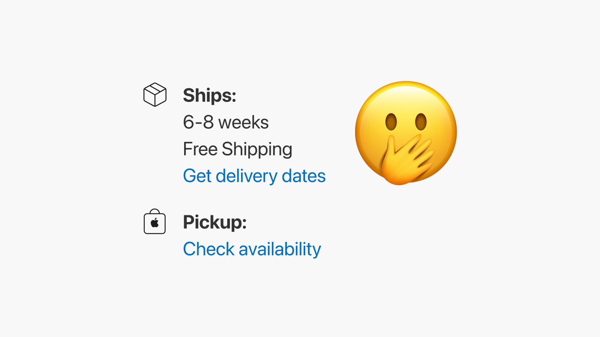

# Apply BYOD to soothe supply chain pain

With remote work becoming the norm, it’s now common for companies to use Apple’s [Automated Device Enrollment](https://support.apple.com/en-us/HT204142) or Windows [Autopilot](https://docs.microsoft.com/en-us/mem/autopilot/windows-autopilot#:~:text=Windows%20Autopilot%20is%20a%20collection,them%20ready%20for%20productive%20use.&text=Using%20cloud%2Dbased%20services%2C%20Windows,required%20to%20maintain%20the%20devices.).

Nothing beats buying a laptop online and having it shipped to a new hire, pre-configured. Awesome, right? It is, but it can get more complicated.

*Dreaded 6–8 weeks shipping delay*

When employees wait for their laptops, productivity suffers.

To solve this issue at Fleet, we take a hybrid approach. We do everything we can to get the devices fast. Then, we allow people to Bring Their Own Devices (BYOD) by carefully managing risk.

Here is how you can implement a similar approach.

## Getting the devices

Order laptops as quickly as possible in the hiring process. That might mean having to pay for one to be shipped back if a candidate changes their mind, but the benefits outweigh the risk.

In countries where you hire a lot, stash a few laptops. You could have a few lower-end loaners or, if you usually order pretty standard configurations, keep a few of those as a buffer that you renew continuously.

## Allow people to work from personal devices but control the risk it creates.

To do so, we leverage security features in our SaaS providers. At Fleet and many other organizations, Google Workspace is the main productivity tool, and it is also used to authenticate employees in other SaaS tools. Office365 has similar features, but you can apply similar principles to reach your security and productivity goals no matter what you use.

## Limit local data

Limit what can be accessed on the web and locally. For example, allow access to files on the web but prevent local synchronization on personal computers.

- [Prevent Google Drive sync](https://support.google.com/a/answer/9299541?product_name=UnuFlow&hl=en&visit_id=637798806258647022-3302602769&rd=1&src=supportwidget0&hl=en)
- [Prevent OneDrive sync](https://docs.microsoft.com/en-us/onedrive/use-group-policy)

You can do the same for email data by only allowing access to email via web applications such as Gmail itself from personal devices and allowing the use of IMAP only for specific clients, such as the iOS Mail client.

- [Disabling POP/IMAP and OAuth clients on Google Workspace](https://support.google.com/a/answer/105694?product_name=UnuFlow&hl=en&visit_id=637799276035281159-4129883793&rd=1&src=supportwidget0&hl=en)
- [Disabling POP/IMAP on Office365](https://docs.microsoft.com/en-us/exchange/clients/pop3-and-imap4/configure-mailbox-access?view=exchserver-2019)

## Do not blindly trust endpoints

Reducing trust in networks and endpoints has security benefits beyond BYOD, but options are available that also enable productivity through dynamic access levels to applications and data depending on the security status and ownership of the device.

First, authentication must be secured. By ensuring sessions are short, that Multi-Factor Authentication (MFA) is in use, and that the device cannot be trusted permanently, you can mitigate the risk of using SaaS accounts on personal devices.

**Google Workspace:**

- [Deploy 2-Step Verification](https://support.google.com/a/answer/9176657?product_name=UnuFlow&hl=en&visit_id=637798806258647022-3302602769&rd=1&src=supportwidget0&hl=en#zippy=%2Callow-users-to-turn-on--step-verification%2Censure-a-smooth-transition-to-an-enforcement-policy%2Cturn-on-enforcement%2Cchoose-a--step-verification-method-to-enforce)
- [Set session length for Google services](https://support.google.com/a/answer/7576830?hl=en)

**Office365:**

- [Set up multifactor authentication](https://docs.microsoft.com/en-us/microsoft-365/admin/security-and-compliance/set-up-multi-factor-authentication?view=o365-worldwide)
- [Session timeouts for Microsoft 365](https://docs.microsoft.com/en-us/microsoft-365/enterprise/session-timeouts?view=o365-worldwide)

That takes care of authentication. Now, time to grant dynamic access based on the ownership and status of devices.

First, define what your policy should be. Allowing access to Slack is different from allowing SSH access to database servers with personal customer data. You need to understand what you are trying to achieve before using these tools to implement controls to support that policy.

Using tools such as Google’s [Context-Aware Access](https://support.google.com/a/answer/9275380?product_name=UnuFlow&hl=en&visit_id=637798806258647022-3302602769&rd=1&src=supportwidget0&hl=en) or Microsoft’s [Conditional Access](https://docs.microsoft.com/en-us/microsoft-365/campaigns/m365-campaigns-conditional-access?view=o365-worldwide#consider-using-conditional-access), it is possible to evaluate a device’s ownership as well as status before granting it access to applications.

A few examples:

- Grant access to synchronize Google Drive only to company-owned computers that are encrypted.
- Grant access to email only from up-to-date computers, personal or otherwise.
- Only allow access to production support from company-owned devices with a corporate certificate.

## Source code

As an open-source company, our code’s integrity takes precedence over confidentiality. The same is true for many proprietary projects. You can protect the integrity of your code, no matter what device and git client is used, by using [branch protection rules](https://docs.github.com/en/repositories/configuring-branches-and-merges-in-your-repository/defining-the-mergeability-of-pull-requests/managing-a-branch-protection-rule) to require code reviews and commit signing.

Solutions for working on remote desktops can make critical use cases possible from personal devices. Ensure you need them before accepting their cost, complexity, and impact on user experience.

## Supply issues won’t end tomorrow, so make a plan!

Supply chain issues will get better, but they will not disappear. Even if they did, the availability of laptops usually suffers when new models are released. By carefully allowing personal computers for some work, you can ensure your new hires can be productive and feel useful right away while balancing a growing organization’s security and productivity goals!

<meta name="category" value="security">
<meta name="authorGitHubUsername" value="GuillaumeRoss">
<meta name="authorFullName" value="Guillaume Ross">
<meta name="publishedOn" value="2022-02-10">
<meta name="articleTitle" value="Apply BYOD to soothe supply chain pain">
<meta name="articleImageUrl" value="../website/assets/images/articles/apply-byod-to-soothe-supply-chain-pain-cover-1600x900@2x.jpg">