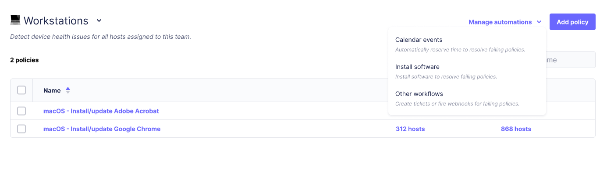
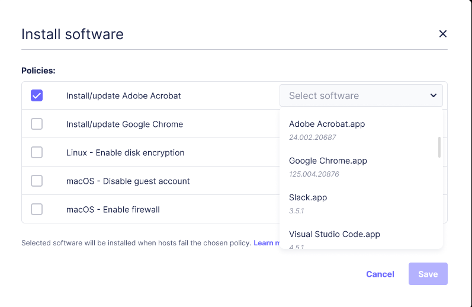
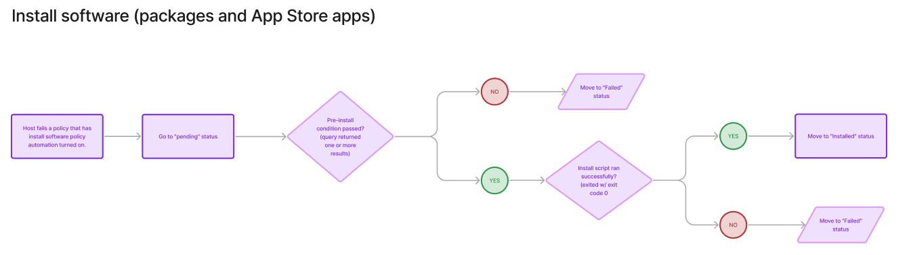

# Automatically install software

_Available in Fleet Premium_

With Fleet, you can automatically install software across your macOS, Windows, and Linux hosts.

## Prerequisites

* Fleet Premium with Admin permissions.
* Fleet [v4.57.0](https://github.com/fleetdm/fleet/releases/tag/fleet-v4.57.0) or greater, or [v4.63.0](https://github.com/fleetdm/fleet/releases/tag/fleet-v4.63.0) or greater for Apple App Store (VPP) apps.
* For VPP apps, see [additional prerequisites](https://fleetdm.com/guides/install-vpp-apps-on-macos-using-fleet#prerequisites).

## Step-by-step instructions

1. **Adding software**: Follow the [deploying software](https://fleetdm.com/guides/deploy-security-agents) guide to make a software title available for installation. Note that for Fleet maintained Apps and custom packages all installation steps (pre-install query, install script, and post-install script) will be executed as configured, regardless of the policy that triggers the installation.

Current supported software deployment formats:
- macOS: .pkg and App Store (VPP)
- Windows: .msi, .exe
- Linux: .deb, .rpm

> As of v4.62.0, Fleet can create an automatic install policy for you when you upload a custom package or add a Fleet Maintained App. If you use this "Automatic" installation mode, you do not have to create your own policy, so you can skip the remaining steps of this process.

2. **Add a policy**: In Fleet, add a policy that failure to pass will trigger the required installation. Go the **Policies** tab, select a team, then press the **Add policy** button. Next, click **Create your own policy**, enter your policy SQL, click **Save**, fill in remaining details in the Save modal, then and click **Save** again.

```sql
SELECT 1 FROM apps WHERE name = 'Adobe Acrobat Reader.app' AND version_compare(bundle_short_version, '23.001.20687') >= 0;
```

> In order to know the exact application name to put in the query (e.g. "Adobe Acrobat Reader.app" in the query above) you can manually install it on a canary/test host and then query `SELECT * from apps;`

3. **Open the software install automation modal**: In the **Policies** tab, click the **Manage automations** button on the top-right, then select **Install software** from the context menu that pops up.



4. **Select policy**: Click the checkbox next to your newly created policy's name. To the right of it select from the
   drop-down list the software you would like to be installed upon failure of this policy.



Upon failure of the selected policy, the selected software installation will be triggered.

> Adding a software automation to a policy, or changing the automated software title, will reset the policy's host counts.

## How does it work?

* After configuring Fleet to auto-install a specific software the rest will be done automatically.
* The policy check mechanism runs on a typical one-hour cadence on all online hosts. 
* Fleet will send install requests to the hosts on the first policy failure (first "No" result for the host) or if a policy goes from "Yes" to "No". Currently, Fleet will not send an install request if a policy is already failing and continues to fail ("No" -> "No"). See the following flowchart for details.


*Detailed flowchart*

App Store (VPP) apps won't be installed if a host has MDM turned off or if you run out of licenses (purchased in Apple Business Manager). Currently, these errors aren't surfaced in Fleet. After turning MDM on for a host or purchasing more licenses, you can retry installing the app on the host's Host details page (learn how [here](https://fleetdm.com/guides/deploy-software-packages#install-the-package)). To retry on multiple hosts at once, head to **Policies > Manager Automations** in Fleet and turn the app's policy automation off and back on.

Currently, App Store apps (VPP) are not installed as [Managed Apps](https://support.apple.com/guide/deployment/distribute-managed-apps-dep575bfed86/web). Uninstalling VPP apps is coming soon.

## Templates for policy queries

Use the following policy templates to see if the software is already installed. Fleet uses these templates to automatically install software.

### macOS (pkg and VPP)

```sql
SELECT 1 FROM apps WHERE name = '<SOFTWARE_TITLE_NAME>' AND version_compare(bundle_short_version, '<SOFTWARE_PACKAGE_VERSION>') >= 0;
```

> `SOFTWARE_TITLE_NAME` includes the `.app` extension. You can also use `bundle_identifier` for a more precise match that works if an end user renames the app on their machine.

### Windows (msi and exe)

```sql
SELECT 1 FROM programs WHERE name = '<SOFTWARE_TITLE_NAME>' AND version_compare(version, '<VERSION>') >= 0;
```

### Debian-based (deb)

```sql
SELECT 1 FROM deb_packages WHERE name = '<SOFTWARE_TITLE_NAME>' AND version_compare(version, '<SOFTWARE_PACKAGE_VERSION>') >= 0;
```

If your team has both Ubuntu and RHEL-based hosts then you should use the following template for the policy queries:
```sql
SELECT 1 WHERE EXISTS (
   -- This will mark the policies as successful on non-Debian-based hosts.
   -- This is only required if Debian-based and RPM-based hosts share a team.
   SELECT 1 WHERE (SELECT COUNT(*) FROM deb_packages) = 0
) OR EXISTS (
   SELECT 1 FROM deb_packages WHERE name = '<SOFTWARE_TITLE_NAME>' AND version_compare(version, '<SOFTWARE_PACKAGE_VERSION>') >= 0
);
```

### RPM-based (rpm)

```sql
SELECT 1 FROM rpm_packages WHERE name = '<SOFTWARE_TITLE_NAME>' AND version_compare(version, '<SOFTWARE_PACKAGE_VERSION>') >= 0;
```

If your team has both Ubuntu and RHEL-based hosts then you should use the following template for the policy queries:
```sql
SELECT 1 WHERE EXISTS (
   -- This will mark the policies as successful on non-RPM-based hosts.
   -- This is only required if Debian-based and RPM-based hosts share a team.
   SELECT 1 WHERE (SELECT COUNT(*) FROM rpm_packages) = 0
) OR EXISTS (
   SELECT 1 FROM rpm_packages WHERE name = '<SOFTWARE_TITLE_NAME>' AND version_compare(version, 'SOFTWARE_PACKAGE_VERSION') >= 0
);
```

## Via the API

Fleet provides a REST API for managing policies, including software install automations. Learn more about Fleet's [REST API](https://fleetdm.com/docs/rest-api/rest-api#add-team-policy).

## Via GitOps

To manage software automations using Fleet's best practice GitOps, check out the `install_software` key in the [policies section of the GitOps reference documentation](https://fleetdm.com/docs/configuration/yaml-files#policies).

## Conclusion

Software deployment can be time-consuming and risky. This guide presents Fleet's ability to mass deploy software to your fleet in a simple and safe way. Starting with uploading a trusted installer and ending with deploying it to the proper set of machines answering the exact policy defined by you.

Leveraging Fleet’s ability to install and upgrade software on your hosts, you can streamline the process of controlling your hosts, replacing old versions of software and having the up-to-date info on what's installed on your fleet.

By automating software deployment, you can gain greater control over what's installed on your machines and have better oversight of version upgrades, ensuring old software with known issues is replaced.

<meta name="articleTitle" value="Automatically install software">
<meta name="authorFullName" value="Sharon Katz">
<meta name="authorGitHubUsername" value="sharon-fdm">
<meta name="category" value="guides">
<meta name="publishedOn" value="2025-01-21">
<meta name="description" value="A guide to workflows using automatic software installation in Fleet.">
