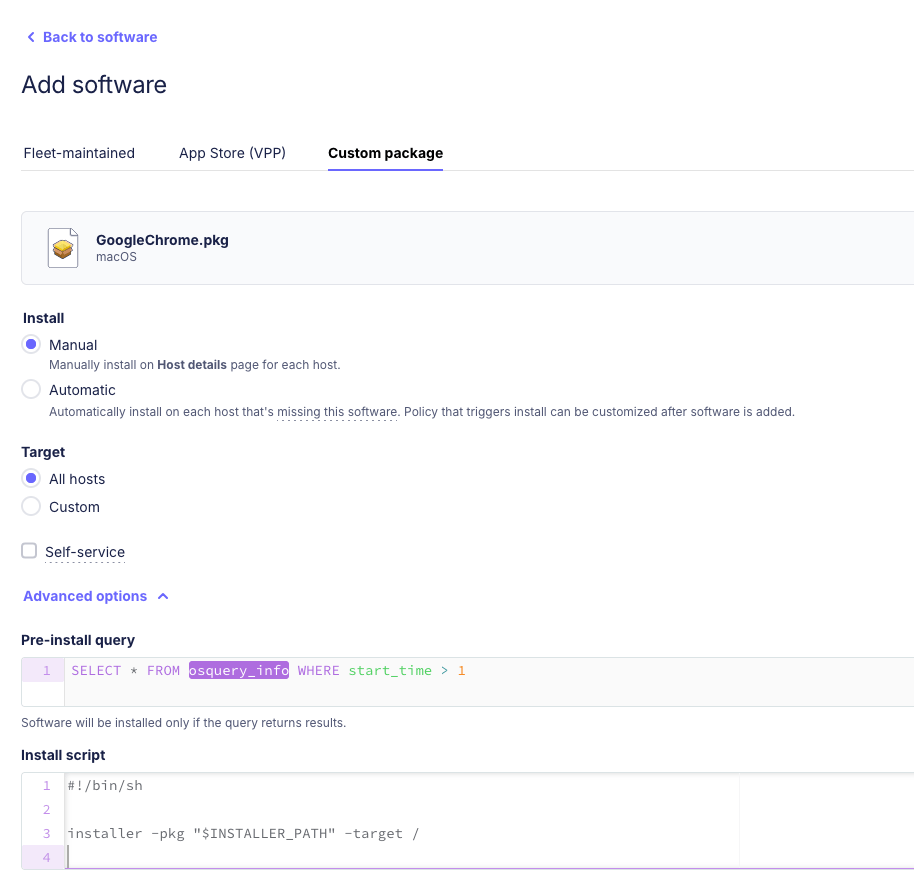

# Automatic policy based installation of software on hosts

TODO: Add general image here

Fleet has the ability to automatically and remotly install software on hosts upon a specific policy failure, programmed in advance. 
This guide will walk you through the process of configuring fleet for automatic installation of
software on hosts using pre uploded installation images and based on pre programmed policies. 
You'll learn how to configure and use this feature, as well as understand how the underlying
mechanism works.

Fleet allows its users to upload trusted software installation files to be installed and used on hosts.
This installation could be conditioned on a failure of a specific Fleet Policy.

A very simple example will be this: 
Install a patch on all MacOS hosts with version lower than 14.2.1.
You will create a policy that assures hosts are equal or higher than 14.2.1 
Like this: 
- ```SELECT 1 where exists (SELECT version FROM os_version WHERE version >= "14.2.1");```

Then all hosts failing this policy will have the patch programmed to be installed.

Of course this feature holds a strong and flexible way to install software based on any chosen policy.
See step by step section below.

## Step-by-Step Instructions

1. Add any software to be available for installation. Follow this document with instruction how to
   do it.
   Note that all steps of the software installation as set here will be respected regardless to the
   policy that may trigger this software installations.
   ('Pre-install query', 'Install script' and 'Post-install script').

   TODO: Sharon - add link to SW install doc.



```
Current supported installation files, manual upload of these formats:
- Macos: .pkg
- Windows: .msi, .exe
- Linux: .deb

Coming soon:
- Ability to auto install from App store (VPP).
- Install on iOS and iPadOS
```


2. In Fleet, add a policy that failure to pass it will trigger the required installation.
  Go to Policies tab --> Press the top right "Add policy" button. --> Click "create your own policy"
  --> Save --> Fill details in the Save modal and Save.


3. Open Manage Automations: Policies Tab --> top right "Manage automations" --> "Install software".


4. Select (click th echeck box of) your newly created policy. To the right of it select from the
   drop-down list the software you would like to be installed upon failure of this policy.


Upon failure of the select policy, the selected software installation will be triggered.


## How does it work?

* After configuring Fleet to auto-install a specific software the rest will be done automatically.
* TODO Sharon: Describe the workflow 


*Detailed flowchart*

## Prerequisites

* Fleet premium. 
* Admin permissions for all three services above.


## Additional Information

* TODO: Add link to software install document
* TODO: Add other docs


### Using fleet API:
The same result can be achieved by using Fleet API directly.
#### Add team policy
The semantics for creating a team policy are the same as for global policies, see [Add policy](#add-policy).
`POST /api/v1/fleet/teams/:id/policies`
##### Parameters
| Name        | Type    | In   | Description                          |
| ----------  | ------- | ---- | ------------------------------------ |
| id         | integer | path | Defines what team ID to operate on.  |
| name        | string  | body | The policy's name.                    |
| query       | string  | body | The policy's query in SQL.                    |
| description | string  | body | The policy's description.             |
| resolution  | string  | body | The resolution steps for the policy. |
| platform    | string  | body | Comma-separated target platforms, currently supported values are "windows", "linux", "darwin". The default, an empty string means target all platforms. |
| critical    | boolean | body | _Available in Fleet Premium_. Mark policy as critical/high impact. |
| software_title_id  | integer | body | _Available in Fleet Premium_. ID of software title to install if the policy fails. |

Either `query` or `query_id` must be provided.
##### Example
`POST /api/v1/fleet/teams/1/policies`
###### Request body
```json
{
  "name": "Gatekeeper enabled",
  "query": "SELECT 1 FROM gatekeeper WHERE assessments_enabled = 1;",
  "description": "Checks if gatekeeper is enabled on macOS devices",
  "critical": true,
  "resolution": "Resolution steps",
  "platform": "darwin"
}
```
###### Default response
`Status: 200`
```json
{
  "policy": {
    "id": 43,
    "name": "Gatekeeper enabled",
    "query": "SELECT 1 FROM gatekeeper WHERE assessments_enabled = 1;",
    "description": "Checks if gatekeeper is enabled on macOS devices",
    "critical": true,
    "author_id": 42,
    "author_name": "John",
    "author_email": "john@example.com",
    "team_id": 1,
    "resolution": "Resolution steps",
    "platform": "darwin",
    "created_at": "2021-12-16T14:37:37Z",
    "updated_at": "2021-12-16T16:39:00Z",
    "passing_host_count": 0,
    "failing_host_count": 0,
    "host_count_updated_at": null,
    "calendar_events_enabled": false
    "calendar_events_enabled": false,
    "install_software": {
      "name": "Adobe Acrobat.app",
      "software_title_id": 1234
    }
  }
}
```

### Using fleet GitOps:
The same result can be achieved by using Fleet API, Fleetctl ot GitOps.

The following text files provide a Gitops example:

```
File name: software-install-policies.yml

name: Adobe Acrobat Reader.app
platform: darwin
description: This policy checks if Adobe Acrobat is installed.
resolution: An IT admin, upload Adobe Acrobat installer and deploy to the host..
query: SELECT 1 FROM apps WHERE name == Adobe Acrobat.app' AND version == "";
install_software:
  package_path: ../lib/software/adobe-acrobat.software.yml
```


```
File name: lib/software/adobe-acrobat.software.yml

url: https://github.com/organinzation/repository/apps/AdobeAcrobatReaderInstallerFull-24_002_20687.pkg
pre_install_query: 
  path: ../lib/check-if-acrobat-running.queries.yml
install_script: 
  path: ../lib/adobe-acrobat-install.sh
post_install_script: 
  path: ../lib/adobe-acrobat-post-install.sh
post_install_script: 
  path: ../lib/adobe-acrobat-post-install.sh
self_service: true
```


```
File name: teams/no-team.yml

name: No team
policies:
  - path: ../lib/software-install.policies.yml 
  - path: ../lib/macos-device-health.policies.yml
controls:
software:
  packages:
   - url: https://github.com/organinzation/repository/installer.pkg
     install_script:
       path: /lib/crowdstrike-install.sh 
     pre_install_query: 
       path: /lib/check-crowdstrike-configuration-profile.queries.yml
     post_install_script:
       path: /lib/crowdstrike-post-install.sh 
     self_service: true
   - path: ..lib/software/adobe-acrobat.software.yml
  app_store_apps:
   - app_store_id: 1091189122
```

## Conclusion

Software deployment can be time consumng and risky if not done the proper way.
This guide presents Fleet's ability to mass deploy software to your fleet in a way that is both
simple and safe. Starting with uploading a trusted installer and ending with deploying it to the
proper set of machines.

Leveraging Fleet’s ability to install and upgrade software on your hosts, you can streamline the
process of controlling your hosts, replacing old versions of software and having the up-to-date info
on what's installed on your fleet.

By automating software deployment, you can gain better control on what's installed on your machines
and have a better ability to upgrade software versions with known issues.


<meta name="articleTitle" value="Automatic installation of software on hosts">
<meta name="authorFullName" value="Sharon Katz">
<meta name="authorGitHubUsername" value="sharon-fdm">
<meta name="category" value="guides">
<meta name="publishedOn" value="2024-08-15">
<meta name="articleImageUrl" value="../website/assets/images/articles/automatic-software-install-in-fleet-731x738@2x.png">
<meta name="description" value="A guide to workflows using automatic software installation in Fleet.">
