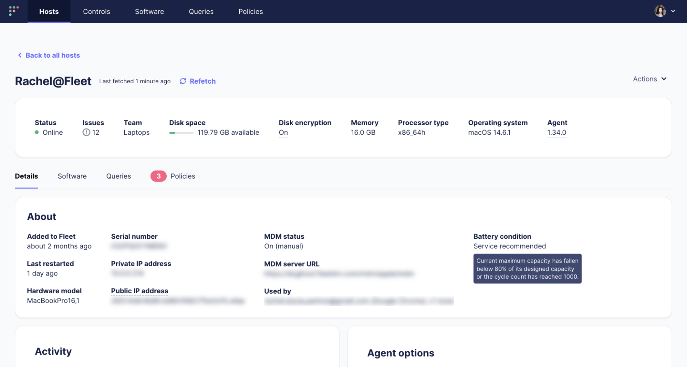

# Battery health


## Introduction

In today's mobile-driven workplace, the health of a device's battery plays a crucial role in maintaining productivity and reliability. Fleet utilizes osquery to monitor device metrics, providing comprehensive insights into battery health and helping IT teams keep their fleets running smoothly.

## Prerequisites

- osquery v.5.12.0+ on Windows
- osquery v3.2.7+ on macOS

## Step-by-step instructions

### Accessing battery health

- From the Fleet dashboard, select a host to view the host detail page. Locate the battery condition on the details tab on the host detail page.



### How battery health is assessed

Fleet gathers data on battery health by focusing on two essential metrics:

1. **Cycle count**: This metric indicates how many complete charge cycles a battery has undergone. A full charge cycle is counted when a battery discharges from 100% to 0%, though this can occur over multiple partial discharges.
2. **Battery capacity**: This reflects the battery's current maximum capacity compared to its original capacity when new. Battery capacity degrades over time as the chemical components wear out with usage.

### What makes a healthy battery?

To ensure a device continues to perform optimally, Fleet defines battery health by considering the following thresholds:

* **Cycle count**: The **cycle count should be below 1000**. Exceeding this count typically means the battery has experienced significant usage and may start to degrade in its ability to hold a charge effectively.
* **Battery capacity**: A healthy battery should retain **above 80%** of its original maximum capacity. Once the capacity falls below this level, the battery's performance and overall lifespan could be negatively impacted.

Battery health will be reported as **Normal** or **Service recommended**, following the same standards for both macOS and Windows.

### Getting more details on a specific battery

If you need more detailed information about a specific battery, you can run a live query on the device using the following osquery command:


```sql

SELECT * FROM battery;

```

or a command specifying a capacity_degradation column to sort your devices by battery capacity degradation:

```sql

SELECT *,
CASE
WHEN designed_capacity = 0 THEN NULL
ELSE CAST(max_capacity AS FLOAT) / CAST(designed_capacity AS FLOAT)
END AS capacity_degradation
FROM battery;

```

## Conclusion

By regularly monitoring battery health with Fleet, IT teams can proactively maintain devices, reducing downtime and extending device lifespans—keeping teams productive and operational. Battery health is vital for the productivity and longevity of devices within a fleet.

For more tips and detailed guides, don’t forget to check out the Fleet [documentation](https://fleetdm.com/docs/get-started/why-fleet).

<meta name="articleTitle" value="Battery health">
<meta name="authorFullName" value="Tim Lee">
<meta name="authorGitHubUsername" value="mostlikelee">
<meta name="category" value="guides">
<meta name="publishedOn" value="2024-10-16">
<meta name="articleImageUrl" value="../website/assets/images/articles/battery-health-1600x900@2x.png">
<meta name="description" value="Monitor and assess battery health in macOS and Windows devices using Fleet and osquery to maintain optimal device performance.">
