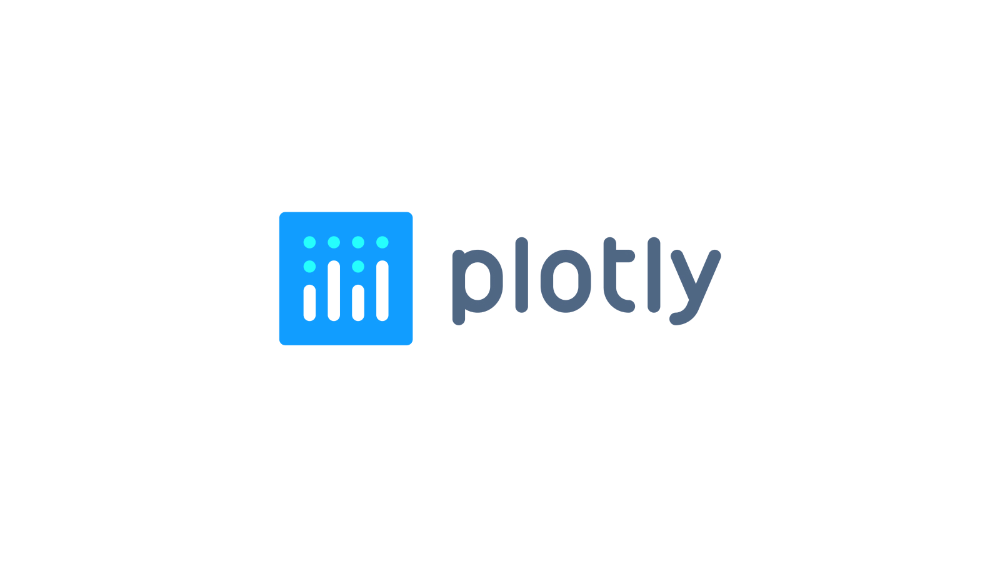

# Building an effective dashboard with Fleet's REST API, Flask, and Plotly: A step-by-step guide



## Background

Everything you can do in the Fleet UI, you can do via the Fleet REST API. Sometimes, though, you just want to do more. What is a concrete use case that we can use in order to exercise the usage of the Fleet REST API? In the past, we’ve explored connecting to the [Fleet REST API via Tines workflows](https://fleetdm.com/guides/using-fleet-and-tines-together). How about another example, but this time, let’s work on a dashboard!

There are several commercially available data visualization solutions on the market, but instead of focusing on any one particular solution, this article intends to show how easy it is to connect to the Fleet API and collect telemetry data for the purpose of data visualization. To that end, we will use open-source elements to accomplish this goal. 

The core of the code and concepts covered in this article originate from [https://realpython.com/python-dash/](https://realpython.com/python-dash/). Essentially, with the content from this nice article, we can make small adjustments to the code to allow for styling differences as well as data source changes. Even though avocados are great and they taste yummy on toast, we care about host data from Fleet more. 


## Tech stack

[Fleet API](https://fleetdm.com/docs/using-fleet/rest-api) (of course, this is our data source)

[Flask](https://pythonbasics.org/what-is-flask-python/) (python web application framework)

[Plotly and Dash](https://plotly.com/) (open source (MIT licensed) graphing library)


## Prerequisites and base setup

* Local macOS dev workstation
* [Python installed](https://docs.brew.sh/Homebrew-and-Python)
* [Git repository](https://github.com/dherder/fleetdash)


## Local environment setup

When developing web apps with Python, it helps to configure a virtual environment to load the libraries and dependencies required for our little dashboard. In order to get your local environment set up [check out this article](https://realpython.com/python-virtual-environments-a-primer/).


## What are we going to do?

* Create a Flask application with data from a single Fleet REST API endpoint
* Use Dash core components and HTML components
* Use callbacks to interactively filter the online/offline status of hosts


## The juicy bits

After you have cloned the repo above, there are some dependencies that you will have to install in your local Python environment. To do this, run the following at your terminal:

```
(venv) % pip install requests json pandas plotly dash datetime numpy
```

After the required dependencies are installed, navigate to the directory where you have cloned the sample “fleetdash” repo. If everything goes as expected, running the following will launch the Flask app:

```
(venv) % python3 ./fleetdash.py
```

The app should launch as follows:

```
(venv) % python3 ./fleetdash.py

Dash is running on http://127.0.0.1:8050/

* Serving Flask app ‘fleetdash’
* Debug mode: on
```

When you navigate to [http://127.0.0.1:8050/](http://127.0.0.1:8050/) in a browser, you should see something like the following:


## What can we do next?


* What other endpoints can we leverage? Maybe list all [Software](https://fleetdm.com/docs/using-fleet/rest-api#software)? 
* Add some [authentication](https://realpython.com/token-based-authentication-with-flask/) on the Flask app.
* [Deploy the Flask app to AWS or Heroku](https://blog.nextideatech.com/deploy-flask-on-aws-heroku/).
* Explore other open-source dashboarding solutions. [Maybe via Grafana?](https://www.metricfire.com/blog/anomaly-detection-using-osquery-and-grafana/)


## Want more examples?

Here’s a cool example of [using the Fleet API with Okta Workflows](https://fleetdm.com/guides/using-fleet-and-okta-workflows-to-generate-a-daily-os-report).


## Summary
Hopefully, this article sparked your interest in the Fleet REST API and potential use cases around leveraging the API for different use cases. If you would like to contribute to the dashboarding sample code, please feel free to submit a PR! Or if you just want to say hi 👋 or compare notes you can find me as `@dherder` in the [osquery](https://osquery.slack.com/team/U01EYE40QCS) or [MacAdmins](https://macadmins.slack.com/team/U0GTA6QF3) Slack.


<meta name="articleTitle" value="Building an effective dashboard with Fleet's REST API, Flask, and Plotly: A step-by-step guide">
<meta name="authorFullName" value="Dave Herder">
<meta name="authorGitHubUsername" value="dherder">
<meta name="category" value="guides">
<meta name="publishedOn" value="2023-05-22">
<meta name="articleImageUrl" value="../website/assets/images/articles/building-an-effective-dashboard-with-fleet-rest-api-flask-and-plotly-800x450@2x.jpg">
<meta name="description" value="Step-by-step guide on building a dynamic dashboard with Fleet's REST API, Flask, and Plotly. Master data visualization with open-source tools!">
