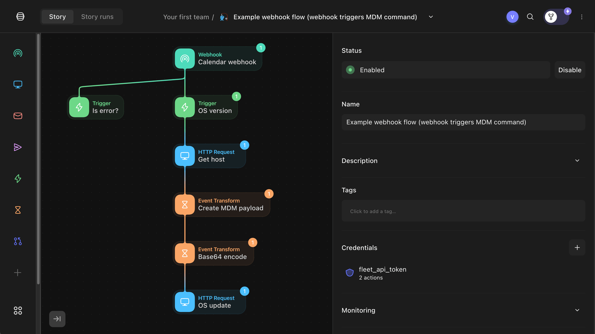
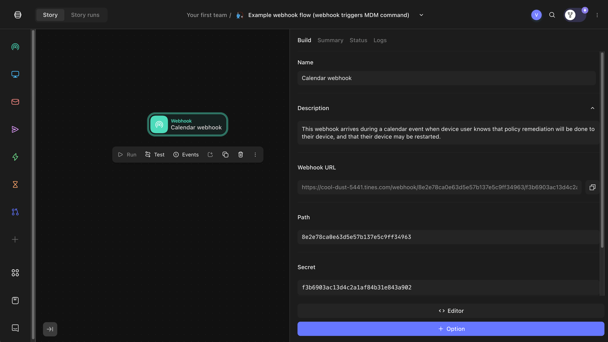
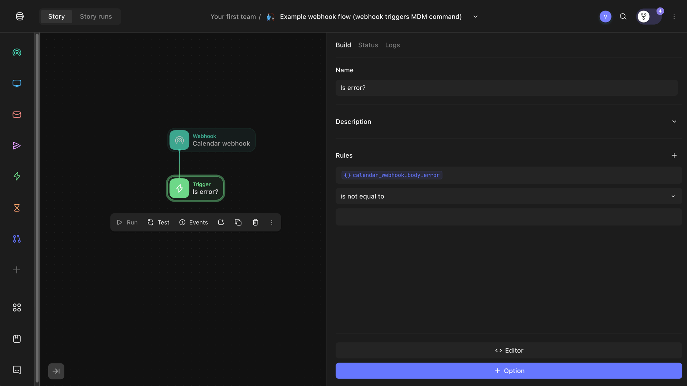
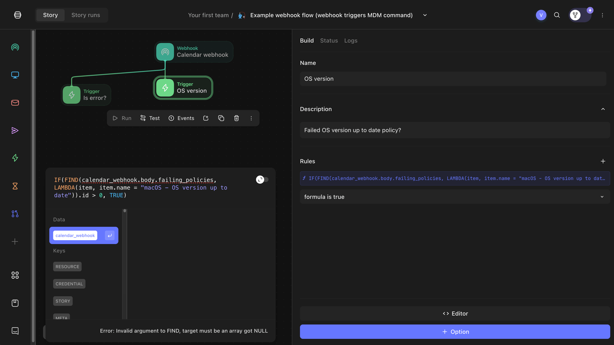
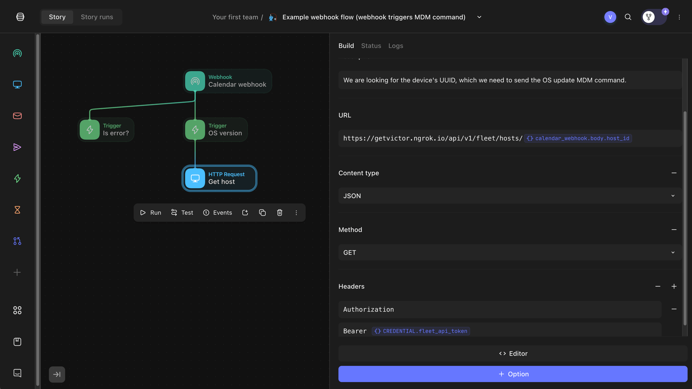
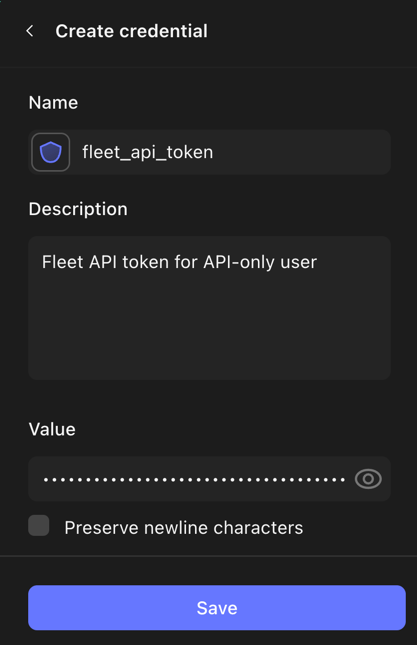
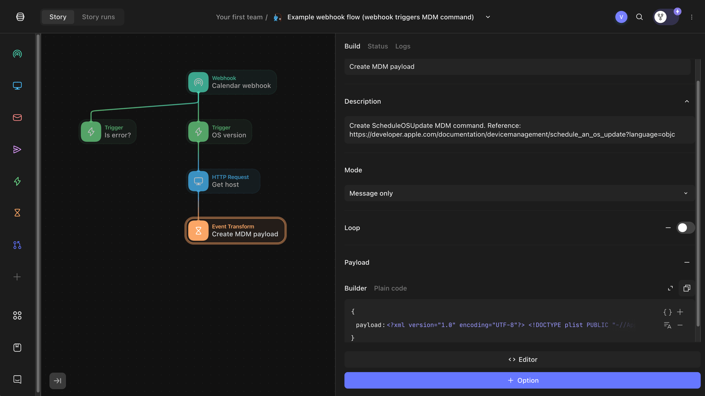
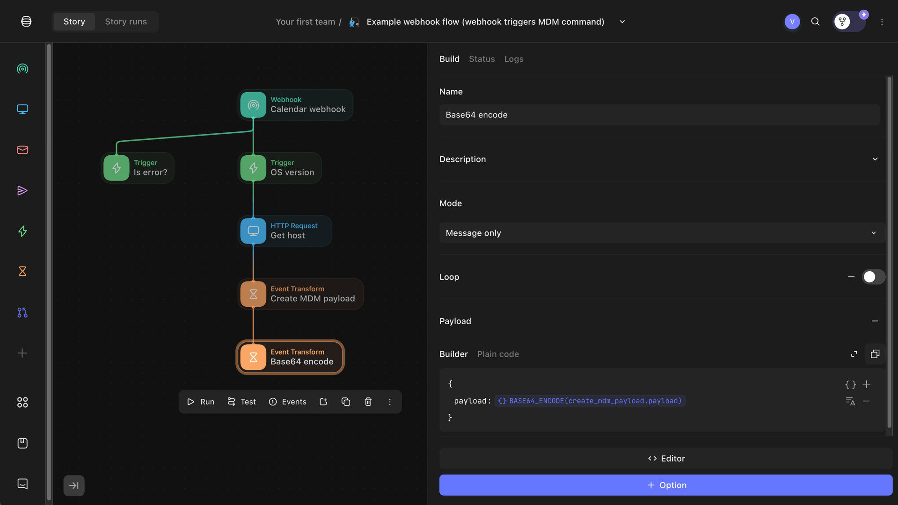
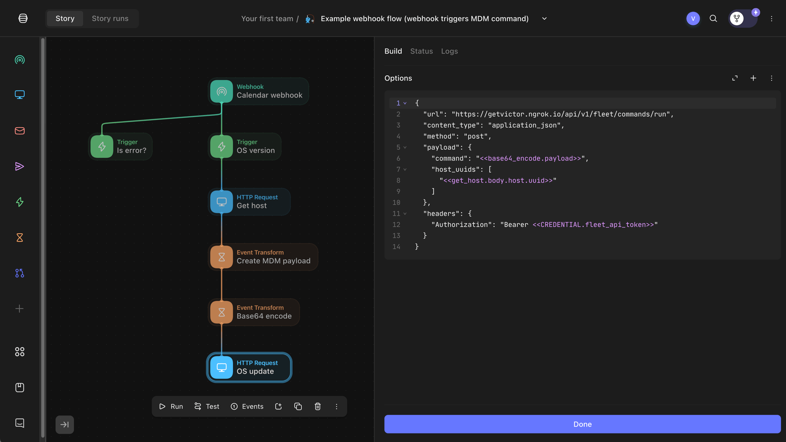
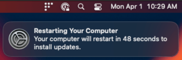

# Building webhook flows with Fleet and Tines


For IT Admins, updating systems is crucial for security and system performance. However, managing updates across numerous devices can be a daunting task. That's where automation tools like Tines and Fleet come into play. In our latest blog post, [Fleet in Your Calendar: Introducing Maintenance Windows](https://fleetdm.com/announcements/fleet-in-your-calendar-introducing-maintenance-windows), we introduced a new feature that allows you to schedule maintenance windows directly in your users' calendar. This feature helps in planning updates and ensures minimal disruption to end users.

Building on that, this guide will walk you through setting up an automated workflow using webhooks and Tines. Maintenance windows call the webhook and initiate the workflow we are building here at the beginning of the calendar event for the user. Tines serves as the low-code/no-code environment for this example, but this workflow can be adapted to any low-code/no-code environment that supports webhooks.

We will demonstrate how to receive a webhook callback from Fleet when a device's OS is outdated and automatically send an MDM command to update the OS. By the end of this tutorial, you'll have a fully automated process that leverages the power of Tines to keep your fleet of devices up to date seamlessly.

Let's dive in and see how you can enhance your IT operations with this powerful integration.





## What is a webhook?

A webhook is a custom HTTP callback that allows one application to send data to another in real-time. It is a simple way to trigger an action based on an event.


## What is Tines?

[Tines](https://www.tines.io/) is a no-code automation platform for repetitive tasks. It is a powerful tool for automating workflows, such as sending emails, creating tickets, and updating databases.


## Our example IT workflow

When a device's OS version is outdated, Tines receives a webhook callback from Fleet and using information from the webhook, builds and sends an MDM (Mobile Device Management) command to update the device’s OS version.

Fleet will send a callback via its calendar integration feature, a maintenance window. Fleet places a scheduled maintenance event on the device user’s calendar. This event warns the device owner that their computer will be restarted to remediate one or more failing policies. During the calendar event time, Fleet sends a webhook. The IT admin must set up a flow to remediate the failing policy. This article is an example of one such flow.


## Getting started – webhook action

First, we create a new Tines story. A story is a sequence of actions that are executed in order. Next, we add a webhook action to the story. The webhook action listens for incoming webhooks. The webhook will contain a JSON body.




_Tines webhook action._


## Handling errors

Webhooks may often contain error messages if there is an issue with the configuration, flow, etc. In this example, we add a trigger action that checks whether the webhook body contains an error. Specifically, our action checks whether the webhook body contains a non-empty “error” field.




_Tines trigger action checking for an error._

We leave this error-handling portion of the story as a stub. In the future, we can expand it by sending an email or triggering other actions.


## Checking whether webhook indicates an outdated OS

At the same time, we also check whether the webhook was triggered by a policy indicating an outdated OS. From previous testing, we know that the webhook payload will look like this:

```json
{
 "timestamp": "2024-03-28T13:57:31.668954-05:00",
 "host_id": 11058,
 "host_display_name": "Victor's Virtual Machine",
 "host_serial_number": "Z5C4L7GKY0",
 "failing_policies": [
   {
     "id": 479,
     "name": "macOS - OS version up to date"
   }
 ]
}
```

The payload contains: 


* The device’s ID (host ID).
* Display name.
* Serial number. 
* A list of failing policies.

We are interested in the failing policies. When one of the failing policies contains a policy named “macOS - OS version up to date,” we know that the device’s OS is outdated. Hence, we create a trigger that looks for this policy.





_Tines trigger action checking for an outdated OS._

We use the following formula, which loops over all policies and will only allow the workflow to proceed if true:

```sql
IF(FIND(calendar_webhook.body.failing_policies, LAMBDA(item, item.name = "macOS - OS version up to date")).id > 0, TRUE)
```

## Getting device details from Fleet

Next, we need to get more details about the device from Fleet. Devices are called hosts in Fleet. We add an “HTTP Request” action to the story. The action makes a GET request to the Fleet API to get the device details. We use the host ID from the webhook payload. We are looking for the device’s UUID, which we need to send the OS update MDM command.





_Tines HTTP Request action to get Fleet device details._

To access Fleet’s API, we need to provide an API key. We store the API key as a CREDENTIAL in the current story. The API key should belong to an API-only user in Fleet so that the key does not reset when the user logs out.





_Add credential to Tines story._


## Creating MDM command payload to update OS version

Now that we have the device’s UUID, we can create the MDM payload. The payload contains the command to update the OS version. We use the [ScheduleOSUpdate](https://developer.apple.com/documentation/devicemanagement/schedule_an_os_update?language=objc) command from Apple’s MDM protocol.

```xml
<?xml version="1.0" encoding="UTF-8"?>
<!DOCTYPE plist PUBLIC "-//Apple//DTD PLIST 1.0//EN" "http://www.apple.com/DTDs/PropertyList-1.0.dtd">
<plist version="1.0">
<dict>
   <key>Command</key>
   <dict>
       <key>RequestType</key>
       <string>ScheduleOSUpdate</string>
       <key>Updates</key>
       <array>
           <dict>
               <key>InstallAction</key>
               <string>InstallASAP</string>
               <key>ProductVersion</key>
               <string>14.5</string>
           </dict>
       </array>
   </dict>
   <key>CommandUUID</key>
   <string><<UUID()>></string>
</dict>
</plist>
```

This command will download macOS 14.5, install it, and pop up a 60-second countdown dialog box before restarting the device. Note that the `<<UUID()>>` Tines function creates a unique UUID for this MDM command.





_Tines event to create ScheduleOSUpdate MDM command._

The Fleet API requires the command to be sent as a base64-encoded string. We add a “Base64 Encode” action to the story to encode the XML payload. It uses the Tines `BASE64_ENCODE` function.





_Tines Base64 Encode event._


## Run the MDM command on the device

Finally, we send the MDM command to the device. We add another “HTTP Request” action to the story. The action makes a POST request to the Fleet API to send the MDM command to the device.





_Tines HTTP Request action to run MDM command on the device._

The MDM command will run on the device, downloading and installing the OS update.





_macOS restart notification after OS update._


## Conclusion

In this article, we built a webhook flow with Tines. We received a webhook callback from Fleet when a device had an outdated OS version. We then sent an MDM command to update the OS version. This example demonstrates how Tines can automate workflows and tasks in IT environments.


<meta name="articleTitle" value="Building webhook flows with Fleet and Tines">
<meta name="authorFullName" value="Victor Lyuboslavsky">
<meta name="authorGitHubUsername" value="getvictor">
<meta name="category" value="guides">
<meta name="publishedOn" value="2024-05-30">
<meta name="articleImageUrl" value="../website/assets/images/articles/building-webhook-flows-with-fleet-and-tines-1600x900@2x.png">
<meta name="description" value="A guide to workflows using Tines and Fleet via webhook to update outdated OS versions.">
