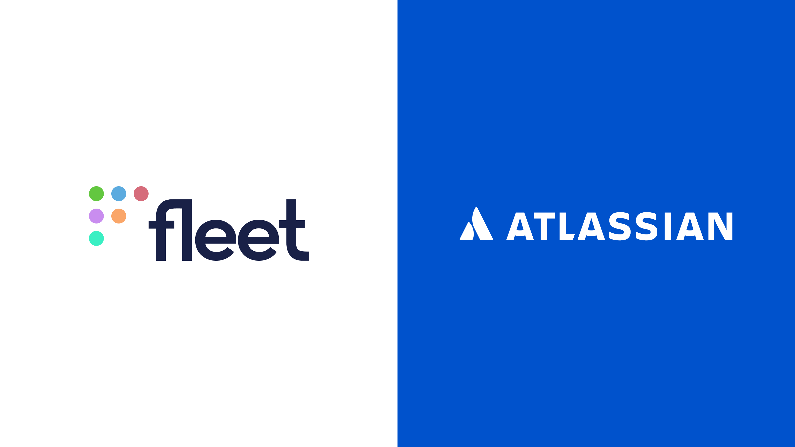

# Atlassian uses Fleet: building a strategic trust platform through programmable endpoint visibility

Atlassian, a global software company specializing in team collaboration and productivity tools, has recently adopted Fleet, a device management platform built on osquery. In this case study, we explore how Fleet has enabled Atlassian to create a strategic trust platform, improving their security posture that facilitates enhanced communication and collaboration among their teams.

**Customer:** Atlassian

**Employees:** 5,000+

**Champion/Interviewee:** Erin Coyle, Trust Engineering

**Founded:** 2002

**Number of Customers:** 194,000+

## The challenge: strengthening security and compliance

With a Trust organization consisting of over 300 employees and a focus on compliance and security, Atlassian sought to address several key challenges:

- Collecting osquery logs into Splunk for anomaly detection and evaluation.
- Ensuring workstations are enrolled and checked for compliance.
- Keeping osquery up-to-date across a large number of devices.
- Improving the accuracy and effectiveness of scorecards, which rank security posture.

<blockquote purpose="quote">Security intelligence needs to know what's there to prevent zero-day issues.</blockquote>

## The solution: Fleet programmable endpoint visibility

Fleet, a device management platform, was instrumental in helping Atlassian overcome challenges via programmable endpoint visibility and asset management. Integrating Fleet into Atlassian’s security ecosystem has enabled them to:

- Push osquery configurations and run security measures more effectively.
- Monitor workstations for compliance, aided by Fleet's historical data capabilities.
- Simplify osquery updates and maintenance.
- Enhance the accuracy of security scorecards for product teams.

<blockquote purpose="quote">Fleet has definitely helped create trust and ensure a broad, successful rollout of osquery.</blockquote>

## Impact on Atlassian's business and security teams

Fleet's implementation at Atlassian has produced several significant benefits:

- Improved trust and collaboration: With Fleet, Atlassian's security team can proactively address vulnerabilities, fostering trust internally among product teams.
- Faster response to security incidents: Fleet's historical data and visibility features enable Atlassian to respond more quickly and effectively to security incidents.
- Increased accuracy in security posture rankings: Fleet's programmability has enhanced the precision of Atlassian's security scorecards, allowing product teams to address issues more effectively.

<blockquote purpose="quote">Quality of service has been extremely good; I can’t recommend Fleet enough.</blockquote>

In summary, Fleet has provided Atlassian with a powerful, programmable endpoint visibility tool, enabling the company to build a strategic trust platform and improve its overall security posture. Fleet's impact on Atlassian's business and security teams has been profound, fostering a more secure and collaborative environment.

Fleet Premium offers companies of all sizes the ability to manage query sets by team and device. From pre-configured CIS queries to software license questions, you can get all the answers you need with Fleet. [Try it out today](https://fleetdm.com/try-fleet/register). 

<call-to-action preset="premium-upgrade"></call-to-action>

<meta name="category" value="success stories">
<meta name="authorGitHubUsername" value="jarodreyes">
<meta name="authorFullName" value="Jarod Reyes">
<meta name="publishedOn" value="2022-05-10">
<meta name="articleTitle" value="Atlassian Uses Fleet: Building a Strategic Trust Platform Through Programmable Endpoint Visibility">
<meta name="articleImageUrl" value="../website/assets/images/articles/case-study-fleet-and-atlassian-800x450@2x.png">