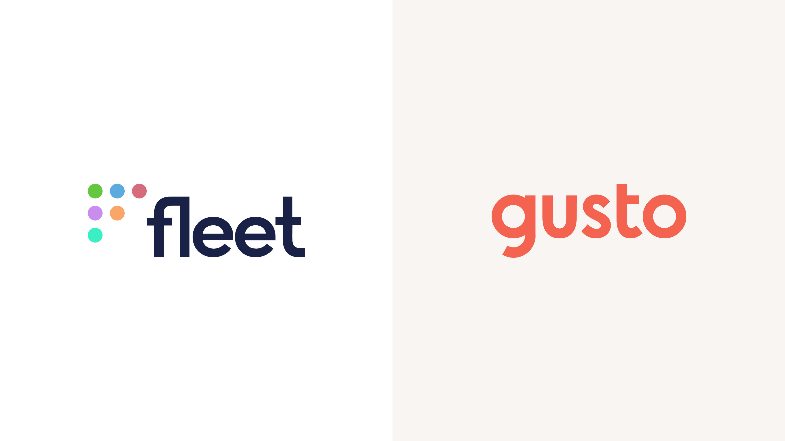

# How Gusto uses Fleet to keep their employee machines compliant and safe

**Deployment:** On-prem with Docker. 3100 hosts. All laptops, mostly MacBooks and Mac mini servers. 97% macOS.

**Plan:** Fleet Premium w/ Premium Support

A few years ago, William Theaker came across osquery and immediately put it to work inside the startup he was working at. We caught up with him 4 years later to learn how Fleet and osquery have been helping him manage thousands of machines for Gusto.

Gusto is a cloud-based platform that helps businesses of all sizes handle payroll, employee benefits, hiring, onboarding, time and attendance, and compliance. They were founded in 2011 and are now a 2200+ employee company worth many billions of dollars. Gusto serves 200,000+ customers worldwide.

## A DevOps approach to endpoint management

William’s first job was through the software society. He has always appreciated the open-source community and his ability to improve his skills in the open alongside others. This open mentality has led to him being always ready to adopt the latest tools and trends to be able to optimize his role. When asked about the latest trend, he points to DevOps practices creeping into the IT side of the house.

“In recent years, it has become increasingly hard to keep up with changing compliance requirements when you really can’t do your job without a computer. Employees are all over the world, and yet companies are expected to know every little thing that is happening on their machines.“ With this increased demand on the team, William said he is always looking for more ways they can automate that work to make it easier. 

“Fleet and osquery give us insight into 3100 employees who are working from home and can’t just go to the helpdesk. They can’t just holler “Spotify crashed,” but with Fleet, we can see that Spotify crashed. It’s great.”

DevOps for IT or ITOps is a trend that is accelerating. Small IT teams are expected to oversee thousands of machines and servers while being on hand to help meet audit requests or jump in on incidents. William notes that one thing different about their Client Platform team is that while not being on the escalation path, they are often brought in to help solve problems for people on the escalation path. “Without the right automation and tools, we just couldn’t do our jobs.”

<blockquote purpose="quote">“Osquery just doesn’t break. It’s extremely fast …Fleet makes it the most reliable system-level tool we use to check the status of our machines.”</blockquote>

## Instant endpoint visibility that is always available and always works

On one Monday William’s team was investigating a macOS configuration across their thousands of machines. Originally they had written a script to ensure they were notified if this was disabled but they wanted to make sure the script was running. Sure enough, when they inspected the computers with Fleet, they saw that the script wasn’t running. Luckily the configuration was enabled, but it reinforced that they needed to check in multiple ways for compliance-related concerns. 

“Osquery just doesn’t break. It’s extremely fast and doesn’t slow down the computer, so no one notices it. These two factors together mean it is the most reliable system-level tool we can rely on to check the status of our machines. It just works whenever we need it. That is not always the case for other basic packages we run on all of our machines. They often need updating or patching if they haven’t just been disabled.”

## Fleet is like having a team of experts helping me

William described a situation where they needed to update an outdated practice of automatically joining MacOS computers to Active Directory. It was the norm 6 years ago, but not any longer. So his team wanted to check if there were any computers still joined to Active Directory. Originally they checked using a configuration script and alert they had written themselves, only discovering that they had been checking the wrong table. “So we checked Fleet, and it told me there were about 700 Macbooks still bound to Active Directory. **The thing with osquery is that the people maintaining those tables know what they are doing.** They are the experts, not me. In this case, I was checking a table that was the wrong table, but I don’t have to track those tables since Fleet just manages them for me.”

In another scenario, William told me about a time they wanted to see how many people were using a certain security product. Fleet wasn’t the obvious choice, but it was the easiest “We just ran a query on how many devices were using this software, and it made it very easy to change the seat and licensing needs when the new contract came up.

<blockquote purpose="quote">“I can safely say Fleet has saved our team thousands of hours in maintenance and upkeep.”</blockquote>

William admits they haven’t fully tapped the potential of Fleet and the Gitops potentials of the tool. But in his estimation, Fleet has saved his team many hours of development time. When I asked him straight up the biggest value Fleet has delivered, he said, “If I had to write all those ruby scripts and log connections? And then maintain all of those tables? I can safely say Fleet has saved our team thousands of hours in maintenance and upkeep.”

Gusto has been a customer of Fleet’s since 2021. If you would like to learn how Gusto uses Fleet in more detail or see the query sets they use on a regular basis, feel free to schedule a call with us. 

Fleet Premium offers companies of all sizes the ability to manage query sets by team and device. From pre-configured CIS queries to software license questions, you can get all the answers you need with Fleet. [Try it out today](https://fleetdm.com/try-fleet/register). 

<call-to-action preset="premium-upgrade"></call-to-action>

<meta name="category" value="success stories">
<meta name="authorGitHubUsername" value="jarodreyes">
<meta name="authorFullName" value="Jarod Reyes">
<meta name="publishedOn" value="2023-05-12">
<meta name="articleTitle" value="How Gusto uses Fleet to keep their employee machines compliant and safe">
<meta name="articleImageUrl" value="../website/assets/images/articles/fleet-user-stories-f100-cover-800x450@2x.jpeg">