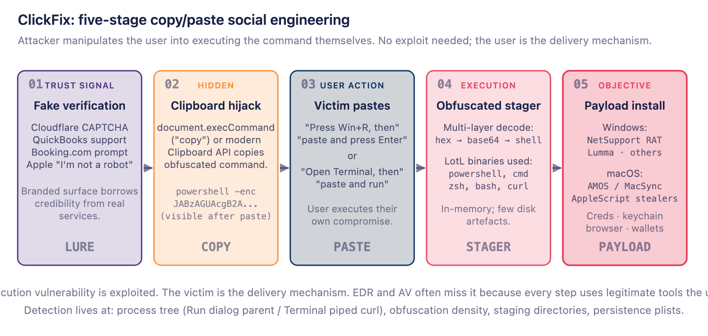
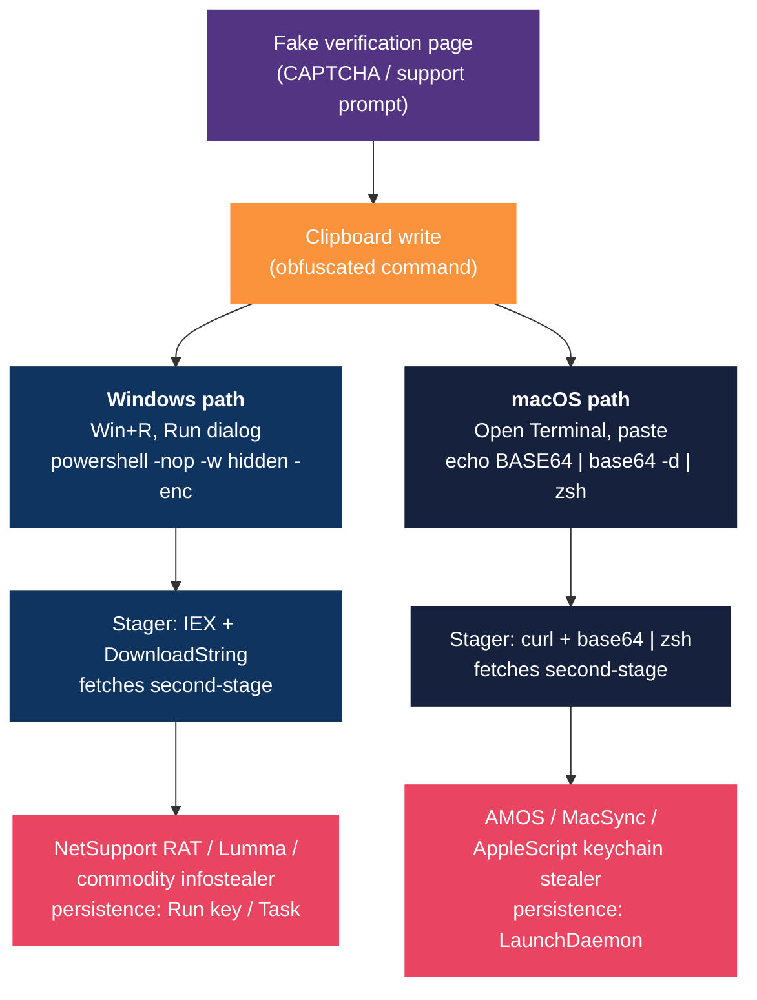
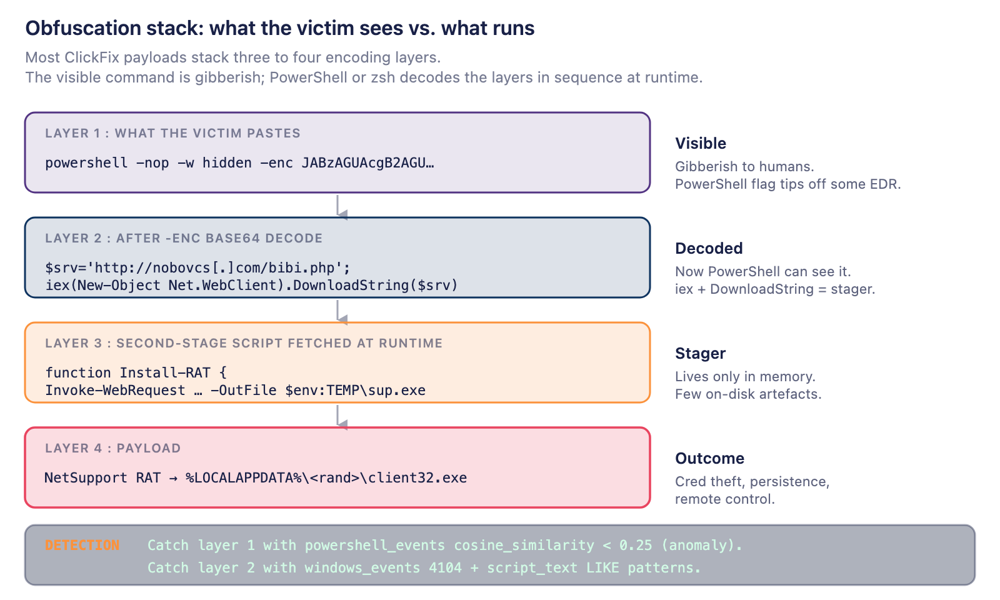

# ClickFix copy/paste social engineering: threat brief and Fleet detection pack

## Executive summary

ClickFix is a social-engineering technique, first observed in 2023 and adopted broadly across crimeware groups by 2026, in which a malicious web page presents a fake verification or support prompt (counterfeit Cloudflare CAPTCHA, QuickBooks support page, Booking.com prompt, Apple "I'm not a robot" overlay, etc.), silently copies an obfuscated shell command to the victim's clipboard, and instructs the victim to paste it into the Windows Run dialog or macOS Terminal. The victim runs the command themselves; no software vulnerability is exploited.

The technique is attractive to attackers for three reasons. It bypasses execution-prevention controls because every step uses legitimate, signed binaries the user invokes deliberately. It defeats most browser-side defences because the malicious code never executes in the browser. Only the clipboard write does. And it shifts the detection burden onto post-paste endpoint telemetry, where most organisations have either not yet deployed evented tables or not yet tuned detections to look for the specific behavioural patterns ClickFix produces.

Recent reporting documents at least five distinct clusters using this method to deliver NetSupport RAT, Lumma and other infostealers on Windows, and AMOS-family / MacSync stealers plus AppleScript-based keychain theft on macOS. The cluster set is broad; the playbook is narrow. This brief treats ClickFix as a technique rather than a single actor, maps the consistent execution chain, consolidates atomic indicators, and ships a vetted Fleet/osquery detection pack for both platforms.

## At a glance

| Field | Value |
|---|---|
| **Technique** | ClickFix: fake-verification clipboard hijack into user-pasted shell command |
| **Active since** | 2023; broadly adopted by mid-2025; cross-platform by 2026 |
| **Platforms** | Windows (PowerShell + cmd.exe via Run dialog), macOS (zsh / bash via Terminal) |
| **Common lures** | Cloudflare CAPTCHA, Google bot-verification, QuickBooks support, Booking.com, Birdeye, fake Apple support |
| **Windows payloads** | NetSupport RAT, Lumma stealer, commodity infostealers |
| **macOS payloads** | AMOS / MacSync stealer family, AppleScript keychain stealers |
| **ATT&CK** | T1204 (User Execution), T1059 (Command and Scripting Interpreter), T1027 + T1027.010 + T1027.015 (Obfuscation), T1218 (Signed Binary Proxy), T1543.001 (LaunchAgent/Daemon), T1555 (Credentials from Password Stores) |
| **Why it works** | No CVE; the user is the delivery mechanism. Browser-side defences are bypassed; only the clipboard write happens in the browser. |

## How the attack lands



*ClickFix collapses initial access into five stages. The victim is the delivery mechanism in stage 3; the browser does no execution at all.*

### The five stages

1. **Lure: branded verification surface.** Attacker-controlled or compromised page presents a fake verification overlay. The branding is the load-bearing element: Cloudflare's challenge UI, Google's bot-verification dialog, a Booking.com support prompt, an Apple "I'm not a robot" panel. The visible asks ("please verify you're human", "complete this support step") borrow credibility from real services users have seen elsewhere.
2. **Clipboard hijack.** The page calls `document.execCommand("copy")` or the modern `navigator.clipboard.writeText` API at the moment the user clicks the verification button. Nothing visibly happens in the browser. The clipboard now holds an obfuscated command.
3. **User paste.** On-screen instructions tell the user to press `Win+R` and paste, or to open Terminal and paste. The victim executes the command themselves under their own user context, signed binaries, and (often) elevated privileges. From the operating system's perspective, this is consensual.
4. **Obfuscated stager.** The pasted command unpacks multiple encoding layers (typically hex then base64 then shell) and fetches a second-stage script from attacker infrastructure. The stager runs in memory; few disk artefacts are written by this step.
5. **Payload install.** The second-stage script installs the final payload (NetSupport RAT, Lumma, AMOS, or an AppleScript keychain stealer) with persistence via Run-key, Scheduled Task, or LaunchDaemon depending on platform.

### Windows / macOS execution chain

The same lure produces different post-paste behaviour by platform. The flowchart below shows the divergence at stage 3.



### Obfuscation stack

ClickFix payloads stack three to four encoding layers between what the victim pastes and what actually runs. The diagram below shows a representative Windows stack; macOS follows the same pattern with `base64 -d | zsh` substituted for `powershell -enc`.



*Each layer pushes detection downstream. The visible string is gibberish to humans; PowerShell or zsh decodes the layers in sequence.*

## Atomic indicators

Consolidated atomic indicators from across the public reporting. ClickFix infrastructure rotates aggressively (within days, not weeks), so atomic indicators below should be treated as short-term hunting fodder. The durable detection layer is behavioural (process tree, command-line obfuscation density, staging paths, plist persistence).

| Type | Value | Context |
|---|---|---|
| Staging domain | `nobovcs[.]com` (representative; reported by [Simply Secure Group, May 2026](https://simplysecuregroup.com/new-clickfix-attack-leverage-windows-run-dialog-box-and-macos-terminal-to-deploy-malware/)) | Hosts second-stage scripts including `bibi.php` for NetSupport RAT install. Treat as **hunting fodder only**; staging domains rotate within days. The behavioural pattern (`*.php` second-stage fetch via PowerShell `DownloadString`) outlives any specific domain. |
| Lure brand impersonations | Cloudflare CAPTCHA, Google bot-verification, QuickBooks support, Booking.com, Birdeye, fake Apple support panels | Visible verification overlays driving the paste action |
| Windows payload | NetSupport RAT (commercial RAT abused for C2) | Installed in `%LOCALAPPDATA%/<random-folder>/client32.exe` after stager runs |
| Windows payload | Lumma stealer, other commodity infostealers | Credentials, browser cookies, crypto wallets |
| macOS staging dir | `/tmp/.xdivcmp/` (representative path) | AppleScript stealers stage copied `login.keychain-db` and ZIP archives here before exfil (Netskope, SOC Prime) |
| macOS persistence | `/Library/LaunchDaemons/*.plist` invoking `/bin/bash` with `~/.agent` or similar user-home script | `RunAtLoad = true` + `KeepAlive = true`. Pattern documented in [Microsoft Threat Intelligence, 6 May 2026](https://www.microsoft.com/en-us/security/blog/2026/05/06/clickfix-campaign-uses-fake-macos-utilities-lures-deliver-infostealers/). |
| macOS payload | AMOS / MacSync stealer family; AppleScript keychain stealers with repeated password prompts | Browser data, keychain database, crypto wallet keys |
| Stager pattern | `powershell -nop -w hidden -enc <base64>` | Windows variant: encoded payload, hidden window |
| Stager pattern | `echo <base64> \| base64 -d \| zsh` | macOS variant: pipe through shell after decode |
| Stager pattern | `curl … \| bash` / `curl … \| zsh` | Both platforms: direct pipe-to-shell |
| ATT&CK | T1204.002 (Malicious File / User Execution), T1059.001 (PowerShell), T1059.004 (Unix Shell), T1027 + T1027.010 (Obfuscation), T1218.011 (rundll32), T1543.001 (LaunchAgent/Daemon), T1555.001 (Keychain), T1555.003 (Credentials from Web Browsers) | Technique-level mapping |

## Detection guidelines: three behavioural lenses

The ClickFix execution chain collapses into three behavioural lenses on the endpoint:

1. **Shell obfuscation and stager content** (PowerShell encoded blocks on Windows; pipe-to-shell on macOS).
2. **Run dialog / Terminal as process parent** (stager spawned directly from `explorer.exe` Run-dialog or `Terminal.app`).
3. **Post-install persistence and staging artefacts** (NetSupport on Windows, LaunchDaemons + `/tmp/.xdivcmp` on macOS).

Every query below has been validated against the current [Fleet table schema](https://fleetdm.com/tables/). Bugs in the generically circulating versions of these queries (`file_events` used on Windows where the table is macOS+Linux only, `file_contents` queried with `LIKE` where the table requires path equality) are corrected inline.

### Schema notes that apply throughout

- **`file_events` and `socket_events` are macOS + Linux only.** On Windows, configure the NTFS event publisher or use the `file` table for snapshot scans. A `file_events` query against a Windows host returns zero rows silently.
- **`process_events` is Linux + macOS only.** Windows uses `process_etw_events`, exposed via `enable_process_etw_events`.
- **`file.path` and `file.directory` require an equality or `LIKE` predicate.** Unconstrained scans are rejected at runtime.
- **`file_contents.path` requires equality**: pass the exact path. To read multiple plists, enumerate paths via `file` first, then join.
- **`powershell_events.cosine_similarity`** is a character-frequency anomaly score against an internal baseline. Lower = more anomalous. Add `cosine_similarity < 0.25` as an unsupervised fallback for novel obfuscation.

### Lens 1: shell obfuscation and stager content

#### 1.1 Encoded / obfuscated PowerShell (Windows)

```sql
SELECT
  datetime(time, 'unixepoch') AS event_time,
  script_path,
  script_name,
  script_block_id,
  script_block_count,
  cosine_similarity,
  script_text
FROM powershell_events
WHERE
  cosine_similarity < 0.25
  OR script_text LIKE '%FromBase64String%'
  OR script_text LIKE '% -enc %'
  OR script_text LIKE '% -e %'
  OR script_text LIKE '%IEX(%'
  OR script_text LIKE '%Invoke-Expression%'
  OR script_text LIKE '%DownloadString%'
  OR script_text LIKE '%DownloadFile%'
  OR script_text LIKE '%Net.WebClient%';
```

Requires `enable_powershell_events_subscriber: true` in Fleet agent options and Windows Script Block Logging enabled via GPO (`HKLM\SOFTWARE\Policies\Microsoft\Windows\PowerShell\ScriptBlockLogging\EnableScriptBlockLogging = 1`). Without Script Block Logging, `script_text` is empty. Schema ref: [`powershell_events`](https://fleetdm.com/tables/powershell_events).

#### 1.2 PowerShell Operational EventID 4104 cross-reference (Windows)

```sql
SELECT
  datetime(time, 'unixepoch') AS event_time,
  eventid,
  provider_name,
  source,
  data
FROM windows_events
WHERE
  eventid = 4104
  AND provider_name LIKE '%PowerShell%'
  AND (data LIKE '%FromBase64String%'
    OR data LIKE '% -enc %'
    OR data LIKE '%IEX(%'
    OR data LIKE '%DownloadString%');
```

Requires `enable_windows_events_publisher: true` and an active subscription to the Microsoft-Windows-PowerShell/Operational channel. Schema ref: [`windows_events`](https://fleetdm.com/tables/windows_events).

#### 1.3 Suspicious shell stagers on macOS

```sql
SELECT
  datetime(time, 'unixepoch') AS event_time,
  path,
  cmdline,
  parent,
  uid
FROM process_events
WHERE
  path IN ('/bin/zsh','/bin/bash','/bin/sh')
  AND (
    (cmdline LIKE '%curl %' AND cmdline LIKE '%|%')
    OR cmdline LIKE '%base64%-d%|%'
    OR cmdline LIKE '%base64 --decode%|%'
    OR cmdline LIKE '% | sh%'
    OR cmdline LIKE '% | zsh%'
    OR cmdline LIKE '% | bash%'
  )
  AND time > strftime('%s','now') - 86400;
```

Requires `enable_process_events: true` with the audit framework or EndpointSecurity backend (`disable_audit: false` + `audit_allow_process_events: true`). `process_events` is macOS + Linux only. For Windows shell-pipe equivalents see Q1.1/1.2 above and the `process_etw_events` correlation. Schema ref: [`process_events`](https://fleetdm.com/tables/process_events).

**False-positive note.** `curl ... | bash` and `curl ... | zsh` are also the canonical Homebrew installer pattern and the install-script idiom on many legitimate macOS / Linux projects (Rust's rustup, several Node version managers, language toolchain installers). Reduce noise by correlating this query's hits with **either** Q1.4 (`unified_log` confirms `Terminal` as the originating process) **or** Q2.2 (EndpointSecurity confirms a known-good `signing_id` / `team_id` for the parent, e.g. Homebrew's signing identity). Standalone `curl | shell` hits should be treated as "investigate" not "page" until the parent-process or signing context is established.

#### 1.4 Terminal-sourced shell activity via macOS Unified Log

The `unified_log` table is **macOS-only** and exposes OSLog entries. Two operationally important schema rules per Fleet's documentation:

- **A `timestamp` constraint is required** for any reasonable performance: `timestamp > <epoch>` or the magic value `timestamp > -1` (pagination mode, below). Without it, the OSLog query is unbounded and may time out or silently truncate.
- **Use only `AND` and `=` constraints** in the WHERE clause to avoid multiple table invocations. `OR`-chained `LIKE` predicates trigger the table to be invoked once per branch, and because `unified_log` maintains a global pagination counter, multiple invocations within a single query produce inconsistent row sets. Where multiple `LIKE` patterns are needed, schedule one query per pattern rather than ORing them together.

**One-shot hunt, bounded 24-hour window, single LIKE pattern:**

```sql
SELECT
  datetime(timestamp, 'unixepoch') AS log_time,
  process, subsystem, category, message
FROM unified_log
WHERE
  timestamp > (strftime('%s','now') - 86400)
  AND process = 'Terminal'
  AND message LIKE '%curl %';
```

Run a sibling scheduled query with `message LIKE '%base64%'` and another with `message LIKE '%wget %'` in your Fleet pack: three small queries with `AND`-only WHERE clauses, not one query with `OR` between them.

**SIEM streaming mode, stateful pagination via `timestamp > -1`:**

```sql
SELECT
  datetime(timestamp, 'unixepoch') AS log_time,
  process, subsystem, category, message
FROM unified_log
WHERE
  timestamp > -1
  AND process = 'Terminal';
```

The `timestamp > -1` form triggers Fleet's pagination idiom: each invocation of the query returns the next batch of unread entries and updates a global pagination counter. Use this when feeding `unified_log` into a SIEM continuously rather than running ad-hoc hunts. Schema ref: [`unified_log`](https://fleetdm.com/tables/unified_log).

### Lens 2: run dialog / Terminal as process parent

#### 2.1 PowerShell or cmd.exe spawned by explorer.exe (Windows, ETW)

```sql
SELECT
  datetime, username, path, cmdline, ppid, pid, type
FROM process_etw_events
WHERE
  type = 'ProcessStart'
  AND (path LIKE '%\powershell.exe'
    OR path LIKE '%\cmd.exe'
    OR path LIKE '%\wscript.exe'
    OR path LIKE '%\mshta.exe');
```

`process_etw_events` does not expose parent-process metadata beyond `ppid` ([fleetdm.com/tables/process_etw_events](https://fleetdm.com/tables/process_etw_events)). Correlate downstream against a companion `processes` query for `(host_id, ppid)` to identify `explorer.exe` Run-dialog parents specifically. Requires `enable_process_etw_events: true`. The Run-dialog correlation is the high-fidelity signal. Run-dialog usage by ordinary end-users is rare and `-enc` flags from it are essentially unique to ClickFix-style attacks.

#### 2.2 Terminal.app spawning shells with piped curl (macOS, EndpointSecurity)

```sql
SELECT
  datetime(time, 'unixepoch') AS event_time,
  pid, parent, path, cmdline, signing_id, team_id, platform_binary
FROM es_process_events
WHERE
  path IN ('/bin/zsh','/bin/bash','/bin/sh')
  AND cmdline LIKE '%curl %'
  AND cmdline LIKE '%|%';
```

`es_process_events` provides EndpointSecurity-backed process telemetry richer than the audit-framework `process_events` table: it exposes Apple code-signing metadata (`signing_id`, `team_id`, `platform_binary`, `cdhash`, `codesigning_flags`). Two schema notes worth flagging: the time column is `time` (bigint epoch), not `datetime`; and the parent-process column is `parent` (bigint), not `parent_pid`. Requires the EndpointSecurity entitlement granted to the osquery binary via MDM and Full Disk Access. Schema ref: [`es_process_events`](https://fleetdm.com/tables/es_process_events).

**False-positive note.** This query catches the same `curl ... | shell` idiom legitimate package managers use (Homebrew, rustup, several language toolchains). The EndpointSecurity columns make the disambiguation tractable: filter results in the SIEM by `team_id` and `signing_id` allowlists. Homebrew's CLT, Apple-signed system binaries, and your approved dev tooling all have stable team/signing identities. Anything outside that allowlist running `curl | shell` is the high-fidelity signal.

### Lens 3: persistence and staging artefacts

#### 3.1 NetSupport RAT footprint on Windows

```sql
SELECT
  name, version, install_date, publisher, uninstall_string
FROM programs
WHERE
  name LIKE '%NetSupport%'
  OR publisher LIKE '%NetSupport%';
```

NetSupport is a legitimate commercial RAT abused by ClickFix operators. On endpoints where NetSupport is not approved IT tooling, any installation is actionable. Schema ref: [`programs`](https://fleetdm.com/tables/programs).

#### 3.2 Random folder in `%LOCALAPPDATA%` containing `client32.exe` (Windows)

```sql
SELECT f.path, f.filename, f.size, f.mtime, h.sha256
FROM file f
LEFT JOIN hash h ON h.path = f.path
WHERE f.path LIKE 'C:\Users\%\AppData\Local\%\client32.exe';
```

`file_events` cannot be used here; it is macOS+Linux only. The Windows-supported pattern is a `file`-table snapshot keyed on a `path LIKE` predicate (the leading literal `C:\Users\` satisfies the constraint planner) joined to `hash` for the SHA-256. Schema refs: [`file`](https://fleetdm.com/tables/file), [`hash`](https://fleetdm.com/tables/hash). For continuous Windows file monitoring across `C:\Users\<user>\AppData\Local\`, configure `enable_ntfs_event_publisher: true` and watch the NTFS publisher's event stream.

#### 3.3 AppleScript stealer staging directory (macOS)

```sql
SELECT path, uid, gid, mode, size, mtime
FROM file
WHERE path LIKE '/tmp/.xdivcmp/%';
```

The `file` table accepts a `path LIKE` predicate when the pattern starts with a literal directory prefix (`/tmp/.xdivcmp/` satisfies osquery's path-constraint planner). `/tmp/.xdivcmp/` is the documented staging directory for AppleScript stealers in current campaigns; treat any contents (especially `login.keychain-db` copies and `.zip` archives) as a high-confidence finding.

#### 3.4 New artefacts appearing in `/tmp/.xdivcmp/` (macOS, evented)

```sql
SELECT
  datetime(time, 'unixepoch') AS event_time,
  action, target_path, sha256, size
FROM file_events
WHERE target_path LIKE '/tmp/.xdivcmp/%';
```

Requires `enable_file_events: true` and the `/tmp/.xdivcmp/` path declared under a `file_paths:` category in agent options. Pairs with 3.3 (3.3 is a snapshot; 3.4 is the continuous monitor).

#### 3.5 LaunchDaemons referencing user-home scripts (macOS)

```sql
WITH suspect_plists AS (
  SELECT path FROM file
  WHERE path LIKE '/Library/LaunchDaemons/%.plist'
)
SELECT fc.path, fc.contents
FROM suspect_plists sp
JOIN file_contents fc ON fc.path = sp.path
WHERE
  fc.contents LIKE '%/Users/%'
  AND (fc.contents LIKE '%RunAtLoad%' OR fc.contents LIKE '%KeepAlive%')
  AND (fc.contents LIKE '%/bin/bash%' OR fc.contents LIKE '%/bin/zsh%');
```

The `file_contents` table requires path **equality**, not `LIKE` ([fleetdm.com/tables/file_contents](https://fleetdm.com/tables/file_contents)). The CTE above enumerates plists via the `file` table (which does accept `LIKE` on path), then joins them into `file_contents` row-by-row, and Fleet's query planner unrolls the join into per-path equality lookups. A LaunchDaemon under `/Library/LaunchDaemons/` referencing any user-home script with `RunAtLoad` or `KeepAlive` is a strong persistence indicator independent of the specific filename.

#### 3.6 Run-key persistence on Windows

```sql
SELECT path, name, data, mtime
FROM registry
WHERE
  path LIKE 'HKEY_USERS\%\Software\Microsoft\Windows\CurrentVersion\Run\%'
  OR path LIKE 'HKEY_LOCAL_MACHINE\Software\Microsoft\Windows\CurrentVersion\Run\%'
  OR path LIKE 'HKEY_LOCAL_MACHINE\Software\Microsoft\Windows\CurrentVersion\RunOnce\%';
```

Catches ClickFix payloads using classic Run-key persistence. Filter the result set downstream by matching `data` against `%AppData\Local\%`, randomised folder names, or non-Microsoft publishers. Schema ref: [`registry`](https://fleetdm.com/tables/registry).

## Required Fleet agent options

```yaml
command_line_flags:
  disable_events: false

  # macOS + Linux: process + file + socket events via audit framework
  enable_file_events: true
  disable_audit: false
  audit_allow_process_events: true
  audit_allow_socket_events: true

  # Windows: ETW + PowerShell + Windows Event Log publishers, NTFS publisher
  enable_ntfs_event_publisher: true
  enable_process_etw_events: true
  enable_powershell_events_subscriber: true
  enable_windows_events_publisher: true

  # Event retention
  events_max: 50000
  events_expiry: 86400
  events_optimize: true

config:
  file_paths:
    macos_staging:
      - '/tmp/.xdivcmp/**'
      - '/tmp/*.zip'
    macos_launch:
      - '/Library/LaunchDaemons/**'
      - '/Library/LaunchAgents/**'
      - '/Users/*/Library/LaunchAgents/**'
    windows_appdata:
      - 'C:\Users\*\AppData\Local\**'
      - 'C:\Users\*\AppData\Roaming\**'
```

Prerequisites outside Fleet:

- **Windows Script Block Logging** enabled via Group Policy (without it, `powershell_events.script_text` is empty).
- **EndpointSecurity entitlement** on macOS for `es_process_events`: requires MDM profile granting Full Disk Access to the osquery binary.

## Hardening and response playbook

Recommended actions, ordered by priority and platform applicability.

### Priority 1: block the paste path (Windows)

1. **Disable the Run dialog** via Group Policy (`User Configuration → Administrative Templates → Start Menu and Taskbar → Remove Run menu from Start Menu`) for non-administrative user groups. ClickFix's Windows path depends on Run-dialog availability.
2. **Enforce PowerShell Constrained Language Mode + WDAC/AppLocker** for non-admin users. Constrained Language Mode blocks the `IEX (New-Object Net.WebClient).DownloadString(...)` pattern that ClickFix stagers rely on. WDAC additionally blocks unsigned PowerShell from running script-block payloads.
3. **Audit and remove unused remote-administration tools.** NetSupport RAT installation should be impossible on workstations where it is not approved IT tooling; pair this with a Fleet policy on Query 3.1.

### Priority 2: block the paste path (macOS)

4. **Restrict Terminal access** via MDM configuration profile for non-developer user groups. ClickFix's macOS path depends on Terminal being available.
5. **Keep System Integrity Protection enabled** and verify via MDM compliance reporting. SIP does not block ClickFix directly but blocks several common second-stage techniques.
6. **Enable XProtect Remediator** (built into macOS 14+). Apple ships baseline AMOS-family detections via XProtect; ensure XProtect signatures are receiving updates.

### Priority 3: detection deployment (both platforms)

7. **Deploy the validated query bundle into Fleet.** Promote Q3.1 (NetSupport on non-IT hosts), Q3.3 (`/tmp/.xdivcmp/`), and Q3.5 (LaunchDaemons referencing user-home scripts) to Fleet policies (fail-on-any-row). Leave the high-FP behavioural queries (Q1.1/1.2 obfuscation, Q2.1 LOLBIN spawns) as scheduled queries feeding the SIEM.
8. **Build SIEM correlation around the Run-dialog parent.** The signal-of-interest is `explorer.exe` spawning `powershell.exe` with `-enc`. That combination is rare under legitimate user behaviour and high-fidelity for ClickFix.
9. **Enrich with network telemetry.** Correlate process-level indicators with proxy/firewall logs to identify outbound connections to staging domains (`bibi.php` patterns, recently-registered short-lived domains). ClickFix infrastructure rotates fast; behavioural patterns on the host outlive atomic indicators.

### Priority 4: user-facing controls

10. **Browser policy: block clipboard write from untrusted origins** where the browser supports per-origin permissions (Edge enterprise policy, Chrome enterprise policy `DefaultClipboardSetting`). Reduces the lure's effectiveness at the source.
11. **Clipboard write monitoring as a complementary control.** Several EDR platforms (CrowdStrike Falcon, SentinelOne, Microsoft Defender for Endpoint) expose clipboard-write events through browser-process telemetry. Build a SIEM rule that fires on browser-process clipboard writes immediately followed by Run-dialog or Terminal.app activity from the same user session within a short window (typically <60 seconds). That two-event sequence is essentially diagnostic of ClickFix and largely free of legitimate FPs. Where the EDR exposes the *content* of the clipboard write, additional filtering on `powershell`/`base64`/`curl` substrings raises fidelity further. This is a detection-layer complement to the browser-policy preventive control in step 10, not a replacement.
12. **Targeted user training.** ClickFix's psychological hook is that the user thinks they are passing a CAPTCHA or completing a support step. Training should specifically cover: *no legitimate website ever asks you to paste anything into Run dialog or Terminal*. Treat as a discrete training topic, not generic phishing awareness.

## Limitations and caveats

1. **Atomic indicators rotate fast.** Staging domains and the specific `/tmp/.xdivcmp/` directory name will both change within days of public reporting. The detection patterns above are written around behavioural shapes that survive; block-and-alert on the atomic indicators only as short-term coverage.
2. **`file_events` Windows asymmetry.** Queries written for `file_events` against Windows paths silently return zero rows. Use the `file` snapshot table with `path LIKE` predicates, or configure the NTFS event publisher.
3. **`file_contents` requires path equality.** Querying with `LIKE` on `file_contents.path` returns zero rows. Use the CTE pattern in Query 3.5 to enumerate paths via `file` first, then join into `file_contents` for per-path content reads.
4. **Cluster attribution is not actor attribution.** Multiple unrelated crimeware groups use ClickFix concurrently. A NetSupport RAT finding tells you *one specific cluster* compromised the host; it does not tell you *which one* without further correlation against C2 infrastructure or payload analysis.
5. **Constrained Language Mode coverage gaps.** PowerShell CLM blocks many but not all stager patterns; operators using cmd.exe + curl + cscript or wscript can bypass PowerShell-specific controls. Layer AppLocker / WDAC / Defender Application Control on top.
6. **AppleScript stealers prompt repeatedly.** Some macOS AppleScript stealers loop on password prompts after the user dismisses them. This is a *user-visible* indicator that incident-response triage should specifically check for in self-reported "weird popup" tickets.

## Downloads

Bundled artefacts from the original cross-post are hosted on the author's blog:

| Artefact | Download |
|---|---|
| Windows query bundle | [clickfix-windows-queries.sql](https://karmine05.github.io/dirtyfrag-blog/code/clickfix-windows-queries.sql) |
| macOS query bundle | [clickfix-macos-queries.sql](https://karmine05.github.io/dirtyfrag-blog/code/clickfix-macos-queries.sql) |
| Fleet agent options snippet | [clickfix-fleet-agent-options.yml](https://karmine05.github.io/dirtyfrag-blog/code/clickfix-fleet-agent-options.yml) |

## Sources

| Topic | Reference |
|---|---|
| Cross-platform technique overview | [Recorded Future: ClickFix campaigns targeting Windows and macOS](https://www.recordedfuture.com/research/clickfix-campaigns-targeting-windows-and-macos) |
| macOS ClickFix delivering infostealers | [Microsoft Threat Intelligence: ClickFix campaign uses fake macOS utilities lures](https://www.microsoft.com/en-us/security/blog/2026/05/06/clickfix-campaign-uses-fake-macos-utilities-lures-deliver-infostealers/), May 2026 |
| AppleScript stealer + `/tmp/.xdivcmp/` staging | [Netskope: macOS ClickFix campaign, AppleScript stealers, new Terminal protections](https://www.netskope.com/blog/macos-clickfix-campaign-applescript-stealers-new-terminal-protections) |
| AppleScript stealer threat analysis | [SOC Prime: macOS ClickFix uses AppleScript stealers](https://socprime.com/active-threats/macos-clickfix-uses-applescript-stealers/) |
| Crimeware adoption + NetSupport RAT | [Group-IB: ClickFix social engineering technique](https://www.group-ib.com/blog/clickfix-the-social-engineering-technique-hackers-use-to-manipulate-victims/) |
| Windows/Run-dialog + macOS Terminal abuse | [Simply Secure Group: New ClickFix attack leverages Run dialog and macOS Terminal](https://simplysecuregroup.com/new-clickfix-attack-leverage-windows-run-dialog-box-and-macos-terminal-to-deploy-malware/) |
| Evolution of the technique | [Todyl, ClickFix evolution: copy-paste social engineering](https://www.todyl.com/blog/clickfix-evolution-copy-paste-social-engineering) |
| Recent threat intelligence | [CYFIRMA: Weekly intelligence report (May 2026)](https://www.cyfirma.com/news/weekly-intelligence-report-01-may-2026/) |
| Fleet evented tables reference | [Fleet: osquery evented tables overview](https://fleetdm.com/guides/osquery-evented-tables-overview) |
| Fleet table reference (used throughout) | [fleetdm.com/tables](https://fleetdm.com/tables/). Every query above is footnoted to its specific table reference page. |
| osquery deployment configuration | [osquery docs: deployment configuration](https://osquery.readthedocs.io/en/stable/deployment/configuration/) |

About the author: [Dhruv Majumdar](https://www.linkedin.com/in/neondhruv) is Fleet's VP of Security Solutions. Talk to [Fleet](https://fleetdm.com/device-management) today to find out how to solve your trickiest device management, data orchestration, and security problems. Cross-post: [ClickFix Copy/Paste Social Engineering: Threat Brief and Fleet Detection Pack](https://karmine05.github.io/dirtyfrag-blog/posts/clickfix-copypaste-fleet-detections/)

<meta name="articleTitle" value="ClickFix copy/paste social engineering: threat brief and Fleet detection pack">
<meta name="authorFullName" value="Dhruv Majumdar">
<meta name="authorGitHubUsername" value="drvcodenta">
<meta name="category" value="security">
<meta name="publishedOn" value="2026-05-26">
<meta name="description" value="Threat brief and Fleet/osquery detection guide for the ClickFix copy/paste social-engineering technique on Windows and macOS.">
