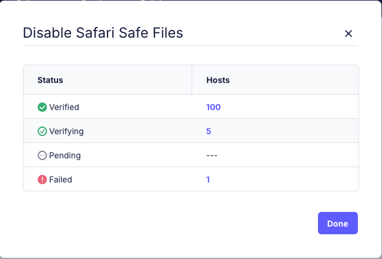

# View and manage MDM configuration profile status

Fleet now makes it easier to understand and manage the status of your MDM configuration profiles
across all your hosts - and to bulk resend failed profiles.

## What’s new

You can now:

- View the **aggregate status** of each configuration profile (e.g., verified, verifiying, pending, failed).
- See a **count of hosts** in each status per configuration profile.
- **Bulk resend** a configuration profile to all hosts with a failed status.

This feature gives you visibility into profile deployment and helps you resolve configuration profile issues quickly.

## Why it matters

Previously, understanding which hosts had failed to apply a config profile required digging
through host details one by one. Now, you can spot issues at a glance and take action in bulk resend
failed profiles to affected hosts.

## How to use

1. Navigate to **Controls > OSSettings > Custom Settings** in the Fleet UI.
2. Each cofiguration profile row now includes an info icon that when clicked will show you the
   aggregate status for that profile:
    - **Verified**: The profile was installed on the host and was this has been verified by Fleet
    - **Verifying**: the profile was installe do the host but has not yet been verified by Fleet
    - **Pending**: the profile is pending install on the host
    - **Failed**: the profile failed to be installed on the host

3. To resend a profile to all hosts where instialltion failed
    - Hover over the **Failed** status row.
    - Click the **Resend** button to send the install command to all affected hosts.
4. To view more information about hosts in a specific status:
    - Click the host count next to the desired status.
    - This takes you to the **Manage hosts** page, filtered by the selected configuration profile and status.

## Use cases

- Investigate and resolve failed profile deliveries quickly.
- Re-apply MDM configuration profiles without needing to touch each host.
- Confirm deployment success across your entire fleet.
- Drill down to view all hosts in a specific configuration profile status.

<meta name="articleTitle" value="View and manage MDM configuration profile status">
<meta name="authorFullName" value="Gabe Hernandez">
<meta name="authorGitHubUsername" value="ghernandez345">
<meta name="category" value="guides">
<meta name="publishedOn" value="2025-05-26">