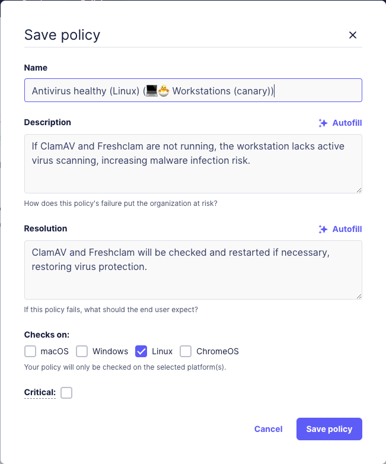

# Configuring maintenance windows in Fleet

This guide will walk you through the process of mitigating failing policies on specific hosts using a scheduled maintenance window. You'll learn how to configure and use this feature, as well as understand how the underlying mechanism works.

Fleet uses policies as a tool to verify that certain behaviors or conditions are met on hosts. These policies run osquery queries on hosts, which return a boolean result indicating success or failure. For example, a policy might check that passwords have more than a certain number of characters or that the `brew` package manager is up to date. Other policies might ensure that disk encryption is enabled or that the screensaver is set to a specific time and locks the host when it activates.

When a policy fails, it may indicate a potential security risk or non-compliance that requires attention. With this new feature, you can automate the mitigation of such failures by scheduling maintenance during a designated time window. For instance, if a `brew` update is required, administrators can schedule a time with the host's user to run an update script via a webhook. This webhook can be integrated with a low-code or no-code solution to streamline the process.

Some of these policies may be very important, and an admin might decide to act promptly upon a failure to mitigate the issue on the affected hosts. This approach ensures that maintenance activities are performed at a convenient time for the user, minimizing disruptions to their workflow. For more context on the importance and functionality of maintenance windows, refer to our blog post: [Fleet in your calendar: introducing maintenance windows](https://fleetdm.com/announcements/fleet-in-your-calendar-introducing-maintenance-windows).

## How does it work?
 
* When a policy fails on a specific host, a Google Calendar event is set for the user owning the host.
* The maintenance window is scheduled for next Tuesday in an available slot between 9 am and 5 pm local time.
* The event will have a description of why it is necessary and what will be done.
* At the time of the event, a payload will be prepared by the Fleet server with information about the host and the failure that then calls the predefined webhook.
* The webhook will do its operation to mitigate the problem using the Fleet API, MDM, or other tools.

## Prerequisites

* A dedicated Google Workspace service account. (Office 365 is coming soon.)
* A service or low-code/no-code webhook provider. (We use Tines in this example.)
* Fleet premium. 
* Admin permissions for all three services above.

## Step-by-Step Instructions

### One-time configuration of your Google Calendar account.

Detailed instructions for configuring your Google Calendar account, along with pre-formatted API keys, are provided within Fleet.

To access these steps, click the top right **User logo** > **Settings** page > **Integrations** tab > **Calendars** on the left-hand menu.

Follow the instructions found on this page.

> Please note that the Fleet server will use APIs provided by Google Calendar. Some additional load should be expected on the server. Make sure to have enough quota. (This can be adjusted later per need)

Video: [How to configure the Google Calendar API in Fleet](https://www.youtube.com/watch?v=CpbzJNrM2LY). (2m)

### Creating a webhook

An external webhook mechanism should be defined to be run as the mitigation plan for failing policies on hosts.

Please refer to the [Building webhook flows with Fleet and Tines](https://fleetdm.com/guides/building-webhook-flows-with-fleet-and-tines) guide to learn more about building webhooks using Tines.

At the end of this operation, you should have a webhook to be used by the Fleet server.

### Configuring a Policy to run the Webhook if failing (Admin)

1. On your Fleet UI, go to the **Policies** tab.
2. On the top left dropdown, select a team if needed.
3. On the top right, click **Manage automations** → **Calendar events**.
4. On the top left corner of the newly opened modal, click **Enable**.
5. Paste the webhook you have in the box named: **Resolution webhook URL**
6. Select one or more desired policies (click the checkbox next to it)

Video: [Setting a webhook for failing policies in Fleet](https://www.youtube.com/watch?v=evMB6zC8jso). (3m)

### Which users will have an event set for them?

If a policy on a host belonging to a Google Calendar user fails, an event will be set on their calendar next Tuesday between 9 a.m. and 5 p.m. local time.

If more than one host has the same user, the event will only be set for one of the hosts. Once this host has been remedied, another event will be scheduled for the next of the user’s hosts, and so forth.

If more than one user is set for a specific host, the event will be set for one of the users.

### What details will be presented in the calendar event?

When adding a policy (**Policies** tab > Top right corner **Add policy** > **create the policy** > Press **Save**), a modal will open with the policy details like this:

The description and resolution fields will be AI-generated based on the SQL on the policy.

The admin may press **Autofill** again to regenerate or edit the text manually. Learn more about [Fleet’s AI-assisted policy descriptions and resolutions](https://fleetdm.com/guides/fleet-ai-assisted-policy-descriptions-and-resolutions).

These fields will appear in the details of the scheduled event.

### Rescheduling the maintenance window (Host owner/user)

* **Rescheduling a maintenance window**: Users can reschedule their maintenance window by moving it on their calendar. Fleet will respect the new schedule and will run the maintenance webhook at the new time.
* **Rescheduled to the past**: If the user reschedules the event to a time before the current time, the Fleet server will reschedule it to the day after the original date.
* **Deleted maintenance window**: If the user deletes an event, the Fleet server reschedules it to the day after the original date. If it is deleted again, it will be rescheduled for the following day.

> The Fleet server handles monitoring the user’s calendar event in real time. Changes to the scheduled event will typically be monitored and addressed within 30 seconds. However, to save load on the Google calendar, only the next week is monitored. In the case of the event being rescheduled to more than a week from the present time, it will still be addressed within 30 minutes rather than in real-time.

## Additional Information

* Video: [How maintenance windows work under the hood](https://www.youtube.com/watch?v=Ra47xZwSitQ). (~4m)
* Video: [Detailed demo of this feature](https://www.youtube.com/watch?v=d4TElmLD1M8). (~20m)

## Conclusion

By following this guide, you’ve learned how to effectively automate the mitigation of failing policies on hosts using Fleet's scheduled maintenance window feature. This approach not only ensures that your fleet remains compliant and secure but also respects your users' time by scheduling maintenance at convenient intervals.

Leveraging Fleet’s integration with Google Calendar and webhooks, you can streamline the process of addressing policy failures, reducing manual oversight, and minimizing disruptions to your users' workflows. Whether it's updating critical software, ensuring security measures like disk encryption, or maintaining compliance with organizational policies, this feature provides a powerful tool to maintain the health and security of your infrastructure.

By automating these tasks, you can focus on more strategic initiatives, confident that Fleet is helping to keep your systems secure and your users satisfied. For more detailed insights into how this feature works or to explore additional customization options, refer to the additional resources provided.

Implementing scheduled mitigations not only enhances operational efficiency but also contributes to a proactive security posture, helping your organization stay ahead of potential risks.

<meta name="articleTitle" value="Configuring maintenance windows in Fleet">
<meta name="authorFullName" value="Sharon Katz">
<meta name="authorGitHubUsername" value="sharon-fdm">
<meta name="category" value="guides">
<meta name="publishedOn" value="2024-08-05">
<meta name="articleImageUrl" value="../website/assets/images/articles/configuring-maintenance-windows-in-fleet-1600x900@2x.jpg">
<meta name="description" value="A guide to workflows using configuring maintenance windows in Fleet.">
