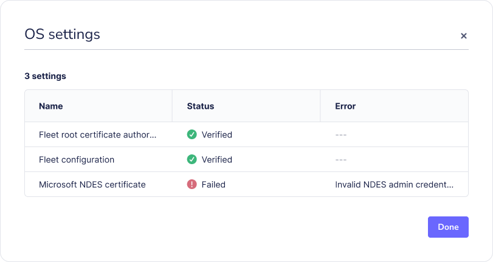

# Connect end users to Wi-Fi or VPN with a certificate (DigiCert, NDES, or custom SCEP)

_Available in Fleet Premium_

Fleet can help your end users connect to Wi-Fi or VPN by deploying certificates from your certificate authority (CA). Fleet currently supports [DigiCert](https://www.digicert.com/digicert-one), [Microsoft NDES](https://learn.microsoft.com/en-us/windows-server/identity/ad-cs/network-device-enrollment-service-overview), custom [SCEP](https://en.wikipedia.org/wiki/Simple_Certificate_Enrollment_Protocol) server, and [Hydrant](https://www.hidglobal.com/solutions/pki-service).

Fleet will automatically renew certificates before expiration. Learn more in the [Renewal section](#renewal).

## DigiCert

The following steps show how to connect end users to Wi-Fi or VPN with DigiCert certificates.

### Step 1: Create a service user in DigiCert

1. Log in to [DigiCert One](https://one.digicert.com/).
2. Create a [new service user](https://one.digicert.com/account/access/service-user/role-service-user-create), under the "DigiCert ONE Manager access" dropdown, select "Trust Lifecycle."
3. On the next page, assign the **User and certificate manager** and **Certificate profile manager** roles.
> For further information, see [DigiCert's instructions for creating a service user](https://docs.digicert.com/en/platform-overview/manage-your-accounts/account-manager/users-and-access/service-users/create-a-service-user.html).

### Step 2: Create certificate profile in DigiCert

1. In DigiCert [Trust Lifcycle Manager](https://one.digicert.com/mpki/dashboard), select **Policies > Certificate profiles** from the main menu. Then select **Create profile from template** and select **Generic Device Certificate** from the list.
2. Add a friendly **Profile name** (e.g., "Fleet - Wi-Fi authentication").
3. Select your **Business unit** and **Issuing CA**.
4. Select **REST API** from **Enrollment method**. Then select **3rd party app** from the **Authentication method** dropdown and select **Next**.
5. Configure the certificate expiration. At most organizations, this is set to 90 days.
6. In the **Flow options** section, make sure that **Allow duplicate certificates** is checked.
7. In the **Subject DN and SAN fields** section, add **Common name**. **Other name (UPN)** is optional.
   - For **Common name**, select **REST request** from **Source for the field's value** dropdown and check **Required**. 
   - If you use **Other name (UPN)**, select **REST Request** and check both **Required** and **Multiple**. 
   - Organizations usually use the device's serial number or the user's email. Fleet variables (covered in the next step) can be used to replace these variables with the actual values before the certificate is delivered to a device.
9. Click **Next** and leave the default options.

### Step 3: Connect Fleet to DigiCert

1. In Fleet, head to **Settings > Integrations > Certificates**.
2. Select **Add CA** and then choose **DigiCert** in the dropdown.
3. Add a **Name** for your certificate authority. Best practice is all caps snake case (for example, "WIFI_AUTHENTICATION"). This name is used later as a variable name in a configuration profile.
4. If you're using DigiCert One's cloud offering, keep the default **URL**. If you're using a self-hosted (on-prem) DigiCert One, update the URL to match the one you use to log in to your DigiCert One.
5. In **API token**, paste your DigiCert server user's API token (from step 1).
6. In **Profile GUID**, paste your DigiCert One certificate profile GUID (from step 2). To your GUID, open the profile in DigiCert and copy **GUID** from the [Certificate profiles](https://one.digicert.com/mpki/policies/profiles) page.
7. In **CN**, **UPN**, and **Certificate seat ID**, enter fixed values or select from [Fleet's host variables](https://fleetdm.com/docs/configuration/yaml-files#macos-settings-and-windows-settings). Most organizations use the host's serial number or end user's email to deliver a certificate that's unique to the host.
8. Select **Add CA**. Your DigiCert certificate authority (CA) should appear in your list of CAs in Fleet.

### Step 4: Add PKCS12 configuration profile to Fleet

1. Create a [configuration profile](https://fleetdm.com/guides/custom-os-settings) with a PKCS12 payload. 
  - For `Password`, use `$FLEET_VAR_DIGICERT_PASSWORD_<CA_NAME>`. 
  - For `Data`, use `$FLEET_VAR_DIGICERT_DATA_<CA_NAME>`.

2. Replace the `<CA_NAME>` with the name you created in step 3. For example, if the name of the CA is "WIFI_AUTHENTICATION", the variables will look like `$FLEET_VAR_DIGICERT_PASSWORD_WIFI_AUTHENTICATION` and `$FLEET_VAR_DIGICERT_DATA_WIFI_AUTHENTICATION`.

3. In Fleet, head to **Controls > OS settings > Custom settings** and add the configuration profile to deploy certificates to your hosts.

When Fleet delivers the profile to your hosts, Fleet will replace the variables. If something goes wrong, errors will appear on each host's **Host details > OS settings**.

### Additional DigiCert details:
- Each DigiCert device type seat (license) can have multiple certificates only if they have the same CN and seat ID. If a new certificate has a different CN, a new DigiCert license is required.
- If the value for any variable used in step 3 above changes, Fleet will resend the profile. This means that if you use a variable like `$FLEET_VAR_HOST_END_USER_IDP_USERNAME` for CN or seat ID, and the variable's value changes, Fleet will get a new certificate and create a new seat in DigiCert. This will add a new DigiCert license. If you want to revoke a license in DigiCert, head to [**Trust Lifcycle Manager > Account > Seats**](https://one.digicert.com/mpki/account/seats) and remove the seat.
- DigiCert seats aren't automatically revoked when hosts are deleted in Fleet. To revoke a license, ask the team that owns DigiCert to follow the instructions above.

#### Example configuration profile

```xml
<?xml version="1.0" encoding="UTF-8"?>
<!DOCTYPE plist PUBLIC "-//Apple//DTD PLIST 1.0//EN" "http://www.apple.com/DTDs/PropertyList-1.0.dtd">
<plist version="1.0">
    <dict>
        <key>PayloadContent</key>
        <array>
            <dict>
                <key>Password</key>
                <string>$FLEET_VAR_DIGICERT_PASSWORD_CA_NAME</string>
                <key>PayloadContent</key>
                <data>$FLEET_VAR_DIGICERT_DATA_CA_NAME</data>
                <key>PayloadDisplayName</key>
                <string>CertificatePKCS12</string>
                <key>PayloadIdentifier</key>
                <string>com.fleetdm.pkcs12</string>
                <key>PayloadType</key>
                <string>com.apple.security.pkcs12</string>
                <key>PayloadUUID</key>
                <string>ee86cfcb-2409-42c2-9394-1f8113412e04</string>
                <key>PayloadVersion</key>
                <integer>1</integer>
            </dict>
        </array>
        <key>PayloadDisplayName</key>
        <string>DigiCert profile</string>
        <key>PayloadIdentifier</key>
        <string>TopPayloadIdentifier</string>
        <key>PayloadType</key>
        <string>Configuration</string>
        <key>PayloadUUID</key>
        <string>TopPayloadUUID</string>
        <key>PayloadVersion</key>
        <integer>1</integer>
    </dict>
</plist>
```


## Microsoft NDES

The following steps show how to connect end users to Wi-Fi or VPN with Microsoft NDES certificates.

### Step 1: Connect Fleet to NDES

1. In Fleet, head to **Settings > **Integrations > Certificates**.
2. Select the **Add CA** button and select **Microsoft NDES** in the dropdown.
3. Enter your **SCEP URL**, **Admin URL**, and **Username** and **Password**.
4. Select **Add CA**. Your NDES certificate authority (CA) should appear in the list in Fleet.

The example paths end with `/certsrv/mscep/mscep.dll` and `/certsrv/mscep_admin/` respectively. These path suffixes are the default paths for NDES on Windows Server 2022 and should only be changed if you have customized the paths on your server.

When saving the configuration, Fleet will attempt to connect to the SCEP server to verify the connection, including retrieving a one-time challenge password. This validation also occurs when adding a new SCEP configuration or updating an existing one via API and GitOps, including dry runs. Please ensure the NDES password cache size is large enough to accommodate this validation.

### Step 2: Add SCEP configuration profile to Fleet

1. Create a [configuration profile](https://fleetdm.com/guides/custom-os-settings) with the SCEP payload. 
  - For `Challenge`, use`$FLEET_VAR_NDES_SCEP_CHALLENGE`. 
  - For `URL`, use `$FLEET_VAR_NDES_SCEP_PROXY_URL`, and make sure to add `$FLEET_VAR_SCEP_RENEWAL_ID` to `CN`.

2. If your Wi-Fi or VPN requires certificates that are unique to each host, update the `Subject`. For example, you can use `$FLEET_VAR_HOST_END_USER_EMAIL_IDP` if your hosts automatically enrolled (via ADE) to Fleet with [end user authentication](https://fleetdm.com/docs/rest-api/rest-api#get-human-device-mapping) enabled. You can also use any of the [Apple's built-in variables](https://support.apple.com/en-my/guide/deployment/dep04666af94/1/web/1.0).

3. In Fleet, head to **Controls > OS settings > Custom settings** and add the configuration profile to deploy certificates to your hosts.

When the profile is delivered to your hosts, Fleet will replace the variables. If something fails, errors will appear on each host's **Host details > OS settings**.



#### Example configuration profile

```xml
<?xml version="1.0" encoding="UTF-8"?>
<!DOCTYPE plist PUBLIC "-//Apple//DTD PLIST 1.0//EN" "http://www.apple.com/DTDs/PropertyList-1.0.dtd">
<plist version="1.0">
<dict>
    <key>PayloadContent</key>
    <array>
       <dict>
          <key>PayloadContent</key>
          <dict>
             <key>Challenge</key>
             <string>$FLEET_VAR_NDES_SCEP_CHALLENGE</string>
             <key>Key Type</key>
             <string>RSA</string>
             <key>Key Usage</key>
             <integer>5</integer>
             <key>Keysize</key>
             <integer>2048</integer>
             <key>Subject</key>
                    <array>
                        <array>
                          <array>
                            <string>CN</string>
                            <string>%SerialNumber% WIFI $FLEET_VAR_SCEP_RENEWAL_ID</string>
                          </array>
                        </array>
                        <array>
                          <array>
                            <string>OU</string>
                            <string>FLEET DEVICE MANAGEMENT</string>
                          </array>
                        </array>
                    </array>
             <key>URL</key>
             <string>$FLEET_VAR_NDES_SCEP_PROXY_URL</string>
          </dict>
          <key>PayloadDisplayName</key>
          <string>WIFI SCEP</string>
          <key>PayloadIdentifier</key>
          <string>com.apple.security.scep.9DCC35A5-72F9-42B7-9A98-7AD9A9CCA3AC</string>
          <key>PayloadType</key>
          <string>com.apple.security.scep</string>
          <key>PayloadUUID</key>
          <string>9DCC35A5-72F9-42B7-9A98-7AD9A9CCA3AC</string>
          <key>PayloadVersion</key>
          <integer>1</integer>
       </dict>
    </array>
    <key>PayloadDisplayName</key>
    <string>SCEP proxy cert</string>
    <key>PayloadIdentifier</key>
    <string>Fleet.WiFi</string>
    <key>PayloadType</key>
    <string>Configuration</string>
    <key>PayloadUUID</key>
    <string>4CD1BD65-1D2C-4E9E-9E18-9BCD400CDEDC</string>
    <key>PayloadVersion</key>
    <integer>1</integer>
</dict>
</plist>
```

## Custom SCEP server

The following steps show how to connect end users to Wi-Fi or VPN with a custom SCEP server.


### Step 1: Connect Fleet to a custom SCEP server

1. In Fleet, head to **Settings > **Integrations > Certificates**.
2. Select the **Add CA** button and select **Custom** in the dropdown.
3. Add a **Name** for your certificate authority. The best practice is to create a name based on your use case in all caps snake case (for example, "WIFI_AUTHENTICATION"). This name will be used later as a variable name in a configuration profile.
4. Add your **SCEP URL** and **Challenge**.
6. Select **Add CA**. Your custom SCEP certificate authority (CA) should appear in the list in Fleet.

### Step 2: Add SCEP configuration profile to Fleet

1. Create a [configuration profile](https://fleetdm.com/guides/custom-os-settings) with the SCEP payload. 
  - For `Challenge`, use`$FLEET_VAR_CUSTOM_SCEP_CHALLENGE_<CA_NAME>`. 
  - For `URL`, use `$FLEET_VAR_CUSTOM_SCEP_PROXY_URL_<CA_NAME>`, and make sure to add `$FLEET_VAR_SCEP_RENEWAL_ID` to `CN`.

2. Replace the `<CA_NAME>` with the name you created in step 3. For example, if the name of the CA is "WIFI_AUTHENTICATION", the variables will look like this: `$FLEET_VAR_CUSTOM_SCEP_PASSWORD_WIFI_AUTHENTICATION` and `FLEET_VAR_CUSTOM_SCEP_DIGICERT_DATA_WIFI_AUTHENTICATION`.

3. If your Wi-Fi or VPN requires certificates that are unique to each host, update the `Subject`. You can use `$FLEET_VAR_HOST_END_USER_EMAIL_IDP` if your hosts automatically enrolled (via ADE) to Fleet with [end user authentication](https://fleetdm.com/docs/rest-api/rest-api#get-human-device-mapping) enabled. You can also use any of [Apple's built-in variables](https://support.apple.com/en-my/guide/deployment/dep04666af94/1/web/1.0).

4. In Fleet, head to **Controls > OS settings > Custom settings** and add the configuration profile to deploy certificates to your hosts.

When the profile is delivered to your hosts, Fleet will replace the variables. If something goes wrong, errors will appear on each host's **Host details > OS settings**.

#### Example configuration profiles

<details>
<summary>Apple configuration profile</summary>

```xml
<?xml version="1.0" encoding="UTF-8"?>
<!DOCTYPE plist PUBLIC "-//Apple//DTD PLIST 1.0//EN" "http://www.apple.com/DTDs/PropertyList-1.0.dtd">
<plist version="1.0">
<dict>
    <key>PayloadContent</key>
    <array>
       <dict>
          <key>PayloadContent</key>
          <dict>
             <key>Challenge</key>
             <string>$FLEET_VAR_CUSTOM_SCEP_CHALLENGE_CA_NAME</string>
             <key>Key Type</key>
             <string>RSA</string>
             <key>Key Usage</key>
             <integer>5</integer>
             <key>Keysize</key>
             <integer>2048</integer>
             <key>Subject</key>
                    <array>
                        <array>
                          <array>
                            <string>CN</string>
                            <string>%SerialNumber% WIFI $FLEET_VAR_SCEP_RENEWAL_ID</string>
                          </array>
                        </array>
                        <array>
                          <array>
                            <string>OU</string>
                            <string>FLEET DEVICE MANAGEMENT</string>
                          </array>
                        </array>
                    </array>
             <key>URL</key>
             <string>$FLEET_VAR_CUSTOM_SCEP_PROXY_URL_CA_NAME</string>
          </dict>
          <key>PayloadDisplayName</key>
          <string>WIFI SCEP</string>
          <key>PayloadIdentifier</key>
          <string>com.apple.security.scep.9DCC35A5-72F9-42B7-9A98-7AD9A9CCA3AC</string>
          <key>PayloadType</key>
          <string>com.apple.security.scep</string>
          <key>PayloadUUID</key>
          <string>9DCC35A5-72F9-42B7-9A98-7AD9A9CCA3AC</string>
          <key>PayloadVersion</key>
          <integer>1</integer>
       </dict>
    </array>
    <key>PayloadDisplayName</key>
    <string>SCEP proxy cert</string>
    <key>PayloadIdentifier</key>
    <string>Fleet.WiFi</string>
    <key>PayloadType</key>
    <string>Configuration</string>
    <key>PayloadUUID</key>
    <string>4CD1BD65-1D2C-4E9E-9E18-9BCD400CDEDC</string>
    <key>PayloadVersion</key>
    <integer>1</integer>
</dict>
</plist>
```

</details>
<details>
<summary>Windows configuration profile</summary>

To get the CAThumbprint of your SCEP server, see the [advanced section](#how-to-get-the-cathumbprint-for-windows-scep-profiles) below.

Any options listed under [Device/SCEP](https://learn.microsoft.com/en-us/windows/client-management/mdm/clientcertificateinstall-csp), can be configured with the SCEP profile.

```xml
<Add>
    <Item>
        <Target>
            <LocURI>./Device/Vendor/MSFT/ClientCertificateInstall/SCEP/$FLEET_VAR_SCEP_WINDOWS_CERTIFICATE_ID</LocURI>
        </Target>
        <Meta>
            <Format xmlns="syncml:metinf">node</Format>
        </Meta>
    </Item>
</Add>
<Add>
    <Item>
        <Target>
            <LocURI>./Device/Vendor/MSFT/ClientCertificateInstall/SCEP/$FLEET_VAR_SCEP_WINDOWS_CERTIFICATE_ID/Install/KeyUsage</LocURI>
        </Target>
        <Meta>
            <Format xmlns="syncml:metinf">int</Format>
        </Meta>
        <Data>160</Data>
    </Item>
</Add>
<Add>
    <Item>
        <Target>
            <LocURI>./Device/Vendor/MSFT/ClientCertificateInstall/SCEP/$FLEET_VAR_SCEP_WINDOWS_CERTIFICATE_ID/Install/KeyLength</LocURI>
        </Target>
        <Meta>
            <Format xmlns="syncml:metinf">int</Format>
        </Meta>
        <Data>1024</Data>
    </Item>
</Add>
<Add>
    <Item>
        <Target>
            <LocURI>./Device/Vendor/MSFT/ClientCertificateInstall/SCEP/$FLEET_VAR_SCEP_WINDOWS_CERTIFICATE_ID/Install/HashAlgorithm</LocURI>
        </Target>
        <Meta>
            <Format xmlns="syncml:metinf">chr</Format>
        </Meta>
        <Data>SHA-1</Data>
    </Item>
</Add>
<Add>
    <Item>
        <Target>
            <LocURI>./Device/Vendor/MSFT/ClientCertificateInstall/SCEP/$FLEET_VAR_SCEP_WINDOWS_CERTIFICATE_ID/Install/SubjectName</LocURI>
        </Target>
        <Meta>
            <Format xmlns="syncml:metinf">chr</Format>
        </Meta>
        <Data>CN=$FLEET_VAR_SCEP_WINDOWS_CERTIFICATE_ID</Data>
    </Item>
</Add>
<Add>
    <Item>
        <Target>
            <LocURI>./Device/Vendor/MSFT/ClientCertificateInstall/SCEP/$FLEET_VAR_SCEP_WINDOWS_CERTIFICATE_ID/Install/EKUMapping</LocURI>
        </Target>
        <Meta>
            <Format xmlns="syncml:metinf">chr</Format>
        </Meta>
        <Data>1.3.6.1.5.5.7.3.2</Data>
    </Item>
</Add>
<Add>
    <Item>
        <Target>
            <LocURI>./Device/Vendor/MSFT/ClientCertificateInstall/SCEP/$FLEET_VAR_SCEP_WINDOWS_CERTIFICATE_ID/Install/ServerURL</LocURI>
        </Target>
        <Meta>
            <Format xmlns="syncml:metinf">chr</Format>
        </Meta>
        <Data>$FLEET_VAR_CUSTOM_SCEP_PROXY_URL_CA_NAME</Data>
    </Item>
</Add>
<Add>
    <Item>
        <Target>
            <LocURI>./Device/Vendor/MSFT/ClientCertificateInstall/SCEP/$FLEET_VAR_SCEP_WINDOWS_CERTIFICATE_ID/Install/Challenge</LocURI>
        </Target>
        <Meta>
            <Format xmlns="syncml:metinf">chr</Format>
        </Meta>
        <Data>$FLEET_VAR_CUSTOM_SCEP_CHALLENGE_CA_NAME</Data>
    </Item>
</Add>
<Add>
    <Item>
        <Target>
            <LocURI>./Device/Vendor/MSFT/ClientCertificateInstall/SCEP/$FLEET_VAR_SCEP_WINDOWS_CERTIFICATE_ID/Install/CAThumbprint</LocURI>
        </Target>
        <Meta>
            <Format xmlns="syncml:metinf">chr</Format>
        </Meta>
        <Data>2133EC6A3CFB8418837BB395188D1A62CA2B96A6</Data>
    </Item>
</Add>
<Exec>
    <Item>
        <Target>
            <LocURI>./Device/Vendor/MSFT/ClientCertificateInstall/SCEP/$FLEET_VAR_SCEP_WINDOWS_CERTIFICATE_ID/Install/Enroll</LocURI>
        </Target>
    </Item>
</Exec>
```

> Currently only device scoped SCEP profiles are supported for Windows devices.

</details>

## Smallstep

The following steps show how to connect end users to Wi-Fi or VPN with Smallstep certificates.

### Step 1: Configure Smallstep with Fleet information

We're currently working with Smallstep to develop a specific Smallstep-Fleet connector. In the meantime, Smallstep can be configured to work with Fleet by using the Smallstep-Jamf connector.

1. In Smallstep, go to **Settings > Device Management**.

2. Under **Available Providers**, find **Jamf** and click **Connect**.

3. In the Smallstepform, enter your Fleet server URL (the API Client ID and API Client Secret fields are not required), then click **Connect MDM**.

4. After connecting, note the following details from Smallstep (these values are required in the next step):
  - **SCEP URL**
  - **WebhookURL (SCEPChallenge)**
  - **Challenge Basic Authentication Username**
  - **Challenge Basic Authentication Password**

### Step 2: Configure Fleet with Smallstep information

1. In Fleet, go to **Settings > Integrations > Certificates** and click **Add CA**. 

2. In the modal, select **Smallstep** from the dropdown and enter a name for your certificate authority (CA). Best practice is all caps snake case (for example, "WIFI_AUTHENTICATION"). This name is used later as a variable name in a configuration profile.

3. For the **Challenge URL**, **Username**, and **Password**, enter the values noted in step 1. For the **SCEP URL**, you'll need to modify the URL provided by Smallstep to use the public proxy route instead. For example, `https://agents.SMALLSTEP_TEAM_NAME.ca.smallstep.com/scep/INTEGRATION_ID` becomes `https://<SMALLSTEP_TEAM_NAME>.scep.smallstep.com/p/agents/<INTEGRATION_ID>`

### Step 3: Add SCEP configuration profile to Fleet

1. Create a [configuration profile](https://fleetdm.com/guides/custom-os-settings) with the SCEP payload. 
  - For `Challenge`, use`$FLEET_VAR_SMALLSTEP_SCEP_CHALLENGE_<CA_NAME>`. 
  - For, `URL`, use `$FLEET_VAR_SMALLSTEP_SCEP_PROXY_URL_<CA_NAME>`, and make sure to add `$FLEET_VAR_SCEP_RENEWAL_ID` to `CN`.

2. Replace the `<CA_NAME>` with the name you created in step 2. For example, if the name of the CA is "WIFI_AUTHENTICATION", the variables will look like this: `$FLEET_VAR_SMALLSTEP_SCEP_CHALLENGE_WIFI_AUTHENTICATION` and `FLEET_VAR_SMALLSTEP_SCEP_PROXY_URL_WIFI_AUTHENTICATION`.

3. If your Wi-Fi or VPN requires certificates that are unique to each host, update the `Subject`. You can use `$FLEET_VAR_HOST_END_USER_EMAIL_IDP` if your hosts automatically enrolled (via ADE) to Fleet with [end user authentication](https://fleetdm.com/docs/rest-api/rest-api#get-human-device-mapping) enabled. You can also use any of the [Apple's built-in variables](https://support.apple.com/en-my/guide/deployment/dep04666af94/1/web/1.0).

4. In Fleet, head to **Controls > OS settings > Custom settings** and add the configuration profile to deploy certificates to your hosts.

When the profile is delivered to your hosts, Fleet will replace the variables. If something goes wrong, errors will appear on each host's **Host details > OS settings**.

#### Example configuration profile

```xml
<?xml version="1.0" encoding="UTF-8"?>
<!DOCTYPE plist PUBLIC "-//Apple//DTD PLIST 1.0//EN" "http://www.apple.com/DTDs/PropertyList-1.0.dtd">
<plist version="1.0">
<dict>
    <key>PayloadContent</key>
    <array>
       <dict>
          <key>PayloadContent</key>
          <dict>
             <key>Challenge</key>
             <string>$FLEET_VAR_SMALLSTEP_SCEP_CHALLENGE_CA_NAME</string>
             <key>Key Type</key>
             <string>RSA</string>
             <key>Key Usage</key>
             <integer>5</integer>
             <key>Keysize</key>
             <integer>2048</integer>
             <key>Subject</key>
                    <array>
                        <array>
                          <array>
                            <string>CN</string>
                            <string>%SerialNumber% WIFI $FLEET_VAR_SCEP_RENEWAL_ID</string>
                          </array>
                        </array>
                        <array>
                          <array>
                            <string>OU</string>
                            <string>FLEET DEVICE MANAGEMENT</string>
                          </array>
                        </array>
                    </array>
             <key>URL</key>
             <string>$FLEET_VAR_SMALLSTEP_SCEP_PROXY_URL_CA_NAME</string>
          </dict>
          <key>PayloadDisplayName</key>
          <string>WIFI SCEP</string>
          <key>PayloadIdentifier</key>
          <string>com.apple.security.scep.9DCC35A5-72F9-42B7-9A98-7AD9A9CCA3AC</string>
          <key>PayloadType</key>
          <string>com.apple.security.scep</string>
          <key>PayloadUUID</key>
          <string>9DCC35A5-72F9-42B7-9A98-7AD9A9CCA3AC</string>
          <key>PayloadVersion</key>
          <integer>1</integer>
       </dict>
    </array>
    <key>PayloadDisplayName</key>
    <string>SCEP proxy cert</string>
    <key>PayloadIdentifier</key>
    <string>Fleet.WiFi</string>
    <key>PayloadType</key>
    <string>Configuration</string>
    <key>PayloadUUID</key>
    <string>4CD1BD65-1D2C-4E9E-9E18-9BCD400CDEDC</string>
    <key>PayloadVersion</key>
    <integer>1</integer>
</dict>
</plist>
```

## Hydrant

The following steps show how to connect end users to Wi-Fi or VPN with Hydrant.

The flow for Hydrant differs from the other certificate authorities (CA's). While other CAs in Fleet use a configuration profile to request a certificate, Hydrant uses:
- A custom script that makes a request to Fleet's [`POST /request_certificate`](https://fleetdm.com/docs/rest-api/rest-api#request-certificate) API endpoint. 
- A custom policy that triggers the script on hosts that don't have a certificate.

### Step 1: Create a Hydrant user and obtain its API credentials

1. Log in to your [company's ACM platform](https://help.hydrantid.com/html/authentication.html).
1. Invite a [new user](https://help.hydrantid.com/html/authentication.html) that will be used for certificate generation and ensure it has the [required permissions](https://help.hydrantid.com/html/roles.html) to request certificates.
1. Log out and log back in as the new user.
1. Get the [API keys](https://help.hydrantid.com/html/manageapikeys.html) for the newly created user, make a note of the **Client ID** and **Client Secret**, you will need that to connect Fleet with Hydrant in the next step.

### Step 2: Connect Fleet to Hydrant

1. In Fleet, head to **Settings > Integrations > Certificates**.
2. Select **Add CA** and then choose **Hydrant EST** in the dropdown.
3. Add a **Name** for your certificate authority. The best practice is to create a name based on your use case in all caps snake case (ex. "WIFI_AUTHENTICATION").
4. Add your Hydrant EST **URL**.
5. Add the Hydrant ID and Key as the **Client ID** and **Client secret** in Fleet respectfully.
6. Click **Add CA**. Your Hydrant certificate authority (CA) should appear in the list in Fleet.

### Step 3: Create a custom script

To automatically deploy certificates to Linux hosts when they enroll, we'll create a custom script to write a certificate to a location. This script will be triggered by a policy that checks for the existence of a certificate.

This custom script will create a certificate signing request (CSR) and make a request to Fleet's "Request certificate" API endpoint.

1. Create an API-only user with the global maintainer role. Learn more how to create an API-only user in the [API-only user guide](https://fleetdm.com/guides/fleetctl#create-api-only-user).
2. In Fleet, head to **Controls > Variables** and create a Fleet variable called REQUEST_CERTIFICATE_API_TOKEN. Add the API-only user's API token as the value. You'll use this variable in your script.
3. Make a request to Fleet's [`GET /certificate_authorities` API endpoint](https://fleetdm.com/docs/rest-api/rest-api#list-certificate-authorities-cas) to get the `id` for your Hydrant CA. You'll use this `id` in your script.
4. In Fleet, head to **Controls > Scripts**, and add a script like the one below, plugging in your own filesystem locations, Fleet server URL and IdP information. For this script to work, the host it's run on has to have openssl, sed, curl and jq installed.

Example script:

```shell
#!/bin/bash
set -e

# Load the end user information, IdP token and IdP client ID.
. /opt/company/userinfo

URL="<IdP-introspection-URL>"

# Generate the password-protected private key
openssl genpkey -algorithm RSA -out /opt/company/CustomerUserNetworkAccess.key -pkeyopt rsa_keygen_bits:2048 -aes256 -pass pass:${PASSWORD}

# Generate CSR signed with that private key. The CN can be changed and DNS attribute omitted if your Hydrant configuration allows it.
openssl req -new -sha256 -key /opt/company/CustomerUserNetworkAccess.key -out CustomerUserNetworkAccess.csr -subj /CN=CustomerUserNetworkAccess:${USERNAME} -addext "subjectAltName=DNS:example.com, email:$USERNAME, otherName:msUPN;UTF8:$USERNAME" -passin pass:${PASSWORD}

# Escape CSR for request
CSR=$(sed 's/$/\\n/' CustomerUserNetworkAccess.csr | tr -d '\n')
REQUEST='{ "csr": "'"${CSR}"'", "idp_oauth_url":"'"${URL}"'", "idp_token": "'"${TOKEN}"'", "idp_client_id": "'"${CLIENT_ID}"'" }'

curl 'https://<Fleet-server-URL>/api/latest/fleet/certificate_authorities/<Hydrant-CA-ID>/request_certificate' \
  -X 'POST' \
  -H 'accept: application/json, text/plain, */*' \
  -H 'authorization: Bearer '"$FLEET_SECRET_REQUEST_CERTIFICATE_API_TOKEN" \
  -H 'content-type: application/json' \
  --data-raw "${REQUEST}" -o response.json

jq -r .certificate response.json > /opt/company/certificate.pem
```

This script assumes that your company installs a custom Company Portal app or something similar at `/opt/company`, gathers the user's IdP session information, uses username and a password to protect the private key from `/opt/company/userinfo`, and installs that the certificate in `/opt/company`. You will want to modify it to match your company's requirements.

For simplicity, the scripts use a `userinfo` file (below). However, the best practice is to load variables from the output of a command or even a separate network request:

```shell
PASSWORD="<Password-for-the-certificate-private-key>"
USERNAME="<End-user-email>"
TOKEN="<End-user-OAuth-IdP-token>"
CLIENT_ID="<OAuth-IdP-client-ID>"
```

Enforcing IdP validation using `idp_oauth_url` and `idp_token` is optional. If enforced, the CSR must include exactly 1 email which matches the IdP username and must include a UPN attribute which is either a prefix of the IdP username or the username itself (i.e. if the IdP username is "bob@example.com", the UPN may be "bob" or "bob@example.com")

### Step 4: Create a custom policy


1. In Fleet, head to **Policies** and select **Add policy**. Use the following query to detect the certificate's existence and if it expires in the next 30 days:

```sql
SELECT 1 FROM certificates WHERE path = '/opt/company/certificate.pem' AND not_valid_after > (CAST(strftime('%s', 'now') AS INTEGER) + 2592000);
```

2. Select **Save** and select only **Linux** as its target. Select **Save** again to create your policy.
3. On the **Policies** page, select **Manage automations > Scripts**. Select your newly-created policy and then in the dropdown to the right, select your newly created certificate issuance script.
4. Now, any host that doesn't have a certificate in `/opt/company/certificate.pem` or has a certificate that expires in the next 30 days will fail the policy. When the policy fails, Fleet will run the script to deploy a new certificate!

## Renewal

Fleet will automatically renew certificates 30 days before expiration. If an end user is on vacation (offline for more than 30 days), their certificate might expire, and they'll lose access to Wi-Fi or VPN. To reconnect them, ask your end users to temporarily connect to a different network so that Fleet can deliver a new certificate.

If certificates are valid for less than 30 days, automatic renewal happens halfway through the validity period. For example, if a certificate is valid for 20 days, Fleet will renew the certificate 10 days before it expires.

> Currently, for NDES and custom SCEP CAs, Fleet requires that the ⁠`$FLEET_VAR_SCEP_RENEWAL_ID` variable is in the certificate's CN (Common Name) for automatic renewal to work. Since the CN has a maximum length of 64 characters, any characters beyond this limit get truncated, causing the renewal to fail.
>
> The ⁠`$FLEET_VAR_SCEP_RENEWAL_ID` is a 36 character UUID. Please make sure that any additional variables or content combined with it do not exceed the remaining 28 characters.
>
> If automatic renewal fails, you can resend the configuration profile manually on the host's **Host details** page, the end user's **Fleet Desktop > My Device** page, or via [Fleet's API](https://fleetdm.com/docs/rest-api/rest-api#resend-custom-os-setting-configuration-profile).

> Fleet does not currently support automatic renewal for Windows hosts.

## Advanced

### User scoped certificates

You can also upload a certificate to be installed in the login keychain of the managed user on a
macOS host using a user-scoped configuration profile.

1. **Add your CA as before**
  Use the above steps to integrate your CA with Fleet.
1. **Create a certificate payload**
  Use your preferred tool (e.g., Apple Configurator or a `.mobileconfig` generator) to create a configuration profile that includes your certificate.
2. **Ensure the payload is scoped to the user**
  In the payload, set the `PayloadScope` to `User`. This tells macOS to install the certificate in the user’s login keychain instead of the system keychain.
3. **Upload the configuration profile to Fleet**
  Navigate to **Controls > OS settings > Custom settings** in the Fleet UI. Upload the `.mobileconfig` profile you created.
4. **Assign the profile to the correct hosts**
  Use Fleet’s targeting filters to assign the profile to the appropriate hosts. The certificate will be installed in the login keychain of the user currently logged in on each device.

### Editing ceritificate configuration profiles on Apple (macOS, iOS, iPadOS) hosts

When you edit a certificate configuration profile for Apple hosts, via GitOps, a new certificate will be added to each hosts' Keychain and the old certificate will be removed. It takes a couple minutes for the old certificate to be removed.

### Assumptions and limitations

* NDES SCEP proxy is currently supported for macOS devices via Apple config profiles. Support for DDM (Declarative Device Management) is coming soon, as is support for iOS, iPadOS, Windows, and Linux.
* Fleet server assumes a one-time challenge password expiration time of 60 minutes.
* On **Windows**, SCEP challenge strings should NOT include `base64` encoding or special characters such as `! @ # $ % ^ & * _ ()` 
* The SCEP Server used for **Windows**, should accept `/pkiclient.exe` at the end, as Windows will always append this to the SCEP URL. If using a Certificate Authority and Fleet Variables, Fleet handles this and strips it away from the request sent to the backing SCEP server.
* On **Windows** hosts, Fleet will not verify the SCEP profile via OSQuery reports. Fleet will mark it as verified, if a successful request went through, even if the certificate is not present.
* On **Windows** hosts, Fleet will not remove certificates from profiles, when removing the profile from the host, or transferring teams.

### How the SCEP proxy works

Fleet acts as a middleman between the host and the NDES or custom SCEP server. When a host requests a certificate from Fleet, Fleet requests a certificate from the NDES or custom SCEP server, retrieves the certificate, and sends it back to the host.

Certificates will appear in the System Keychain on macOS. During the profile installation, the OS generates several temporary certificates needed for the SCEP protocol. These certificates may be briefly visible in the Keychain Access app on macOS. The CA certificate must also be installed and marked as trusted on the device for the issued certificate to appear as trusted. The IT admin can send the CA certificate in a separate [CertificateRoot profile](https://developer.apple.com/documentation/devicemanagement/certificateroot?language=objc)

In addition, Fleet does the following:

NDES SCEP proxy:

- Retrieves the one-time challenge password from NDES. The NDES admin password is encrypted in Fleet's database by the [server private key](https://fleetdm.com/docs/configuration/fleet-server-configuration#server-private-key). It cannot be retrieved via the API or the web interface. Retrieving passwords for many hosts at once may cause a bottleneck. To avoid long wait times, we recommend a gradual rollout of SCEP profiles.
  - Restarting NDES will clear the password cache and may cause outstanding SCEP profiles to fail.
- Resends the configuration profile to the host if the one-time challenge password has expired.
  - If the host has been offline and the one-time challenge password is more than 60 minutes old, Fleet assumes the password has expired and will resend the profile to the host with a new one-time challenge password.

Custom SCEP proxy:

- Generates a one-time passcode that is added to the URL in the SCEP profile.
  - When a host makes a certificate request via the URL, the passcode is validated by Fleet prior to retrieving a certificate from the custom SCEP server.
  - This Fleet-managed passcode is valid for 60 minutes. Fleet automatically resends the SCEP profile
    to the host with a new passcode if the host requests a certificate after the passcode has expired.
  - The static challenge configured for the custom SCEP server remains in the SCEP profile.

<meta name="articleTitle" value="Connect end users to Wi-Fi or VPN with a certificate (DigiCert, NDES, or custom SCEP)">
<meta name="authorFullName" value="Victor Lyuboslavsky">
<meta name="authorGitHubUsername" value="getvictor">
<meta name="category" value="guides">
<meta name="publishedOn" value="2024-10-30">
<meta name="description" value="Learn how to automatically connect a device to a Wi-Fi by adding your certificate authority and issuing a certificate from it.">

### How to get the CAThumbprint for Windows SCEP profiles

Steps to get CAThumbrint from your SCEP server:

1. Use GetCACert operation to download certificate. For example, open in browser: https://scep-server-url/scep?operation=GetCACert
2. Run the following command to get the SHA1 Thumbprint
    1. **Terminal (MacOS)** -> `openssl x509 -inform DER -in /path/to/downloaded-cert.cer -noout -fingerprint -sha1 | sed 's/sha1 Fingerprint=//; s/://g`
    2. **PowerShell (Windows)** -> `$cert = Get-PfxCertificate -FilePath "Z:\scep (1).cer";$cert.Thumbprint`
3. It will return the SHA1 Thumbprint without colons and text. Copy this
4. Use the copied value for ./Device/Vendor/MSFT/ClientCertificateInstall/SCEP/$FLEET_VAR_SCEP_WINDOWS_CERTIFICATE_ID/Install/CAThumbprint option.