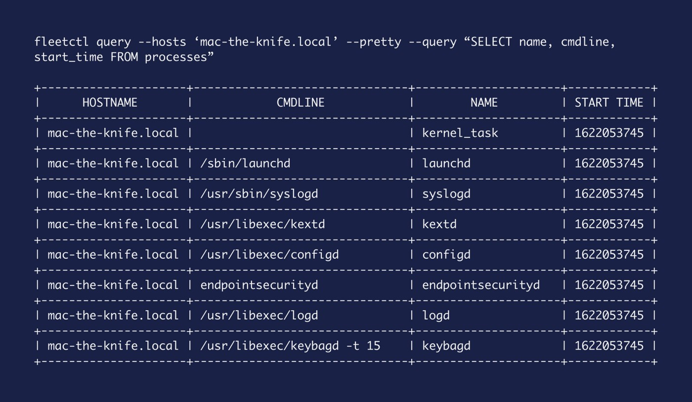
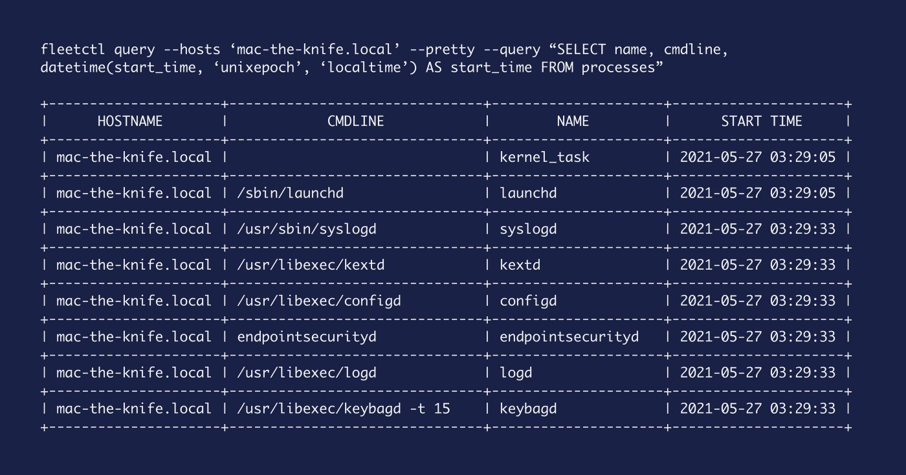

# Converting unix timestamps with osquery

## Human readable timestamps


*Unix timestamps can be confusing for even the smartest Time Lord.*

If you are anything like me, and unix timestamps leave you thinking about the mysterious numbers in Lost, you’re going to want to convert them into something more human friendly. Running your timestamp through any number of online converters is one way to go, but it’s a clunky process.


*Hmm… 10800? That’s Thursday, January 1, 1970 3:00:00 AM, if I’m not mistaken.*

Thankfully, we can easily convert unix timestamps directly in osquery:

```
SELECT     
  unixtime,
  datetime(unixtime, 'unixepoch') AS timestamp
FROM     
  (SELECT 1623366772 AS unixtime);

unixtime = 1623366772 
timestamp = 2021-06-10 23:12:52
```

The above query returns the time in UTC, but what if we want to get the local timestamp for the system being queried?

```
SELECT
  datetime(unixtime, 'unixepoch') AS timestamp,
  datetime(unixtime, 'unixepoch', 'localtime') AS local_timestamp FROM     
  (SELECT 1623366772 AS unixtime);       
  timestamp = 2021-06-10 23:12:52 
local_timestamp = 2021-06-11 8:12:52
```

We can take this further by baking this idea into any of our queries. Let’s run a simple query to get all running processes on our host.

```
SELECT
  name, cmdline, start_time
FROM
  processes
```

As you can see, we have `start_time` listed in unix time again.



So let’s augment our query with the `datetime` line from before to give us a more human friendly output for `start_time`.

```
SELECT
  name, cmdline,
  datetime(start_time, 'unixepoch') AS start_time
FROM
  processes
```


And finally, as before, we can of course output that data as the local time for our host by you guessed it, adding `localtime` to our query.

```
SELECT
  name, cmdline,
  datetime(start_time, 'unixepoch', 'localtime') AS start_time
FROM
  processes
```



So there we go. Simple, human readable timestamps with osquery.

### Could this post be more helpful?

Let us know if you can think of any other example scenarios you’d like us to cover.

<meta name="category" value="guides">
<meta name="authorFullName" value="Mike Thomas">
<meta name="authorGitHubUsername" value="mike-j-thomas">
<meta name="publishedOn" value="2021-06-15">
<meta name="articleTitle" value="Converting unix timestamps with osquery">
<meta name="articleImageUrl" value="../website/assets/images/articles/converting-unix-timestamps-with-osquery-cover-800x450@2x.jpeg">
