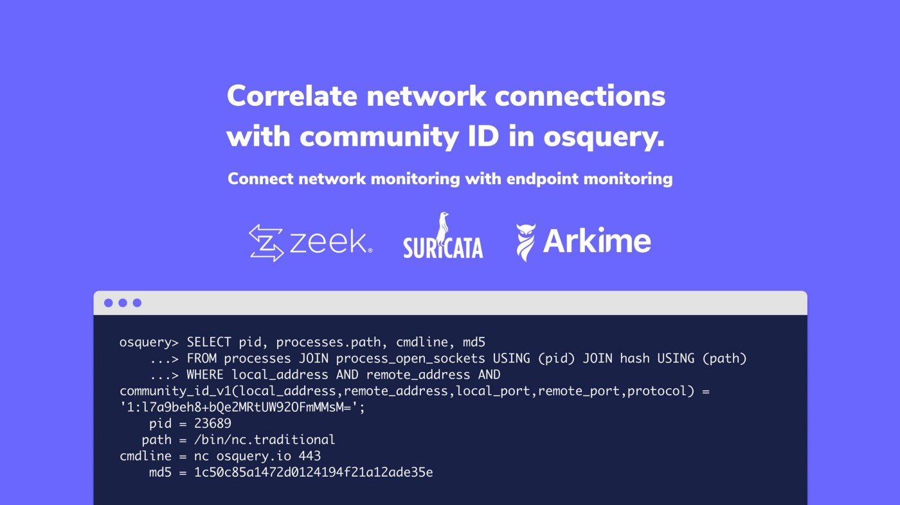

# Correlate network connections with community ID in osquery.

## Connect network monitoring with endpoint monitoring.




Interested in correlating events from network monitoring tools to host activity? Support for [Community ID hashing](https://github.com/corelight/community-id-spec) in osquery allows osquery’s endpoint instrumentation to be easily correlated with that of network monitors such as Zeek. Similar strategies can be used to correlate osquery logs with those from other tools that support Community ID. This includes Arkime (formerly Moloch), Suricata, and more.


## Community ID

Community ID is a hash of the network connection parameters that allows a connection to be matched between monitoring solutions that support the hash.

To generate a Community ID, a hash is performed with the source and destination IP addresses and ports, along with the protocol and a seed. The generated hash is deterministic and can be compared across implementing software.

## Correlation

How do we use Community ID to correlate the logs between a networking tool and osquery? Consider the following `conn.log` generated by Zeek:


```
$ cat /usr/local/zeek/logs/current/conn.log
...
#fields	ts	uid	id.orig_h	id.orig_p	id.resp_h	id.resp_p	proto	service	duration	orig_bytes	resp_bytes	conn_state	local_orig	local_resp	missed_bytes	history	orig_pkts	orig_ip_bytes	resp_pkts	resp_ip_bytes	tunnel_parents	community_id
#types	time	string	addr	port	addr	port	enum	string	interval	count	count	string	bool	bool	count	string	count	count	count	count	set[string]	string
1582669704.509068	CEmnOh4OZTnzaUHWi	172.17.0.2	47434	192.168.65.1	53	udp	dns	0.030783	0	36	SHR	T	T	0	Cd	0	0	164	-	1:M9OoSr2um69x5G8SikO3S7CVlKk=
1582669709.819653	CVTuEs4iasnpIw8nb7	172.17.0.2	35173	192.168.65.1	53	udp	dns	0.004224	0	92	SHR	T	T	0	Cd	0	0	1120	-	1:1/6GSKCm6A8zk8jXFOEeZKTYccY=
1582669709.844549	CZX3af2jpkfeJzNItb	172.17.0.2	42716	13.227.76.23	443	tcp	-	30.017714	0	0	SHR	T	F	0	^hCf	0	0	288	-	1:l7a9beh8+bQe2MRtUW92OFmMMsM=
1582669741.641209	CQFgp24cLxMDaBPr03	172.17.0.2	50944	13.227.76.89	443	tcp	-	1.691777	0	9653625	SHR	T	F	0	^hCadCCCfA	1	406827	9926713	-	1:13GuW4mT6PnRwUi+zetPtsWWD3I=
1582669741.587538	CDvjoz2xAkMs4vbpo8	172.17.0.2	38330	192.168.65.1	53	udp	dns	0.033607	0	352	SHR	T	T	0	Cd	0	0	2408	-	1:6tMXxnnFDfuiCIYTYXXCPMfB3fA=
```

Say that we are interested in the TCP connection between `172.17.0.2:42716` and `13.227.76.23:443`. Looking in the last column of the log, we retrieve the Community ID `1:l7a9beh8+bQe2MRtUW92OFmMMsM=`.

We can now use the Community ID as the connection to the information available in osquery:


```
osquery> SELECT community_id_v1(local_address,remote_address,local_port,remote_port,protocol) AS community_id, *
    ...> FROM processes JOIN process_open_sockets USING (pid)
    ...> WHERE local_address AND remote_address AND community_id = '1:l7a9beh8+bQe2MRtUW92OFmMMsM=';
      community_id = 1:l7a9beh8+bQe2MRtUW92OFmMMsM=
               pid = 23689
              name = nc
              path = /bin/nc.traditional
           cmdline = nc osquery.io 443
             state = T
               cwd = /root
              root = /
               uid = 0
               gid = 0
              euid = 0
              egid = 0
              suid = 0
              sgid = 0
           on_disk = 1
        wired_size = 0
     resident_size = 2088000
        total_size = 10880000
         user_time = 0
       system_time = 0
   disk_bytes_read = 0
disk_bytes_written = 0
        start_time = 1582669708
            parent = 1
            pgroup = 23689
           threads = 1
              nice = 0
                fd = 3
            socket = 138425
            family = 2
          protocol = 6
     local_address = 172.17.0.2
    remote_address = 13.227.76.23
        local_port = 42716
       remote_port = 443
              path =
             state = CLOSE_WAIT
     net_namespace = 4026532309
```

This query provides a great deal more context for the network connection observed in Zeek. We can see what command is running (`cmdline`), the path to the executable (`path`), the executing user (`uid`), the start time of the process (`start_time`), and much more.

In this case we clearly observe that the network connection is a connection made with the `netcat` tool to `osquery.io`.

The data retrieved by osquery can be further extended by joining to additional tables. For example, the following query also retrieves the MD5 hash of the process binary:


```
osquery> SELECT pid, processes.path, cmdline, md5
    ...> FROM processes JOIN process_open_sockets USING (pid) JOIN hash USING (path)
    ...> WHERE local_address AND remote_address AND community_id_v1(local_address,remote_address,local_port,remote_port,protocol) = '1:l7a9beh8+bQe2MRtUW92OFmMMsM=';
    pid = 23689
   path = /bin/nc.traditional
cmdline = nc osquery.io 443
    md5 = 1c50c85a1472d0124194f21a12ade35e
```

## Extend the Concept

In the above examples, a live investigation of the network traffic is performed using `osqueryi`. How can we take advantage of this functionality to perform retroactive analysis?

Queries can be scheduled within `osqueryd` to log the Community ID of network connections along with the details about the associated process. These logs can be collected in the log aggregation pipeline/SIEM and correlated with the logs from network monitoring. Consider scheduling queries such as:


```
SELECT *, community_id_v1(local_address,remote_address,local_port,remote_port,protocol) AS community_id 
FROM processes JOIN process_open_sockets USING (pid) JOIN hash USING (path)
```

The `community_id` column can then be used to correlate the events logged by network monitors.

On Linux, the `socket_events` table may produce additional utility as it captures all socket connections, not only those active at the time of query execution.


<meta name="category" value="guides">
<meta name="authorFullName" value="Zach Wasserman">
<meta name="authorGitHubUsername" value="zwass">
<meta name="publishedOn" value="2021-06-02">
<meta name="articleTitle" value="Correlate network connections with community ID in osquery.">
<meta name="articleImageUrl" value="../website/assets/images/articles/correlate-network-connections-with-community-id-in-osquery-cover-800x502@2x.jpeg">
