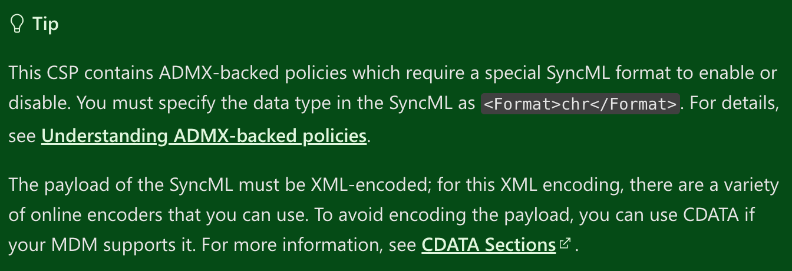
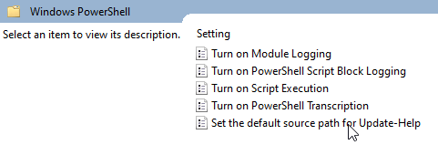
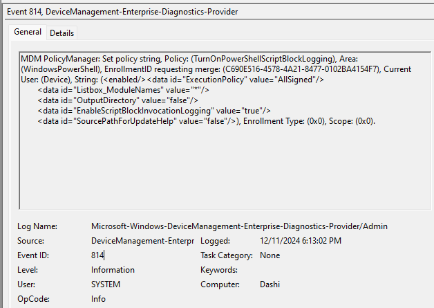

Deploying Windows configurations profiles (aka Configuration Service Providers (CSPs)) for Windows devices can feel daunting, especially if you're new to the process or accustomed to ClickOps and other UI-driven approaches. The scarcity of straightforward documentation and guides can make it feel like you're venturing into a configuration rabbit hole.


This guide will help you understand the building blocks to crafting CSPs of varying complexity – from simple payloads to more complex ones that involve modification of ADMX underpinnings.

> In Fleet, Windows CSPs are called [**Custom OS settings**](https://fleetdm.com/guides/custom-os-settings).

## ADMX

### What is ADMX and why should you care?

From [Microsoft](https://learn.microsoft.com/en-us/windows/client-management/understanding-admx-backed-policies):

>“Mobile Device Management (MDM) policy configurations allow access of a selected set of Group Policy administrative templates (ADMX policies) for Windows PCs via the Policy configuration service provider (CSP). This expanded access ensures that enterprises can keep their devices compliant and prevent the risk of compromising security of their devices managed through the cloud.”

In an ADMX policy, an administrative template contains the metadata of a Windows Group Policy. Each setting in a Group Policy corresponds to a specific registry value. These Group Policy settings are defined in an XML file format known as an ADMX file. MDM doesn’t use the same tools as Group Policy, the traditional way to control Windows settings. Instead, it uses the Policy CSP to read the ADMX instructions.

ADMX policies can be applied in two ways:

1. Shipped with Windows, located at ```SystemRoot\policydefinitions``` and processed into MDM policies at OS-build time

2. Ingested to a device through the Policy CSP URI, for example, ```./Vendor/MSFT/Policy/ConfigOperations/ADMXInstall``` which we will cover further on in this guide.


Windows maps the name and category path of a Group Policy to an MDM policy by parsing the associated ADMX file, finding the specified Group Policy, and storing the metadata in the MDM Policy CSP client store. When the MDM policy contains a SyncML command AND the Policy CSP URI ```.\[device|user]\vendor\msft\policy\[config|result]\<area>\<policy>```, this metadata is referenced and determines which registry keys are configured.

## Unpacking the “How”

Unfortunately, to capture handling of ADMX the admin building the policies must use a UI, such as the Group Policy Editor, to gather the necessary data. For this example, we will use the ```WindowsPowerShell``` which controls PowerShell settings and is an ADMX-backed policy. [This](https://learn.microsoft.com/en-us/windows/client-management/mdm/policy-csp-windowspowershell) is the official documentation that we will work from if you want to follow along. Notice this banner that indicates the ADMX requirement:




In the Windows documentation, you will notice a section called ADMX Mapping:


Pay attention to the line **ADMX File Name**, which will show you the name of the .admx file you need to open to help craft your CSP. All ADMX files are located at:
```C:\Windows\PolicyDefinitions\{ADMXFileName.admx}```

In this XML file are the keys, and their type listed which indicates the values the CSP can modify. In this example there are 5 parameters:
 - ExecutionPolicy
 - EnableModuleLogging
 - EnableTranscripting
 - EnableScriptBlockLogging
 - EnableUpdateHelpDefaultSourcePath

Values can take one of the following types:

1. Text Element - The text element simply corresponds to a string and correspondingly to an edit box in a policy panel display by gpedit. The string is stored in the registry of type REG_SZ.

2. MultiText Element - The multiText element simply corresponds to a REG_MULTISZ registry string and correspondingly to a grid to enter multiple strings in a policy panel display by gpedit.

3. List Element - The list element corresponds to a hive of REG_SZ registry strings and correspondingly to a grid to enter multiple strings in a policy panel display by gpedit.msc.
    - PRO TIP: Each pair is a REG_SZ name/value key. When applying policies through gpedit, visit the corresponding registry location to understand how list values are stored.

4. No Elements - Just an Enable/Disable of the policy, represented like `<Enabled/>`

5. Enum - Think of these as options from a dropdown in gpedit. This is the data type we are working with in the example

6. Decimal Element

7. Boolean Element

At this point in the build we know the ADMX keys for this specific policy, which values those keys accept, and now to translate that into a CSP that Fleet can interpret.
You can also see in the group policy editor the values that are being modified by the profile.



In this example, we will modify the ExecutionPolicy value, which in group policy editor translates to “Turn on Script Execution”, the XML from the .admx looks like such:

```
<enum id="ExecutionPolicy" valueName="ExecutionPolicy" required="true">
          <item displayName="$(string.AllScriptsSigned)">
            <value>
              <string>AllSigned</string>
            </value>
          </item>
          <item displayName="$(string.RemoteSignedScripts)">
            <value>
              <string>RemoteSigned</string>
            </value>
          </item>
          <item displayName="$(string.AllScripts)">
            <value>
              <string>Unrestricted</string>
            </value>
```

To write this into the CSP, pull out the `id`, “ExecutionPolicy”, and the accepted values - an enum type with one of three possibilities, and use the `value` tag to create an entry in the CSP that looks like this:

```<data id="ExecutionPolicy" value="AllSigned"/>```

Going through all the keys in this policies, the payload will look like such:

```
<data id="ExecutionPolicy" value="AllSigned"/>
<data id="Listbox_ModuleNames" value="*"/>
<data id="OutputDirectory" value="false"/>
<data id="EnableScriptBlockInvocationLogging" value="true"/>
<data id="SourcePathForUpdateHelp" value="false"/>
```

>Data passed in these CSPs need to be represented in the CDATA format.
>CDATA (Character Data) is a section that allows including text data that should not be treated as XML markup. This is particularly useful for embedding content that might otherwise be misinterpreted as XML elements or attributes, such as raw text.
>A CDATA section starts with ```<![CDATA[ and ends with ]]>```. The text between these delimiters is treated as character data, not as XML.

Our block looks like:

```
<![CDATA[<enabled/><data id="ExecutionPolicy" value="AllSigned"/>
<data id="Listbox_ModuleNames" value="*"/>
<data id="OutputDirectory" value="false"/>
<data id="EnableScriptBlockInvocationLogging" value="true"/>
<data id="SourcePathForUpdateHelp" value="false"/>]]>
```

Note, I added the `<enabled/>` at the start of the block, this is required to enable the settings overall. All CSPs will at least need to have that `<enabled/>`. And it’s possible, depending on the setting, that this is the only key.

Now that we have the data block, we can finally put it all together to generate a CSP.

```
<Add>
  <Item>
    <Meta>
      <Format xmlns="syncml:metinf">chr</Format>
    </Meta>
    <Target>
      <LocURI>./Device/Vendor/MSFT/Policy/Config/WindowsPowerShell/TurnOnPowerShellScriptBlockLogging</LocURI>
    </Target>
    <Data>
      <![CDATA[<enabled/><data id="ExecutionPolicy" value="AllSigned"/>
      <data id="Listbox_ModuleNames" value="*"/>
      <data id="OutputDirectory" value="false"/>
      <data id="EnableScriptBlockInvocationLogging" value="true"/>
      <data id="SourcePathForUpdateHelp" value="false"/>]]>
    </Data>
  </Item>
</Add>
```

Since we’re working with an ADMX-backed setting, the `Format` section needs to be
```<Format xmlns="syncml:metinf">chr</Format>```

The LocURL is listed in the CSP documentation and the `<Data>` block goe after in the CDATA format.

Pay attention to the verbs `<Add>` vs `<Replace>` when creating as these need to match the system configuration we are targeting or it oftentimes will fail.

## Migrating from Intune

Intune uses Windows [CSPs](https://learn.microsoft.com/en-us/windows/client-management/mdm/policy-configuration-service-provider) that set registry keys that tell your system(s) which configuration to enforce. Intune CSPs can mostly be found in the registry under the `HKLM:\SOFTWARE\Microsoft\Provisioning\NodeCache\CSP\Device\MS DM Server\Nodes\<id>` key.

How to get the CSP from Intune and format it as a configuration profile for Fleet:

### Step 1: Export from Intune

1. Navigate to your Intune admin center and select **Devices > Configuration Profiles**.
2. Select the three dots next to **Settings Catalog Profile**.
3. Select the **Export JSON** to download a JSON file with the CSP settings.

### Step 2: Identify Intune CSPs

1. Open your exported Intune JSON from the steps above in the text editor of your choice.
2. Every `settingDefinitionId` JSON element will contain the CSP that was set via Intune. For example `device_vendor_msft_policy_config_internetexplorer_disablefirstrunwizard`, is the CSP for disabling the first run wizard in Internet Explorer. Note that this looks almost identical to the `LocURI` that Fleet wants in a configuration profile: `./Device/Vendor/MSFT/Policy/Config/InternetExplorer/DisableFirstRunWizard`.
3. Make a list of every `settingDefinitionId` you want to migrate to Fleet

### Step 3: Create your configuration profile:

1. Create a new `configuraion-profile.xml` file with as many of the below code blocks as CSPs that you want to migrate:

```xml
<Replace>
  <Item>
    <Meta>
      <Format xmlns="syncml:metinf">chr</Format>
    </Meta>
    <Target>
      <LocURI>./Device/Vendor/MSFT/Policy/Config/CHANGEME_AREANAME/CHANGEME_POLICYNAME</LocURI>
    </Target>
    <Data><![CDATA[CHANGEME]]></Data>
  </Item>
</Replace>
```

2. Find the correct `<Data>` block, by logging into a Windows host enrolled to Intune, opening the Registry Editor, and heading to `HKLM:\SOFTWARE\Microsoft\Provisioning\NodeCache\CSP\Device\MS DM Server\Nodes`. Then, search for the `settingDefinitionId` (CSP) from your list in step 2:
 - The `NodeURI` of the Registry key will be the `LocURI` in the CSP XML
 - The `ExpectedValue` of the Registry key will be the `<Data>` block in the CSP XML[^1]

Alternatively, you can use this PowerShell one-liner to get the CSPs from the Windows Registry, which you can script together to loop through every CSP:

  ```powershell
  $inputString = "disablefirstrunwizard"; Get-ChildItem -Path 'HKLM:\SOFTWARE\Microsoft\Provisioning\NodeCache\CSP\Device\MS DM Server\Nodes' -Recurse | Get-ItemProperty | Where-Object { $_.NodeUri -like "*$inputString*" } | Select-Object NodeUri, ExpectedValue | Format-List
  ```

[^1]: If the `ExpectedValue` returns just an integer, then change the `<Data>` block just the integer (ex: `ExpectedValue = 1` then `<Data>1</Data>`) and change `<Format xmlns="syncml:metinf">chr</Format>` to `<Format xmlns="syncml:metinf">int</Format>`.

## Debugging

There are a couple of ways to start troubleshooting issues with MDM.

In the Settings > Accounts > Access work or school > Click on Connected by Fleet and then Info > Create Report. This will generate a snapshot of the device, policies it has ingested and ADMX keys that have been modified.

Windows Event Logs can also be a helpful place to look.

Applications and Service Logs > Microsoft > Windows > DeviceManagement-Enterprise-Diagnostics-Provider.

The `Admin` logs will show you all profiles that have been pushed to the device and their status. It helps to use the `Find` function to look for keywords in your profile to narrow your search. Here is an example of the logs that show when the CSP we created here was deployed.



Alternatively, you can use this PowerShell one-liner to see errors from the MDM event log:

```powershell
Get-WinEvent -FilterHashtable @{LogName='Microsoft-Windows-DeviceManagement-Enterprise-Diagnostics-Provider/Admin'; Level=2} -MaxEvents 15 | Format-Table -Wrap
```

[This](https://blog.mindcore.dk/2022/09/intune-error-codes-and-solutions/) blog post can also help you translate error codes that are present here.


## Conclusion

Deploying CSPs for your Windows fleet may seem complex at first, but with a structured approach and the right tools, it becomes a powerful way to standardize and secure your device configurations. Fleet provides the flexibility to deploy MDM profiles across platforms from a single, centralized management platform, enabling IT teams to maintain consistency, security, and efficiency.

Ready to take control of your Windows device configurations? Explore Fleet’s powerful API and GitOps workflows to start building and managing your CSPs today. Visit fleetdm.com to learn more or get in touch with our team to see how we can help streamline your device management strategy.

<meta name="articleTitle" value="Creating Windows configuration profiles (CSPs)">
<meta name="authorFullName" value="Harrison Ravazzolo">
<meta name="authorGitHubUsername" value="harrisonravazzolo">
<meta name="category" value="guides">
<meta name="publishedOn" value="2024-12-12">
<meta name="description" value="Learn how to deploy Windows configuration profiles (CSPs) with Fleet">
