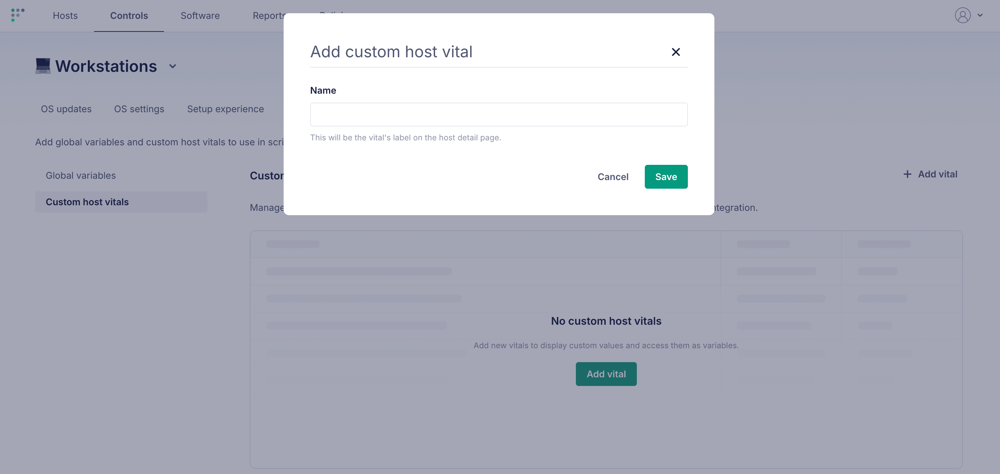
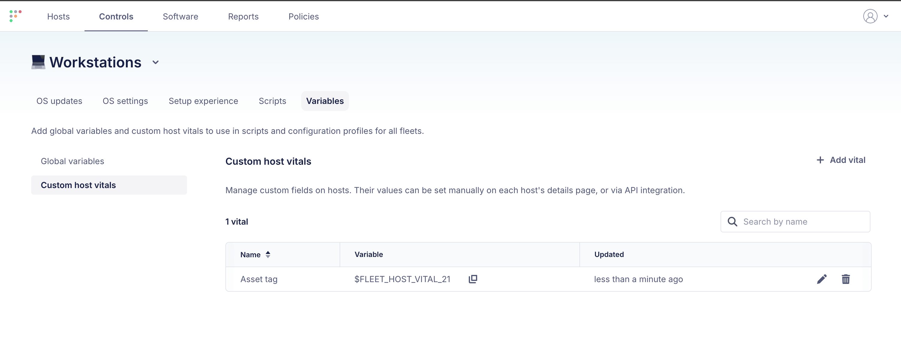
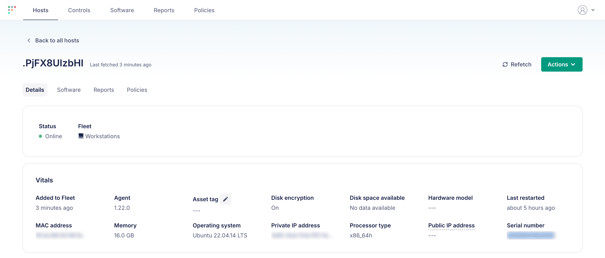
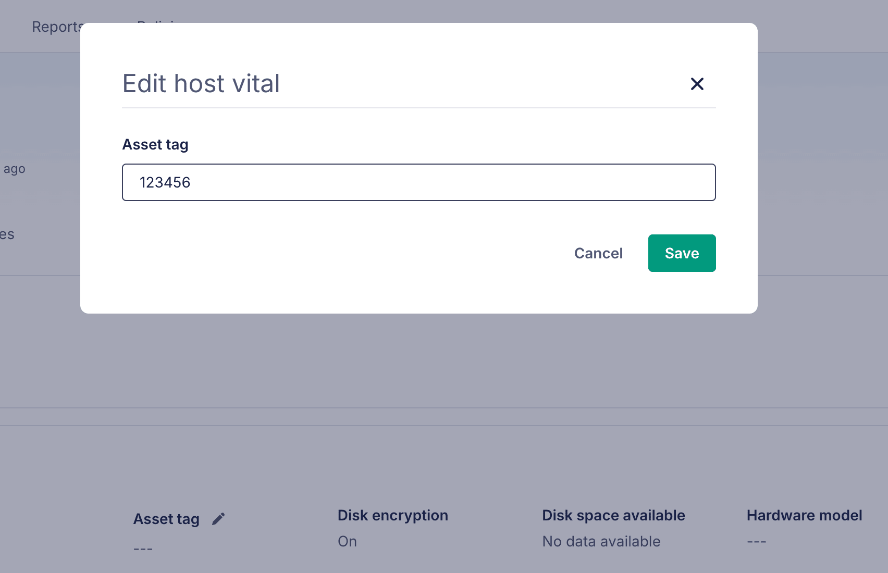
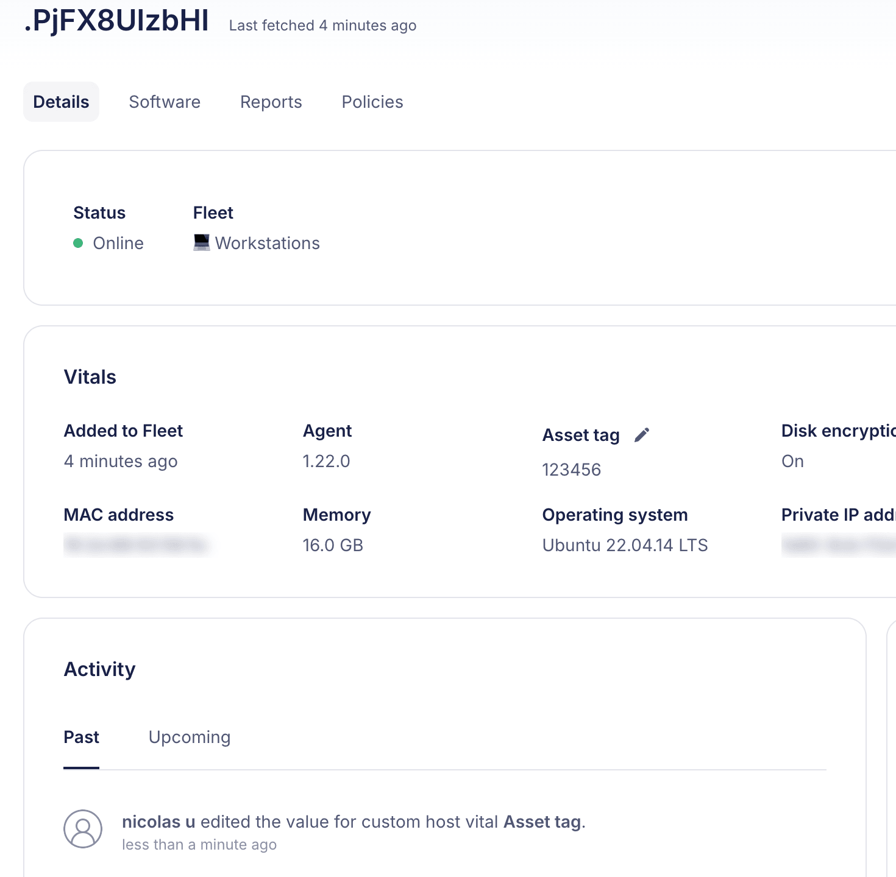

# Use custom host vitals in scripts and configuration profiles

Custom host vitals let you define your own host fields, set a value for each host, and reference those values as variables (prefixed with `$FLEET_HOST_VITAL_`) in [scripts](https://fleetdm.com/guides/scripts) and [configuration profiles](https://fleetdm.com/guides/custom-os-settings).

Unlike [custom variables](https://fleetdm.com/guides/secrets-in-scripts-and-configuration-profiles) (`$FLEET_SECRET_*`), which hold a single value shared across all hosts, a custom host vital can hold a **different value per host**. For example, an "Asset tag" vital can resolve to a different asset tag on every device. Custom host vital values are **not** hidden in the UI or API — don't use them for secrets.

Support for custom host vitals in [host name templates](https://github.com/fleetdm/fleet/issues/49489) is coming in Fleet 4.91.

## Prerequisites

- A global admin or maintainer role to add, edit, or delete custom host vitals.
- A Fleet API token if you'll set host values via the API.

## Add custom host vitals

Each custom host vital has a unique name and is referenced by a variable in the format `$FLEET_HOST_VITAL_<id>` (or `${FLEET_HOST_VITAL_<id>}`), where `<id>` is the vital's ID. You can copy the exact variable from the **Variable** column of the Custom host vitals table.

Custom host vitals are global, meaning they can be used in scripts and profiles across all fleets.

### UI

To add a custom host vital, go to **Controls > Variables > Custom host vitals** and click **Add vital**. Give it a name — this becomes the vital's label on the host details page:



The new vital appears in the table. Copy its variable (for example, `$FLEET_HOST_VITAL_21`) from the **Variable** column to reference it in scripts and profiles, and use the pencil and trash icons to rename or delete it:



### GitOps

Custom host vitals are global and are specified inline in your `default.yml` file. Each entry's `name` must be unique across all custom host vitals:

```yaml
custom_host_vitals:
  - name: Asset tag
  - name: Function
  - name: Jamf device ID
```

Custom host vitals removed from `default.yml` are deleted on the next GitOps run. A run fails if you try to delete a vital that's still referenced by a script or profile — remove the reference first (see [Known limitations and issues](#known-limitations-and-issues)).

## Set a host's value

A custom host vital starts with no value on each host. Until a value is set for a host, sending a script or profile that references the vital to that host will fail.

Global admins and maintainers can set a value on any host; fleet admins and maintainers can set values for hosts in their fleets.

### UI

Each custom host vital appears in a host's **Details > Vitals**, showing `---` until a value is set:



Click the pencil (edit) icon next to the vital, enter a value, and click **Save**:



The value now shows in the host's vitals, and the change is recorded in the host's activity:



### API

Set a host's value with the [Fleet REST API](https://fleetdm.com/docs/rest-api/rest-api). This is useful for syncing values from an external system of record (for example, an asset management tool):

```sh
curl -X PUT https://<your-fleet-url>/api/v1/fleet/hosts/<host_id>/custom_host_vitals/<id> \
  -H "Authorization: Bearer <your-api-token>" \
  -H "Content-Type: application/json" \
  -d '{"value": "C02XL0Zerato"}'
```

## Using a custom host vital in scripts and configuration profiles

Reference the vital by its variable anywhere in a script or configuration profile. When Fleet sends the script or profile to a host, it replaces `$FLEET_HOST_VITAL_<id>` with that host's value.

For example, a configuration profile that writes the host's asset tag (defined as `$FLEET_HOST_VITAL_1`):

```xml
<key>PayloadContent</key>
<string>$FLEET_HOST_VITAL_1</string>
```

When a host's value changes, Fleet automatically resends the Apple (macOS, iOS, iPadOS), Windows, and Android configuration profiles that reference the vital, so each device receives its updated value.

## Known limitations and issues

- Custom host vital values are **not** masked in the Fleet UI, API, or script results. Use [custom variables](https://fleetdm.com/guides/secrets-in-scripts-and-configuration-profiles) (`$FLEET_SECRET_*`) for secrets.
- A custom host vital **can't be deleted while it's referenced** by a script or configuration profile. Edit or delete the referencing script/profile first, then delete the vital.
- Referencing a `$FLEET_HOST_VITAL_<id>` that doesn't exist (for example, a typo like `$FLEET_HOST_VITAL_asset_tag`) is rejected when the script or profile is added.
- Custom host vitals can't be used in certificate authority (SCEP/ACME/DigiCert) payloads; those fields accept [built-in variables](https://fleetdm.com/guides/fleet-variables) only.

<meta name="category" value="guides">
<meta name="authorGitHubUsername" value="nulmete">
<meta name="authorFullName" value="Nicolás Ulmete">
<meta name="publishedOn" value="2026-07-15">
<meta name="articleTitle" value="Use custom host vitals in scripts and configuration profiles">
<meta name="description" value="Define custom host fields, set a value per host, and use them as variables in scripts and configuration profiles.">
