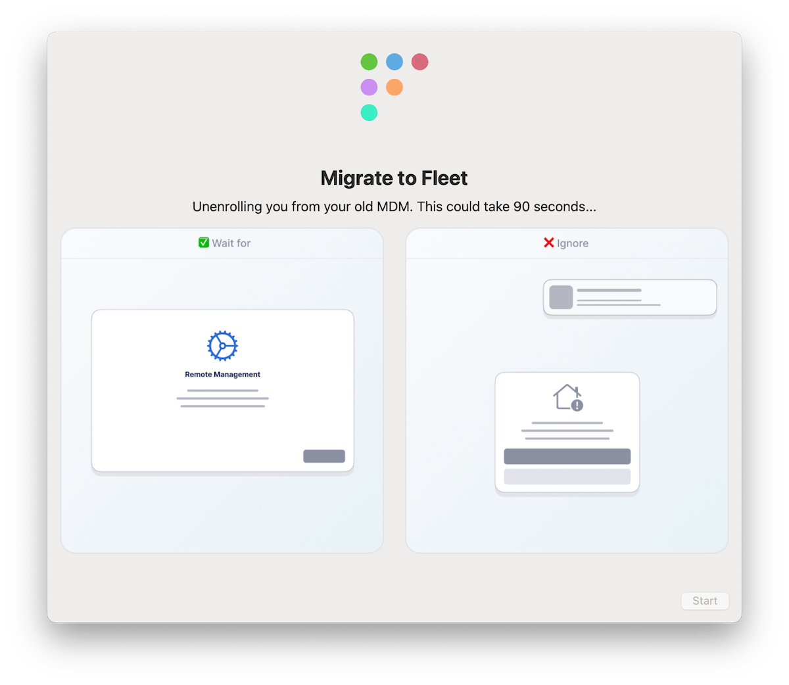

# Debunk the cross-platform myth

Conventional wisdom holds that cross-platform device management is a nightmare. It’s no surprise—most solutions out there are cobbled together with bolted-on features that never quite mesh. If you’ve tried managing a mixed fleet of macOS, Windows, and Linux devices, you might have some scars to show for it. But here’s the thing: it doesn’t have to be that way. Fleet is built differently, and it’s time to debunk the myth that cross-platform management has to suck.

## Cross-platform pain points

The skepticism around cross-platform device management is real, and for good reason. Many IT teams have been burned by solutions that promise seamless management across different operating systems but deliver only frustration and complexity. Solutions that often leave a trail of disappointed admins in their wake, often forcing you to manage the tools more than the devices. Fleet flips that script by letting you interact directly with each operating system’s native features. Whether Apple’s macOS, Microsoft’s Windows, or various Linux distributions, Fleet provides a consistent management experience without forcing you to “talk Windows” to your Macs or vice versa.

## Managing every OS like it’s your favorite

Fleet introduces familiar concepts like custom attributes and dynamic grouping but adapts them to work with the nuances of each operating system. This means you can manage your macOS, Windows, and Linux devices without juggling multiple management platforms or dealing with convoluted workarounds. Everything is streamlined in one open-source platform, giving you direct access to the data and events from each OS.

By working directly with native operating system features, Fleet ensures you don’t lose low-level control or compromise on capabilities. Instead of managing multiple MDM solutions, you can focus on managing your devices—regardless of OS.

For example:

* **Operating systems**: You can enforce OS updates with Declarative Device Management (DDM), Nudge, and Windows Update from one console.
* **Automated enrollment**: Drop-ship devices to your end users with Apple Business Manager or Autopilot and let them set up their own accounts. No IT help is needed.
* **Config management**: Manage settings with configuration profiles for Apple and device profiles for Windows. Use a canary team to test changes before they go live.
* **App management**: Automatically keep applications and plugins secure and up-to-date. Install the software end users need or let them install it themselves via self-service.
* **Scripts and events**: Easily manage and version control your custom script library. Execute shell and PowerShell scripts when computers drift from the baseline.
* **Keep up with Apple**: Fleet's team and community stay current on the latest features and releases from all supported platform vendors, not just Apple.

## Switching platforms is disruptive

It’s understandable to be cautious about adopting a new management solution, especially if you’re concerned about the time and effort involved in switching. However, Fleet is designed with ease of transition in mind. Our platform integrates seamlessly with your existing tools and workflows, minimizing disruption. Plus, with our comprehensive documentation and responsive community support, you’ll have everything you need to get up and running quickly. Fleet’s flexible deployment options let you start small and scale at your pace, ensuring a smooth, controlled migration.

## One platform, many possibilities

Fleet isn’t just about making cross-platform management tolerable—it’s about making it genuinely effective. With Fleet, you can enforce OS updates, automate device enrollment, manage configurations, and keep applications secure, all from one place. You can also deploy Fleet yourself at any time; it’s 100% source-available, meaning you can look at the source code for how any part of it works.

And because Fleet is open-source, it’s designed with flexibility and transparency in mind. You can tailor it to fit your organization’s needs, whether you’re managing a few hundred devices or tens of thousands.

<blockquote purpose="quote">

Mad props to how easy making a deploy pkg of the agent was. I wish everyone made stuff that easy.

</blockquote>

_Wes Whetstone, Staff CPE at Stripe_

## The takeaway

Cross-platform management doesn’t have to be the headache it’s been in the past. Fleet is here to simplify how you manage your devices, no matter what mix of operating systems you’re dealing with. It’s time to let go of the myth that managing different platforms means managing different tools. With Fleet, you can have everything you need in one place—without the anxiety.

Ready to get started?

Visit our [start page](https://fleetdm.com/start) to begin your journey.

<meta name="category" value="announcements">
<meta name="authorFullName" value="Mike McNeil">
<meta name="authorGitHubUsername" value="mikermcneil">
<meta name="publishedOn" value="2024-08-27">
<meta name="articleTitle" value="Debunk the cross-platform myth">
<meta name="description" value="Debunk the cross-platform myth with MDM">
