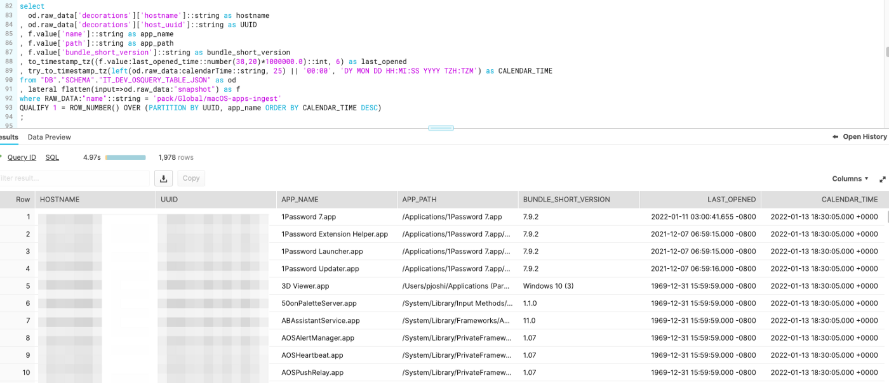

# Delivering data to Snowflake from Fleet and osquery.

## A comprehensive guide by Tom Larkin.


Tom Larkin, IT engineer at Snowflake, put together an incredible guide for moving data from osquery and Fleet into Snowflake and kindly gave us permission to share his insights on our blog.

You can find more writings from Tom at: https://t-lark.github.io/

---

## Snowflake, osquery, and Fleet are pure magic!

Many of you have probably heard of [osquery](https://osquery.io/), which is a piece of software you can install onto a computer that allows humans to query the OS to return fast and reliable system data. Osquery is not new, and many organizations have been using it in various capacities for years now. Vendors and developers also ship osquery with their products these days as well. This allows a developer or vendor to collect local data fast and reliably for their software and solutions.

My team and I have been evaluating osquery along with a product called [Fleet](https://fleetdm.com) to see what we can accomplish with getting fast and reliable data pipelined to Snowflake. Like all projects, research and development, proofs-of-concept, and so forth, one can start by simply stating a problem statement or a story. The data story I used to kick this proof of concept off was simply this:

### Our data story

*As an IT Engineer, I want fast, reliable, and robust data from all the systems we manage. While also getting that data as fast as we possibly can at scale.*

Our problem statement will probably be things many of us in IT and Operations face every day, especially with endpoint management solutions. MDM is really only good for MDM things, and while those things do bring value to IT organizations, it often falls short of the full scope of what we need. Data collection is a big part of this, and MDM solutions have limitations around data collection and data storage. Honestly, this should be expected as the MDM tool's primary functions are not data collection, nor are they data warehouses.

## Data collection at a glance

MDM typically collects data every 24 hours in most MDM applications out of the box. It is also either a manual process to add inventory data collection into your workflows when you want to collect data on state change or requires writing a series of data collection scripts. For example, every time your MDM tools install an application, the MDM tool must send that data back to the MDM servers to store that data. This often results in data drift where the data on the actual system and the data in the server-side application do not match. The data will match the next time that the device submits inventory to the MDM service. IT Engineers can sometimes crank up inventory collection, but it is at risk of hitting rate limits or even DDoS’ing your own MDM service. MDM also does not collect things like Python Packages, `homebrew` binaries installed, web browser plugins, running process info, and more. Osquery can collect much more data at a much higher frequency. Since osquery is a completely separate toolchain, it also has no dependencies on your MDM or your MDM infrastructure.

### MDM solutions

*I have not personally tested every MDM solution out there, so this is an anecdotal summarization of my experiences and an overall generalization. Some MDM tools may be able to collect data faster than every 24 hours. Some MDM solutions do allow for customized data collection, but that is not without labor to build and maintain.*

## What is Fleet?

Fleet is a centralized management and orchestration tool for osquery. It allows tech professionals to centralize queries and configurations and handles secure communications from the endpoints to the service. Fleet also provides a set of tools to manage the infrastructure and the osquery installers for each platform. There are many osquery solutions out there that do similar things, but Fleet was attractive to us because they focused solely on getting the data and managing the queries and configurations. Which is what our initial goal was in this proof-of-concept exercise. Fleet has a channel on the [Mac Admins Slack](https://fleetdm.com/slack) you can join if you are interested in learning more. Additional noteworthy features are (but are not limited to) SAML integration for your IdP, support, RBAC for teams, and they are looking to add vulnerability data to their product as well. They also display the osquery table schema in the web application for quick reference, which is a nice quality of life feature.

The two features I want to focus on for this blog post are the live queries and the scheduled queries. Live queries are probably what you would assume they are. It is a feature where you can run a query from the Fleet application and get near-real-time results back from an endpoint (or many endpoints) very quickly. Scheduled queries run at a set increment of time, and those query results can be streamed from the application to cloud storage.

### Live query interface:


### Scheduled queries interface:


## Getting the data into Snowflake

Running Fleet in AWS means you can leverage all the great cloud tech that exists in most modern cloud platforms. We chose to host this in AWS, and it is highly likely you could do something similar in another cloud provider. At a high level, this is how we implemented it:

- The Fleet Application is self-hosted in a private cloud VPC
- Configured AWS Kinesis Firehose to stream data to S3
- osquery binary data and query results data go into two separate folders within the S3 bucket
- Configured Snowpipe to consume data on the event of data being written to S3
- Exposed a load balance appliance on the edge so clients could communicate to the service securely over the internet

### Quick diagram:


In this proof-of-concept project, we decided to get data into our dev environment as fast as we possibly could. So, queries were running every 15 minutes against a half dozen or so test devices. We also collected data on Linux, macOS, and Windows 10 devices. Our observation is we got the data very fast from Fleet and into Snowflake. It seemed to take minutes, and it was fast enough to make it tough for us to really time how long it actually took end to end. Every time Fleet would run a scheduled query; those query results would be pipelined into an S3 bucket by streaming the data with Kinesis Firehose. Since Snowpipe can leverage the SQS event API, upon that bucket getting data written to it, the native cloud integration would notify Snowpipe to consume the data automatically. This setup allows for continuous automated data flow from the Fleet application right into Snowflake.

## Working with the data in Snowflake

Now that our end-to-end data pipelines were flowing, we needed to make sure we could use and leverage the data. Fleet will store the query results as a JSON document, which is perfect for our setup. We are simply storing all the query results in a single raw data table. I wanted to start with Windows 10 data, as our Windows MDM solution doesn’t export a lot of data natively. The data we do get from our Windows MDM solution is more of a `boolean` result of True or False, and not the actual data itself. To explain this simply, we have a set of compliance policies that check against certain states of security settings, and if any one of those states fails, it marks the devices just as `Not Compliant`, but it does not tell us which state is failing. Then there is no way to get third-party application data out of it unless you want to build an API ingest connector. Lastly, like all MDM solutions, inventory collection is often once a day. Our data story was to get this data as fast as we possibly could, and we wanted to get it every 15 minutes versus every 24 hours.

A quick and easy query to test in Fleet with the live query feature to see if I got the results I wanted was simply this:

### SQL

```
1 SELECT * from programs;
```

The above query will result in giving us everything osquery can collect about Windows 10 applications. If you installed osquery on a Windows 10 device you can run the interactive mode binary and just test out the query locally. In Fleet for this scheduled query, we named it `windows-apps-ingest` which later downstream we can use as a primary key in Snowflake.

With Snowflake, I can simply run this query to grab the data I need. Remember, we are shipping the raw JSON query results to a single schema/table in one column and then leveraging post-data processing features in Snowflake to get the data we need out of the raw JSON query results. Here is a truncated sample of the data you will get from Fleet into Snowflake.

data sample:

### JSON

```
1 {
2 "action": "snapshot",
3 "calendarTime": "Sun Dec 12 06:13:52 2021 UTC",
4 "counter": 0,
5 "decorations": {
6   "host_uuid": "UUID-of-device",
7   "hostname": "hostname-of-device"
8 },
9 "epoch": 0,
10 "hostIdentifier": "device-id",
11 "name": "pack/Global/windows-apps-ingest",
12 "numerics": false,
13 "snapshot": [
14 {
15   "name": "Brave",
16   "source": "programs",
17   "type": "Program (Windows)",
18   "version": "96.1.32.115"
19 },
20 {
21   "name": "Fleet osquery",
22   "source": "programs",
23   "type": "Program (Windows)",
24   "version": "0.0.3"
25 },
26 {
27   "name": "Google Chrome",
28   "source": "programs",
29   "type": "Program (Windows)",
30   "version": "96.0.4664.93"
31 },
```

Now let's really work with the data now that we know we can use the `name` key in the JSON data to filter out the exact data we want to work with. One could also model the data off of this raw data table into other tables and views, but that will be a future blog post on data modeling. It is just a bit worth noting now if you are new to working with data. We will use a feature in Snowflake called [flatten](https://docs.snowflake.com/en/sql-reference/functions/flatten.html) to essentially turn the JSON keys and values into something similar to columns and rows in a relational database.

### SQL

```
1 select 
2  od.raw_data['decorations']['hostname']::string as hostname
3 , od.raw_data['decorations']['host_uuid']::string as UUID
4 , f.value['name']::string as app_name
5 , f.value['source']::string as app_source
6 , f.value['version']::string as app_version
7 , try_to_timestamp_tz(left(od.raw_data:calendarTime::string, 25) 8 || '00:00', 'DY MON DD HH:MI:SS YYYY TZH:TZM') as CALENDAR_TIME
8 from "DB"."SCHEMA"."IT_DEV_OSQUERY_TABLE_JSON" as od
9 , lateral flatten(input=>od.raw_data:"snapshot") as f
10 where RAW_DATA:"name"::string = 'pack/Global/windows-apps-ingest'
11 QUALIFY 1 = ROW_NUMBER() OVER (PARTITION BY UUID, app_name ORDER BY CALENDAR_TIME DESC)
12 ;
```

If you look at the JSON data above the query, you will see there is an array within a dictionary-like data structure under the key name "`snapshot`." This is where osquery will list all the installed applications and other metadata relating to the installed applications. Flatten will then allow us to query for a value of a key like one would a dictionary data set. The [Qualify](https://docs.snowflake.com/en/sql-reference/constructs/qualify.html) feature allows us to return a single result partitioned by a unique key and only return the absolute latest data. This is so simple and yet so very powerful. We have thousands of rows of data already in our tiny proof-of-concept project, and since we don’t really have any scale or capacity issues with the power of the cloud, we can store all historical data as well. This easily enables IT and Operations professionals to keep all your data, and with little effort, grab the absolute latest data of a device.

We can also filter by the query name from Fleet, which we have used in our proof-of-concept with pretty great success. This allows IT Engineers and Professionals to create specific queries for specific data sets and figure out how to parse, explore, present, and model the data in post-processing instead of dealing with data transformation during the data pipeline flows. We split our data into queries that made sense; for example, `firefox-addons-ingest` is one of our scheduled queries, and it does exactly what it advertises. It grabs all the installed Firefox addons for every platform. Then we can later process that data; however, we want to in Snowflake.

Another query we liked was just some basic application info, combined with the last time the application was opened. There is a caveat, or perhaps something noteworthy to observe here, and that is that if an application has never been opened, it defaults to a 1969 date stamp. However, we found this data to be valuable as we can track if users are actually using licensed software and perhaps this data could be leveraged to reclaim unused licenses. Thus, saving your org money on the cost of software licenses. Another caveat to also make a note of is that when applications update and install an entirely new app bundle folder in macOS, the metadata is completely reset. For example, let's say Office 365 auto-updates the suite of apps, and now Microsoft Word has a new version installed; this will also reset the last opened time. Updates to apps are often treated like new or fresh installations since they are a new app, new version, and have new metadata.

Query and data example:



## Conclusions and takeaways

Without a doubt, we have found this entire proof-of-concept extremely valuable. A product like Fleet that offers centralized management and orchestration of osquery, integrated with the power and scale of Snowflake, is truly something to marvel. We have been collecting Fleet data in our test device group every 15 minutes and getting that data into Snowflake in very short periods of time. This is so much faster than MDM that MDM is not really even comparable. The amount of data we get is also fantastic. Browser extensions have always been a pain point of data collection, for example, and osquery makes this so easy to get.

The benefits aren’t just with data either; they are with your tools stacks as well. Fleet and osquery are standalone products that have zero dependencies on MDM, sans installing agents and binaries. This means that if an Organization ever decides to change MDMs, a stack like Fleet + osquery could easily integrate into the new MDM solution. It also removes the dependency of tossing all your data collection in something like MDM. This stack is also cross-platform, which is either a great or not-so-great thing depending on context. In this specific context, it is a very good thing. I can now manage data collection across our macOS, Linux, and Windows 10 devices. My Org and team manage all three of those platforms, so having a tool stack like this is amazing.

The data pipelines are automated, and we publish data to S3 then consume it into Snowflake at a very fast rate. This is another great benefit of this solution. Some IT and Security tools only ship data when an event occurs, meaning the software you are using has to detect a specific event and then ship that event. This model is great for noise reduction in say an incident and response or monitoring scenario, but it also is not perfect. You can observe data drift or reactive scenarios vs proactive ones without a constant data stream. Now you can have both your fast data stream and your event-based data together in one data platform!

Lastly, we have scoped out many benefits and use cases for a solution like this. Even though our data story was originally just around getting the best possible data we could, while ingesting it as fast as we possibly could, the use cases have already expanded. Here go our thoughts on the use of a stack like this:

- Robust IT and Operations Data
- Incident and Response investigation
- Threat hunting
- Licensed software usage
- Vulnerability data
- Systems configuration data on security and compliance
- Extended application data for our software patching story
- Data sharing this data to many other teams internally
- Enabling other teams to run live queries to get near-real-time data

Remember, data sharing is data caring, and IT teams that collect robust data like this should share it with other teams. Enable everyone to collaborate more and build a better data culture within your organization. A solution like this could be easily extended into many teams at an organization and Snowflake makes that part pretty easy.

When I get more time, and as we progress with solutions like this I will likely share more of our data journeys in my blog. This is mind-blowing to me, as I have never had a setup at any job where I can get data from our end-user device fleet this fast. I don’t know how to describe this other than it is just pure magic.


<meta name="category" value="guides">
<meta name="authorGitHubUsername" value="t-lark">
<meta name="authorFullName" value="Tom Larkin">
<meta name="publishedOn" value="2022-02-01">
<meta name="articleTitle" value="Delivering data to Snowflake from Fleet and osquery.">
<meta name="articleImageUrl" value="../website/assets/images/articles/delivering-data-to-snowflake-from-fleet-and-osquery-cover-1600x900@2x.jpg">
