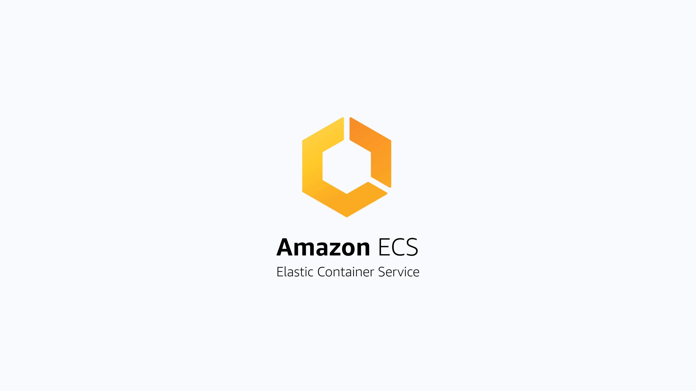

# Deploy Fleet on AWS ECS

> **Archived.** While still usable, this guide has not been updated recently. See the [Deploy Fleet](https://fleetdm.com/docs/deploy/deploy-fleet) docs for supported deployment methods.

Terraform reference architecture can be found [here](https://github.com/fleetdm/fleet-terraform)

### Infrastructure dependencies

#### MySQL

In AWS we recommend running Aurora with MySQL Engine.

#### Redis

In AWS we recommend running ElastiCache (Redis Engine).

#### Fleet server

Running Fleet in ECS consists of two main components the ECS service & load balancer.

#### Fleet migrations

Migrations in ECS can be achieved by running dedicated ECS tasks that run the `fleet prepare --no-prompt=true db` command.

Alternatively you can bake the prepare command into the same task definition see [here for a discussion](https://github.com/fleetdm/fleet/pull/1761#discussion_r697599457), but this is not recommended for production environments.

<meta name="articleTitle" value="Deploy Fleet on AWS ECS">
<meta name="authorGitHubUsername" value="edwardsb">
<meta name="authorFullName" value="Ben Edwards">
<meta name="publishedOn" value="2021-10-06">
<meta name="category" value="guides">
<meta name="articleImageUrl" value="../website/assets/images/articles/deploy-fleet-on-aws-ecs-800x450@2x.png">
<meta name="description" value="Information for deploying Fleet on AWS ECS.">