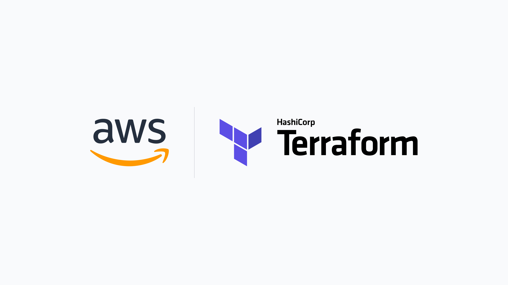

# Deploy Fleet on AWS with Terraform

> **Archived.** While still usable, this guide has not been updated recently. See the [Deploy Fleet](https://fleetdm.com/docs/deploy/deploy-fleet) docs for supported deployment methods.



Learn how to deploy Fleet on AWS with Terraform IaC (infrastructure as code).

Deploying on AWS with Fleet’s reference architecture is an easy way to get a fully functional Fleet instance that can scale to your needs.

## Prerequisites:

- AWS CLI installed and configured.
- Terraform installed (version `1.3.9` or greater)
- AWS Account and IAM user capable of creating resources
- About 30 minutes

## Introduction

### Remote State

Remote state can be simple (local state) or complicated (S3, state locking, etc.). To keep this guide straightforward we are going to leave the remote state out of the equation. For more information on how to manage terraform remote state see https://developer.hashicorp.com/terraform/language/state/remote

### Modules

[Fleet terraform](https://github.com/fleetdm/fleet/tree/main/terraform) is made up of multiple modules. These modules can be used independently, or as group to stand up an opinionated set of infrastructure that we have found success with.

Each module defines the required resource and consumes the next nested module. The root module creates the VPC and then pulls in the `byo-vpc` module configuring it as necessary. The `byo-vpc` module creates the database and cache instances that get passed into the `byo-db` module. And finally the `byo-db` module creates the ECS cluster and load balancer to be consumed by the `byo-ecs` module.

The modules are made to be flexible allowing you to bring your own infrastructure. For example if you already have an existing VPC you'd like to deploy Fleet into, you could opt to use the `byo-vpc` module, supplying the necessary configuration like subnets (database, cache, and application needed to communicate) and VPC ID.


#### Examples

##### Bring your own nothing
```hcl

terraform {
  required_providers {
    aws = {
      source  = "hashicorp/aws"
      version = "~> 4.0"
    }
  }
}

module "fleet" {
  source = "github.com/fleetdm/fleet//terraform?ref=main"
}
```
This configuration utilizes all the modules Fleet defines with the default configurations. In essence this would provision:
1. VPC
2. DB & Cache
3. ECS for compute

##### Bring your own VPC
```hcl
module "fleet_vpcless" {
  source = "github.com/fleetdm/fleet//terraform/byo-vpc?ref=main"

  alb_config = {
    subnets         = ["public-subnet-789"]
    certificate_arn = "acm_cert_arn"
  }
  vpc_config = {
    vpc_id = "vpc123"
    networking = {
      subnets = ["private-subnet-123", "private-subnet-456"]
    }
  }
}
```

This configuration allows you to bring your own VPC, public & private subnets, and ACM certificate. All of these are required to configure the remainder of the infrastructure, like the Database and ECS.

##### Bring only Fleet
```hcl
module "fleet_ecs" {
  source      = "github.com/fleetdm/fleet//terraform/byo-vpc/byo-db/byo-ecs?ref=main"
  ecs_cluster = "my_ecs_cluster"
  vpc_id      = "vpc123"
  fleet_config = {
    image = "fleetdm/fleet:v4.36.0"
    database = {
      address             = "rds_cluster_endpoint"
      rr_address          = "rds_cluster_readonly_endpoint"
      database            = "fleet"
      user                = "fleet"
      password_secret_arn = "secrets-manager-arn" # ARN to the database password
    }
    redis = {
      address = "redis_cluster_endpoint"
    }
    networking = {
      subnets = ["private_subnet-123"]
    }
    loadbalancer = {
      arn = "alb_arn"
    }
  }
}
```

This configuration assumes you have brought all the required dependencies of Fleet, the VPC, MySQL, Redis, and ALB/networking.


## Infrastructure
https://github.com/fleetdm/fleet/tree/main/infrastructure/dogfood/terraform/aws


The infrastructure used in this deployment is available in all regions. The following resources will be created:

- VPC
  - Subnets
    - Public
    - Private
  - ACLs
  - Security Groups
  - Application Load Balancer
- ECS as the container orchestrator
  - Fargate for underlying compute
  - Task roles via IAM
- RDS Aurora (MySQL 8.X)
- Elasticache (Redis 6.X)

### Encryption
By default, both RDS & Elasticache are encrypted at rest and encrypted in transit. The S3 buckets are also server-side encrypted using AWS managed KMS keys.

### Networking
For more details on the networking configuration take a look at https://github.com/terraform-aws-modules/terraform-aws-vpc. In the configuration Fleet provides, we are creating public and private subnets in addition to separate data layers for RDS and Elasticache. The configuration also defaults to use a single NAT Gateway.

### Backups
RDS daily snapshots are enabled by default and retention is set to 30 days. A snapshot identifier can be supplied via terraform variable (`rds_initial_snapshot`) in order to create the database from a previous snapshot.

## Deployment

We're going to deploy Fleet using the module system with a few configurations. First start off by creating `fleet.tf` or naming it whatever you like.

```hcl
terraform {
  required_providers {
    aws = {
      source  = "hashicorp/aws"
      version = "~> 4.0"
    }
  }
}

module "fleet" {
  source = "github.com/fleetdm/fleet//terraform?ref=main"

  fleet_config = {
    image = "fleetdm/fleet:v4.36.0" # override default to deploy the image you desire
  }
}
```

Run `terraform get` to have terraform pull down the module. After this completes you should get a linting error saying that a required property,`certificate_arn`, is not defined .

To fix this issue lets define some Route53 resources:

```hcl
module "acm" {
  source  = "terraform-aws-modules/acm/aws"
  version = "4.3.1"

  domain_name = "fleet.<your_domain>.com"
  zone_id     = aws_route53_zone.main.id

  wait_for_validation = true
}

resource "aws_route53_zone" "main" {
  name = "fleet.<your_domain>.com"
}

resource "aws_route53_record" "main" {
  zone_id = aws_route53_zone.main.id
  name    = "fleet.<your_domain>.com"
  type    = "A"

  alias {
    name                   = module.fleet.byo-vpc.byo-db.alb.lb_dns_name
    zone_id                = module.fleet.byo-vpc.byo-db.alb.lb_zone_id
    evaluate_target_health = true
  }
}
```

Now we can edit the module declaration:
```hcl
module "fleet" {
  source          = "github.com/fleetdm/fleet//terraform?ref=main"
  certificate_arn = module.acm.acm_certificate_arn
  
  fleet_config = {
    image = "fleetdm/fleet:v4.36.0" # override default to deploy the image you desire
  }
}
```

We're also going to pull in the auto-migration addon that will ensure Fleet migrations run:
```hcl
module "migrations" {
  source                   = "github.com/fleetdm/fleet//terraform/addons/migrations?ref=main"
  ecs_cluster              = module.fleet.byo-vpc.byo-db.byo-ecs.service.cluster
  task_definition          = module.fleet.byo-vpc.byo-db.byo-ecs.task_definition.family
  task_definition_revision = module.fleet.byo-vpc.byo-db.byo-ecs.task_definition.revision
  subnets                  = module.fleet.byo-vpc.byo-db.byo-ecs.service.network_configuration[0].subnets
  security_groups          = module.fleet.byo-vpc.byo-db.byo-ecs.service.network_configuration[0].security_groups
}
```

All together this looks like:
```hcl
terraform {
  required_providers {
    aws = {
      source  = "hashicorp/aws"
      version = "~> 4.0"
    }
  }
}

module "fleet" {
  source          = "github.com/fleetdm/fleet//terraform?ref=main"
  certificate_arn = module.acm.acm_certificate_arn

  fleet_config = {
    image = "fleetdm/fleet:v4.36.0" # override default to deploy the image you desire
  }
}

module "migrations" {
  source                   = "github.com/fleetdm/fleet//terraform/addons/migrations?ref=main"
  ecs_cluster              = module.fleet.byo-vpc.byo-db.byo-ecs.service.cluster
  task_definition          = module.fleet.byo-vpc.byo-db.byo-ecs.task_definition.family
  task_definition_revision = module.fleet.byo-vpc.byo-db.byo-ecs.task_definition.revision
  subnets                  = module.fleet.byo-vpc.byo-db.byo-ecs.service.network_configuration[0].subnets
  security_groups          = module.fleet.byo-vpc.byo-db.byo-ecs.service.network_configuration[0].security_groups
}

module "acm" {
  source  = "terraform-aws-modules/acm/aws"
  version = "4.3.1"

  domain_name = "fleet.<your_domain>.com"
  zone_id     = aws_route53_zone.main.id

  wait_for_validation = true
}

resource "aws_route53_zone" "main" {
  name = "fleet.<your_domain>.com"
}

resource "aws_route53_record" "main" {
  zone_id = aws_route53_zone.main.id
  name    = "fleet.<your_domain>.com"
  type    = "A"

  alias {
    name                   = module.fleet.byo-vpc.byo-db.alb.lb_dns_name
    zone_id                = module.fleet.byo-vpc.byo-db.alb.lb_zone_id
    evaluate_target_health = true
  }
}
```

Now we can start to provision the infrastructure. In order to do this we'll need to run `terraform apply` in stages to layer up the infrastructure.

First run:
```shell
terraform apply -target module.fleet.module.vpc
```

This will provision the VPC and the subnets required to deploy the rest of the Fleet dependencies (database and cache).

Next run:
```shell
terraform apply
```

You should see the planned output, and you will need to confirm the creation. Review this output, and type `yes` when you are ready. Note this will take up to 30 minutes to apply.

During this process, terraform will create a `hosted zone` with an `NS` record for your domain and request a certificate from [AWS Certificate Manager (ACM)](https://aws.amazon.com/certificate-manager/). While the process is running, you'll need to add the `NS` records to your domain as well. 

Let’s say we own `queryops.com` and have an ACM certificate issued to it. We want to host Fleet at `fleet.queryops.com` so in this case, we’ll need to hand nameserver authority over to `fleet.queryops.com` before ACM will verify via DNS and issue the certificate. To make this work, we need to create an `NS` record on `queryops.com` and copy the `NS` records that were created by terraform for the `fleet.queryops.com` hosted zone.


### Modifying the Fleet configuration

To modify Fleet, you can override any of the exposed keys in `fleet_config`. Here is an example:
```hcl
module "fleet" {
  source          = "github.com/fleetdm/fleet//terraform?ref=main"
  certificate_arn = module.acm.acm_certificate_arn
  
  fleet_config = {
    image = "fleetdm/fleet:v4.36.0"
    cpu = 500 # note that by default fleet runs as ECS fargate so you need to abide by limit thresholds https://docs.aws.amazon.com/AmazonECS/latest/developerguide/AWS_Fargate.html#:~:text=Amazon%20ECS.-,Task%20CPU%20and%20memory,-Amazon%20ECS%20task
    mem = 1024
    
    # you can even supply additional IAM policy ARNs for Fleet to assume, this is useful when you want to add custom logging destinations for osquery logs
    extra_iam_policies = ["iam_arn"]
  }
}
```

## Conclusion

Setting up all the required infrastructure to run a dedicated web service in AWS can be a daunting task. Our goal is to provide a solid base to build from. As most AWS environments have their own specific needs and requirements, this base is intended to be modified and tailored to your specific needs.

## Troubleshooting

1. AWS CLI gives the error "cannot find ECS cluster" when trying to run the migration task
   - double-check your AWS CLI default region and make sure it is the same region you deployed the ECS cluster in
   - the `--cluster <arg>` might be incorrect, verify the name of your ECS cluster that was created
2. AWS ACM fails to validate and issue certificates
   - verify that the NS records created in the new hosted zone are propagated to your nameserver authority
   - this might require multiple terraform apply runs
3. ECS fails to deploy Fleet container image (docker pull request limit exceeded/429 errors)
   - if the migration task has not run successfully before the Fleet backend attempts to start it will cause the container to repeatedly fail and this can exceed docker pull request rate limits
   - scale down the fleet backend to zero tasks and let the pull request limit reset, this can take from 15 minutes to an hour
   - attempt to run migrations and then scale the Fleet backend back up
4. If Fleet is running, but you are getting a poor experience or feel like something is wrong
   - check application logs emitted to AWS Cloudwatch
   - check performance metrics (CPU & Memory utilization) in AWS Cloudwatch
      - RDS
      - Elasticache
      - ECS

### Scaling Limitations
It is possible to run into multiple AWS scaling limitations depending on the size of the Fleet deployment, frequency of queries, and amount of data returned.
The Fleet backend is designed to scale horizontally (this is also enabled by default using target-tracking autoscaling policies out-of-the-box).

However, it is still possible to run into AWS scaling limitations such as:
#### Firehose write throughput provision exceeded errors
This particular issue would only be encountered for the largest of Fleet deployments and can occur because of high volume of data and/or number of hosts, if you notice these errors in the application logs or from the AWS Firehose console try the following:
1. Check the service limits https://docs.aws.amazon.com/firehose/latest/dev/limits.html
2. evaluate the amount of data returned using Fleet's live query feature
3. reduce the frequency of scheduled queries
4. reduce the amount of data returned for scheduled queries (Snapshot vs Differential queries https://osquery.readthedocs.io/en/stable/deployment/logging/)


More troubleshooting tips can be found here https://fleetdm.com/docs/get-started/faq#deployment

<meta name="articleTitle" value="Deploy Fleet on AWS with Terraform">
<meta name="authorGitHubUsername" value="edwardsb">
<meta name="authorFullName" value="Ben Edwards">
<meta name="publishedOn" value="2021-11-30">
<meta name="category" value="guides">
<meta name="articleImageUrl" value="../website/assets/images/articles/deploy-fleet-on-aws-with-terraform-800x450@2x.png">
<meta name="description" value="Learn how to deploy Fleet on AWS.">
