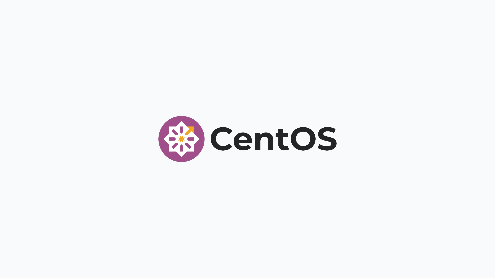

# Deploy Fleet on CentOS

> **Archived.** While still usable, this guide has not been updated recently. See the [Deploy Fleet](https://fleetdm.com/docs/deploy/deploy-fleet) docs for supported deployment methods.



> Updated on December 2, 2020, by [Noah Talerman](https://github.com/noahtalerman).

In this guide, we're going to install Fleet and all of its application dependencies on a CentOS 7.1 server. Once we have Fleet up and running, we're going to install osquery on that same CentOS 7.1 host and enroll it in Fleet. This should give you a good understanding of both how to install Fleet as well as how to install and configure osquery such that it can communicate with Fleet.

## Setting up a host

If you don't have a CentOS host readily available, Fleet recommends using [Vagrant](https://www.vagrantup.com/) for this guide. You can find installation instructions on Vagrant's [downloads page](https://developer.hashicorp.com/vagrant/downloads).

Once you have installed Vagrant, run the following to create a Vagrant box, start it, and log into it:

```sh
echo 'Vagrant.configure("2") do |config|
  config.vm.box = "bento/centos-7.1"
  config.vm.network "forwarded_port", guest: 8080, host: 8080
end' > Vagrantfile
vagrant up
vagrant ssh
```

## Installing Fleet

To install Fleet, [download](https://github.com/fleetdm/fleet/releases) the latest release from GitHub. The binary is in an archive that uses this naming convention, including the current version: `fleet_<version>_linux.tar.gz`.

Once the file is downloaded, extract the Fleet binary from the archive and copy it in to your desired location.

For example:
```console
> tar -xf fleet_<version>_linux.tar.gz
> sudo cp fleet_<version>_linux/fleet /usr/bin/
> /usr/bin/fleet version
fleet version <version>
```

## Installing and configuring dependencies

### MySQL

To install the MySQL server files, run the following:

```sh
wget https://repo.mysql.com/mysql57-community-release-el7.rpm
sudo rpm -i mysql57-community-release-el7.rpm
sudo yum update
sudo yum install mysql-server
```

To start the MySQL service:

```sh
sudo systemctl start mysqld
```

Let's set a password for the MySQL root user.
MySQL creates an initial temporary root password which you can find in `/var/log/mysqld.log` you will need this password to change the root password.

Connect to MySQL

```sh
mysql -u root -p
```

When prompted enter in the temporary password from `/var/log/mysqld.log`

Change root password, in this case we will use `toor?Fl33t` as default password validation requires a more complex password.

For MySQL 5.7.6 and newer, use the following command:

```sh
mysql> ALTER USER "root"@"localhost" IDENTIFIED BY "toor?Fl33t";
```

For MySQL 5.7.5 and older, use:

```sh
mysql> SET PASSWORD FOR "root"@"localhost" = PASSWORD("toor?Fl33t");
```

Now issue the command

```sh
mysql> flush privileges;
```

And exit MySQL

```sh
mysql> exit
```

Stop MySQL and start again

```sh
sudo mysqld stop
sudo systemctl start mysqld
```

It's also worth creating a MySQL database for us to use at this point. Run the following to create the `fleet` database in MySQL. Note that you will be prompted for the password you created above.

```sh
echo 'CREATE DATABASE fleet;' | mysql -u root -p
```

### Redis

To install the Redis server files, run the following:

```sh
sudo rpm -Uvh https://archives.fedoraproject.org/pub/archive/epel/6/i386/epel-release-6-8.noarch.rpm
sudo yum install redis
```

To start the Redis server in the background, you can run the following:

```sh
sudo service redis start
```

## Running the Fleet server

Now that we have installed Fleet, MySQL, and Redis, we are ready to launch Fleet! First, we must "prepare" the database. We do this via `fleet prepare db`:

```sh
/usr/bin/fleet prepare db \
  --mysql_address=127.0.0.1:3306 \
  --mysql_database=fleet \
  --mysql_username=root \
  --mysql_password=toor?Fl33t
```

The output should look like:

```sh
Migrations completed.
```

Before we can run the server, we need to generate some TLS keying material. If you already have tooling for generating valid TLS certificates, then you are encouraged to use that instead. You will need a TLS certificate and key for running the Fleet server. If you'd like to generate self-signed certificates, you can do this via (replace SERVER_NAME with your server FQDN):

```sh
openssl req -x509 -newkey rsa:4096 -sha256 -days 3650 -nodes \
  -keyout /tmp/server.key -out /tmp/server.cert -subj "/CN=SERVER_NAME” \
  -addext "subjectAltName=DNS:SERVER_NAME”
```

You should now have two new files in `/tmp`:

- `/tmp/server.cert`
- `/tmp/server.key`

Now we are ready to run the server! We do this via `fleet serve`:

```sh
/usr/bin/fleet serve \
  --mysql_address=127.0.0.1:3306 \
  --mysql_database=fleet \
  --mysql_username=root \
  --mysql_password=toor \
  --redis_address=127.0.0.1:6379 \
  --server_cert=/tmp/server.cert \
  --server_key=/tmp/server.key \
  --logging_json
```

Now, if you go to [https://localhost:8080](https://localhost:8080) in your local browser, you should be redirected to [https://localhost:8080/setup](https://localhost:8080/setup) where you can create your first Fleet user account.

## Running Fleet with systemd

See [Running with systemd](https://fleetdm.com/docs/deploying/configuration#running-with-systemd) for documentation on running fleet as a background process and managing the fleet server logs.

## Installing and running osquery

> Note that this whole process is outlined in more detail in the [Adding Hosts To Fleet](https://fleetdm.com/docs/using-fleet/adding-hosts) document. The steps are repeated here for the sake of a continuous tutorial.

To install osquery on CentOS, you can run the following:

```sh
sudo rpm -ivh https://osquery-packages.s3.amazonaws.com/centos7/noarch/osquery-s3-centos7-repo-1-0.0.noarch.rpm
sudo yum install osquery
```

You will need to set the osquery enroll secret and osquery server certificate. If you head over to the manage hosts page on your Fleet instance (which should be [https://localhost:8080/hosts/manage](https://localhost:8080/hosts/manage)), you should be able to click "Add New Hosts" and see a modal like the following:


If you select "Fetch Fleet Certificate", your browser will download the appropriate file to your downloads directory (to a file probably called `localhost-8080.pem`). Copy this file to your CentOS host at `/var/osquery/server.pem`.

You can also select "Reveal Secret" on that modal and the enrollment secret for your Fleet instance will be revealed. Copy that text and create a file with its contents:

```sh
echo 'LQWzGg9+/yaxxcBUMY7VruDGsJRYULw8' | sudo tee /var/osquery/enroll_secret
```

Now you're ready to run the `osqueryd` binary:

```sh
sudo /usr/bin/osqueryd \
  --enroll_secret_path=/var/osquery/enroll_secret \
  --tls_server_certs=/var/osquery/server.pem \
  --tls_hostname=localhost:8080 \
  --host_identifier=instance \
  --enroll_tls_endpoint=/api/osquery/enroll \
  --config_plugin=tls \
  --config_tls_endpoint=/api/osquery/config \
  --config_refresh=10 \
  --disable_distributed=false \
  --distributed_plugin=tls \
  --distributed_interval=3 \
  --distributed_tls_max_attempts=3 \
  --distributed_tls_read_endpoint=/api/osquery/distributed/read \
  --distributed_tls_write_endpoint=/api/osquery/distributed/write \
  --logger_plugin=tls \
  --logger_tls_endpoint=/api/osquery/log \
  --logger_tls_period=10
```

If you go back to [https://localhost:8080/hosts/manage](https://localhost:8080/hosts/manage), you should have a host successfully enrolled in Fleet!

<meta name="articleTitle" value="Deploy Fleet on CentOS">
<meta name="authorGitHubUsername" value="marpaia">
<meta name="authorFullName" value="Mike Arpaia">
<meta name="publishedOn" value="2017-09-22">
<meta name="category" value="guides">
<meta name="articleImageUrl" value="../website/assets/images/articles/deploy-fleet-on-centos-800x450@2x.png">
<meta name="description" value="A guide to deploy Fleet on CentOS.">
