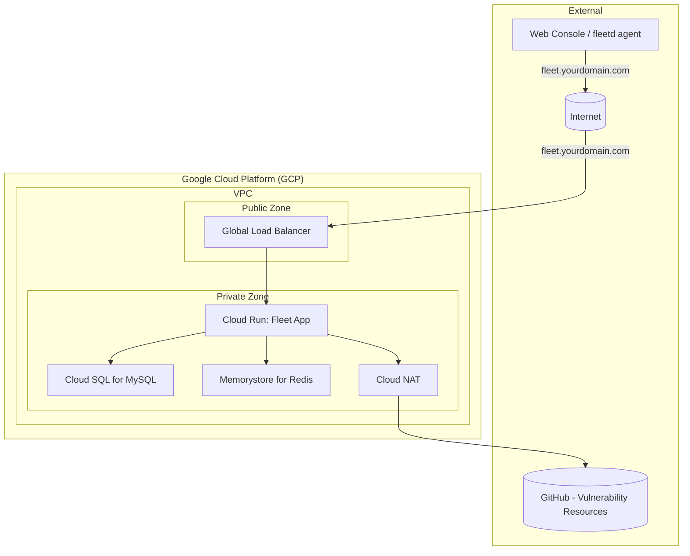

# Deploy Fleet on GCP

This Terraform project automates the deployment of Fleet on the Google Cloud Platform (GCP). It provisions a new GCP project (or uses an existing one if configured) and deploys all necessary infrastructure components, including:

- A new Google Cloud Project (via terraform-google-modules/project-factory)
- VPC Network and Subnets
- Cloud NAT for outbound internet access
- Cloud SQL for MySQL (database for Fleet)
- Memorystore for Redis (caching for Fleet)
- Google Cloud Storage (GCS) bucket (for Fleet software installers, S3-compatible access configured)
- Google Secret Manager (for storing sensitive data like database passwords and Fleet server private key)
- Cloud Run v2 Service (for the main Fleet application)
- Cloud Run v2 Job (for database migrations)
- External HTTP(S) Load Balancer with managed SSL certificate
- Cloud DNS for managing the Fleet endpoint
- Appropriate IAM service accounts and permissions

## Prerequisites

1. [Terraform](https://developer.hashicorp.com/terraform) version ~> 1.11.
2. [Google Cloud SDK](https://cloud.google.com/sdk) installed and configured.
3. GCP account & permissions:
    - A Google Cloud organization ID.
    - A billing account ID.
    - Credentials configured for Terraform to interact with GCP. This typically means running   gcloud auth application-default login with a user account that has:
    - Organization administrator or folder creator & project creator roles at the organization/  folder level (for the project-factory module).
    - Billing account user role on the billing account.
    - Once the project is created, subsequent applies for resources within the project will   generally require owner or editor on the provisioned project.
    - Alternatively, use a service account with appropriate permissions.
4. Registered domain name: You will need a domain name that you can manage DNS records for. This project will create a Cloud DNS Managed Zone for this domain (or a subdomain).
5. (Optional) Fleet license key: If you have a Fleet Premium license, you can provide it.

## Configuration

1.  [Clone the repository](https://github.com/fleetdm/fleet-terraform/tree/e8d559ecba80ab35cb8014212f5bd0a22b545618/gcp) or ensure you have all the files.
2.  Create a `terraform.tfvars` file and paste in the folowing, populated with your specific values:

```hcl
# Required: GCP Organization and Billing
org_id               = "YOUR_ORGANIZATION_ID" # e.g., "123456789012"
billing_account_id   = "YOUR_BILLING_ACCOUNT_ID" # e.g., "012345-6789AB-CDEF
# Required: DNS Configuration
# The public DNS zone name (e.g., "example.com." - note the trailing dot)
# This project will create/manage this zone in Cloud DNS.
dns_zone_name        = "your-domain.com."
# The fully qualified domain name for your Fleet instance (e.g., "fleet.your-domain.com.")
dns_record_name      = "fleet.your-domain.co
# Optional: Project Configuration
project_name         = "my-fleet-project" # Name for the new GCP project
random_project_id    = true               # Set to false if you want to use project_nameproject_id (must be globally uniq
# Optional: Labels
labels = {
  application = "fleetdm"
  environment = "production"
  owner       = "devops-team"

# --- byo-project module specific variables (passed through from root) ---
# You can override defaults from byo-project/variables.tf here if needed,
# or set values for variables that don't have defaul
# Example: Fleet Configuration including migration execution
fleet_config = {
  # image_tag                = "fleetdm/fleet:v4.x.y" # Specify your desired Fleet version
  # license_key              = "YOUR_FLEET_LICENSE_KEY"
  # installers_bucket_name   = "my-unique-fleet-installers" # Must be globally unique
  # fleet_cpu                = "1000m"
  # fleet_memory             = "4096Mi"
  # debug_logging            = false
  # min_instance_count       = 1
  # max_instance_count       = 3
  # exec_migration           = true # Set to true to run migrations on `terraform apply`
                                   # (e.g., when changing image_tag)

```

### Key variables to set:

| Variable | Notes |
| :--- | :--- |
| `org_id` | Your GCP organization ID. |
| `billing_account_id` | Your GCP billing account ID. |
| `dns_zone_name` | The DNS zone that will be created/managed in Cloud DNS (e.g., `mydomain.com.`). **Must end with a dot.** |
| `dns_record_name` | The specific DNS record for Fleet (e.g., `fleet.mydomain.com.`). **Must end with a dot.** |
| `project_name` | A descriptive name for the project to be created. |
| `fleet_config.image_tag` | The Docker image tag for the Fleet version you want to deploy (e.g., `fleetdm/fleet:v4.67.3`). |
| `fleet_config.exec_migration` |  Set to `true` when you are upgrading the `fleet_config.image_tag` to automatically run database migrations. Set to `false` if you want to manage migrations manually or if it's not an image upgrade. |
| `fleet_config.license_key` (Optional, inside the `fleet_config` object) | Your Fleet license key if you have one. |

> Note: Review [`variables.tf`](https://github.com/fleetdm/fleet-terraform/blob/e8d559ecba80ab35cb8014212f5bd0a22b545618/gcp/variables.tf) and [`byo-project/variables.tf`](https://github.com/fleetdm/fleet-terraform/blob/e8d559ecba80ab35cb8014212f5bd0a22b545618/gcp/byo-project/variables.tf) for all available options and their defaults.

## Deployment Steps

1.  Authenticate with GCP
> Ensure your `gcloud` CLI is authenticated with the account having the necessary permissions.

```bash
gcloud auth application-default login
```

2.  Initialize Terraform. Navigate to the root directory of the project (where `main.tf` is located) and run:

```bash
terraform init
```

3.  Review the changes Terraform will make:

```bash
terraform plan -out=tfplan
```

4.  Apply the Configuration to provision the resources:

```bash
terraform apply tfplan
```

    > This process can take a significant amount of time (10–20 minutes or more), especially for the initial project creation, API enablement, and Cloud SQL instance provisioning.

5.  Update DNS (if not using Cloud DNS for the parent zone). If `dns_zone_name` (e.g., `fleet.your-domain.com.`) is a new zone created by this Terraform, and your parent domain (e.g., `your-domain.com.`) is managed elsewhere (e.g., Cloudflare), you need to delegate this new zone.
    - Get the Name Servers (NS) records for the newly created `google_dns_managed_zone${var.prefix}-zone`):
    
```bash
# First, get the project ID and zone name if you don't know them
PROJECT_ID=$(terraform output -raw project_id 2>/dev/null || gcloud projects  list  filter="name~^my-fleet-project" --format="value(projectId)" | head  -n 1)
DNS_ZONE_INTERNAL_NAME="fleet-zone" # Or as configured by 'prefix' variable

gcloud dns managed-zones describe ${DNS_ZONE_INTERNAL_NAME} \
    --project=${PROJECT_ID} \
    --format="value(nameServers)"
```

- Add these NS records to your parent domain's DNS settings at your domain registrar or DNS provider.
  
> If `dns_zone_name` (e.g., `your-domain.com.`) was an *existing* zone you own and manage via Cloud DNS in this project, Terraform would add records to it directly. The current setup *creates* the zone, so delegation is key if the parent is external.

## Accessing Fleet

Once the deployment is complete, database migrations have run successfully, and DNS has propagated (which can take a few minutes):

- Open your web browser and navigate to the `dns_record_name` you configured (e.g., `https://fleet.your-domain.com`).
- You should be greeted by the Fleet setup page or login screen.

## Key Resources Created (within the byo-project module)

- VPC Network (`fleet-network`): Custom network for Fleet resources.
- Subnet (`fleet-subnet`): Subnetwork within the VPC.
- Cloud Router & NAT (`fleet-cloud-router`, `fleet-vpc-nat`):** For outbound internet access from Cloud Run and other private resources.
- Cloud SQL for MySQL (`fleet-mysql-xxxx`): Managed MySQL database.
- Memorystore for Redis (`fleet-cache`): Managed Redis instance.
- GCS Bucket (`fleet-installers-xxxx`): For S3-compatible storage.
- Secret Manager Secrets:**
    - `fleet-db-password-xxxx`: Stores the generated MySQL user password.
    - `fleet-private-key-xxxx`: Stores a generated private key for Fleet server.
- Service Account (`fleet-run-sa`): Used by Cloud Run services/jobs with necessary permissions.
- Cloud Run Service (`fleet-service`): Hosts the main Fleet application.
- Cloud Run Job (`fleet-migration-job`): For database migrations.
- Network Endpoint Group (`fleet-neg`): Connects the Load Balancer to the Cloud Run service.
- Cloud DNS Managed Zone (`fleet-zone`): Manages DNS records for `dns_zone_name`.
- External HTTP(S) Load Balancer (`fleet-lb`): Provides public access to Fleet via HTTPS.
- DNS A Record: Points `dns_record_name` to the Load Balancer's IP.

> Note: `xxxx` indicates a random suffix added by some modules/resources for uniqueness.

## Cleaning Up

To destroy all resources created by this Terraform project:
1.  Navigate to the root directory of the project.
2.  Run the destroy command:

```
terraform destroy
```

3.  Confirm by typing `yes` when prompted.

## Important Considerations

- Permissions: The user or service account running Terraform needs extensive permissions, especially for project creation. For ongoing management within the project, a role like `Project Editor` or more granular roles might suffice.
- Fleet Configuration: This Terraform setup provisions the infrastructure. Further Fleet application configuration (e.g., SSO, SMTP, agent options) will need to be done through the Fleet UI or API after deployment.
- Security:
    - Review IAM permissions granted.
    - The Load Balancer is configured for HTTPS and redirects HTTP.
    - Cloud SQL and Memorystore are not publicly accessible and are connected via Private Service Access.
- Scalability: Cloud Run scaling parameters (`min_instance_count`, `max_instance_count`) and database/cache tier can be adjusted in `variables.tf` (via `fleet_config`, `database_config`, `cache_config`) to suit your load.

### Networking Diagram



## Requirements

| Name | Version |
| :--- | :--- |
| Terraform | ~> 1.11 |
| Google |  6.35.0 |

## Modules

| Name | Source | Version |
| :--- | :--- | :--- |
| fleet | [./byo-project](https://github.com/fleetdm/fleet-terraform/tree/e8d559ecba80ab35cb8014212f5bd0a22b545618/gcp) | n/a |
| project/_factory | https://registry.terraform.io/modules/terraform-google-modules/project-factory/google | ~> 18.0.0 |

## Inputs

### billing_account_id (required)

Billing account ID.

#### Type

`any`

#### Default

n/a

---

### cache_config (optional)

Configuration for the Memorystore (Redis) instance.

#### Type

```
object({
  name           = string
  tier           = string
  engine_version = string
  connect_mode   = string
  memory_size    = number
})
```

#### Default

```
{
  name           = "fleet-cache"
  tier           = "STANDARD_HA"
  engine_version = null
  connect_mode   = "PRIVATE_SERVICE_ACCESS"
  memory_size    = 1
}
```

---

### database_config (optional)

Configuration for the Cloud SQL (MySQL) instance.

#### Type
```
object({
  name                = string
  database_name       = string
  database_user       = string
  collation           = string
  charset             = string
  deletion_protection = bool
  database_version    = string
  tier                = string
})
```

#### Default
```
{
  name                = "fleet-mysql"
  database_name       = "fleet"
  database_user       = "fleet"
  collation           = "utf8mb4_unicode_ci"
  charset             = "utf8mb4"
  deletion_protection = false
  database_version    = "MYSQL_8_0"
  tier                = "db-n1-standard-1"
}
```

---

### dns_record_name (required)

The DNS record for Fleet (e.g., `fleet.my-fleet-infra.com.`).

#### Type

`string`

#### Default

n/a

---

### dns_zone_name (required)

The DNS name of the managed zone (e.g., `my-fleet-infra.com.`).

#### Type

`string`

#### Default

n/a

#### Description

---

### fleet_config (optional) 

Configuration for the Fleet application deployment.

#### Type

```
object({
  installers_bucket_name = string
  image_tag              = string
  fleet_cpu              = string
  fleet_memory           = string
  debug_logging          = bool
  license_key            = optional(string)
  min_instance_count     = number
  max_instance_count     = number
  exec_migration         = bool
  extra_env_vars         = optional(map(string))
  extra_secret_env_vars  = optional(map(object({
    secret  = string
    version = string
  })))
})
```

#### Default

```
{
  installers_bucket_name = "fleet-installers-gcp-test-1"
  image_tag              = "fleetdm/fleet:v4.67.3"
  fleet_cpu              = "1000m"
  fleet_memory           = "4096Mi"
  debug_logging          = false
  exec_migration         = true
  extra_env_vars         = {}
  extra_secret_env_vars  = {}
  min_instance_count     = 1
  max_instance_count     = 5
}
```

---

### fleet_image (optional)

Fleet image tag to use. (Note: While not explicitly documented, this likely overrides the image version in `fleet_config` if set separately.)

#### Type

`string`

#### Default

`"v4.67.3"`

---

### labels (optional)

Resource labels applied to all created resources.

#### Type

`map(string)`

#### Default

```
{
  application = "fleet"
}
```

---

### location (optional)

General location for resources, such as GCS buckets.

#### Type

`string`

#### Default

`us`

---

### org_id (required)

Google Cloud organization ID.

#### Type

`any`

#### Default

n/a

---

### prefix (optional)

A prefix used for naming resources within the byo-project module.

#### Type

`string`

#### Default

`"fleet"`

---

### project_name (optional)

The name of the project. Used in naming and labeling resources.

#### Type

`string`

#### Default

`"fleet"`

---

### random_project_id (optional)

Whether to generate a random suffix for the project ID.

#### Type

`bool`

#### Default

`true`

---

### region (optional)

The GCP region used for regional resources (e.g., Cloud SQL, subnets).

#### Type

`string`

#### Default

`uscentral1`

---

### vpc_config (optional)

Configuration for the VPC network and subnets, including custom subnet IP ranges and private access settings.

#### Type

```
object({
  network_name = string
  subnets = list(object({
    subnet_name           = string
    subnet_ip             = string
    subnet_region         = string
    subnet_private_access = bool
  }))
})
```

#### Default

```
{
  network_name = "fleet-network"
  subnets = [
    {
      subnet_name           = "fleet-subnet"
      subnet_ip             = "10.10.10.0/24"
      subnet_region         = "us-central1"
      subnet_private_access = true
    }
  ]
}
```

---

## Outputs

| Name | Description |
| :--- | :--- |
| `cloud_router_name` | The name of the Cloud Router created for NAT. |
| `cloud_run_service_location` | The location of the deployed Fleet Cloud Run service. |
| `cloud_run_service_name` | The name of the deployed Fleet Cloud Run service. |
| `dns_managed_zone_name` | The name of the Cloud DNS managed zone created for Fleet. |
| `dns_managed_zone_name_servers` | The authoritative name servers for the created Cloud DNS managed zone. Delegate your domain to these. |
| `fleet_application_url` | The primary URL to access the Fleet application (via the Load Balancer). |
| `fleet_service_account_email` | The email address of the service account used by the Fleet Cloud Run service. |
| `load_balancer_ip_address` | The external IP address of the HTTP(S) Load Balancer. |
| `mysql_instance_connection_name` | The connection name for the Cloud SQL instance (used by Cloud SQL Proxy). |
| `mysql_instance_name` | The name of the Cloud SQL for MySQL instance. |
| `redis_host` | The host IP address of the Memorystore for Redis instance. |
| `redis_instance_name` | The name of the Memorystore for Redis instance. |
| `redis_port` | The port number of the Memorystore for Redis instance. |
| `software_installers_bucket_name` | The name of the GCS bucket for Fleet software installers. |
| `software_installers_bucket_url` | The gsutil URL of the GCS bucket for Fleet software installers. |
| `vpc_network_name` | The name of the VPC network created. |
| `vpc_network_self_link` | The self-link of the VPC network created. |
| `vpc_subnets_names` | List of subnet names created in the VPC. |

<meta name="articleTitle" value="Deploy Fleet on GCP">
<meta name="authorGitHubUsername" value="edwardsb">
<meta name="authorFullName" value="Ben Edwards">
<meta name="publishedOn" value="2025-06-26">
<meta name="category" value="guides">
<meta name="description" value="Learn how to deploy Fleet on GCP.">
