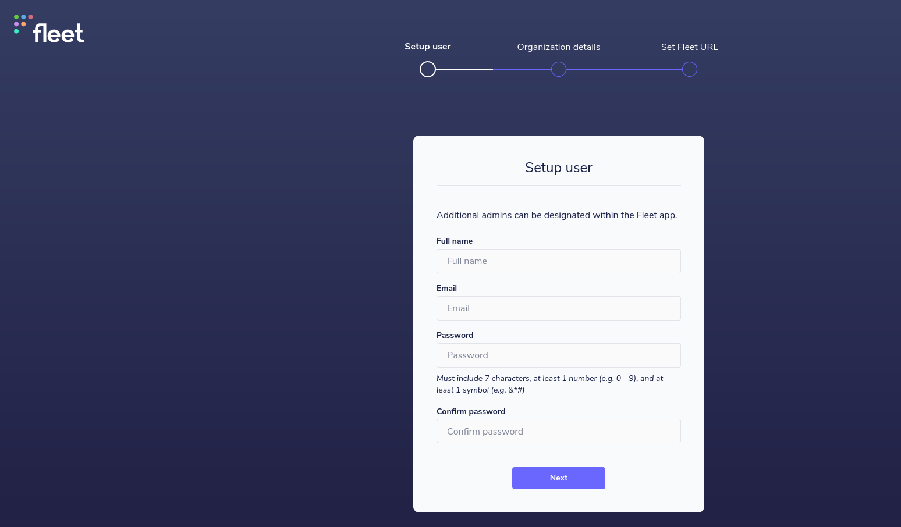
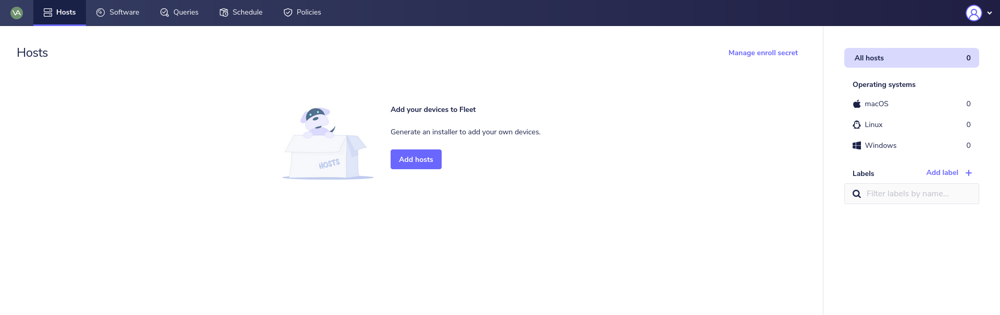
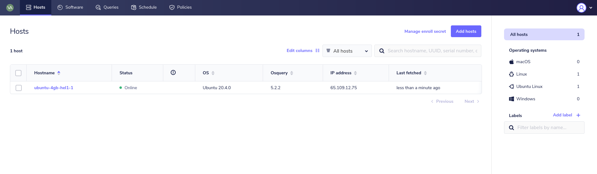
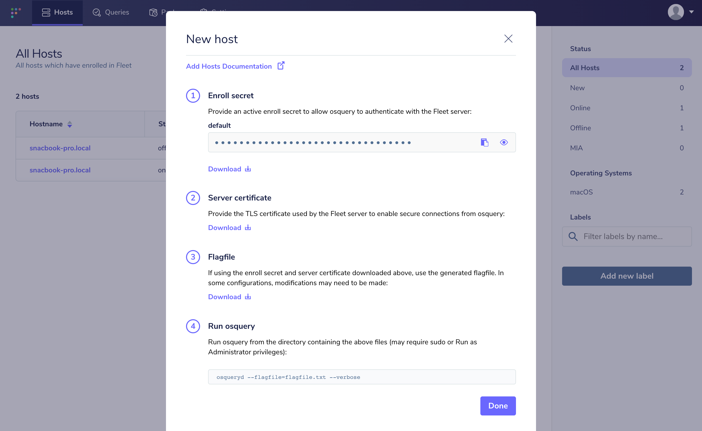
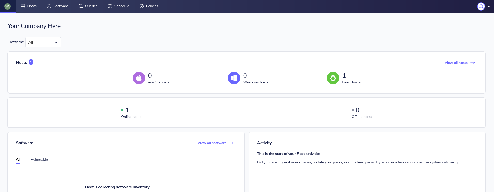

# Deploy Fleet on Hetzner Cloud with Cloud-init & Docker


[Hetzner](https://hetzner.com) provides the best price-performance of any provider worldwide for “root” (dedicated) and Virtual Private Servers (VPS) with high performance and generous bandwidth.

While other providers may charge large amounts for computing and storage, Hetzner is cost-effective _and_ scalable, with great managed options (such as [Nextcloud](https://www.hetzner.com/storage/storage-share)).

Let’s explore how you might deploy Fleet on [Hetzner Cloud](https://hetzner.com/cloud) as quickly as possible so you can use Fleet to orchestrate osquery on your endpoints.

## The 2 minute setup

For those who want to get started quickly, copy and paste the following two scripts into Cloud-init UserData. Alternatively, the more adventurous can follow the [full deployment guide](#the-full-deployment-guide).

### Fleet

Copy and paste the following script into Cloud-init UserData for the Fleet controller machine:

```bash
#!/usr/bin/bash

# DONT FORGET: Replace the line below with your fleet machine TLD
export FLEET_DOMAIN=fleet.domain.tld

#######
# DNS #
#######

# Set up DNS resolution
sed -i /etc/systemd/resolved.conf 's/^#DNS=$/DNS=1.1.1.1 9.9.9.9 8.8.8.8/'
systemctl restart systemd-resolved

#######
# APT #
#######

# Update Apt
sudo apt update
sudo apt install -y ca-certificates curl gnupg lsb-release

############
# Firewall #
############

apt install ufw
ufw deny all

ufw allow ssh
ufw allow http
ufw allow https

ufw enable

############
# Fail2Ban #
############

apt install fail2ban

##########
# Docker #
##########

apt install -y ca-certificates curl gnupg lsb-release # these should already be installed

# Set up package repositories for docker
curl -fsSL https://download.docker.com/linux/ubuntu/gpg | gpg --dearmor -o /usr/share/keyrings/docker-archive-keyring.gpg
echo "deb [arch=$(dpkg --print-architecture) signed-by=/usr/share/keyrings/docker-archive-keyring.gpg] https://download.docker.com/linux/ubuntu $(lsb_release -cs) stable" | tee /etc/apt/sources.list.d/docker.list > /dev/null

# Install docker
apt update
apt install -y docker-ce docker-ce-cli containerd.io docker-compose-plugin

docker pull mysql@sha256:16e159331007eccc069822f7b731272043ed572a79a196a05ffa2ea127caaf67 # mysql:5.7.38 as of 2022/05/19

######################
# MySQL (dockerized) #
######################

# mysql:5.7.38 as of 2022/05/19
docker pull mysql@sha256:16e159331007eccc069822f7b731272043ed572a79a196a05ffa2ea127caaf67

# Create the Fleet MySQL data folder
mkdir -p /etc/fleet

# Create ENV that will be used by the docker container
touch /etc/fleet/mysql.env
chmod 600 /etc/fleet/mysql.env
echo "MYSQL_HOST=127.0.0.1" >> /etc/fleet/mysql.env
echo "MYSQL_USER=fleet" >> /etc/fleet/mysql.env
echo "MYSQL_DATABASE=fleet" >> /etc/fleet/mysql.env
cat /dev/urandom | tr -dc 'a-zA-Z0-9' | fold -w 32 | head -n 1 | sed -e 's/^/MYSQL_PASSWORD=/' >> /etc/fleet/mysql.env
cat /dev/urandom | tr -dc 'a-zA-Z0-9' | fold -w 32 | head -n 1 | sed -e 's/^/MYSQL_ROOT_PASSWORD=/' >> /etc/fleet/mysql.env

cat <<EOF > /etc/systemd/system/fleet-mysql.service
[Unit]
Description=Fleet MySQL instance
After=docker.service
Requires=docker.service

[Service]
TimeoutStartSec=0
Restart=always

ExecStartPre=-/usr/bin/docker exec %n stop
ExecStartPre=-/usr/bin/docker rm %n
ExecStartPre=-/usr/bin/docker pull mysql@sha256:16e159331007eccc069822f7b731272043ed572a79a196a05ffa2ea127caaf67

ExecStart=/usr/bin/docker run --rm \
    --name %n \
    -p 127.0.0.1:3306:3306 \
    -v /etc/fleet/mysql:/var/lib/mysql \
    --env-file /etc/fleet/mysql.env \
    mysql@sha256:16e159331007eccc069822f7b731272043ed572a79a196a05ffa2ea127caaf67

ExecStop=/usr/bin/docker stop %n

[Install]
WantedBy=default.target
EOF

systemctl daemon-reload
systemctl enable fleet-mysql
systemctl start fleet-mysql

######################
# Redis (Dockerized) #
######################

docker pull eqalpha/keydb@sha256:18a00f69577105650d829ef44a9716eb4feaa7a5a2bfacd115f0a1e7a97a8726

cat <<EOF > /etc/systemd/system/fleet-redis.service
[Unit]
Description=Fleet Redis instance
After=docker.service
Requires=docker.service

[Service]
TimeoutStartSec=0
Restart=always

ExecStartPre=-/usr/bin/docker exec %n stop
ExecStartPre=-/usr/bin/docker rm %n
# eqalpha/keydb:x86_64_v6.3.0 as of 2022-05-19
ExecStartPre=-/usr/bin/docker pull eqalpha/keydb@sha256:18a00f69577105650d829ef44a9716eb4feaa7a5a2bfacd115f0a1e7a97a8726

ExecStart=/usr/bin/docker run --rm \
    --name %n \
    -p 127.0.0.1:6379:6379 \
    -v /etc/fleet/redis:/var/lib/redis \
    eqalpha/keydb@sha256:18a00f69577105650d829ef44a9716eb4feaa7a5a2bfacd115f0a1e7a97a8726

ExecStop=/usr/bin/docker stop %n

[Install]
WantedBy=default.target
EOF

systemctl daemon-reload
systemctl enable fleet-redis
systemctl start fleet-redis

######################
# Fleet (Dockerized) #
######################

docker pull fleetdm/fleet@sha256:332744f3503dc15fdb65c7b672a09349b2c30fb59a08f9ab4b1bbab94e3ddb5b

mkdir -p /etc/fleet/fleet

# MySQL fleet ENV
bash -c 'source /etc/fleet/mysql.env && echo -e "FLEET_MYSQL_USERNAME=$MYSQL_USER" >> /etc/fleet/fleet.env';
bash -c 'source /etc/fleet/mysql.env && echo -e "FLEET_MYSQL_PASSWORD=$MYSQL_PASSWORD" >> /etc/fleet/fleet.env';
echo 'FLEET_MYSQL_DATABASE=fleet' >> /etc/fleet/fleet.env

# Other fleet ENV vars
echo 'FLEET_SERVER_ADDRESS=127.0.0.1:8080' >> /etc/fleet/fleet.env
echo 'FLEET_MYSQL_ADDRESS=localhost:3306' >> /etc/fleet/fleet.env
echo 'FLEET_REDIS_ADDRESS=localhost:6379' >> /etc/fleet/fleet.env
echo 'FLEET_SERVER_TLS=false' >> /etc/fleet/fleet.env

cat <<EOF > /etc/systemd/system/fleet.service
[Unit]
Description=Fleet
After=docker.service
Requires=docker.service

[Service]
TimeoutStartSec=0
Restart=always
ExecStartPre=-/usr/bin/docker exec %n stop
ExecStartPre=-/usr/bin/docker rm %n
ExecStartPre=-/usr/bin/docker pull fleetdm/fleet@sha256:332744f3503dc15fdb65c7b672a09349b2c30fb59a08f9ab4b1bbab94e3ddb5b

ExecStartPre=/usr/bin/docker run --rm \
    --name fleet-prepare-db \
    --net=host \
    --env-file=/etc/fleet/fleet.env \
    fleetdm/fleet@sha256:332744f3503dc15fdb65c7b672a09349b2c30fb59a08f9ab4b1bbab94e3ddb5b \
    /usr/bin/fleet prepare db --no-prompt --logging_debug

ExecStart=/usr/bin/docker run --rm \
    --name %n \
    --net=host \
    -p 127.0.0.1:8080:8080 \
    --env-file=/etc/fleet/fleet.env \
    fleetdm/fleet@sha256:332744f3503dc15fdb65c7b672a09349b2c30fb59a08f9ab4b1bbab94e3ddb5b \
    /usr/bin/fleet serve

[Install]
WantedBy=default.target
EOF

systemctl daemon-reload
systemctl enable fleet
systemctl start fleet

######################
# Caddy (Dockerized) #
######################

mkdir -p /etc/fleet/caddy;
touch /etc/fleet/caddy.env;
chmod 600 /etc/fleet/caddy.env;
echo -e "FLEET_DOMAIN=${FLEET_DOMAIN}" >> /etc/fleet/caddy.env; # Replace this with your domain!

cat <<EOF > /etc/fleet/caddy/Caddyfile
{\$FLEET_DOMAIN}

reverse_proxy 127.0.0.1:8080
EOF

docker pull caddy@sha256:6e62b63d4d7a4826f9e93c904a0e5b886a8bea2234b6569e300924282a2e8e6c

cat <<EOF > /etc/systemd/system/fleet-caddy.service
[Unit]
Description=Fleet Caddy instance
After=docker.service
Requires=docker.service

[Service]
TimeoutStartSec=0
Restart=always
EnvironmentFile=/etc/fleet/caddy.env
ExecStartPre=-/usr/bin/docker exec %n stop
ExecStartPre=-/usr/bin/docker rm %n
# caddy:2.5.1-alpine as of 2022-05-20
ExecStartPre=-/usr/bin/docker pull caddy@sha256:6e62b63d4d7a4826f9e93c904a0e5b886a8bea2234b6569e300924282a2e8e6c
ExecStart=/usr/bin/docker run --rm \
    --name %n \
    --env-file=/etc/fleet/caddy.env \
    --net=host \
    -v /etc/fleet/caddy/Caddyfile:/etc/caddy/Caddyfile \
    -v /etc/fleet/caddy/data:/data \
    -v /etc/fleet/caddy/config:/config \
    caddy@sha256:6e62b63d4d7a4826f9e93c904a0e5b886a8bea2234b6569e300924282a2e8e6c

[Install]
WantedBy=default.target
EOF

systemctl daemon-reload
systemctl enable fleet-caddy
systemctl start fleet-caddy
```

### Host

Copy and paste the script below into Cloud-init UserData for your hosts (which run `osqueryd` and workloads).

```bash
#!/usr/bin/bash
#######
# DNS #
#######

# Set up DNS resolution
sed -i /etc/systemd/resolved.conf 's/^#DNS=$/DNS=1.1.1.1 9.9.9.9 8.8.8.8/'
systemctl restart systemd-resolved

#######
# APT #
#######

# Update Apt
sudo apt update
sudo apt install -y ca-certificates curl gnupg lsb-release

############
# Firewall #
############

apt install ufw
ufw deny all

ufw allow ssh
ufw allow http
ufw allow https

ufw enable

############
# Fail2Ban #
############

apt install fail2ban

############
# fleetctl #
############

wget https://github.com/fleetdm/fleet/releases/download/fleet-v4.14.0/fleetctl_v4.14.0_linux.tar.gz
echo "cd50f058724cdde07edcc3cf89c83e9c5cd91ca41974ea470ae660cb50dd04a1 fleetctl_v4.14.0_linux.tar.gz" | sha256sum -c

tar --extract --file=fleetctl_v4.14.0_linux.tar.gz fleetctl_v4.14.0_linux/fleetctl
mv fleetctl_v4.14.0_linux/fleetctl /usr/bin/fleetctl

##########################
# Machine Workload Setup #
##########################

### Your normal node setup goes here


### (after the Fleet instance is running, you'll get a command like the one below to run on hosts)
### $ fleetctl package --type=deb --fleet-url=https://fleet.vadosware.io --enroll-secret=xxxxxxxxxxxxxxxxxxxxxxxxxxxxxxxx
### (Running the command above produces a .DEB package you can install like the example below)
### $ apt install /root/fleet-osquery_0.0.13_amd64.deb
### (After this, you should be able to see your new machine on the fleet instance! 🎉)
```

---

## The full deployment guide

For the more adventurous, here are the complete instructions for deploying Fleet on Hetzner with Cloud-init and Docker from scratch.

## Prerequisites

To follow this guide, you’ll need:

- An [account with Hetzner](https://accounts.hetzner.com/signUp)
- A practical understanding of [Cloud-init](https://cloudinit.readthedocs.io/), the multi-distribution method for cross platform cloud instance initialization.
- A practical understanding of Cloud-init [User-Data](https://cloudinit.readthedocs.io/en/latest/topics/format.html)
- A practical understanding of [Docker](https://docs.docker.com/) (or any other container runtime of your choice)

## Get a machine from Hetzner

First, purchase a machine (for example, a [Hetzner Cloud](https://hetzner.com/cloud) instance):


_Hetzner cloud purchase machine screen_

After purchasing, you should know the IP address of your machine (and make sure you set up things like SSH securely!)

---

## DNS

### For your domain

This would be a great time to set up `A`/`AAAA` records for your Fleet controller instance – something like `fleet.domain.tld` should work (ex. `fleet.yoursite.com`).

### On the machine

Now that we have our machine, we’ll want to allow DNS queries to DNS resolvers other than Hetzner:

```
sed -i /etc/systemd/resolved.conf 's/^#DNS=$/DNS=1.1.1.1 9.9.9.9 8.8.8.8/'
systemctl restart systemd-resolved
```

This will ensure that external DNS can be reached through a means _other_ than by Hetzner default DNS nameservers.

### Set up APT

Let’s get our machine up to date and install some packages we’ll need later

```
# Update Apt
sudo apt update
sudo apt install -y ca-certificates curl gnupg lsb-release
```

### Set up a firewall

Basic security hardening dictates you add a firewall so let’s use [UFW][ufw]:

```
apt install ufw
ufw deny all

ufw allow ssh
ufw allow http
ufw allow https

ufw enable
```

---

## Docker

Before we can get started, let’s install [Docker](https://docs.docker.com/) to manage our workloads. Other container runtimes would work, but Docker is pretty well known, robust, and uses [Containerd](https://containerd.io) underneath anyway, so let’s use that:


```
sudo apt install -y ca-certificates curl gnupg lsb-release # these should already be installed

# Set up package repositories for docker
$ curl -fsSL https://download.docker.com/linux/ubuntu/gpg | sudo gpg --dearmor -o /usr/share/keyrings/docker-archive-keyring.gpg
$ echo \
  "deb [arch=$(dpkg --print-architecture) signed-by=/usr/share/keyrings/docker-archive-keyring.gpg] https://download.docker.com/linux/ubuntu \
  $(lsb_release -cs) stable" | sudo tee /etc/apt/sources.list.d/docker.list > /dev/null

# Install docker
$ sudo apt update
$ sudo apt install -y docker-ce docker-ce-cli containerd.io docker-compose-plugin
```

>NOTE: This is a UserData script, so we don’t have to worry about removing previous existing versions!
>See the [official Docker Ubuntu install documentation](https://docs.docker.com/engine/install/ubuntu/#install-using-the-repository) for more details.

---

## MySQL

Fleet uses [MySQL](https://www.mysql.com/) as its primary data store, so first, we’ll have to set up MySQL.

To run MySQL, we’ll have to do the following:


### Pull the MySQL container

We can pull the [official MySQL docker image](https://hub.docker.com/_/mysql) like so:

```
$ docker pull mysql@sha256:16e159331007eccc069822f7b731272043ed572a79a196a05ffa2ea127caaf67 # mysql:5.7.38 as of 2022/05/19
```

### Create & enable a systemd unit for MySQL

[systemd](https://systemd.io) has become the defacto systems manager for most distros, and as such, we’ll be setting up a [systemd unit](https://www.freedesktop.org/software/systemd/man/systemd.unit.html) to ensure MySQL is started automatically.

First we’ll set up our credentials:

```
# Create the Fleet MySQL data folder
mkdir -p /etc/fleet

# Create ENV that will be used by the docker container
touch /etc/fleet/mysql.env
chmod 600 /etc/fleet/mysql.env
echo "MYSQL_HOST=127.0.0.1" >> /etc/fleet/mysql.env
echo "MYSQL_USER=fleet" >> /etc/fleet/mysql.env
echo "MYSQL_DATABASE=fleet" >> /etc/fleet/mysql.env
cat /dev/urandom | tr -dc 'a-zA-Z0-9' | fold -w 32 | head -n 1 | sed -e 's/^/MYSQL_PASSWORD=/' >> /etc/fleet/mysql.env
cat /dev/urandom | tr -dc 'a-zA-Z0-9' | fold -w 32 | head -n 1 | sed -e 's/^/MYSQL_ROOT_PASSWORD=/' >> /etc/fleet/mysql.env
```

And then we’ll create the actual unit that reads this config

```
[Unit]
Description=Fleet MySQL instance
After=docker.service
Requires=docker.service

[Service]
TimeoutStartSec=0
Restart=always

ExecStartPre=-/usr/bin/docker exec %n stop
ExecStartPre=-/usr/bin/docker rm %n
ExecStartPre=-/usr/bin/docker pull mysql@sha256:16e159331007eccc069822f7b731272043ed572a79a196a05ffa2ea127caaf67

ExecStart=/usr/bin/docker run --rm \
    --name %n \
    -p 127.0.0.1:3306:3306 \
    -v /etc/fleet/mysql:/var/lib/mysql \
    --env-file /etc/fleet/mysql.env \
    mysql@sha256:16e159331007eccc069822f7b731272043ed572a79a196a05ffa2ea127caaf67

ExecStop=/usr/bin/docker stop %n

[Install]
WantedBy=default.target
```

We’ll save this content to `/etc/systemd/system/fleet-mysql.service`, and refresh `systemd`:

```
$ systemctl daemon-reload
$ systemctl enable fleet-mysql
```

---

## Set up Redis

Fleet uses [Redis](https://redis.io/) as its primary caching solution, so we’ll need to set up Redis as well. While “vanilla” Redis is a great choice, a recent entrant to the space is [KeyDB](https://keydb.dev/), an alternative multi-threaded implementation of Redis.

### Pull the ~~Redis~~ KeyDB Docker container

We can pull the [KeyDB docker image](https://hub.docker.com/r/eqalpha/keydb) like so:

```
$ docker pull eqalpha/keydb@sha256:18a00f69577105650d829ef44a9716eb4feaa7a5a2bfacd115f0a1e7a97a8726 # x86_64_v6.3.0 as of 2022/05/19
```

### Create and enable a Redis systemd service

Similarly to MySQL, a systemd service can be created for our redis-equivalent service as well.


```
[Unit]
Description=Fleet Redis instance
After=docker.service
Requires=docker.service

[Service]
TimeoutStartSec=0
Restart=always

ExecStartPre=-/usr/bin/docker exec %n stop
ExecStartPre=-/usr/bin/docker rm %n
ExecStartPre=-/usr/bin/docker pull eqalpha/keydb@sha256:18a00f69577105650d829ef44a9716eb4feaa7a5a2bfacd115f0a1e7a97a8726 # eqalpha/keydb:x86_64_v6.3.0 as of 2022-05-19

ExecStart=/usr/bin/docker run --rm \
    --name %n \
    -p 127.0.0.1:6379:6379 \
    -v /etc/fleet/redis:/var/lib/redis \
    eqalpha/keydb@sha256:18a00f69577105650d829ef44a9716eb4feaa7a5a2bfacd115f0a1e7a97a8726

ExecStop=/usr/bin/docker stop %n

[Install]
WantedBy=default.target
```

We’ll save this content to `/etc/systemd/system/fleet-redis.service`. And just like MySQL we’ll `daemon-reload` and `enable`:

```
systemctl daemon-reload
systemctl enable fleet-redis
```

---

## Fleet

We’re finally at the main course – time to install Fleet!

### Pull the Fleet docker container

We can pull the [Fleet docker image](https://hub.docker.com/r/fleetdm/fleet) like so:

```
$ docker pull fleetdm/fleet@sha256:332744f3503dc15fdb65c7b672a09349b2c30fb59a08f9ab4b1bbab94e3ddb5b
```

The [Fleet v4.14.0](https://github.com/fleetdm/fleet/releases/tag/fleet-v4.14.0) release can be found [in DockerHub](https://hub.docker.com/r/fleetdm/fleet/tags?page=1&name=v4.14.0).

### Create and enable the Fleet systemd service

First, we’ll get our Fleet ENV vars in place:

```
mkdir -p /etc/fleet/fleet

# MySQL fleet ENV
bash -c 'source /etc/fleet/mysql.env && echo -e "FLEET_MYSQL_USERNAME=$MYSQL_USER" >> /etc/fleet/fleet.env';
bash -c 'source /etc/fleet/mysql.env && echo -e "FLEET_MYSQL_PASSWORD=$MYSQL_PASSWORD" >> /etc/fleet/fleet.env';
echo 'FLEET_MYSQL_DATABASE=fleet' >> /etc/fleet/fleet.env

# Other fleet ENV vars
echo 'FLEET_SERVER_ADDRESS=127.0.0.1:8080' >> /etc/fleet/fleet.env
echo 'FLEET_MYSQL_ADDRESS=localhost:3306' >> /etc/fleet/fleet.env
echo 'FLEET_REDIS_ADDRESS=localhost:6379' >> /etc/fleet/fleet.env
echo 'FLEET_SERVER_TLS=false' >> /etc/fleet/fleet.env
```

We can set up Fleet to run like so:

```
[Unit]
Description=Fleet
After=docker.service
Requires=docker.service

[Service]
TimeoutStartSec=0
Restart=always
ExecStartPre=-/usr/bin/docker exec %n stop
ExecStartPre=-/usr/bin/docker rm %n
ExecStartPre=-/usr/bin/docker pull fleetdm/fleet@sha256:332744f3503dc15fdb65c7b672a09349b2c30fb59a08f9ab4b1bbab94e3ddb5b

ExecStartPre=/usr/bin/docker run --rm \
    --name fleet-prepare-db \
    --net=host \
    --env-file=/etc/fleet/fleet.env \
    fleetdm/fleet@sha256:332744f3503dc15fdb65c7b672a09349b2c30fb59a08f9ab4b1bbab94e3ddb5b \
    /usr/bin/fleet prepare db --no-prompt --logging_debug

ExecStart=/usr/bin/docker run --rm \
    --name %n \
    --net=host \
    --env-file=/etc/fleet/fleet.env \
    fleetdm/fleet@sha256:332744f3503dc15fdb65c7b672a09349b2c30fb59a08f9ab4b1bbab94e3ddb5b \
    /usr/bin/fleet serve

[Install]
WantedBy=default.target
```

---

## (Optional) Caddy for automatic HTTPS

To have access to your Fleet instance from far away, we’ll set up a TLS-terminating load balancer like [Caddy](https://caddyserver.com/docs) to do the heavy lifting for us.

Luckily, Caddy supports automatic HTTPS certificate retrieval via [LetsEncrypt](https://letsencrypt.org/), so it will make things easier.

First, let’s write our domain as a configuration that systemd can use at `/etc/fleet/caddy.env`:

```
mkdir -p /etc/fleet/caddy;
touch /etc/fleet/caddy.env;
chmod 600 /etc/fleet/caddy.env;
echo "FLEET_DOMAIN=fleet.domain.tld" >> /etc/fleet/caddy.env; # Replace this with your domain!
```

Assuming you have a domain like `fleet.domain.tld` already purchased and set up; we can get external-reachability for our cluster with Caddy by first writing a `Caddyfile`:

```
{$FLEET_DOMAIN}

reverse_proxy 127.0.0.1:8080
```

After saving that simple `Caddyfile` at `/etc/fleet/caddy/Caddyfile`, we can do our usual `docker pull`ing:

```
$ docker pull caddy@sha256:6e62b63d4d7a4826f9e93c904a0e5b886a8bea2234b6569e300924282a2e8e6c
```

Here’s a systemd service:

```
[Unit]
Description=Fleet Caddy instance
After=docker.service
Requires=docker.service

[Service]
TimeoutStartSec=0
Restart=always
EnvironmentFile=/etc/fleet/caddy.env
ExecStartPre=-/usr/bin/docker exec %n stop
ExecStartPre=-/usr/bin/docker rm %n
ExecStartPre=-/usr/bin/docker pull caddysha@256:6e62b63d4d7a4826f9e93c904a0e5b886a8bea2234b6569e300924282a2e8e6c # caddy:2.5.1-alpine as of 2022-05-20
ExecStart=/usr/bin/docker run --rm \
    --name %n \
    --env-file=/etc/fleet/caddy.env \
    -p 80:80 \
    -p 443:443 \
    -v /etc/fleet/caddy/Caddyfile:/etc/caddy/Caddyfile \
    -v /etc/fleet/caddy/data:/data \
    -v /etc/fleet/caddy/config:/config \
    caddy@sha256:6e62b63d4d7a4826f9e93c904a0e5b886a8bea2234b6569e300924282a2e8e6c

[Install]
WantedBy=default.target
```

>NOTE: if you choose not to use Caddy, you’ll have to generate self-signed certs or use another method.

At this point you should be able to go to your domain (ex. `https://fleet.domain.tld`) and access Fleet 🎉!

---

## How long does it take?

The User Data script takes around 100 seconds to run: \

```
Cloud-init v. 22.1-14-g2e17a0d6-0ubuntu1~20.04.3 running 'modules:final' at Thu, 02 Jun 2022 07:22:35 +0000. Up 12.99 seconds.
Cloud-init v. 22.1-14-g2e17a0d6-0ubuntu1~20.04.3 finished at Thu, 02 Jun 2022 07:23:58 +0000. Datasource DataSourceHetzner. Up 94.87 seconds
```

---

## Initial setup of Fleet

Now that we’ve got Fleet running let’s complete the initial setup!

Visit your Fleet dashboard (i.e., `https://fleet.domain.tld`), and enter your name, email and password to complete the initial setup of Fleet:


_Fleet setup screen_

You should see the empty hosts page:


_Empty host page on Fleet_

---

## Adding a host

From this point on, we can start adding nodes to our cluster – for demonstration purposes, we’ll add _the node that Fleet is running on and our intended workloads_, which isn’t the best, but ignoring that, Fleet is up and running!


### Adding a host (the easy way)

The easiest way to add a new host is <code>[fleetctl](https://fleetdm.com/docs/using-fleet/fleetctl-cli)</code> – let’s see how you can easily add a new host. <code>fleetctl</code> can be used to create Orbit installers, making installing/updating <code>osquery</code> easy.


### Installing fleetctl

First, download the [latest stable fleetctl release](https://github.com/fleetdm/fleet/releases):

```
wget https://github.com/fleetdm/fleet/releases/download/fleet-v4.14.0/fleetctl_v4.14.0_linux.tar.gz
echo "cd50f058724cdde07edcc3cf89c83e9c5cd91ca41974ea470ae660cb50dd04a1 fleetctl_v4.14.0_linux.tar.gz" | sha256sum -c
```

We can install `fleetctl` by unzipping it to `/usr/bin/fleetctl`:

```
tar --extract --file=fleetctl_v4.14.0_linux.tar.gz fleetctl_v4.14.0_linux/fleetctl
mv fleetctl_v4.14.0_linux/fleetctl /usr/bin/fleetctl
```

### Adding a new host with fleetctl

We can bootstrap a new host quite easily with `fleetctl`.

First SSH to the machine and run:

```
$ fleetctl package --type=deb --fleet-url=https://fleet.domain.tld --enroll-secret=xxxxxxxxxxxxxxxxxxxxxxxxxxxxxxxx
# fleetctl package will output the name of an osquery installer deb file
$ sudo apt install /root/fleet-osquery_0.0.11_amd64.deb # this path may be different for you!
```

We’re running on Ubuntu so we’ve used `--type=deb`; pick the right command for the device you're adding (e.g.,. `msi` for Windows machines). Also, make sure to change your `--fleet-url` as well.

After refreshing Fleet you should see one host:


_one host displayed on hosts page of Fleet_

---

### Adding a device (the hard way)

If you’re determined to do things the hard way, use the commands below!

### Install `osquery` & `osqueryd`

We can install osquery quickly using the usual instructions:

```
export OSQUERY_KEY=1484120AC4E9F8A1A577AEEE97A80C63C9D8B80B
sudo apt-key adv --keyserver keyserver.ubuntu.com --recv-keys $OSQUERY_KEY
sudo add-apt-repository 'deb [arch=amd64] https://pkg.osquery.io/deb deb main'
sudo apt update
sudo apt install osquery
```

### Check with Fleet for an enroll secret

Here is where we check with Fleet for an enroll secret:


_Fleet add new host modal dialog_

Write the enroll secret out to a file:

```
$ echo '< your enroll secret >' | sudo tee /var/osquery/enroll_secret
```

Along with the enroll seret we’ll need the server certificate as well, save that file under `/var/osquery/server.pem`.

The `osqueryd` installed via `apt` has it’s default ENV config stored in `/etc/default/osqueryd`:

```
FLAG_FILE="/etc/osquery/osquery.flags"
CONFIG_FILE="/etc/osquery/osquery.conf"
LOCAL_PIDFILE="/var/osquery/osqueryd.pidfile"
PIDFILE="/var/run/osqueryd.pidfile"
```

We need quite a few flags for the `osqueryd` service installed via `apt` (installed at `/etc/systemd/system/osqueryd.service`):

```
[Unit]
Description=The osquery Daemon
After=network.service syslog.service

[Service]
TimeoutStartSec=0
EnvironmentFile=/etc/default/osqueryd

ExecStartPre=/bin/sh -c "if [ ! -f $FLAG_FILE ]; then touch $FLAG_FILE; fi"
ExecStartPre=/bin/sh -c "if [ -f $LOCAL_PIDFILE ]; then mv $LOCAL_PIDFILE $PIDFILE; fi"

ExecStart=/opt/osquery/bin/osqueryd \
  --flagfile $FLAG_FILE \
  --config_path $CONFIG_FILE

Restart=on-failure
KillMode=control-group
KillSignal=SIGTERM
TimeoutStopSec=15
CPUQuota=20%

[Install]
WantedBy=multi-user.target
```

With this in place we can start `osqueryd` on this machine:

```
systemctl start osqueryd
```

---

## Getting used to Fleet

Take some time and get acclimated to Fleet – your Fleet dashboard should look like the following:


_Fleet dashboard_

---

## Advanced Fleet

Now that you’re ready to use Fleet and have a host installed, let’s import some queries and learn more about our hosts.

### Importing queries to Fleet

We can also use `fleetctl` to import queries (stored in a Query Library) into Fleet.

Let’s use the [standard query library](https://github.com/fleetdm/fleet/tree/main/docs/01-Using-Fleet/standard-query-library), downloading it like so:

```
$ curl https://raw.githubusercontent.com/fleetdm/fleet/main/docs/01-Using-Fleet/standard-query-library/standard-query-library.yml -o standard-query-library.yaml
```

Now that we have downloaded the library, we can set the address for Fleet:

```
$ fleetctl config set --address https://fleet.yourserver.tld
```

Next, we’ll need to log in with the credentials we set up for Fleet:

```
$ fleetctl login
Log in using the standard Fleet credentials.
Email: <enter user you just set up>
Password:
Fleet login successful and context configured!
```

Finally, to apply the standard query library that we downloaded earlier:

```
$ fleetctl apply -f standard-query-library.yaml
```

`fleetctl` is a crucial tool for using Fleet and provides many new powerful ways to monitor your infrastructure.

> NOTE: Fleet scales horizontally with no effort, but this setup is “all-in-one”, so if you’d like to add more nodes make sure to make the MySQL instance a separate cloud server!

---

## What’s next?

Consider further detailing your setup with the following:

### Create a dedicated `fleet` user

We can create a `fleet` user with restricted privileges to run `fleet` and related services with Docker’s support for [user namespaces](https://docs.docker.com/engine/security/userns-remap/).

We can run a much safer and more secure setup by doing this.

### Add more hosts

Of course, we should be monitoring more hosts! Fleet has lots of ways to integrate so you can get your whole Fleet running `fleet`.

<meta name="category" value="guides">
<meta name="authorGitHubUsername" value="ksatter">
<meta name="authorFullName" value="Katheryn Satterlee">
<meta name="publishedOn" value="2022-06-27">
<meta name="articleTitle" value="Deploy Fleet on Hetzner Cloud with Cloud-init & Docker">
<meta name="articleImageUrl" value="../website/assets/images/articles/deploying-fleet-on-hetzner-1600x900@2x.jpg">
