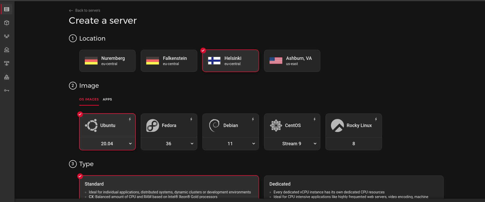

# Deploy Fleet on Hetzner Cloud

> **Archived.** While still usable, this guide has not been updated recently. See the [Deploy Fleet](https://fleetdm.com/docs/deploy/deploy-fleet) docs for supported deployment methods.


Learn how to deploy Fleet on Hetzner Cloud using cloud-init and Docker. [Hetzner](https://hetzner.com) is a great price-performance provider for “root” (dedicated) and Virtual Private Servers (VPS), offering high performance and generous bandwidth.

## The 2 minute setup

For those who want to get started quickly, copy and paste the following two scripts into cloud-init User-Data. Alternatively, the more adventurous can follow the [full deployment guide](#the-full-deployment-guide).

### Fleet

Copy and paste the following script into cloud-init User-Data for the Fleet controller machine, replacing `FLEET_DOMAIN` with your Fleet machine TLD:

```bash
#!/usr/bin/bash

# DONT FORGET: Replace the line below with your fleet machine TLD
export FLEET_DOMAIN=fleet.domain.tld

#######
# DNS #
#######

# Set up DNS resolution
sed -i /etc/systemd/resolved.conf 's/^#DNS=$/DNS=1.1.1.1 9.9.9.9 8.8.8.8/'
systemctl restart systemd-resolved

#######
# APT #
#######

# Update Apt
sudo apt update
sudo apt install -y ca-certificates curl gnupg lsb-release

############
# Firewall #
############

apt install ufw
ufw deny all

ufw allow ssh
ufw allow http
ufw allow https

ufw enable

############
# Fail2Ban #
############

apt install fail2ban

##########
# Docker #
##########

apt install -y ca-certificates curl gnupg lsb-release # these should already be installed

# Set up package repositories for docker
curl -fsSL https://download.docker.com/linux/ubuntu/gpg | gpg --dearmor -o /usr/share/keyrings/docker-archive-keyring.gpg
echo "deb [arch=$(dpkg --print-architecture) signed-by=/usr/share/keyrings/docker-archive-keyring.gpg] https://download.docker.com/linux/ubuntu $(lsb_release -cs) stable" | tee /etc/apt/sources.list.d/docker.list > /dev/null

# Install docker
apt update
apt install -y docker-ce docker-ce-cli containerd.io docker-compose-plugin

docker pull mysql@sha256:134e2d1c7c517d05e5328a77aa5a165a314dc4c4116503e7e089494f4e398ab1 # mysql:8.0.36 as of 2024/07/04

######################
# MySQL (dockerized) #
######################

# mysql:8.0.36 as of 2024/07/04
docker pull mysql@sha256:134e2d1c7c517d05e5328a77aa5a165a314dc4c4116503e7e089494f4e398ab1

# Create the Fleet MySQL data folder
mkdir -p /etc/fleet

# Create ENV that will be used by the docker container
touch /etc/fleet/mysql.env
chmod 600 /etc/fleet/mysql.env
echo "MYSQL_HOST=127.0.0.1" >> /etc/fleet/mysql.env
echo "MYSQL_USER=fleet" >> /etc/fleet/mysql.env
echo "MYSQL_DATABASE=fleet" >> /etc/fleet/mysql.env
cat /dev/urandom | tr -dc 'a-zA-Z0-9' | fold -w 32 | head -n 1 | sed -e 's/^/MYSQL_PASSWORD=/' >> /etc/fleet/mysql.env
cat /dev/urandom | tr -dc 'a-zA-Z0-9' | fold -w 32 | head -n 1 | sed -e 's/^/MYSQL_ROOT_PASSWORD=/' >> /etc/fleet/mysql.env

cat <<EOF > /etc/systemd/system/fleet-mysql.service
[Unit]
Description=Fleet MySQL instance
After=docker.service
Requires=docker.service

[Service]
TimeoutStartSec=0
Restart=always

ExecStartPre=-/usr/bin/docker exec %n stop
ExecStartPre=-/usr/bin/docker rm %n
ExecStartPre=-/usr/bin/docker pull mysql@sha256:134e2d1c7c517d05e5328a77aa5a165a314dc4c4116503e7e089494f4e398ab1

ExecStart=/usr/bin/docker run --rm \
    --name %n \
    -p 127.0.0.1:3306:3306 \
    -v /etc/fleet/mysql:/var/lib/mysql \
    --env-file /etc/fleet/mysql.env \
    mysql@sha256:134e2d1c7c517d05e5328a77aa5a165a314dc4c4116503e7e089494f4e398ab1

ExecStop=/usr/bin/docker stop %n

[Install]
WantedBy=default.target
EOF

systemctl daemon-reload
systemctl enable fleet-mysql
systemctl start fleet-mysql

######################
# Redis (Dockerized) #
######################

docker pull eqalpha/keydb@sha256:18a00f69577105650d829ef44a9716eb4feaa7a5a2bfacd115f0a1e7a97a8726

cat <<EOF > /etc/systemd/system/fleet-redis.service
[Unit]
Description=Fleet Redis instance
After=docker.service
Requires=docker.service

[Service]
TimeoutStartSec=0
Restart=always

ExecStartPre=-/usr/bin/docker exec %n stop
ExecStartPre=-/usr/bin/docker rm %n
# eqalpha/keydb:x86_64_v6.3.0 as of 2022-05-19
ExecStartPre=-/usr/bin/docker pull eqalpha/keydb@sha256:18a00f69577105650d829ef44a9716eb4feaa7a5a2bfacd115f0a1e7a97a8726

ExecStart=/usr/bin/docker run --rm \
    --name %n \
    -p 127.0.0.1:6379:6379 \
    -v /etc/fleet/redis:/var/lib/redis \
    eqalpha/keydb@sha256:18a00f69577105650d829ef44a9716eb4feaa7a5a2bfacd115f0a1e7a97a8726

ExecStop=/usr/bin/docker stop %n

[Install]
WantedBy=default.target
EOF

systemctl daemon-reload
systemctl enable fleet-redis
systemctl start fleet-redis

######################
# Fleet (Dockerized) #
######################

docker pull fleetdm/fleet@sha256:332744f3503dc15fdb65c7b672a09349b2c30fb59a08f9ab4b1bbab94e3ddb5b

mkdir -p /etc/fleet/fleet

# MySQL fleet ENV
bash -c 'source /etc/fleet/mysql.env && echo -e "FLEET_MYSQL_USERNAME=$MYSQL_USER" >> /etc/fleet/fleet.env';
bash -c 'source /etc/fleet/mysql.env && echo -e "FLEET_MYSQL_PASSWORD=$MYSQL_PASSWORD" >> /etc/fleet/fleet.env';
echo 'FLEET_MYSQL_DATABASE=fleet' >> /etc/fleet/fleet.env

# Other fleet ENV vars
echo 'FLEET_SERVER_ADDRESS=127.0.0.1:8080' >> /etc/fleet/fleet.env
echo 'FLEET_MYSQL_ADDRESS=localhost:3306' >> /etc/fleet/fleet.env
echo 'FLEET_REDIS_ADDRESS=localhost:6379' >> /etc/fleet/fleet.env
echo 'FLEET_SERVER_TLS=false' >> /etc/fleet/fleet.env

cat <<EOF > /etc/systemd/system/fleet.service
[Unit]
Description=Fleet
After=docker.service
Requires=docker.service

[Service]
TimeoutStartSec=0
Restart=always
ExecStartPre=-/usr/bin/docker exec %n stop
ExecStartPre=-/usr/bin/docker rm %n
ExecStartPre=-/usr/bin/docker pull fleetdm/fleet@sha256:332744f3503dc15fdb65c7b672a09349b2c30fb59a08f9ab4b1bbab94e3ddb5b

ExecStartPre=/usr/bin/docker run --rm \
    --name fleet-prepare-db \
    --net=host \
    --env-file=/etc/fleet/fleet.env \
    fleetdm/fleet@sha256:332744f3503dc15fdb65c7b672a09349b2c30fb59a08f9ab4b1bbab94e3ddb5b \
    /usr/bin/fleet prepare db --no-prompt --logging_debug

ExecStart=/usr/bin/docker run --rm \
    --name %n \
    --net=host \
    -p 127.0.0.1:8080:8080 \
    --env-file=/etc/fleet/fleet.env \
    fleetdm/fleet@sha256:332744f3503dc15fdb65c7b672a09349b2c30fb59a08f9ab4b1bbab94e3ddb5b \
    /usr/bin/fleet serve

[Install]
WantedBy=default.target
EOF

systemctl daemon-reload
systemctl enable fleet
systemctl start fleet

######################
# Caddy (Dockerized) #
######################

mkdir -p /etc/fleet/caddy;
touch /etc/fleet/caddy.env;
chmod 600 /etc/fleet/caddy.env;
echo -e "FLEET_DOMAIN=${FLEET_DOMAIN}" >> /etc/fleet/caddy.env; # Replace this with your domain!

cat <<EOF > /etc/fleet/caddy/Caddyfile
{\$FLEET_DOMAIN}

reverse_proxy 127.0.0.1:8080
EOF

docker pull caddy@sha256:6e62b63d4d7a4826f9e93c904a0e5b886a8bea2234b6569e300924282a2e8e6c

cat <<EOF > /etc/systemd/system/fleet-caddy.service
[Unit]
Description=Fleet Caddy instance
After=docker.service
Requires=docker.service

[Service]
TimeoutStartSec=0
Restart=always
EnvironmentFile=/etc/fleet/caddy.env
ExecStartPre=-/usr/bin/docker exec %n stop
ExecStartPre=-/usr/bin/docker rm %n
# caddy:2.5.1-alpine as of 2022-05-20
ExecStartPre=-/usr/bin/docker pull caddy@sha256:6e62b63d4d7a4826f9e93c904a0e5b886a8bea2234b6569e300924282a2e8e6c
ExecStart=/usr/bin/docker run --rm \
    --name %n \
    --env-file=/etc/fleet/caddy.env \
    --net=host \
    -v /etc/fleet/caddy/Caddyfile:/etc/caddy/Caddyfile \
    -v /etc/fleet/caddy/data:/data \
    -v /etc/fleet/caddy/config:/config \
    caddy@sha256:6e62b63d4d7a4826f9e93c904a0e5b886a8bea2234b6569e300924282a2e8e6c

[Install]
WantedBy=default.target
EOF

systemctl daemon-reload
systemctl enable fleet-caddy
systemctl start fleet-caddy
```

### Host

Copy and paste the script below into cloud-init User-Data for your hosts (which run `osqueryd` and workloads).

> The Fleet version number in the script can be swapped for the latest.

```bash
#!/usr/bin/bash
#######
# DNS #
#######

# Set up DNS resolution
sed -i /etc/systemd/resolved.conf 's/^#DNS=$/DNS=1.1.1.1 9.9.9.9 8.8.8.8/'
systemctl restart systemd-resolved

#######
# APT #
#######

# Update Apt
sudo apt update
sudo apt install -y ca-certificates curl gnupg lsb-release

############
# Firewall #
############

apt install ufw
ufw deny all

ufw allow ssh
ufw allow http
ufw allow https

ufw enable

############
# Fail2Ban #
############

apt install fail2ban

############
# fleetctl #
############

wget https://github.com/fleetdm/fleet/releases/download/fleet-v4.15.0/fleetctl_v4.15.0_linux.tar.gz
echo "cd50f058724cdde07edcc3cf89c83e9c5cd91ca41974ea470ae660cb50dd04a1 fleetctl_v4.15.0_linux.tar.gz" | sha256sum -c

tar --extract --file=fleetctl_v4.15.0_linux.tar.gz fleetctl_v4.15.0_linux/fleetctl
mv fleetctl_v4.15.0_linux/fleetctl /usr/bin/fleetctl

##########################
# Machine Workload Setup #
##########################

### Your normal node setup goes here


### (after the Fleet instance is running, you'll get a command like the one below to run on hosts)
### $ fleetctl package --type=deb --fleet-url=https://fleet.vadosware.io --enroll-secret=xxxxxxxxxxxxxxxxxxxxxxxxxxxxxxxx
### (Running the command above produces a .DEB package you can install like the example below)
### $ apt install /root/fleet-osquery_0.0.13_amd64.deb
### (After this, you should be able to see your new machine on the fleet instance! 🎉)
```

---

## The full deployment guide

For the more adventurous, here are the complete instructions for deploying Fleet on Hetzner with cloud-init and Docker from scratch.

## Prerequisites

To follow this guide, you’ll need:

- An [account with Hetzner](https://accounts.hetzner.com/signUp)
- A practical understanding of [Cloud-init](https://cloudinit.readthedocs.io/), the multi-distribution method for cross platform cloud instance initialization.
- A practical understanding of cloud-init [User-Data](https://cloudinit.readthedocs.io/en/latest/topics/format.html)
- A practical understanding of [Docker](https://docs.docker.com/) (or any other container runtime of your choice)

## Get a machine from Hetzner

First, purchase a machine (for example, a [Hetzner Cloud](https://hetzner.com/cloud) instance):


_Hetzner cloud purchase machine screen_

After purchasing, you should know the IP address of your machine (and make sure you set up things like SSH [securely](https://community.hetzner.com/tutorials/securing-ssh)!)

---

## DNS

### For your domain

This would be a great time to set up `A`/`AAAA` records for your Fleet controller instance – something like `fleet.domain.tld` should work (ex. `fleet.yoursite.com`).

### On the machine

Now that we have our machine, we’ll want to allow DNS queries to DNS resolvers other than Hetzner:

```sh
sed -i /etc/systemd/resolved.conf 's/^#DNS=$/DNS=1.1.1.1 9.9.9.9 8.8.8.8/'
systemctl restart systemd-resolved
```

This will ensure that external DNS can be reached through a means _other_ than by Hetzner default DNS nameservers.

### Set up APT

Let’s get our machine up to date and install some packages we’ll need later

```sh
# Update Apt
sudo apt update
sudo apt install -y ca-certificates curl gnupg lsb-release
```

### Set up a firewall

To ensure we do not expose services accidentally, we'll install [UncomplicatedFirewall](https://wiki.ubuntu.com/UncomplicatedFirewall), also known as ufw, to block all inbound traffic by default and then allow the protocols we need.

```sh
apt install ufw
ufw deny all

ufw allow ssh
ufw allow http
ufw allow https

ufw enable
```

---

## Docker

Before we can get started, let’s install [Docker](https://docs.docker.com/) to manage our workloads. Other container runtimes would work, but Docker is pretty well known, robust, and uses [Containerd](https://containerd.io) underneath anyway, so let’s use that:


```sh
sudo apt install -y ca-certificates curl gnupg lsb-release # these should already be installed

# Set up package repositories for docker
$ curl -fsSL https://download.docker.com/linux/ubuntu/gpg | sudo gpg --dearmor -o /usr/share/keyrings/docker-archive-keyring.gpg
$ echo \
  "deb [arch=$(dpkg --print-architecture) signed-by=/usr/share/keyrings/docker-archive-keyring.gpg] https://download.docker.com/linux/ubuntu \
  $(lsb_release -cs) stable" | sudo tee /etc/apt/sources.list.d/docker.list > /dev/null

# Install docker
$ sudo apt update
$ sudo apt install -y docker-ce docker-ce-cli containerd.io docker-compose-plugin
```

>NOTE: This is a UserData script, so we don’t have to worry about removing previous existing versions!
>See the [official Docker Ubuntu install documentation](https://docs.docker.com/engine/install/ubuntu/#install-using-the-repository) for more details.

---

## MySQL

Fleet uses [MySQL](https://www.mysql.com/) as its primary data store, so first, we’ll have to set up MySQL.

To run MySQL, we’ll have to do the following:


### Pull the MySQL container

We can pull the [official MySQL docker image](https://hub.docker.com/_/mysql) like so:

```sh
$ docker pull mysql@sha256:134e2d1c7c517d05e5328a77aa5a165a314dc4c4116503e7e089494f4e398ab1 # mysql:8.0.36 as of 2024/07/04
```

### Create & enable a systemd unit for MySQL

[systemd](https://systemd.io) has become the defacto systems manager for most distros, and as such, we’ll be setting up a [systemd unit](https://www.freedesktop.org/software/systemd/man/systemd.unit.html) to ensure MySQL is started automatically.

First we’ll set up our credentials:

```sh
# Create the Fleet MySQL data folder
mkdir -p /etc/fleet

# Create ENV that will be used by the docker container
touch /etc/fleet/mysql.env
chmod 600 /etc/fleet/mysql.env
echo "MYSQL_HOST=127.0.0.1" >> /etc/fleet/mysql.env
echo "MYSQL_USER=fleet" >> /etc/fleet/mysql.env
echo "MYSQL_DATABASE=fleet" >> /etc/fleet/mysql.env
cat /dev/urandom | tr -dc 'a-zA-Z0-9' | fold -w 32 | head -n 1 | sed -e 's/^/MYSQL_PASSWORD=/' >> /etc/fleet/mysql.env
cat /dev/urandom | tr -dc 'a-zA-Z0-9' | fold -w 32 | head -n 1 | sed -e 's/^/MYSQL_ROOT_PASSWORD=/' >> /etc/fleet/mysql.env
```

And then we’ll create the actual unit that reads this config

```systemd
[Unit]
Description=Fleet MySQL instance
After=docker.service
Requires=docker.service

[Service]
TimeoutStartSec=0
Restart=always

ExecStartPre=-/usr/bin/docker exec %n stop
ExecStartPre=-/usr/bin/docker rm %n
ExecStartPre=-/usr/bin/docker pull mysql@sha256:134e2d1c7c517d05e5328a77aa5a165a314dc4c4116503e7e089494f4e398ab1

ExecStart=/usr/bin/docker run --rm \
    --name %n \
    -p 127.0.0.1:3306:3306 \
    -v /etc/fleet/mysql:/var/lib/mysql \
    --env-file /etc/fleet/mysql.env \
    mysql@sha256:134e2d1c7c517d05e5328a77aa5a165a314dc4c4116503e7e089494f4e398ab1

ExecStop=/usr/bin/docker stop %n

[Install]
WantedBy=default.target
```

We’ll save this content to `/etc/systemd/system/fleet-mysql.service`, and refresh `systemd`:

```sh
$ systemctl daemon-reload
$ systemctl enable fleet-mysql
```

---

## Redis

Fleet uses [Redis](https://redis.io/) as its primary caching solution, so we’ll need to set up Redis as well. While “vanilla” Redis is a great choice, a recent entrant to the space is [KeyDB](https://keydb.dev/), an alternative multi-threaded implementation of Redis.

### Pull the ~~Redis~~ KeyDB Docker container

We can pull the [KeyDB docker image](https://hub.docker.com/r/eqalpha/keydb) like so:

```sh
$ docker pull eqalpha/keydb@sha256:18a00f69577105650d829ef44a9716eb4feaa7a5a2bfacd115f0a1e7a97a8726 # x86_64_v6.3.0 as of 2022/05/19
```

### Create and enable a Redis systemd service

Similarly to MySQL, a systemd service can be created for our redis-equivalent service as well.


```systemd
[Unit]
Description=Fleet Redis instance
After=docker.service
Requires=docker.service

[Service]
TimeoutStartSec=0
Restart=always

ExecStartPre=-/usr/bin/docker exec %n stop
ExecStartPre=-/usr/bin/docker rm %n
ExecStartPre=-/usr/bin/docker pull eqalpha/keydb@sha256:18a00f69577105650d829ef44a9716eb4feaa7a5a2bfacd115f0a1e7a97a8726 # eqalpha/keydb:x86_64_v6.3.0 as of 2022-05-19

ExecStart=/usr/bin/docker run --rm \
    --name %n \
    -p 127.0.0.1:6379:6379 \
    -v /etc/fleet/redis:/var/lib/redis \
    eqalpha/keydb@sha256:18a00f69577105650d829ef44a9716eb4feaa7a5a2bfacd115f0a1e7a97a8726

ExecStop=/usr/bin/docker stop %n

[Install]
WantedBy=default.target
```

We’ll save this content to `/etc/systemd/system/fleet-redis.service`. And just like MySQL we’ll `daemon-reload` and `enable`:

```sh
systemctl daemon-reload
systemctl enable fleet-redis
```

---

## Fleet

We’re finally at the main course – time to install Fleet!

### Pull the Fleet docker container

We can pull the [Fleet docker image](https://hub.docker.com/r/fleetdm/fleet) like so:

```sh
$ docker pull fleetdm/fleet@sha256:332744f3503dc15fdb65c7b672a09349b2c30fb59a08f9ab4b1bbab94e3ddb5b
```

The [Fleet v4.15.0](https://github.com/fleetdm/fleet/releases/tag/fleet-v4.15.0) release can be found [in DockerHub](https://hub.docker.com/r/fleetdm/fleet/tags?page=1&name=v4.15.0).

### Create and enable the Fleet systemd service

First, we’ll get our Fleet ENV vars in place:

```sh
mkdir -p /etc/fleet/fleet

# MySQL fleet ENV
bash -c 'source /etc/fleet/mysql.env && echo -e "FLEET_MYSQL_USERNAME=$MYSQL_USER" >> /etc/fleet/fleet.env';
bash -c 'source /etc/fleet/mysql.env && echo -e "FLEET_MYSQL_PASSWORD=$MYSQL_PASSWORD" >> /etc/fleet/fleet.env';
echo 'FLEET_MYSQL_DATABASE=fleet' >> /etc/fleet/fleet.env

# Other fleet ENV vars
echo 'FLEET_SERVER_ADDRESS=127.0.0.1:8080' >> /etc/fleet/fleet.env
echo 'FLEET_MYSQL_ADDRESS=localhost:3306' >> /etc/fleet/fleet.env
echo 'FLEET_REDIS_ADDRESS=localhost:6379' >> /etc/fleet/fleet.env
echo 'FLEET_SERVER_TLS=false' >> /etc/fleet/fleet.env
```

We can set up Fleet to run like so:

```systemd
[Unit]
Description=Fleet
After=docker.service
Requires=docker.service

[Service]
TimeoutStartSec=0
Restart=always
ExecStartPre=-/usr/bin/docker exec %n stop
ExecStartPre=-/usr/bin/docker rm %n
ExecStartPre=-/usr/bin/docker pull fleetdm/fleet@sha256:332744f3503dc15fdb65c7b672a09349b2c30fb59a08f9ab4b1bbab94e3ddb5b

ExecStartPre=/usr/bin/docker run --rm \
    --name fleet-prepare-db \
    --net=host \
    --env-file=/etc/fleet/fleet.env \
    fleetdm/fleet@sha256:332744f3503dc15fdb65c7b672a09349b2c30fb59a08f9ab4b1bbab94e3ddb5b \
    /usr/bin/fleet prepare db --no-prompt --logging_debug

ExecStart=/usr/bin/docker run --rm \
    --name %n \
    --net=host \
    --env-file=/etc/fleet/fleet.env \
    fleetdm/fleet@sha256:332744f3503dc15fdb65c7b672a09349b2c30fb59a08f9ab4b1bbab94e3ddb5b \
    /usr/bin/fleet serve

[Install]
WantedBy=default.target
```

---

## (Optional) Caddy for automatic HTTPS

To have access to your Fleet instance from far away, we’ll set up a TLS-terminating load balancer like [Caddy](https://caddyserver.com/docs) to do the heavy lifting for us.

Luckily, Caddy supports automatic HTTPS certificate retrieval via [LetsEncrypt](https://letsencrypt.org/), so it will make things easier.

First, let’s write our domain as a configuration that systemd can use at `/etc/fleet/caddy.env`:

```sh
mkdir -p /etc/fleet/caddy;
touch /etc/fleet/caddy.env;
chmod 600 /etc/fleet/caddy.env;
echo "FLEET_DOMAIN=fleet.domain.tld" >> /etc/fleet/caddy.env; # Replace this with your domain!
```

Assuming you have a domain like `fleet.domain.tld` already purchased and set up; we can get external-reachability for our cluster with Caddy by first writing a `Caddyfile`:

```
{$FLEET_DOMAIN}

reverse_proxy 127.0.0.1:8080
```

After saving that simple `Caddyfile` at `/etc/fleet/caddy/Caddyfile`, we can do our usual `docker pull`ing:

```sh
$ docker pull caddy@sha256:6e62b63d4d7a4826f9e93c904a0e5b886a8bea2234b6569e300924282a2e8e6c
```

Here’s a systemd service:

```systemd
[Unit]
Description=Fleet Caddy instance
After=docker.service
Requires=docker.service

[Service]
TimeoutStartSec=0
Restart=always
EnvironmentFile=/etc/fleet/caddy.env
ExecStartPre=-/usr/bin/docker exec %n stop
ExecStartPre=-/usr/bin/docker rm %n
ExecStartPre=-/usr/bin/docker pull caddysha@256:6e62b63d4d7a4826f9e93c904a0e5b886a8bea2234b6569e300924282a2e8e6c # caddy:2.5.1-alpine as of 2022-05-20
ExecStart=/usr/bin/docker run --rm \
    --name %n \
    --env-file=/etc/fleet/caddy.env \
    -p 80:80 \
    -p 443:443 \
    -v /etc/fleet/caddy/Caddyfile:/etc/caddy/Caddyfile \
    -v /etc/fleet/caddy/data:/data \
    -v /etc/fleet/caddy/config:/config \
    caddy@sha256:6e62b63d4d7a4826f9e93c904a0e5b886a8bea2234b6569e300924282a2e8e6c

[Install]
WantedBy=default.target
```

>NOTE: if you choose not to use Caddy, you’ll have to generate self-signed certs or use another method.

At this point you should be able to go to your domain (ex. `https://fleet.domain.tld`) and access Fleet 🎉!

---

## How long does it take?

The User Data script takes around 100 seconds to run: \

```
Cloud-init v. 22.1-14-g2e17a0d6-0ubuntu1~20.04.3 running 'modules:final' at Thu, 02 Jun 2022 07:22:35 +0000. Up 12.99 seconds.
Cloud-init v. 22.1-14-g2e17a0d6-0ubuntu1~20.04.3 finished at Thu, 02 Jun 2022 07:23:58 +0000. Datasource DataSourceHetzner. Up 94.87 seconds
```

---

## Set up Fleet and enroll hosts

Now that Fleet is running, visit your Fleet dashboard (i.e., `https://fleet.domain.tld`) and enter your name, email and password. You should now see the empty hosts page. To start enrolling hosts into Fleet, check out [Adding hosts](https://fleetdm.com/docs/using-fleet/adding-hosts).

---

## What's next?

Now that you’re ready to use Fleet and have a host installed. Here's some next steps:

- Take some time to get acclimatized to Fleet. [Learn how to use Fleet](https://fleetdm.com/docs/using-fleet/learn-how-to-use-fleet) and [Fleet UI](https://fleetdm.com/docs/using-fleet/fleet-ui) are both great places to start.
- Import Fleet's [standard query library](https://fleetdm.com/docs/using-fleet/standard-query-library) to start asking questions about your hosts.
- To run a more secure setup, consider creating a dedicated `fleet` user with Docker's support for user [namespaces](https://docs.docker.com/engine/security/userns-remap/). 


<meta name="articleTitle" value="Deploy Fleet on Hetzner Cloud">
<meta name="authorGitHubUsername" value="ksatter">
<meta name="authorFullName" value="Kathy Satterlee">
<meta name="publishedOn" value="2022-06-27">
<meta name="category" value="guides">
<meta name="articleImageUrl" value="../website/assets/images/articles/deploy-fleet-on-hetzner-cloud-800x450@2x.png">
<meta name="description" value="Learn how to deploy Fleet on Hetzner Cloud using cloud-init and Docker.">
