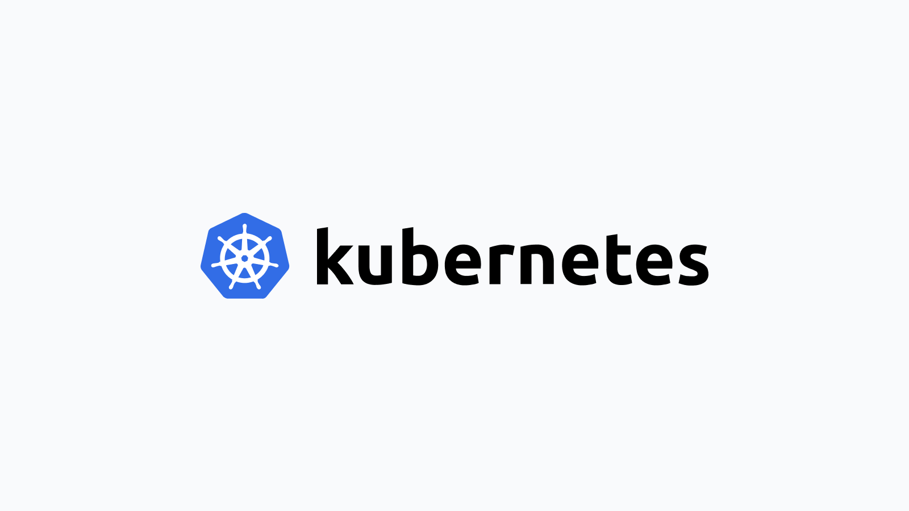

# Deploy Fleet on Kubernetes

> **Archived.** While still usable, this guide has not been updated recently. See the [Deploy Fleet](https://fleetdm.com/docs/deploy/deploy-fleet) docs for supported deployment methods.



> Updated on May 10, 2022, by [Kelvin Oghenerhoro Omereshone](https://github.com/DominusKelvin).

In this guide, we will focus on deploying Fleet only on a Kubernetes cluster. Kubernetes is a container orchestration tool that was open sourced by Google in 2014.

There are 2 primary ways to deploy the Fleet server to a Kubernetes cluster. The first is via `kubectl` with a `deployment.yml` file. The second is using Helm, the Kubernetes Package Manager.

## Deploying Fleet with kubectl

We will assume you have `kubectl` and MySQL and Redis are all set up and running. Optionally you have minikube to test your deployment locally on your machine.

To deploy the Fleet server and connect to its dependencies (MySQL and Redis), we will use [Fleet's best practice `fleet-deployment.yml` file](https://github.com/fleetdm/fleet/blob/main/docs/Deploy/_kubernetes/fleet-deployment.yml).

Let's tell Kubernetes to create the cluster by running the below command.

`kubectl apply -f ./fleet-deployment.yml`

## Initializing Helm

If you have not used Helm before, you must run the following to initialize your cluster prior to installing Fleet:

```sh
helm init
```

> Note: The helm init command has been removed in Helm v3. It performed two primary functions. First, it installed Tiller which is no longer needed. Second, it set up directories and repositories where Helm configuration lived. This is now automated in Helm v3; if the directory is not present it will be created.

## Deploying Fleet with Helm

To configure preferences for Fleet for use in Helm, including secret names, MySQL and Redis hostnames, and TLS certificates, download the [values.yaml](https://raw.githubusercontent.com/fleetdm/fleet/main/charts/fleet/values.yaml) and change the settings to match your configuration.

Please note you will need all dependencies configured prior to installing the Fleet Helm Chart as it will try and run database migrations immediately.

Once you have those configured, run the following:

```sh
helm upgrade --install fleet fleet \
  --repo https://fleetdm.github.io/fleet/charts \
  --values values.yaml
```

The Fleet Helm Chart [README.md](https://github.com/fleetdm/fleet/blob/main/charts/fleet/README.md) also includes an example using namespaces, which is outside the scope of the examples below.

## Installing infrastructure dependencies with Helm

For the sake of this tutorial, we will again use Helm, this time to install MySQL and Redis.

### MySQL

The MySQL that we will use for this tutorial is not replicated and it is not Highly Available. If you're deploying Fleet on a Kubernetes managed by a cloud provider (GCP, Azure, AWS, etc), I suggest using their MySQL product if possible as running HA MySQL in Kubernetes can be difficult. To make this tutorial cloud provider agnostic however, we will use a non-replicated instance of MySQL.

To install MySQL from Helm, run the following command. Note that there are some options that need to be defined:

- There should be a `fleet` database created
- The default user's username should be `fleet`

Helm v2
```sh
helm install \
  --name fleet-database \
  --set auth.username=fleet,auth.database=fleet \
  oci://registry-1.docker.io/bitnamicharts/mysql
```

Helm v3
```sh
helm install fleet-database \
  --set auth.username=fleet,auth.database=fleet \
  oci://registry-1.docker.io/bitnamicharts/mysql 
```

This helm package will create a Kubernetes `Service` which exposes the MySQL server to the rest of the cluster on the following DNS address:

```
fleet-database-mysql:3306
```

We will use this address when we configure the Kubernetes deployment and database migration job, but if you're not using a Helm-installed MySQL in your deployment, you'll have to change this in your Kubernetes config files. For the Fleet Helm Chart, this will be used in the `values.yaml`.

#### Database migrations

Note: this step is not neccessary when using the Fleet Helm Chart as it handles migrations automatically.

The last step is to run the Fleet database migrations on your new MySQL server. To do this, run the following:

```sh
kubectl create -f ./docs/Deploy/_kubernetes/fleet-migrations.yml
```

In Kubernetes, you can only run a job once. If you'd like to run it again (i.e.: you'd like to run the migrations again using the same file), you must delete the job before re-creating it. To delete the job and re-run it, you can run the following commands:

```sh
kubectl delete -f ./docs/Deploy/_kubernetes/fleet-migrations.yml
kubectl create -f ./docs/Deploy/_kubernetes/fleet-migrations.yml
```

### Redis

Helm v2
```sh
helm install \
  --name fleet-cache \
  --set persistence.enabled=false \
  oci://registry-1.docker.io/bitnamicharts/redis
```

Helm v3
```sh
helm install fleet-cache \
  --set persistence.enabled=false \
  oci://registry-1.docker.io/bitnamicharts/redis
```

This helm package will create a Kubernetes `Service` which exposes the Redis server to the rest of the cluster on the following DNS address:

```
fleet-cache-redis:6379
```

We will use this address when we configure the Kubernetes deployment, but if you're not using a Helm-installed Redis in your deployment, you'll have to change this in your Kubernetes config files. If you are using the Fleet Helm Chart, this will also be used in the `values.yaml` file.

## Setting up and installing Fleet

> **A note on container versions**
>
> The Kubernetes files referenced by this tutorial use the Fleet container tagged at `1.0.5`. The tag is something that should be consistent across the migration job and the deployment specification. If you use these files, I suggest creating a workflow that allows you templatize the value of this tag. For further reading on this topic, see the [Kubernetes documentation](https://kubernetes.io/docs/concepts/configuration/overview/#container-images).

### Create server secrets

It should be noted that by default Kubernetes stores secret data in plaintext in etcd. Using an alternative secret storage mechanism is outside the scope of this tutorial, but let this serve as a reminder to secure the storage of your secrets.

#### TLS certificate & key

Consider using Lets Encrypt to easily generate your TLS certificate. For examples on using `lego`, the command-line Let's Encrypt client, see the [documentation](https://github.com/xenolf/lego#cli-example). Consider the following example, which may be useful if you're a GCP user:

```sh
GCE_PROJECT="acme-gcp-project" GCE_DOMAIN="acme-co" \
  lego --email="username@acme.co" \
    -x "http-01" \
    -x "tls-sni-01" \
    --domains="fleet.acme.co" \
    --dns="gcloud" --accept-tos run
```

If you're going the route of a more traditional CA-signed certificate, you'll have to generate a TLS key and a CSR (certificate signing request):

```sh
openssl req -new -newkey rsa:2048 -nodes -keyout tls.key -out tls.csr
```

Now you'll have to give this CSR to a Certificate Authority, and they will give you a file called `tls.crt`. We will then have to add the key and certificate as Kubernetes secrets.

```sh
kubectl create secret tls fleet-tls --key=./tls.key --cert=./tls.crt
```

### Deploying Fleet

First we must deploy the instances of the Fleet webserver. The Fleet webserver is described using a Kubernetes deployment object. To create this deployment, run the following:

```sh
kubectl apply -f ./docs/Deploy/_kubernetes/fleet-deployment.yml
```

You should be able to get an instance of the webserver running via `kubectl get pods` and you should see the following logs:

```sh
kubectl logs fleet-webserver-9bb45dd66-zxnbq
ts=2017-11-16T02:48:38.440578433Z component=service method=ListUsers user=none err=null took=2.350435ms
ts=2017-11-16T02:48:38.441148166Z transport=https address=0.0.0.0:443 msg=listening
```

### Deploying the load balancer

Now that the Fleet server is running on our cluster, we have to expose the Fleet webservers to the internet via a load balancer. To create a Kubernetes `Service` of type `LoadBalancer`, run the following:

```sh
kubectl apply -f ./docs/Deploy/_kubernetes/fleet-service.yml
```

### Configure DNS

Finally, we must configure a DNS address for the external IP address that we now have for the Fleet load balancer. Run the following to show some high-level information about the service:

```sh
kubectl get services fleet-loadbalancer
```

In this output, you should see an "EXTERNAL-IP" column. If this column says `<pending>`, then give it a few minutes. Sometimes acquiring a public IP address can take a moment.

Once you have the public IP address for the load balancer, create an A record in your DNS server of choice. You should now be able to browse to your Fleet server from the internet!

<meta name="articleTitle" value="Deploy Fleet on Kubernetes">
<meta name="authorGitHubUsername" value="marpaia">
<meta name="authorFullName" value="Mike Arpaia">
<meta name="publishedOn" value="2017-11-18">
<meta name="category" value="guides">
<meta name="articleImageUrl" value="../website/assets/images/articles/deploy-fleet-on-kubernetes-800x450@2x.png">
<meta name="description" value="Learn how to deploy Fleet on Kubernetes.">
