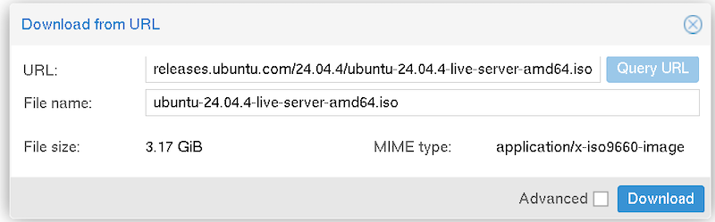
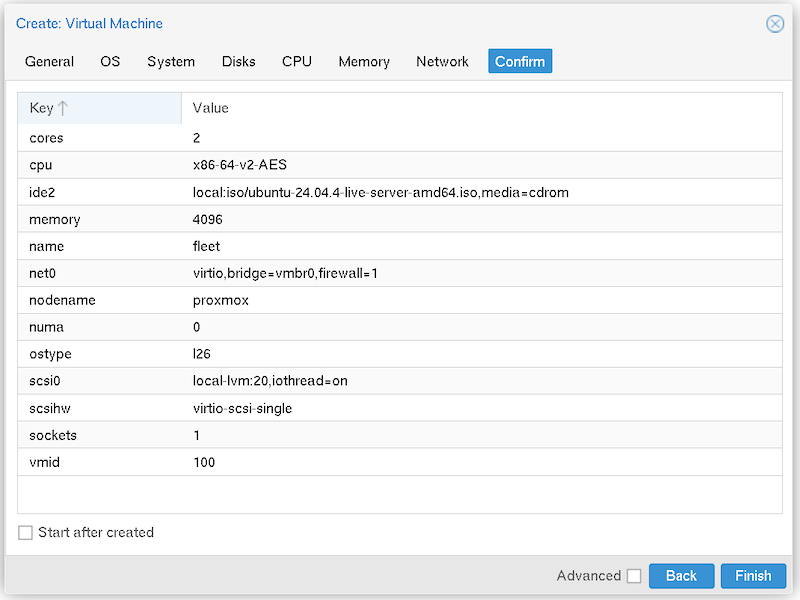

# Deploy Fleet on Proxmox

[Proxmox](https://www.proxmox.com/en/) is an open source virtualization platform that is widely adopted for on-premises and private cloud virtualization. Many organizations have adopted Proxmox due to cost and licensing changes with other virtualization platforms.

This tutorial describes how to deploy the Fleet server on Proxmox using Ubuntu and Docker. The configuration uses a self-signed certificate and is appropriate for a small deployment, evaluation, or lab environment. The same concepts used in this tutorial can be applied to larger deployments using additional VMs for scale.

Deploying Fleet on Proxmox requires 5 steps:

1. Deploy a Proxmox Virtual Machine
2. Install Ubuntu
3. Install Docker
4. Deploy Fleet using Docker Compose
5. Complete the Fleet Setup Wizard

The following sections take you through each step, with all necessary screenshots and commands. While the nuances in your environment might be slightly different, you should be able to follow along to build a complete Fleet installation.

## Prerequisites

You will need the following to complete this installation tutorial:

- A running **Proxmox VE host** (version 7.x or 8.x)
- At least **4 GB RAM** and **2 vCPUs** available to allocate to the Fleet VM
- At least **20 GB of disk space** for the VM
- A **domain name or local DNS entry** pointing to the VM's IP (required for TLS/MDM enrollment)
- Basic familiarity with the Proxmox web UI and Linux command line

Additionally, the Fleet server and clients must be able to communicate over TLS on the default port of 1337.

## Create a virtual machine in Proxmox

The first step is to deploy a virtual machine to host the Fleet server. Fleet can be deployed using Docker Compose, and any Linux distribution with Docker support is acceptable. This tutorial uses an Ubuntu 26.04 server image.

First, upload the ISO to Proxmox by navigating to your desired storage location and selecting **ISO Images > Download from URL**. Specify the URL to an appropriate ISO, such as https://releases.ubuntu.com/24.04.4/ubuntu-24.04.4-live-server-amd64.iso



Next, deploy a new Ubuntu virtual machine with the following parameters:

| **Configuration** | **Minimum Requirement** |
|:---|:---|
| Disks | 20GB disk size |
| CPU | 2 CPU cores |
| Memory | 4GB (4096 MB) |
| Network | The Fleet VM must have outbound Internet connectivity to perform the installation. Clients must also be able to reach the Fleet VM using the default port of 1337. |


Confirm all of the settings and create the VM:


## Install Ubuntu

The initial installation and configuration of Ubuntu will vary according to your needs. Generally, the default installation parameters are acceptable for hosting a Fleet server. The host operating system can be very lightweight, as Fleet is installed in containers using Docker Compose.

First, boot the VM in Proxmox by navigating to the VM and clicking **Console > Start Now**. Use the Ubuntu installer to perform a default installation, and modify any parameters according to your organizational policies. We recommend the default installation parameters with the following considerations:

- Choose an Ubuntu Server (instead of Ubuntu Server minimized) installation.
- Configure a static IP address, unless DHCP reservations are used in your environment.
- Configure the storage layout according to your normal organizational policies. The default configuration using LVM is appropriate, but you may want to adjust partitions according to your preferences.
- We recommend enabling the OpenSSH server with SSH keys for secure remote management.

## Install Docker and Docker Compose

Fleet runs as a set of Docker containers and can be managed using [Docker Compose](https://docs.docker.com/compose/). The operating system may already have Docker in its package repository. However, the best way to get the latest version of Docker is by using the official Docker repositories.

The installation instructions below are accurate for Ubuntu at this time of writing. However, it’s always a good idea to consult the [official installation instructions](https://docs.docker.com/engine/install/ubuntu/) first.

First, update the package manager index and install the prerequisite software for adding the Docker repository:

```bash
sudo apt update
sudo apt install ca-certificates curl
```

Next, add the Docker repository’s public key:

```bash
sudo install -m 0755 -d /etc/apt/keyrings
sudo curl -fsSL https://download.docker.com/linux/ubuntu/gpg -o /etc/apt/keyrings/docker.asc
sudo chmod a+r /etc/apt/keyrings/docker.asc
```

Next, add the repository to the list of apt sources:

```bash
# Add the repository to Apt sources:
sudo tee /etc/apt/sources.list.d/docker.sources <<EOF
Types: deb
URIs: https://download.docker.com/linux/ubuntu
Suites: $(. /etc/os-release && echo "${UBUNTU_CODENAME:-$VERSION_CODENAME}")
Components: stable
Signed-By: /etc/apt/keyrings/docker.asc
EOF
```

The package manager index must be updated once the new repository is in place. Run an update to refresh the index:

```bash
sudo apt update
```

Finally, install Docker and its tooling:

```bash
sudo apt install docker-ce docker-ce-cli containerd.io docker-buildx-plugin docker-compose-plugin
```

Verify that Docker has been installed and configured correctly by running the “hello-world” container:

```bash
sudo docker run hello-world
```

Your output should look similar to the output below:

```bash
sudo docker run hello-world
Unable to find image 'hello-world:latest' locally
latest: Pulling from library/hello-world
17eec7bbc9d7: Pull complete
ea52d2000f90: Download complete
Digest: sha256:85404b3c53951c3ff5d40de0972b1bb21fafa2e8daa235355baf44f33db9dbdd
Status: Downloaded newer image for hello-world:latest

Hello from Docker!
This message shows that your installation appears to be working correctly.
```

## Deploy Fleet using Docker Compose

Fleet is hosted using a set of Docker containers deployed with Docker Compose. This makes it easy to manage your Fleet deployment without worrying about host-level package dependencies and configuration. Deploying Fleet using Docker Compose is simple and fast.

### Set up the Fleet Docker Compose environment

First, set up a directory to store the Docker Compose file and Fleet configuration. This example uses `/opt/fleet-deployment`, but you can use any directory that makes sense for your environment:

```bash
sudo mkdir /opt/fleet-deployment
cd /opt/fleet-deployment/
```

### Download the official configuration files

Download the Docker Compose file and the sample environment variable file:

```bash
sudo curl -O https://raw.githubusercontent.com/fleetdm/fleet/refs/heads/main/docs/solutions/docker-compose/docker-compose.yml

sudo curl -O https://raw.githubusercontent.com/fleetdm/fleet/refs/heads/main/docs/solutions/docker-compose/env.example
```

### Configure your environment

Copy the sample environment file to a .env file that can be automatically loaded by Docker Compose. You will use this file to customize your Fleet configuration in the next steps.

```bash
sudo cp env.example .env
```

Generate a random password for the Fleet server private key using openssl:

```bash
openssl rand -base64 32
```

The openssl command generates a long string and will produce output similar to the output below:

```bash
fleet@fleet:~$ openssl rand -base64 32
qqM+mPLALkc4Uc+cTifMoBQKmmrt2rhcUe85klaPif0=
```

The .env file is used to customize Fleet’s configuration. There are several options in this file, along with comments about their purpose. You can use the default values for most configuration parameters. However, some environment variables must be configured to initially deploy Fleet:

| **Environment Variable** | **Value** |
| :---- | :---- |
| MYSQL\_ROOT\_PASSWORD | A root password for the MySQL database. This root password will be set when Docker creates the MySQL container. Make sure this password meets your organization’s password complexity requirements. |
| MYSQL\_PASSWORD=SecurePassword123 | A password for the “fleet’ user in the MySQL database. This password will be set when Docker creates the MySQL container. Make sure this password meets your organization’s password complexity requirements. |
| FLEET\_SERVER\_PRIVATE\_KEY  | The private key used by the Fleet server. This should be the output of the previous openssl command. |
| FLEET\_LICENSE\_KEY | A license key for Fleet Premium. This is an **optional** field, and you can leave it blank to use [Fleet’s free tier](https://fleetdm.com/try-fleet). |

Edit the .env file using your preferred editor, such as vim. Sample values are shown below, but you should customize these for your environment.

```ini
# MySQL Configuration
MYSQL_ROOT_PASSWORD=SecureRootPassword123
MYSQL_DATABASE=fleet
MYSQL_USER=fleet
MYSQL_PASSWORD=SecurePassword123

# Fleet Server Configuration
# Generate a random key with: openssl rand -base64 32
FLEET_SERVER_PRIVATE_KEY=qqM+mPLALkc4Uc+cTifMoBQKmmrt2rhcUe85klaPif0=
```

### Configure Fleet certificates

Certificates are a crucial part of securing the connection between the Fleet server and its clients. You must provide the Fleet installation with a certificate for the Fleet server to use. This tutorial uses a self-signed certificate, which is appropriate for demo and evaluation environments.

For more information about the way certificates are handled in Fleet, please see the following documentation: https://fleetdm.com/guides/certificates-in-fleetd

First, create a directory to store the certificate and private key:

```bash
sudo mkdir certs
```

Next, generate a certificate and private key. You must customize the CN and subjectAltName fields to use the fully-qualified domain name (FQDN) and IP address of your Fleet installation. Configuring the subjectAltName field is particularly important, as the CN field is used only for legacy purposes and will not enable successful certificate validation on its own.

```bash
sudo openssl req -x509 -nodes -days 365 -newkey rsa:2048 \
  -keyout certs/fleet.key \
  -out certs/fleet.crt \
  -subj "/CN=fleet.example.com" \
  -addext "subjectAltName=DNS:localhost,DNS:fleet.example.com,IP:127.0.0.1,IP:192.168.122.98"
```

The `fleet` user inside the Docker container must be able to access the certificate and private key. The user inside the container runs as user ID 100 and group ID 101. The default permissions on the certificate and private key will prevent the Fleet user from accessing this file. Adjust the permissions on the certificate and private key accordingly:

```bash
sudo chown 100:101 certs/fleet.*
```

### Run Fleet using Docker Compose

Finally, bring up the Docker compose environment:

```bash
sudo docker compose up -d
```

You can monitor the status of the deployment until all containers are healthy using the following commands:

```bash
sudo docker compose logs
sudo docker compose ps
```

## Complete the Fleet setup wizard

You can configure and use Fleet once all of the Docker containers are healthy and the deployment is online. Navigate to the FQDN or IP address of the Fleet server (e.g., https://fleet.your-domain.com). The installation wizard will automatically display a user setup window and will walk you through all of the steps necessary to set up Fleet.

These steps include:

1. Setting up an initial user and password
2. Providing a name and optional logo for your organization
3. Setting up the Fleet web address
    - This should be set to the fully-qualified domain name (FQDN) of your Fleet server. Clients will use this web address to connect with Fleet

Once you have fully configured Fleet, you will be automatically redirected to the main server dashboard.

## Next steps

Getting started with Fleet on Proxmox is easy, thanks to Fleet’s container-native architecture and support for Docker Compose. In this tutorial, you deployed a Fleet server running inside of an Ubuntu VM on Proxmox, as a simple environment that is appropriate for evaluation. Larger environments should consult the [Fleet Reference Architectures guide](https://fleetdm.com/docs/deploy/reference-architectures) to understand production considerations.

Now that Fleet has been successfully deployed in your Proxmox environment, you can begin [enrolling hosts](https://fleetdm.com/guides/enroll-hosts) and [exploring the rich set of MDM capabilities](https://fleetdm.com/docs/get-started/tutorials-and-guides#further-learning) that Fleet has to offer. 


<meta name="articleTitle" value="Deploy Fleet on Proxmox">
<meta name="authorGitHubUsername" value="acritelli">
<meta name="authorFullName" value="Anthony Critelli">
<meta name="publishedOn" value="2026-04-06">
<meta name="category" value="guides">
<meta name="description" value="Deploy Fleet on Proxmox using Ubuntu and Docker Compose. Step-by-step guide for lab, evaluation, or small on-premises environments.">