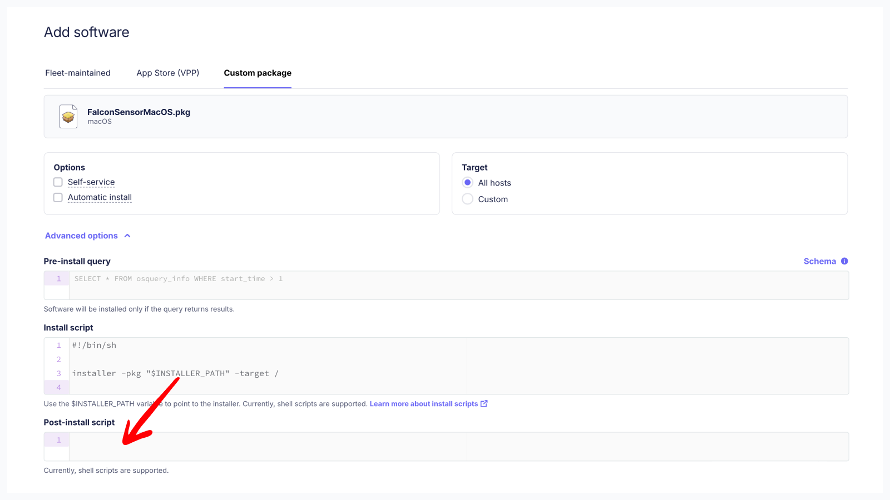
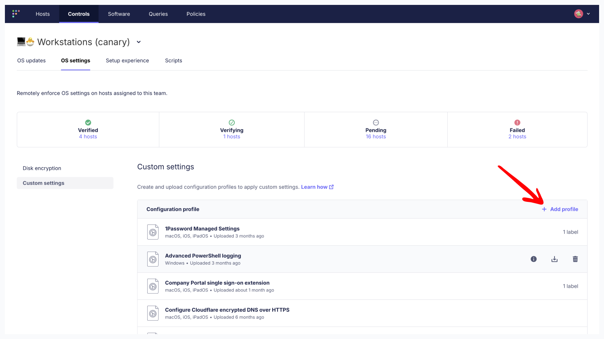

# Deploy CrowdStrike Falcon with Fleet

This guide will show you how to deploy CrowdStrike Falcon on macOS, Linux and Windows using Fleet. It covers installing the CrowdStrike Falcon application, creating a post-install script for collecting the CrowdStrike Customer ID for activation and deploying required application configurations.

## Upload the CrowdStrike Falcon installer to Fleet

1. In the Falcon console, go to **Host setup and management** > **Sensor Downloads**. 
2. Download the installer for the appropriate OS and architecture.
3. In Fleet, go to **Software > Add software > Custom package** to upload the installer.
4. Select **Automatic install** or **Self-service** if these options apply to your environment.

>If needed, use [labels](https://fleetdm.com/guides/managing-labels-in-fleet) to scope installations for different hardware architectures.

## Create a post-install script for collecting the CrowdStrike Customer ID

Your CrowdStrike **Customer ID** can be found on the Sensor download page in the CrowdStrike console.

The **Customer ID** _must be collected_ during the installation to activate the Falcon application. 

Adding the platfom-specifc scripts below to the CrowdStrike Falcon custom package settings in Fleet will allow the host on which the application has been installed to collect the **Customer ID** for activation in the CrowdStrike tenant. 

>After following the instructions above to upload a CrowdStrike Falcon package, you can click on **Advanced options** to expand the **Custom package** settings and reveal the **Post-install script** field for pasting in a script. See the screen shot below for details.



For further reference, Crowdstrike Falcon scripts and install documentation can be found at: https://github.com/CrowdStrike/falcon-scripts

## macOS

If your organization is using Fleet GitOps and you want to pass the CrowdStrike site key as a secret, follow this guide: https://fleetdm.com/guides/secrets-in-scripts-and-configuration-profiles.

For admins using the macOS Setup Experience in Fleet, we recommend adding the Falcon application to the list of software being installed during initial provisioning.

### Upload a macOS post-install script to Fleet for collecting the CrowdStrike Customer ID

To use this script, copy your **Customer ID** from the CrowdStrike console, then, paste it into the value for the `CUSTOMER_ID` variable below. Next, copy the modified script to the CrowdStrike Falcon custom package settings as a post-install action in Fleet:

```
#!/bin/bash
CUSTOMER_ID="YOUR-CUSTOMER-ID-HERE"
FALCON_PATH="/Applications/Falcon.app/Contents/Resources/falconctl"

sudo "$FALCON_PATH" license "$CUSTOMER_ID"

# Check status
if [ $? -eq 0 ]; then
    echo "Activation completed"
else
    echo "Activation failed"
    exit 1
fi
```

### Upload macOS configuration files to Fleet

CrowdStrike Falcon requires multiple `.mobileconfig` payloads on macOS.

The payloads can be combined and delivered as a single Configuration Profile, or, delivered in separate Configuration Profiles for modularity and easier reading.

Below is an explanation of what each of the macOS CrowdStrike Falcon payloads does:

- `crowdstrike-service-management.mobileconfig` - Configure CrowdStrike Falcon as a managed login item so its services can't be stopped by end users.
- `crowdstrike-notification.mobileconfig` - Suppress notifications to reduce end user notifcation fatigue. (This is a best practice for many fully-managed applications.)
- `crowdstrike-system-extension` - Install the CrowdStrike Falcon System Extension to allow all necessary application entitlements and access to the macOS kernel.
- `crowdstrike-web-filter.mobileconfig` - Enable web filtering to monitor network traffic at the socket level.
- `crowdstrike-full-disk-access.mobileconfig` - Grant full disk access to all CrowdStrike application processes using the CrowdStrike Apple Developer team identifier.

[Download the CrowdStrike Falcon macOS Configuration Profiles](https://github.com/fleetdm/fleet/tree/main/docs/solutions)

>To upload Configuration Profiles to your Fleet instance: go to **Controls > OS Settings > Custom settings** then click **Add Profile**. See the screen shot below for details.



## Linux

### Upload a Linux post-install script to Fleet for collecting the CrowdStrike Customer ID

To use this script, copy your **Customer ID** from the CrowdStrike console, then, paste it into the value for the `FalconCid` variable below. Next, copy the modified script to the CrowdStrike Falcon custom package settings as a post-install action in Fleet:

```
#!/bin/bash

# Set your Customer ID here
FalconCid = "YOUR-CUSTOMER-ID-HERE

echo "Setting CrowdStrike Falcon Customer ID: $FalconCid"

# Set the Customer ID
sudo /opt/CrowdStrike/falconctl -s --cid="$FalconCid"

# Check if the command was successful
if [ $? -eq 0 ]; then
    echo "Customer ID set successfully!"
    
    # Verify the setting
    echo "Verifying Customer ID..."
    sudo /opt/CrowdStrike/falconctl -g --cid
else
    echo "Error: Failed to set Customer ID"
    exit 1
fi
```

Admins can verify the installation by running the following command which searches for the falcon-sensor binary:

```
sudo ps -e | grep falcon-sensor
```

## Windows

CrowdStrike offers `.exe` and `.msi` Falcon installers for Windows. Using the `.msi` inataller in Fleet is preferred as this installer type performs a silent, fully-automated installation when using the **Automatic install** option.

### Upload a Windows post-install script to Fleet for collecting the CrowdStrike Customer ID

To use this script, copy your **Customer ID** from the CrowdStrike console, then, paste it into the value for the `$FalconCid` variable below. Next, copy the modified script to the CrowdStrike Falcon custom package settings as a post-install action in Fleet:

```
# Set your Customer ID here
$FalconCid = "YOUR-CUSTOMER-ID-HERE"

$logFile = "${env:TEMP}/fleet-install-software.log"
try {
$installProcess = Start-Process msiexec.exe `
  -ArgumentList "/quiet /norestart /lv ${logFile} /i `"${env:INSTALLER_PATH}`" CID=${FalconCid}" `
  -PassThru -Verb RunAs -Wait
Get-Content $logFile -Tail 500
Exit $installProcess.ExitCode
} catch {
  Write-Host "Error: $_"
  Exit 1
}
```

There are several other flags that can be added to this script. See: https://github.com/CrowdStrike/falcon-scripts for a list of supported options.

## Conclusion

Fleet offers admins a straight-forward approach to deploying the CrowdStrike Falcon application across your macOS, Linux and Windows hosts. See https://fleetdm.com/guides/deploy-software-packages for more information on installing software packages using Fleet.

<meta name="articleTitle" value="Deploy CrowdStrike with Fleet">
<meta name="authorFullName" value="Harrison Ravazzolo">
<meta name="authorGitHubUsername" value="harrisonravazzolo">
<meta name="category" value="guides">
<meta name="publishedOn" value="2025-08-11">
<meta name="description" value="Deploy CrowdStrike with Fleet">
<meta name="articleImageUrl" value="../website/assets/images/articles/fleet-crowdstrike-cover-800x450@2x.png">
