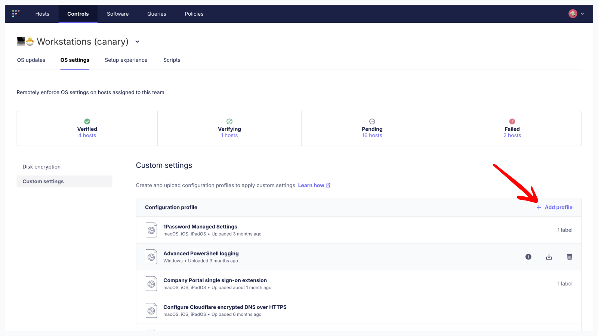
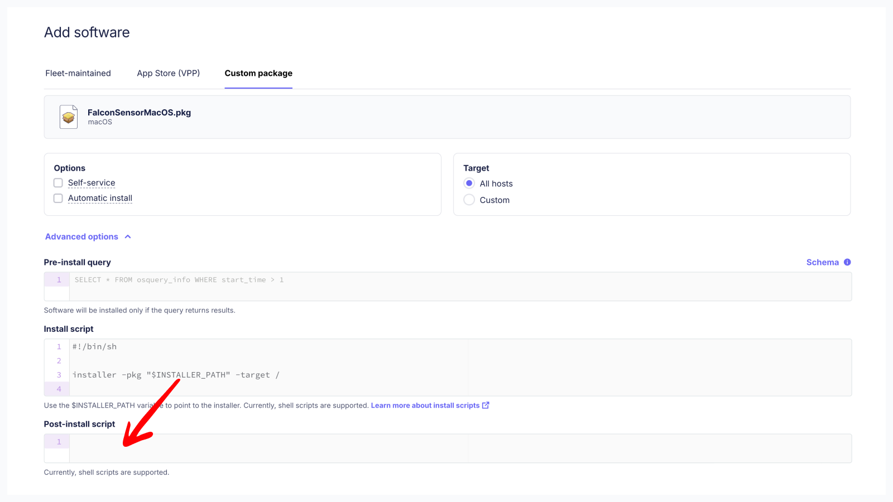

# Deploy CrowdStrike Falcon with Fleet

This guide will cover how to deploy CrowdStrike Falcon on macOS, Linux and Windows using Fleet. It includes:

- Installing the CrowdStrike Falcon application
- Creating a post-install script to collect the CrowdStrike Customer ID for activation
- Deploying required application configurations

## Install options to consider before you start

### Install CrowdStrike Falcon during Fleet End User Setup Experience

It is considered a best practice to install CrowdStrike Falcon when hosts first enroll into Fleet as part of the provisioning process. Learn how:
- [macOS](https://fleetdm.com/guides/setup-experience#install-software)
- [Linux](https://fleetdm.com/guides/windows-linux-setup-experience#choose-software)
- [Windows](https://fleetdm.com/guides/windows-linux-setup-experience#choose-software)

### Use GitOps to install CrowdStrike Falcon

If your organization is using Fleet GitOps and you want to pass the CrowdStrike site key as a secret, follow this guide: https://fleetdm.com/guides/secrets-in-scripts-and-configuration-profiles.

### Dedicated CrowdStrike Falcon osquery table

Starting with fleetd version 1.50, you can use the [`crowdstrike_falcon`](https://fleetdm.com/tables/crowdstrike_falcon) osquery table to check the status of a CrowdStrike Falcon installation on macOS and Linux.

## Download the CrowdStrike Falcon installer

On the CrowdStrike Falcon dashboard, click the hamburger menu in the top-left corner of the page, then navigate to **Host setup and management** > **Sensor Downloads** (in the **Deploy** section of the menu).

Select the appropriate Falcon Sensor package for your platform and copy the **Customer ID** string found in the **How to install** sidebar on the right side of the page. The **Customer ID** *must be collected* during the CrowdStrike Falcon installation to activate the Falcon application on a host.

>For Windows, CrowdStrike offers `.exe` and `.msi` Falcon installers. Selecting the `.msi` package is preferable because it performs a silent, fully-automated installation when using the **Automatic install** option in Fleet.

## macOS CrowdStrike Falcon installation

### 1. Deploy configuration profiles

CrowdStrike Falcon requires multiple `.mobileconfig` payloads on macOS.

The payloads can be combined and delivered as a single Configuration Profile, or, delivered in separate Configuration Profiles for modularity and easier reading.

Below is an explanation of what each of the macOS CrowdStrike Falcon payloads does:

- `crowdstrike-service-management.mobileconfig` - Configure Falcon as a managed login item so its services can't be stopped by end users.
- `crowdstrike-notification.mobileconfig` - Suppress notifications to reduce end user notification fatigue. (This is a best practice for many fully-managed applications.)
- `crowdstrike-system-extension` - Install the CrowdStrike Falcon System Extension to allow all necessary application entitlements and access to the macOS kernel.
- `crowdstrike-web-filter.mobileconfig` - Enable web filtering to monitor network traffic at the socket level.
- `crowdstrike-full-disk-access.mobileconfig` - Grant full disk access to all CrowdStrike application processes using the CrowdStrike Apple Developer team identifier.

[Download the CrowdStrike Falcon macOS Configuration Profiles](https://github.com/fleetdm/fleet/tree/main/docs/solutions/macos/configuration-profiles)

To upload Configuration Profiles to your Fleet instance: go to **Controls > OS Settings > Configuration profiles** then click **Add Profile**.



### 2. Create a post-install script

To activate a host in the CrowdStrike tenant, a script must be excuted after CrowdStrike Falcon is installed to collect the **Customer ID**. Use this script on macOS with the **Customer ID** string copied from your CrowdStrike tenant above:

```
#!/bin/bash
CUSTOMER_ID="YOUR-CUSTOMER-ID-HERE"
FALCON_PATH="/Applications/Falcon.app/Contents/Resources/falconctl"

sudo "$FALCON_PATH" license "$CUSTOMER_ID"

# Check status
if [ $? -eq 0 ]; then
    echo "Activation completed"
else
    echo "Activation failed"
    exit 1
fi
```

### 3. Add the Falcon Sensor to your software library

1. In Fleet, go to **Software > Add software > Custom package** to upload the Falcon Sensor installer.
2. Click **Advanced options**, then paste the activation script from the previous step into **Post-install script**, making sure to set the `CUSTOMER_ID` variable.



3. Click **Add software**.

## Linux CrowdStrike Falcon installation

### 1. Create a post-install script

To activate a host in the CrowdStrike tenant, a script must be excuted after CrowdStrike Falcon is installed to collect the **Customer ID**. Use this script on Linux with the **Customer ID** string copied from your CrowdStrike tenant above:

```
#!/bin/bash
CUSTOMER_ID="YOUR-CUSTOMER-ID-HERE"

# Set the Customer ID
sudo /opt/CrowdStrike/falconctl -s --cid="$CUSTOMER_ID"

if [ $? -eq 0 ]; then
    echo "Activation completed"
else
    echo "Activation failed"
    exit 1
fi
```

CrowdStrike provides [documentation for additional flags](https://github.com/crowdstrike/falcon-scripts/tree/main/bash/install) you can use here.

### 2. Add the Falcon Sensor to your software library

1. In Fleet, go to **Software > Add software > Custom package** to upload the Falcon Sensor installer.
2. Click **Advanced options**, then paste the activation script from the previous step into **Post-install script**, making sure to set the `CUSTOMER_ID` variable.

>You can use [labels](https://fleetdm.com/guides/managing-labels-in-fleet) to scope installations for different hardware architectures.

3. Click **Add software**.

## Windows CrowdStrike Falcon MSI installation

### 1. Create a post-install script

To activate a host in the CrowdStrike tenant, a script must be excuted after CrowdStrike Falcon is installed to collect the **Customer ID**. Use this script on Windows with the **Customer ID** string copied from your CrowdStrike tenant above:

```
# Set your Customer ID here
$FalconCid = "YOUR-CUSTOMER-ID-HERE"

$logFile = "${env:TEMP}/fleet-install-software.log"
try {
$installProcess = Start-Process msiexec.exe `
  -ArgumentList "/quiet /norestart /lv ${logFile} /i `"${env:INSTALLER_PATH}`" CID=${FalconCid}" `
  -PassThru -Verb RunAs -Wait
Get-Content $logFile -Tail 500
Exit $installProcess.ExitCode
} catch {
  Write-Host "Error: $_"
  Exit 1
}
```

>CrowdStrike provides [documentation for additional flags](https://github.com/crowdstrike/falcon-scripts/tree/main/powershell/install) here.

### 2. Add the Falcon Sensor to your software library

1. In Fleet, go to **Software > Add software > Custom package** to upload the Falcon Sensor installer.
2. Click **Advanced options**, then paste the activation script from the previous step into **Post-install script**, making sure to set the `$FalconCid` variable.
3. Click **Add software**.


## Windows CrowdStrike Falcon EXE installation

### 1. Create an install script

To activate a host in the CrowdStrike tenant, a script must be excuted during CrowdStrike Falcon installation to collect the **Customer ID**. Use this script on Windows with the **Customer ID** string copied from your CrowdStrike tenant above:

```
$logFile = "${env:TEMP}\fleet-install-software.log"
try {
    $installProcess = Start-Process -FilePath "${env:INSTALLER_PATH}" -ArgumentList "/quiet /norestart /install CID=<YOUR-CUSTOMER-ID-HERE>"
    Get-Content $logFile -Tail 500
    Exit $installProcess.ExitCode
} catch {
    Write-Host "Error: $_"
    Exit 1
}
```

>CrowdStrike provides [documentation for additional flags](https://github.com/crowdstrike/falcon-scripts/tree/main/powershell/install) here.

### 2. Create an uninstall script

```
$logFile = "${env:TEMP}\fleet-uninstall-software.log"
$uninstallPath = "${env:ProgramFiles}\CrowdStrike\CSFalconService.exe"

try {
    if (Test-Path $uninstallPath) {
        $uninstallProcess = Start-Process -FilePath $uninstallPath `
            -ArgumentList "/uninstall /quiet" `
            -Wait -PassThru
        Get-Content $logFile -Tail 500 -ErrorAction SilentlyContinue
        Exit $uninstallProcess.ExitCode
    }
    Exit 1
} catch {
    Write-Host "Error: $_"
    Exit 1
}
```

>CrowdStrike provides [documentation for additional flags](https://github.com/crowdstrike/falcon-scripts/tree/main/powershell/install) here.

### 2. Add the Falcon Sensor to your software library

1. In Fleet, go to **Software > Add software > Custom package** to upload the Falcon Sensor installer.
2. Paste the install script from the previous step into **install script**, making sure to set the customer ID. And the uninstall script, into **Uninstall script**.
3. Click **Add software**.

## Verify and enforce activation with policies

Installing the Falcon sensor and activating it are two separate outcomes. A sensor can install successfully and still sit unlicensed, which means it reports no data to your CrowdStrike tenant. Policies let you check activation as a distinct condition, and re-run the activation script on hosts that fail.

This also solves a common timing problem. A post-install script runs the moment the package lands, which during setup experience can be before the end user's account exists. A policy is evaluated on the host's regular reporting cadence instead, so it only runs the activation script once the sensor is actually present and unlicensed.

> **Note:** The `crowdstrike_falcon` table requires fleetd 1.50 or later, and is available on macOS and Linux. Windows hosts don't have this table, so use the [`programs`](https://fleetdm.com/tables/programs) table to check the installed version instead.

### Check that Falcon is installed

Pair this policy with an [install software automation](https://fleetdm.com/guides/automatic-software-install-in-fleet) to deploy the sensor to hosts that don't have it.

```sql
SELECT 1 FROM apps WHERE bundle_identifier = 'com.crowdstrike.falcon.App';
```

### Check that Falcon is activated

An installed but unlicensed sensor reports an empty agent ID and customer ID. Attach your activation script to this policy using a [script automation](https://fleetdm.com/guides/policy-automation-run-script).

```sql
SELECT 1 FROM crowdstrike_falcon
WHERE agent_id IS NOT NULL AND agent_id != ''
  AND cid IS NOT NULL AND cid != '';
```

### Check that the sensor is loaded

A sensor can be licensed and still not be running, usually because the system extension hasn't been approved.

```sql
SELECT 1 FROM crowdstrike_falcon WHERE sensor_loaded = 'true';
```

### Check that the sensor isn't in reduced functionality mode

Reduced functionality mode means Falcon is running with degraded protection. This most often happens after a macOS upgrade that the installed sensor version doesn't support yet.

```sql
SELECT 1 FROM crowdstrike_falcon WHERE reduced_functionality_mode = 'false';
```

### Check that the system extension is active

```sql
SELECT 1 FROM system_extensions
WHERE identifier = 'com.crowdstrike.falcon.Agent'
  AND team = 'X9E956P446'
  AND state = 'activated_enabled';
```

### Make the activation script safe to re-run

Fleet retries a policy's script automation up to three times when the script exits with a non-zero code, and resets that count once the host passes. Write the script so a second run on an already-licensed host is harmless.

```bash
#!/bin/bash
CUSTOMER_ID="$FLEET_SECRET_CROWDSTRIKE_CID"
FALCONCTL="/Applications/Falcon.app/Contents/Resources/falconctl"

if [ -z "$CUSTOMER_ID" ]; then
  echo "No customer ID set"
  exit 1
fi

if [ ! -x "$FALCONCTL" ]; then
  echo "falconctl not found at $FALCONCTL"
  exit 1
fi

if "$FALCONCTL" stats agent_info 2>/dev/null | grep -q "agentID:.*[0-9a-fA-F]"; then
  echo "Already activated"
  exit 0
fi

if "$FALCONCTL" license "$CUSTOMER_ID"; then
  echo "Activation completed"
  exit 0
fi

echo "Activation failed"
exit 1
```

> **Note:** By default, Fleet runs the script on the first failure and on any pass to fail transition, not on consecutive failures. To re-run it on every failing report, set `continuous_automations_enabled` to `true` on the policy. This can retry a script that never resolves the policy, so use it deliberately.

## Conclusion

Fleet offers admins a straight-forward approach to deploying the CrowdStrike Falcon application across your macOS, Linux and Windows hosts. See https://fleetdm.com/guides/deploy-software-packages for more information on installing software packages using Fleet.

<meta name="articleTitle" value="Deploy CrowdStrike with Fleet">
<meta name="authorFullName" value="Harrison Ravazzolo">
<meta name="authorGitHubUsername" value="harrisonravazzolo">
<meta name="category" value="guides">
<meta name="publishedOn" value="2025-11-05">
<meta name="description" value="Deploy CrowdStrike with Fleet">
<meta name="articleImageUrl" value="../website/assets/images/articles/fleet-crowdstrike-cover-800x450@2x.png">
