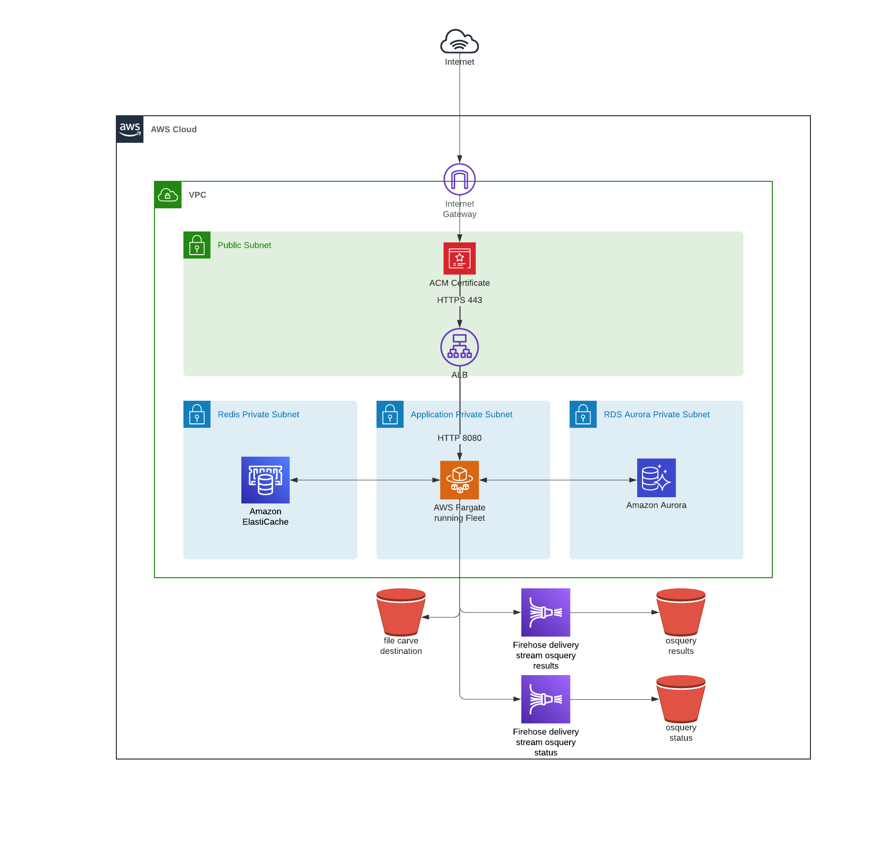
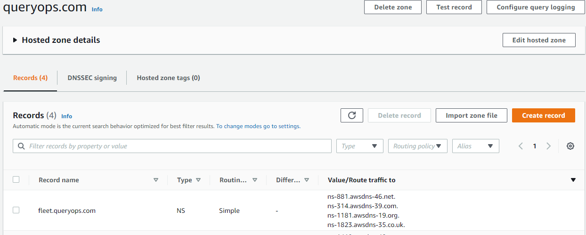
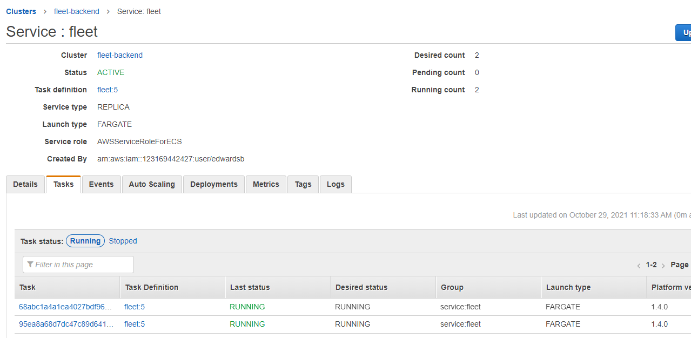

# Deploying Fleet on AWS with Terraform

There are many ways to deploy Fleet. Last time, we looked at deploying [Fleet on Render](https://fleetdm.com/deploy/deploying-fleet-on-render). This time, we’re going to deploy Fleet on AWS with Terraform IaC (infrastructure as code).

Deploying on AWS with Fleet’s reference architecture will get you a fully functional Fleet instance that can scale to your needs

<div class="video-container" style="position: relative; width: 100%; padding-bottom: 56.25%; margin-top: 24px; margin-bottom: 40px;">
	<iframe class="video" style="position: absolute; top: 0; left: 0; width: 100%; height: 100%; border: 0;" src="https://www.youtube.com/embed/vMcP0tM6g_o" allowfullscreen></iframe>
</div>

## Prerequisites:

- AWS CLI installed and configured.
- Terraform installed (version 1.04 or greater)
- AWS Account and IAM user capable of creating resources
- Clone [Fleet](https://github.com/fleetdm/fleet) or copy the [Terraform files](https://github.com/fleetdm/fleet/tree/main/infrastructure/dogfood/terraform/aws)

## Bootstrapping

To bootstrap our [remote state](https://www.terraform.io/docs/language/state/remote.html) resources, we’ll create a S3 bucket and DynamoDB table using the values defined in `remote-state/main.tf`. We'll override the `prefix` terraform variable to get unique resources and the `region` variable to use the same region set in the AWS CLI (you can run `aws configure get region` to see what region is set).

From the `/remote-state` directory, run:

1. `terraform init`
2. `terraform workspace new <your_org>-fleet-remote-state`
3. `terraform apply -var prefix="<your_org>-fleet" -var region="<region>"`

  You should be able to see all the resources that Terraform will create — the **S3 bucket** and the **dynamodb** table:

  ```
  Plan: 3 to add, 0 to change, 0 to destroy.

  Do you want to perform these actions in workspace "dev"?

  Terraform will perform the actions described above.

  Only 'yes' will be accepted to approve.
  Enter a value:
  ```

  After typing `yes` you should have a new S3 bucket named `<your_org>-fleet-terraform-remote-state` And the table `<your_org>-fleet-terraform-state-lock`. Keep these handy because we’ll need them in the following steps.

  You may see a warning during this process. It is safe to ignore. 

Now that the remote state is configured, we can move on to setting up the infrastructure for Fleet. 

## Infastructure
https://github.com/fleetdm/fleet/tree/main/infrastructure/dogfood/terraform/aws



The infrastructure used in this deployment is available in all regions. The following resources will be created:

- VPC
  - Subnets
    - Public
    - Private
  - ACLs
  - Security Groups
  - Application Load Balancer
- ECS as the container orchestrator
  - Fargate for underlying compute
  - Task roles via IAM
- RDS Aurora (MySQL 8.X)
- Elasticache (Redis 6.X)
- Firehose Delivery Stream (osquery log destination)
- S3 bucket (the following S3 buckets can house sensitive data, thus are created with zero public access)
  - firehose destination for osquery logs (https://github.com/fleetdm/fleet/blob/main/infrastructure/dogfood/terraform/aws/firehose.tf#L27)
  - osquery file carving destination (https://github.com/fleetdm/fleet/blob/main/infrastructure/dogfood/terraform/aws/s3.tf#L29)

### Encryption
By default, both RDS & Elasticache are encrypted at rest and encrypted in transit. The S3 buckets are also server-side encrypted using AWS managed KMS keys.

### Networking
For more details on the networking configuration take a look at https://github.com/terraform-aws-modules/terraform-aws-vpc. In the configuration Fleet provides
we are creating public and private subnets in addition to separate data layer for RDS and Elasticache. The configuration also defaults
to using a single NAT Gateway.

### Backups
RDS daily snapshots are enabled by default and retention is set to 30 days. If there is ever a need a snapshot identifier can be supplied via terraform variable (`rds_initial_snapshot`)
in order to create the database from a previous snapshot.

Next, we’ll update the terraform setup in the `/aws` directory's [main.tf](https://github.com/fleetdm/fleet/tree/main/infrastructure/dogfood/terraform/aws/main.tf) to use the S3 Bucket and DynamoDB created above:

```
terraform {
  // bootstrapped in ./remote-state
  backend "s3" {
    bucket         = "<your_org>-fleet-terraform-remote-state"
    region         = "<region>"
    key            = "<your_org>-fleet"
    dynamodb_table = "<your_org>-fleet-terraform-state-lock"
  }
  required_providers {
    aws = {
      source  = "hashicorp/aws"
      version = "3.57.0"
    }
  }
}
```

We’ll also need a `tfvars` file to make some environment-specific variable overrides. Create a file in the `/aws` directory named `prod.tfvars`, and copy/paste the variables below:

```
prefix                    = "<your_org>-fleet-prod"
fleet_backend_cpu         = 1024
fleet_backend_mem         = 4096 //software inventory requires 4GB
redis_instance            = "cache.t3.micro"
fleet_min_capacity        = 0
fleet_max_capacity        = 0
domain_fleetdm            = "<your_fleet_domain>"
software_inventory        = "1"
vulnerabilities_path      = "/fleet/vuln"
osquery_results_s3_bucket = "<your_org>-fleet-prod-osquery-results-archive"
osquery_status_s3_bucket  = "<your_org>-fleet-prod-osquery-status-archive"
```

Feel free to use whatever values you would like for the `osquery_results_s3_bucket` and `osquery_status_s3_bucket`. Just keep in mind that they need to be unique across AWS. We're setting the initial capacity for `fleet` to `0` to prevent the fleet service from attempting to start until setup is complete. Note that your AWS CLI region should be set to the same region you intend to provision the resources. All regions are compatible.

Now we’re ready to apply the terraform. From the `/aws` directory, Run:

1. `terraform init`
2. `terraform workspace new <your_org>-fleet-prod`
3. `terraform apply --var-file=prod.tfvars`

You should see the planned output, and you will need to confirm the creation. Review this output, and type `yes` when you are ready. Note this will take up to 30 minutes to apply.

During this process, terraform will create a `hosted zone` with an `NS` record for your domain and request a certificate from [AWS Certificate Manager (ACM)](https://aws.amazon.com/certificate-manager/). While the process is running, you'll need to add the `NS` records to your domain as well. 

Let’s say we own `queryops.com` and have an ACM certificate issued to it. We want to host Fleet at `fleet.queryops.com` so in this case, we’ll need to hand nameserver authority over to `fleet.queryops.com` before ACM will verify via DNS and issue the certificate. To make this work, we need to create an `NS` record on `queryops.com`, and put the same `NS` records that get created after terraform creates the `fleet.queryops.com` hosted zone.



Once `terraform apply` finishes you should see output similar to:

```
acm_certificate_arn = "arn:aws:acm:us-east-2:123169442427:certificate/b2845034-d4e1-4ff2-9630-1c93feaf2185"
aws_alb_name = "fleetdm"
aws_alb_target_group_name = "fleetdm"
backend_security_group = "arn:aws:ec2:us-east-2:123169442427:security-group/sg-00c9fa9632d7e03ca"
fleet-backend-task-revision = 5
fleet-migration-task-revision = 4
fleet_ecs_cluster_arn = "arn:aws:ecs:us-east-2:123169442427:cluster/fleet-backend"
fleet_ecs_cluster_id = "arn:aws:ecs:us-east-2:123169442427:cluster/fleet-backend"
fleet_ecs_service_name = "fleet"
fleet_min_capacity = 2
load_balancer_arn_suffix = "app/fleetdm/3427efb8c09088be"
mysql_cluster_members = toset([
  "fleetdm-mysql-iam-1",
])
nameservers_fleetdm = tolist([
  "ns-1181.awsdns-19.org",
  "ns-1823.awsdns-35.co.uk",
  "ns-314.awsdns-39.com",
  "ns-881.awsdns-46.net",
])
private_subnets = [
  "arn:aws:ec2:us-east-2:123169442427:subnet/subnet-03a54736c942cd1e4",
  "arn:aws:ec2:us-east-2:123169442427:subnet/subnet-07b59b34d4e0850e5",
  "arn:aws:ec2:us-east-2:123169442427:subnet/subnet-084d808e122d776af",
]
redis_cluster_members = toset([
  "fleetdm-redis-001",
  "fleetdm-redis-002",
  "fleetdm-redis-003",
])
target_group_arn_suffix = "targetgroup/fleetdm/0f3bec83c8b02f58"
```

We'll need some of these values in the next step.

## Prepare the database

Now all we need to do is prepare the database for use. We'll run an AWS ECS Task that will migrate the database and prepare it for use.

```
aws ecs run-task --cluster fleet-backend --task-definition fleet-migrate:<latest_migration_version> --launch-type FARGATE --network-configuration "awsvpcConfiguration={subnets=[<private_subnet_id>],securityGroups=[<desired_security_group>]}"
```

Where `<migration_version>` is `fleet-migration-task-revision`, `<private_subnet_id>` is one of the private subnets, and `<desired_security_group>` is the security group from the previous output. 

For the example output from `terraform apply` in the previous step, the command would look like this:

```
aws ecs run-task --cluster fleet-backend --task-definition fleet-migrate:4 --launch-type FARGATE --network-configuration "awsvpcConfiguration={subnets=[subnet-03a54736c942cd1e4],securityGroups=[sg-00c9fa9632d7e03ca]}"
```

Running this command will kick off the migration task, and Fleet will be ready to go.



At this point, you can go to your Fleet domain and start [using Fleet](https://fleetdm.com/docs/using-fleet). 

## Start the Fleet service

Now that Fleet has everything it needs, we're ready to start the service. 

First, we'll need to edit our production variables to increase Fleet's capacity and allow the service to start. In the `prod.tvars` file, update `fleet_min_capacity` and `fleet_max_capacity`:

```
prefix                    = "<your_org>-fleet-prod"
fleet_backend_cpu         = 1024
fleet_backend_mem         = 4096 //software inventory requires 4GB
redis_instance            = "cache.t3.micro"
fleet_min_capacity        = 1
fleet_max_capacity        = 5
domain_fleetdm            = "<your_fleet_domain>"
software_inventory        = "1"
vulnerabilities_path      = "/fleet/vuln"
osquery_results_s3_bucket = "<your_org>-fleet-prod-osquery-results-archive"
osquery_status_s3_bucket  = "<your_org>-fleet-prod-osquery-status-archive"
```

Then apply the updates:

`terraform apply --var-file=prod.tfvars`

Once the process completes, your Fleet instance is ready to use! Check out the documentation for more details on [using Fleet](https://fleetdm.com/docs/using-fleet). 

## Conclusion

Setting up all the required infrastructure to run a dedicated web service in AWS can be a daunting task. The Fleet team’s goal is to provide a solid base to build from. As most AWS environments have their own specific needs and requirements, this base is intended to be modified and tailored to your specific needs.

## Troubleshooting

1. AWS CLI gives the error "cannot find ECS cluster" when trying to run the migration task
   1. double-check your AWS CLI default region and make sure it is the same region you deployed the ECS cluster in
   2. the `--cluster <arg>` might be incorrect, verify the name of your ECS cluster that was created
2. AWS ACM fails to validate and issue certificates
   1. verify that the NS records created in the new hosted zone are propagated to your nameserver authority
   2. this might require multiple terraform apply runs
3. ECS fails to deploy Fleet container image (docker pull request limit exceeded/429 errors)
   1. if the migration task has not run successfully before the Fleet backend attempts to start it will cause the container to repeatedly fail and this can exceed docker pull request rate limits
   2. scale down the fleet backend to zero tasks and let the pull request limit reset, this can take from 15 minutes to an hour
   3. attempt to run migrations and then scale the Fleet backend back up
4. If Fleet is running, but you are getting a poor experience or feel like something is wrong
   1. check application logs emitted to AWS Cloudwatch
   2. check performance metrics (CPU & Memory utilization) in AWS Cloudwatch
      1. RDS
      2. Elasticache
      3. ECS
### Scaling Limitations
It is possible to run into multiple AWS scaling limitations depending on the size of the Fleet deployment, frequency of queries, and amount of data returned.
The Fleet backend is designed to scale horizontally (this is also enabled by default using target-tracking autoscaling policies out-of-the-box).

However, it is still possible to run into AWS scaling limitations such as:
#### Firehose write throughput provision exceeded errors
This particular issue would only be encountered for the largest of Fleet deployments and can occur because of high volume of data and/or number of hosts, if you notice these errors in the application logs or from the AWS Firehose console try the following:
1. Check the service limits https://docs.aws.amazon.com/firehose/latest/dev/limits.html
2. evaluate the amount of data returned using Fleet's live query feature
3. reduce the frequency of scheduled queries
4. reduce the amount of data returned for scheduled queries (Snapshot vs Differential queries https://osquery.readthedocs.io/en/stable/deployment/logging/)

#### 

More troubleshooting tips can be found here https://fleetdm.com/docs/deploying/faq

<meta name="category" value="deploy">
<meta name="authorGitHubUsername" value="edwardsb">
<meta name="authorFullName" value="Ben Edwards">
<meta name="publishedOn" value="2021-11-30">
<meta name="articleTitle" value="Deploying Fleet on AWS with Terraform">
<meta name="articleImageUrl" value="../website/assets/images/articles/deploying-fleet-on-aws-with-terraform-cover-1600x900@2x.jpg">
