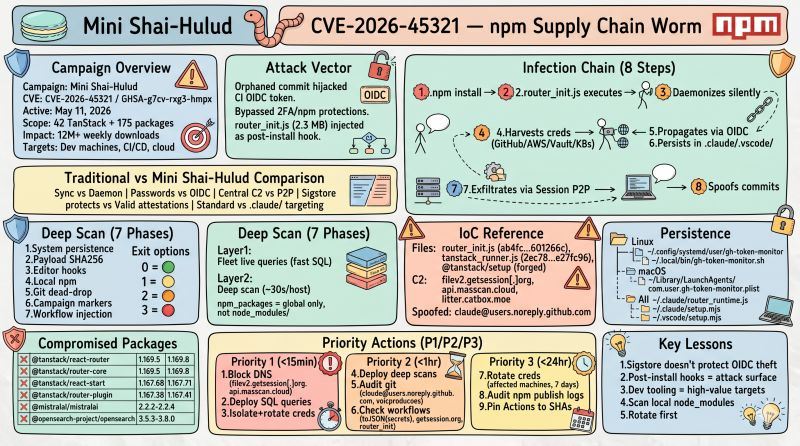

# Detecting the Mini Shai-Hulud npm supply chain worm with Fleet



On May 12, the npm registry was hit by an active supply chain worm that compromised 42 TanStack packages across 84 versions, plus 175 additional packages spanning 17 namespaces. The malware daemonizes silently during installation, then harvests credentials from GitHub Actions, AWS, HashiCorp Vault, and Kubernetes service accounts before propagating to new packages using the maintainer identities it just stole.

This post walks through how the Fleet security team detected the worm across our own 30-host fleet, the SQL queries and scripts we used, and the coverage gap every team relying on osquery's `npm_packages` table should know about.

## What happened

An orphaned commit in the TanStack/router repository let attackers hijack the CI workflow's OIDC token. That credential bypass walked right around two-factor authentication and npm's publishing protections, and the attackers used it to inject a 2.3 MB payload, `router_init.js`, as a post-install hook on dozens of legitimate packages.

The infection chain on `npm install` looks like this:

1. `router_init.js` runs through the postInstall hook.
2. The process forks, detaches from the terminal, and returns control immediately. Installation appears normal.
3. The daemon harvests credentials in sequence: GitHub Actions OIDC tokens, AWS (IMDSv2, Secrets Manager, SSM across regions), HashiCorp Vault, and Kubernetes service accounts.
4. The worm republishes malicious versions to npm using the stolen maintainer identity.
5. It persists by dropping hooks in `.claude/` and `.vscode/` directories.
6. Exfiltration runs over Session's P2P network at `filev2.getsession[.]org`.
7. Repository commits are made through the GitHub GraphQL API, spoofing `claude@users.noreply.github.com` as the author.

## Why this attack is different

Most malicious post-install scripts execute synchronously and leak output to the terminal. This variant forks and detaches, which is the most important behavioral difference. Developers see a clean install. Nothing in the build log indicates a problem.

A few other properties of Mini Shai-Hulud are worth flagging:

**Sigstore attestations provide false confidence.** The malware publishes through legitimate maintainer OIDC tokens, so the provenance attestations it generates are valid. Signature checks cannot distinguish a compromised credential from an authentic one.

**OIDC propagation defeats 2FA.** The worm republishes using issued tokens rather than passwords. Two-factor authentication offers no protection once the token is in attacker hands.

**Decentralized command and control.** Exfiltration over Session's P2P network means no single IP or domain leads cleanly back to an actor. DNS blocking `filev2.getsession[.]org` is necessary, but it is not sufficient.

**Developer tooling as a persistence channel.** Targeting `.claude/` and `.vscode/` is deliberate. Those directories survive across projects and sit close to high-privilege credentials.

Socket.dev's reporting on the campaign flagged two indicators that are useful for deep detection even before an official advisory closes: the PBKDF2 salt `svksjrhjkcejg`, and the string `IfYouRevokeThisTokenItWillWipeTheComputerOfTheOwner` appearing in malicious `package.json` files.

## How we used Fleet to detect it

We approached detection in two layers and ran both against every host in our fleet.

**Layer 1, live queries with osquery SQL.** Fast fleet-wide scans that surface compromised global packages, persistence files, active malware processes, and known C2 connections. Results come back in seconds.

**Layer 2, deep scan scripts via run-script.** Comprehensive per-host filesystem analysis that catches what SQL cannot, especially compromised packages installed inside per-project `node_modules/` directories. These finish in roughly 30 seconds per host.

Both layers are needed. Here is why.

## The npm_packages coverage gap

Fleet's `npm_packages` osquery table queries only globally installed packages, looking at default paths like `~/.npm-global`, `/usr/local/lib/node_modules`, and `/opt/homebrew/lib/node_modules`. It does not walk into project-local `node_modules/` directories.

In practice, almost no one installs npm packages globally. A developer with 20 active projects, each containing a compromised `@tanstack/react-router@1.169.8` in its own `node_modules/`, will produce zero rows from an `npm_packages` query against that host.

> SQL queries give you a fast global exposure check. Scripts give you complete visibility. You need both.

The deep scan scripts close this gap. They use `find ... -maxdepth 10 -type d -name node_modules` to enumerate every `node_modules/` directory under user home directories, then validate each tree against the full list of compromised versions.

## Fleet SQL queries

We shipped three platform-specific SQL files (Linux, macOS, and Windows) that combine multiple indicator classes through `UNION ALL` and tag every result with a severity label.

```
EXPOSURE_global_pkg_version  - compromised version in global npm tree
CRITICAL_persistence_*       - systemd service, LaunchAgent, or payload present
CRITICAL_active_payload_*    - malware process currently running
HIGH_persistence_editor_hook - .claude/ or .vscode/ hooks present
```

The queries cover:

- 42 TanStack packages across 84 versions that were directly compromised.
- 133 additional packages across 322 versions from the broader Mini Shai-Hulud campaign, identified by shared payload SHA256s, C2 domains, and campaign markers.
- `@tanstack/setup` flagged as forged at any version.
- Payload file paths across common install locations, including NVM.
- Active process detection for `router_init.js`, `router_runtime.js`, and `tanstack_runner.js` in the command line.
- Systemd user service `gh-token-monitor.service` on Linux, and the matching `com.user.gh-token-monitor.plist` LaunchAgent on macOS.
- Editor hooks in `.claude/` and `.vscode/`.

## Deep scan scripts

`mini_shai_hulud_scan_fleet_deep.sh` for Linux and macOS, and `mini_shai_hulud_scan_windows.ps1` for Windows, run sequentially with a 300-second timeout. Both follow the same seven-phase plan.

| Phase | Check | What it looks at |
|-------|-------|------------------|
| 1 | System persistence | Systemd user services and LaunchAgents |
| 2 | Payload files | `router_init.js` and `tanstack_runner.js` by SHA256 across home and global paths |
| 3 | Editor hooks | `.claude/router_runtime.js`, `.claude/setup.mjs`, `.vscode/setup.mjs` |
| 4 | Local npm packages | Every `node_modules/` directory, recursively |
| 5 | Git dead-drop commits | `claude@users.noreply.github.com` spoofed author, `voicproducoes` account, malicious commit hash |
| 6 | Campaign markers | PBKDF2 salt `svksjrhjkcejg`, campaign string in `package.json`, malicious commit reference |
| 7 | Workflow injection | `.github/workflows/*.yml` scanned for `toJSON(secrets)`, C2 domains, `__DAEMONIZED`, `router_init` |

Each run returns one of four exit codes:

- 0, CLEAN. No indicators found.
- 1, EXPOSED. A compromised package is present, but no execution evidence.
- 2, HIGH. Editor-hook persistence found.
- 3, CRITICAL. A payload file or system persistence artifact is likely present.

## Results across our fleet

Across 24 Linux and macOS hosts, every script returned exit code 0 with full coverage. A representative tail:

```
[*] Phase 6 - campaign markers in package.json
    Scanning package.json files in /root...
    [OK] no campaign markers found

[*] Phase 7 - injected GitHub workflows
    [OK] no malicious workflows found

===========================================================
  SUMMARY  (host=automater  duration=31s)
===========================================================
  CRITICAL findings: 0
  HIGH findings:     0
  EXPOSURE findings: 0

  VERDICT: CLEAN, no indicators found
```

On Windows, four of five targeted hosts (DC01, DC02, WIN10-1, and WRK-AI) completed clean, with one host still in progress at the time we captured results.

## Indicators of compromise

### Primary indicators

| Indicator | Value or pattern |
|-----------|------------------|
| Malware file | `router_init.js` (SHA256 `ab4fcadaec...601266c`) |
| Runner file | `tanstack_runner.js` (SHA256 `2ec78d5...e27fc96`) |
| Forged package | `@tanstack/setup`, any version, treat as malicious |
| Active process | `node` running `router_init.js` in its command line |
| C2 egress, confirmed | `filev2.getsession[.]org` |
| C2 egress, reported | `api.masscan.cloud`, `litter.catbox.moe` |
| Spoofed author | `claude@users.noreply.github.com` |

### Persistence locations

| Platform | Path |
|----------|------|
| Linux | `~/.config/systemd/user/gh-token-monitor.service` |
| Linux | `~/.local/bin/gh-token-monitor.sh` |
| macOS | `~/Library/LaunchAgents/com.user.gh-token-monitor.plist` |
| All | `~/.claude/router_runtime.js`, `~/.claude/setup.mjs` |
| All | `~/.vscode/setup.mjs` |

### High-impact compromised versions

| Package | Bad versions |
|---------|--------------|
| `@tanstack/react-router` | 1.169.5, 1.169.8 |
| `@tanstack/router-core` | 1.169.5, 1.169.8 |
| `@tanstack/react-start` | 1.167.68, 1.167.71 |
| `@tanstack/router-plugin` | 1.167.38, 1.167.41 |
| `@mistralai/mistralai` | 2.2.2, 2.2.3, 2.2.4 |
| `@opensearch-project/opensearch` | 3.5.3, 3.6.2, 3.7.0, 3.8.0 |

42 TanStack packages are directly affected. Fleet's queries also cover 175 additional packages from the broader campaign.

## Immediate response

### Within 15 minutes

1. Block DNS egress to `filev2.getsession[.]org` and `api.masscan.cloud` at the resolver and firewall. Stop exfiltration before you start investigating.
2. Deploy the SQL queries as Fleet live queries against every endpoint.
3. Isolate any host returning CRITICAL findings (exit code 3 or an active process). Rotate credentials in this order: npm tokens, GitHub PATs, AWS, Vault, and Kubernetes.

### Within an hour

4. Deploy the deep scan scripts through Fleet run-script. SQL covers global packages. The scripts cover every `node_modules/` directory on disk.
5. Audit git history for commits authored by `claude@users.noreply.github.com` or the `voicproducoes` account.
6. Inspect CI and CD workflow files for `toJSON(secrets)`, `getsession.org`, and `router_init`.

### Within 24 hours

7. Rotate credentials proactively on any machine that installed an affected package in the last 7 days, even if the scan returns clean. The malware may have exfiltrated already.
8. Audit npm publish logs for unexpected publishes from your organization's packages.
9. Pin GitHub Actions references to commit SHAs, not tags.

## Lessons we are taking forward

**Sigstore provenance alone is not enough.** Valid signatures cannot detect OIDC token compromise. The credential itself is legitimate. Trust must extend past signatures into behavior.

**Post-install hooks remain high-risk attack surface.** They execute with user privileges, and on developer machines or CI runners that authority is wildly excessive for the work they actually do.

**Developer tooling directories are premium targets.** Attackers go where credentials cluster. Treat `.claude/`, `.vscode/`, and similar configuration paths as sensitive surfaces, not personal preferences.

**Local `node_modules/` scanning is mandatory.** The `npm_packages` table is fast and useful, but it cannot stand on its own. Filesystem-level analysis has to be part of your detection plan.

**Rotation comes before forensics.** If an affected package landed on a machine in the last week, assume credentials are gone. The rotation clock should be measured in minutes, not hours.

## External references

- Socket.dev analysis: [TanStack npm packages compromised: Mini Shai-Hulud supply chain attack](https://socket.dev/blog/tanstack-npm-packages-compromised-mini-shai-hulud-supply-chain-attack)
- TanStack postmortem: [npm supply chain compromise postmortem](https://tanstack.com/blog/npm-supply-chain-compromise-postmortem)
- Mini Shai-Hulud campaign overview: [Mini Shai-Hulud supply chain attacks](https://socket.dev/supply-chain-attacks/mini-shai-hulud)

---

About the author: [Dhruv Majumdar](https://www.linkedin.com/in/neondhruv) is Fleet's VP of Security Solutions. Talk to [Fleet](https://fleetdm.com/device-management) today to find out how to solve your trickiest device management, data orchestration, and security problems.

<meta name="articleTitle" value="Detecting the Mini Shai-Hulud npm supply chain worm with Fleet">
<meta name="authorFullName" value="Dhruv Majumdar">
<meta name="authorGitHubUsername" value="drvcodenta">
<meta name="category" value="security">
<meta name="publishedOn" value="2026-05-13">
<meta name="description" value="How we detected the Mini Shai-Hulud npm supply chain worm across our fleet using Fleet live queries and deep scan scripts.">
