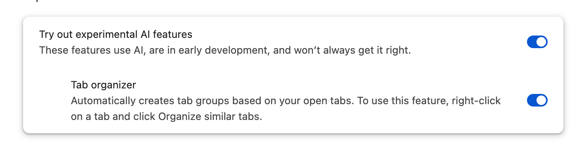
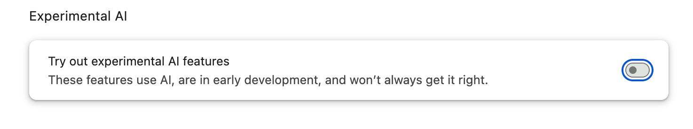

# Discovering Chrome AI using Fleet


# Discovering AI in Chrome with Fleet

Google Chrome, one of the most widely used web browsers, continually evolves to incorporate new features, including artificial intelligence (AI). This article will guide you through detecting if AI capabilities have been enabled in Chrome on macOS using Fleet.

## Using Fleet to discover AI features in Chrome

Google Chrome has integrated AI to enhance user experience by providing intelligent suggestions, improving search results, and offering in-browser assistance. Visit the [Chrome AI Innovations page](https://www.google.com/chrome/ai-innovations/) for more information.

### Step 1: Understanding Chrome's preferences JSON file

On macOS, Chrome stores user settings and configurations in a JSON file at the following path:

```
/Users/<user>/Library/Application Support/Google/Chrome/Default/Preferences
```

### Step 2: Identifying AI-related settings

Chrome AI-related preferences are stored in the `optimization_guide` section of the Chrome Preferences file. The `tab_organization_setting_state` key / value field will signify if AI features are enabled.

`jq` is a lightweight and powerful command-line tool for parsing, filtering, and manipulating JSON data. It can extract and parse information from JSON files at specific key / value fields.

In this case, `jq` is used to locate and read the value of the `tab_organization_setting_state` key within the Chrome Preferences file. This knowledge allows an admin to craft a Fleet query for reporting the state of the Chrome AI settings.

- If enabled, the setting will return `1`.



```
% jq '.optimization_guide.tab_organization_setting_state'  /Users/<user>/Library/Application\ Support/Google/Chrome/Default/Preferences                                      
1
```

- If disabled, the setting will return `2`.



```
% jq '.optimization_guide.tab_organization_setting_state'  /Users/<user>/Library/Application\ Support/Google/Chrome/Default/Preferences                                      
2
```

### Step 3: Query the JSON file with Fleet

To detect Chrome AI features in Fleet, use a SQL query like the following:

```
SELECT fullkey,path FROM parse_json WHERE path LIKE '/Users/%/Library/Application Support/Google/Chrome/Default/Preferences' AND fullkey='optimization_guide/tab_organization_setting_state';
```

### Conclusion

Fleet's powerful querying abilities allow you to monitor features like these across all of your devices.

<meta name="articleTitle" value="Discovering Chrome AI using Fleet">
<meta name="authorFullName" value="Brock Walters">
<meta name="authorGitHubUsername" value="nonpunctual">
<meta name="category" value="guides">
<meta name="publishedOn" value="2024-09-06">
<meta name="articleImageUrl" value="../website/assets/images/articles/discovering-chrome-ai-using-fleet-1600x900@2x.jpg">
<meta name="description" value="Use Fleet to detect and monitor settings enabled in Google Chrome by querying Chrome's preferences JSON file.">
