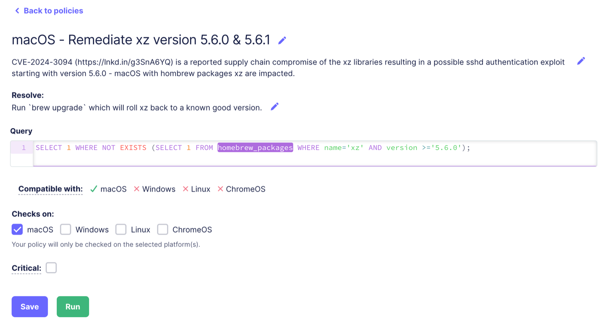

# Discovering xz vulnerability with Fleet


Detecting and remediating software vulnerabilities is more crucial than ever. 

`CVE-2024-3094` recently exposed a critical vulnerability in the `xz` libraries. This vulnerability, which can open backdoors on systems with `xz` installed starting from version 5.6.0, particularly affects `sshd` authentication.

Fleet is known for its ability to provide real-time insights and manage devices across platforms.

Because of this, we wanted to test using Fleet to build an end-to-end remediation workflow for `CVE-2024-3094`. The following case study looks at Fleet’s strengths and some areas where improvements could be made when using Fleet for this type of remediation.


## Discovery

The initial step involved leveraging Fleet's quick search capability, known as _live query_, to locate `xz` on Fleet’s computers.

This underscored Fleet's strength in identifying vulnerable software. It also revealed a limitation: out-of-the-box software search capabilities in the Fleet UI only gathered information about `xz`via the <code>[homebrew_packages](https://fleetdm.com/tables/homebrew_packages)</code> osquery table.


By adding saved queries like the ones below, Fleet can be customized to search for software like `xz` in more places across multiple computer platforms:

**This query checks for libraries related to xz on a Linux system:**


```
SELECT * FROM rpm_packages WHERE name LIKE '%xz%'
UNION ALL
SELECT * FROM deb_packages WHERE name LIKE '%xz%'
UNION ALL
SELECT * FROM programs WHERE name LIKE '%xz%';
```


> Running queries with wildcards may greatly impact Fleet Host performance.

**This query checks for xz installations on a Linux system:**


```
SELECT name,version,source FROM rpm_packages WHERE name='xz'
UNION ALL
SELECT name,version,source FROM deb_packages WHERE name='xz'
UNION ALL
SELECT name,version FROM programs WHERE name='xz';
```


**This query checks common UNIX system paths for the xz binary:**


```
SELECT path FROM file WHERE path IN ('/bin/xz','/usr/bin/xz','/usr/local/bin/xz','/sbin/xz','/usr/sbin/xz','/usr/local/sbin/xz');
```


**This query checks if the xz process is currently running:**


```
SELECT pid,name,path,cmdline FROM processes WHERE name='xz';
```


**This query searches for references to xz in system logs:**


```
SELECT * FROM syslog WHERE message LIKE '%xz%';
```


**This query monitors changes to the xz binary using [File Integrity Monitoring (FIM)](https://www.youtube.com/watch?v=b6fMF248k6A):**


```
SELECT * FROM file_events WHERE target_path LIKE '%/xz';
```


> Enabling File Integrity Monitoring requires modification of the Fleet configuration. For more information, see [file integrity monitoring (FIM)](https://fleetdm.com/guides/osquery-evented-tables-overview?utm_source=fleetdm.com&utm_content=table-yara_events#file-integrity-monitoring-fim) in the Fleet documentation for more information.

For more information on gathering data from Fleet Hosts, see the [Fleet osquery table schema documentation.](https://fleetdm.com/tables/account_policy_data)


## Remediation


### Policy logic

Fleet’s Policy feature allows admins to craft custom SQL queries that run on Hosts enrolled in Fleet. A Policy is effectively a pass/fail test based on a query result. 

Fleet can also be configured to send a webhook (i.e., an HTTP request) to a specified URL on a Policy failure - an extremely powerful feature. 

In some use cases, SQL query logic is not always well-suited for returning pass / fail results from Fleet Hosts. The query required for this case is an example.

The Policy should fail _if and only if_ the targeted file is found.





Query explanation:


* The “inner” query returns true if the file exists
* The “outer” query returns the value 1 if the “inner” query determination is false

A Policy failure event generates the webhook to trigger our remediation automation.


### Scripts

Below is a script that will:


* Determine if the `xz` package was installed via Homebrew
* Update Homebrew if `xz` is detected

The Homebrew update rolls `xz` back to a known-good version.

```
#!/bin/sh

# binary name to check
applstr='brew'

# get current logged in user
crntusr="$(/usr/bin/stat -f %Su /dev/console)"

# Check if brew is installed, exit with instruction if not
if ! /usr/bin/sudo -i -u "$crntusr" /usr/bin/which "$applstr" 2>&1 > /dev/null
then
    printf "Homebrew may not be installed.\nPlease install Homebrew to use this remediation.\nFor instructions, see https://brew.sh/"; exit
fi

# collect xz version
xz_vers="$(/usr/bin/sudo -i -u "$crntusr" xz --version)"

# remediate via Homebrew
if [ -z "$xz_vers" ] 
then
    printf "xz not installed via Homebrew.\nHost may not vulnerable.\nExiting..."; exit
elif echo "$xz_vers" | /usr/bin/grep -E '5\.6\.0|5\.6\.1'
then
    printf "Executing Homebrew upgrade to roll xz back to known good version..."
    /usr/bin/sudo -i -u "$crntusr" brew upgrade xz; /usr/bin/sudo -i -u "$crntusr" brew cleanup xz --prune=0
else
    printf "xz version ok."
fi
```


Integrating a third-party automation solution is required to execute this script if it is stored in Fleet. To complete the remediation workflow, the third-party solution must:


* Receive the webhook sent from the Fleet Policy failure event
* Use the webhook as a trigger to send an HTTP request to the Fleet API to execute the script

Here is a [Tines](https://www.tines.com/) workflow integration that performs these steps, remediating vulnerable Fleet Hosts:


It is non-optimal to require a 3rd party solution for executing scripts. It would be ideal to have the ability in Fleet to find and remediate vulnerable Hosts via a Fleet-only workflow.


## Opportunities

This case study illuminates Fleet's capabilities and, hopefully, will open a dialogue for improvement in the following areas:


* Enhancing Fleet UI search capabilities
* Simplifying Fleet Policy features to allow for more intuitive query logic
* Adding Script execution capabilities in Fleet to streamline admin workflows

Efforts to mitigate the `xz` vulnerability at Fleet allowed us to gain valuable insights. By acknowledging current capability limitations, we intend to pave the way for future enhancements that will make Fleet a comprehensive device management solution - much more than just a tool for detection and data collection.


<meta name="articleTitle" value="Discovering xz vulnerability with Fleet">
<meta name="authorFullName" value="Brock Walters">
<meta name="authorGitHubUsername" value="nonpunctual">
<meta name="category" value="guides">
<meta name="publishedOn" value="2024-06-03">
<meta name="articleImageUrl" value="../website/assets/images/articles/discovering-geacon-using-fleet-1600x900@2x.jpg">
<meta name="description" value="Discover and create a comprehensive end-to-end remediation workflow for the xz vulnerability (CVE-2024-3094) with Fleet.">
