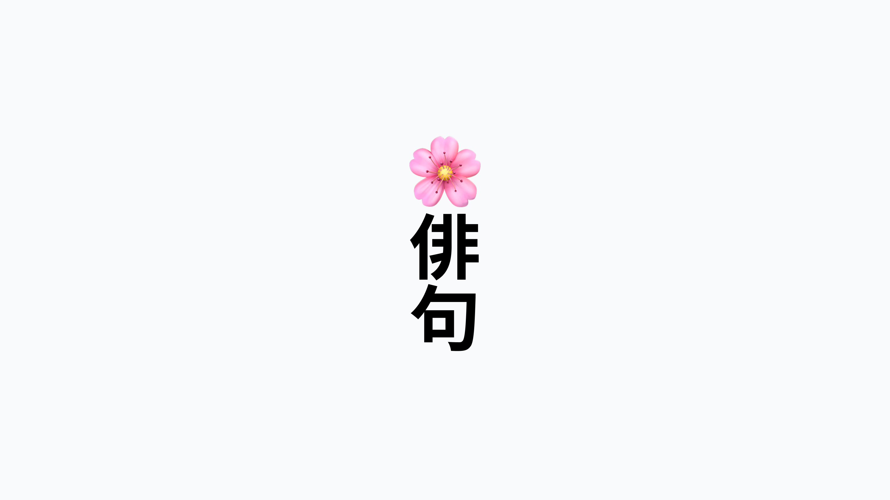

# Driving company culture through AI haiku poetry

When we released [remote wipe](https://fleetdm.com/releases/fleet-4.47.0) for macOS, Windows, and Linux, AI crafted this poetic gem for the occasion:

<blockquote purpose="large-quote">

Wipe clean as fresh snow,  

Workstations from afar glow,  

Ready for new flow.

</blockquote>

5-7-5, and it rhymes? Not bad!

At Fleet, we harness the power of GitHub to track and manage all of our business processes, design ideas, and engineering tasks. Everything we do is conducted [publicly](https://github.com/fleetdm/fleet/issues), embodying our commitment to [openness](https://fleetdm.com/handbook/company#openness). However, the mundane task of issue tracking needed a spark of creativity.

That's when we turned to AI, specifically to the structured simplicity of Japanese haiku—17 syllables divided into three lines of 5, 7, and 5 syllables. This poetic form, known for its objective descriptions of nature, contrasts sharply with the complexity of software development. It distills vast concepts into concise, evocative expressions. Influenced by masters like [Matsuo Bashō](https://en.wikipedia.org/wiki/Matsuo_Bash%C5%8D), our AI models are trained to craft haikus that capture the essence of each GitHub issue as it closes, infusing our routine with traditional haiku subjects such as the season, time of day, and other images of the natural world to create moments of unexpected beauty.

Since integrating this AI-driven poetry with our GitHub bot, [thousands of haikus](https://github.com/fleetdm/fleet/issues?q=is%3Aissue+is%3Aclosed) have been created, each marking the resolution of an issue with a smile. Like modern haiku, these poems range from humorous to profound, often, but not limited to the subject of nature, but always adhering to the 5-7-5 syllable structure.

Another favorite emerged when we launched an [arm64 binary](https://github.com/fleetdm/fleet/issues/9047) of `fleetctl` for macOS on Apple Silicon:

<blockquote purpose="large-quote">

Apple Silicon calls,  

Fleetctl in native tongue,  

Efficiency prevails.

</blockquote>

Our command line interface speaks Apple’s native tongue—how's that for making technology poetic?

### Mechanism behind the muse

Designed to automatically generate a haiku for each closed GitHub issue, our system utilizes OpenAI's model via a [webhook](https://github.com/fleetdm/fleet/blob/main/website/api/controllers/webhooks/receive-from-github.js#L222-L260). Here’s a glimpse into how this creative process is embedded in our technical workflow:

1. **Extract issue details** We pull the necessary details, such as the repository owner's name and issue number, to locate the right issue.

2. **Set up authentication** A secret key (`openAiSecret`) is essential for authenticating our requests to the OpenAI API.

3. **Prepare and send the prompt** We concatenate the issue's title and body into a summary that feeds into the AI prompt, instructing it to reflect on the technical enhancement and its impact succinctly.

4. **Receive and process AI poetry** On success, the AI’s poetic output is cleaned of any extraneous formatting before being posted as a comment under the closed issue on GitHub.

This creative initiative enriches the developer experience and sets the stage for further AI-enhanced features within Fleet's core offerings. Starting next month, we're expanding our use of AI in Fleet v4.45.0 to streamline and simplify your day-to-day tech challenges, ensuring that the poetry of innovation continues to evolve in our hands.

<meta name="articleTitle" value="Driving company culture through AI haiku poetry">
<meta name="authorFullName" value="Luke Heath">
<meta name="authorGitHubUsername" value="lukeheath">
<meta name="category" value="guides">
<meta name="publishedOn" value="2024-04-17">
<meta name="articleImageUrl" value="../website/assets/images/articles/driving-company-culture-through-ai-haiku-poetry-1600x900@2x.png">
<meta name="description" value="Code and verse entwine, Silicon sparks, haikus shine, Art meets design line.">
