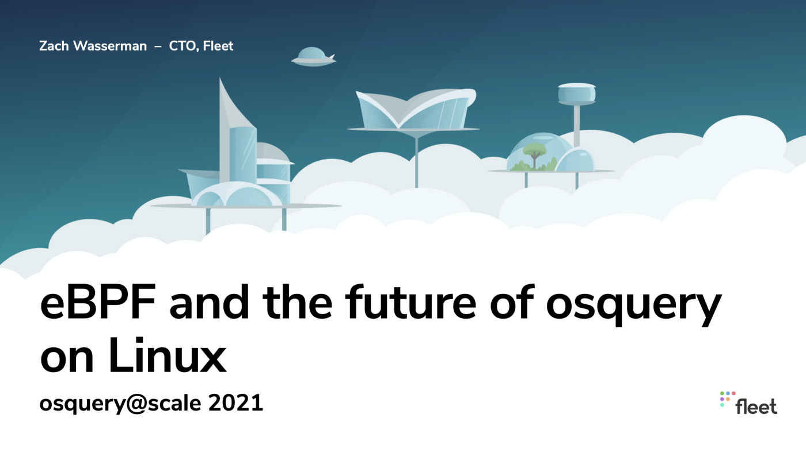

# eBPF & the future of osquery on Linux

What is the state of event instrumentation with osquery on Linux today? How is the Audit framework meeting Linux visibility needs, and what are the shortcomings of the approach? What is eBPF and how will it open new opportunities for osquery instrumentation on Linux?

This talk discusses the Audit approach to Linux events with osquery, including configuration and the capabilities exposed. eBPF is introduced along with the new `bpf_process_events` and `bpf_socket_events` tables. We conclude with thoughts about the future of eBPF and osquery on Linux.

### Presentation video

<iframe width="560" height="315" src="https://www.youtube.com/embed/p3rIRJM2vwo" title="YouTube video player" frameborder="0" allow="accelerometer; autoplay; clipboard-write; encrypted-media; gyroscope; picture-in-picture" allowfullscreen></iframe>

### Slide Deck

<iframe class="speakerdeck-iframe" frameborder="0" src="https://speakerdeck.com/player/a0444dd4b2b24bad8db7908590506699" title="eBPF &amp; the future of osquery on Linux" allowfullscreen="true" mozallowfullscreen="true" webkitallowfullscreen="true" style="border: 0px; background: padding-box padding-box rgba(0, 0, 0, 0.1); padding: 0px; border-radius: 6px; box-shadow: rgba(0, 0, 0, 0.2) 0px 5px 40px; width: 560px; height: 314px;" data-ratio="1.78343949044586"></iframe>

<meta name="category" value="security">
<meta name="authorGitHubUsername" value="zwass">
<meta name="authorFullName" value="Zach Wasserman">
<meta name="publishedOn" value="2021-01-25">
<meta name="articleTitle" value="eBPF & the future of osquery on Linux">
<meta name="articleImageUrl" value="../website/assets/images/articles/ebpf-the-future-of-osquery-on-linux-cover-700x394@2x.png">
