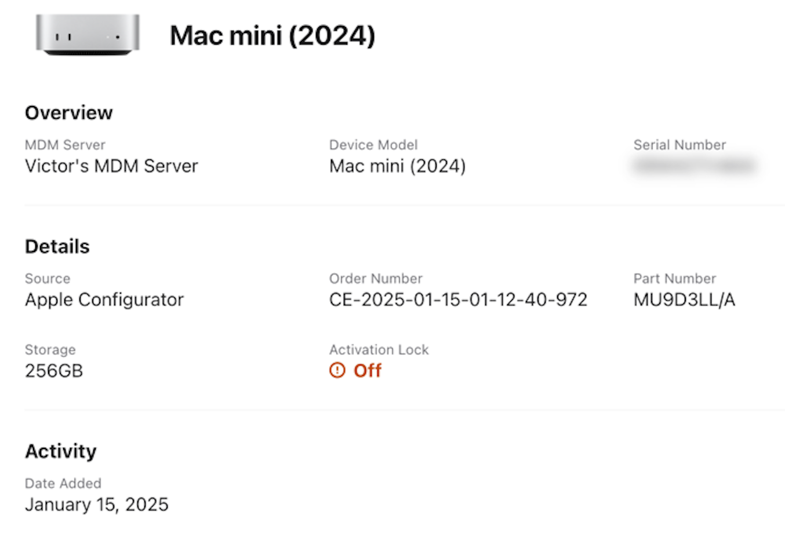
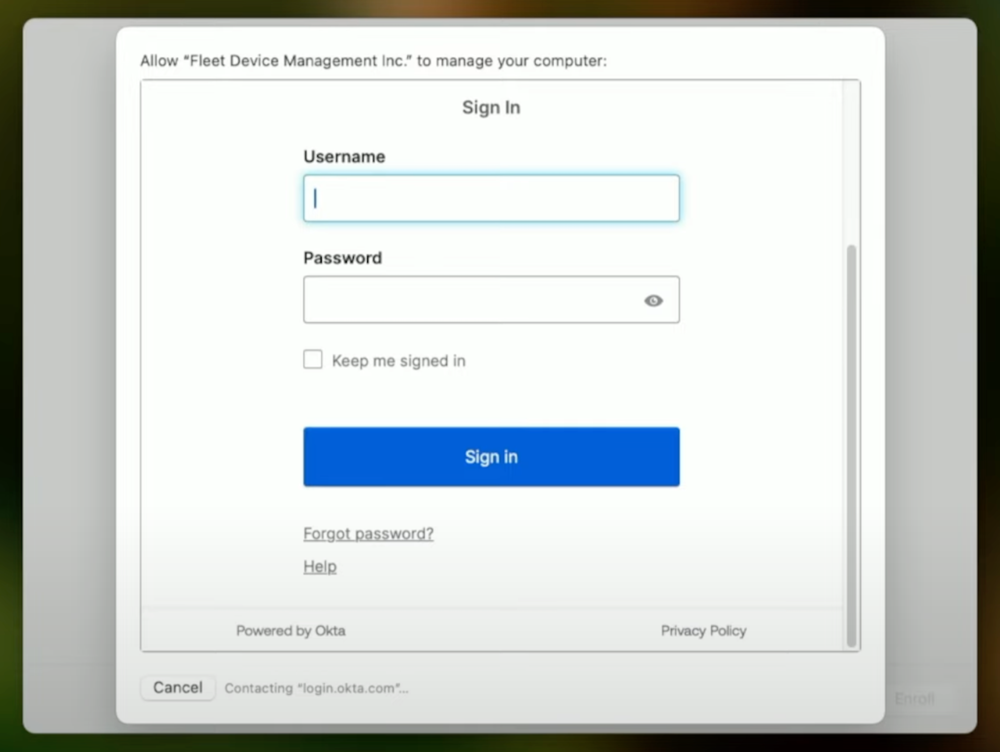
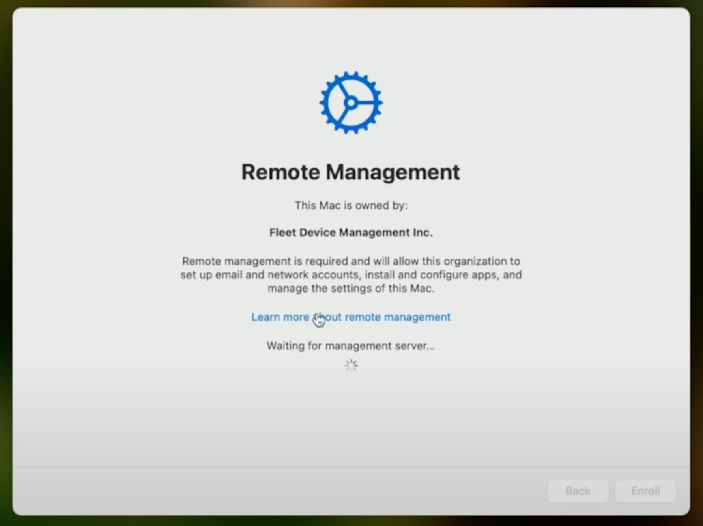
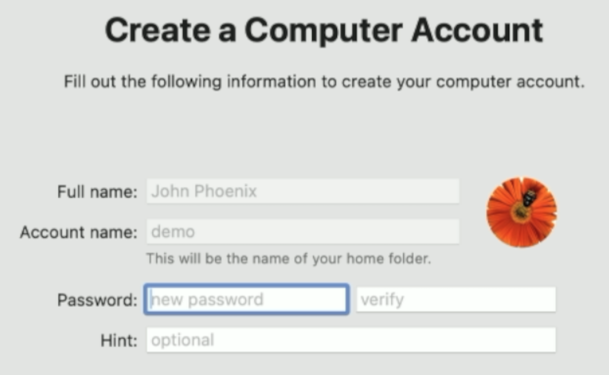
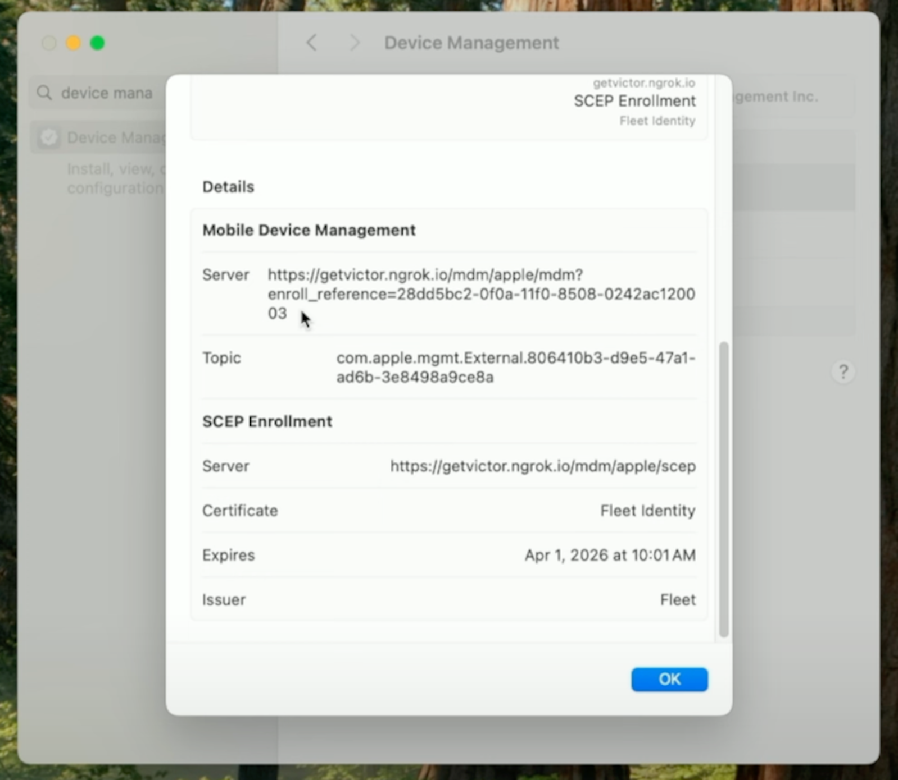

# Effortless onboarding: Fleet’s SAML integration for macOS Setup

Fleet MDM server simplifies the macOS setup experience. With Fleet, organizations can automate device enrollment, configure system settings, and provide compliance with minimal user intervention. With single sign-on (SSO) integration, the end user's username and name can be automatically populated in the local macOS account, allowing for a secure and efficient onboarding process. This article goes under the hood and dives into the technical details of how this end-user authentication integration works.

## Prerequisites

To use this flow, we must have Apple MDM enabled in Fleet and a macOS host ready to set up in [Apple Business Manager (ABM)](https://business.apple.com/) linked to our Fleet MDM server.

### What is Apple Business Manager?

Apple Business Manager (ABM) is a web-based portal that helps organizations deploy and manage Apple devices, including macOS computers, iPhones, and iPads. ABM provides a centralized platform for IT administrators to purchase hardware, assign devices to Mobile Device Management (MDM) servers, and distribute apps and content.

### Apple's ADE vs DEP

Apple's Device Enrollment Program (DEP) was the original, separate Apple service designed to register and configure devices automatically through an MDM solution. Subsequently, Apple rolled DEP into Automated Device Enrollment (ADE) as part of Apple Business Manager, combining DEP's automatic provisioning with other services in a streamlined portal. The terms ADE and DEP are often used interchangeably.

## Setting up end-user authentication

The first step is to enable SAML (Security Assertion Markup Language) SSO for your IdP (Identity Provider). Follow the instructions from the [Single sign-on guide](https://fleetdm.com/docs/deploy/single-sign-on-sso). Use the URL ending with `/mdm/sso/callback.` Make sure to assign users to your SAML integration.

You can [require users to authenticate with your IdP before using their Mac](https://fleetdm.com/guides/macos-setup-experience#end-user-authentication-and-end-user-license-agreement-eula). Note that setting up end-user authentication is done globally. However, enabling end-user authentication is done separately for each team. You may test end-user authentication in a separate team before rolling it out to the rest of your organization.

With end-user authentication enabled for your team, Fleet sends the updated enrollment profile to Apple. This sync happens once a minute and can be adjusted with the [mdm.apple_dep_sync_periodicity](https://fleetdm.com/docs/configuration/fleet-server-configuration#mdm-apple-dep-sync-periodicity) server configuration setting. The relevant attribute of the [Apple enrollment profile](https://developer.apple.com/documentation/devicemanagement/profile) is `configuration_web_url`. Fleet sets it to `{server_url}/mdm/sso`.

## macOS setup experience

When the end user turns on their macOS device for the first time and connects to the Internet, it syncs with Apple and downloads the enrollment profile from ADE. Since the profile contains a `configuration_web_url`, a web view comes from Fleet server. The web view sends a POST request to `{server_url}/api/v1/fleet/mdm/sso` to fetch the SAML request URL and redirects the user to that IdP URL.

This request initiates a Service Provider-initiated SAML flow, where Fleet is the service provider. Fleet's SAML request uses HTTP redirect binding, which transmits the SAML request message within URL parameters. The HTTP redirect binding is a standard SAML flow. The other standard approach, which Fleet does not support, is the HTTP POST binding. Fleet does not use request signing and relies on the TLS channel to secure the request. For more details on SAML, see [SAML 2.0 Technical Overview](https://docs.oasis-open.org/security/saml/Post2.0/sstc-saml-tech-overview-2.0.html).

After the user enters their credentials, including any multi-factor authentication, the IdP sends a SAML response to the URL that we configured when setting up the SAML integration, which is `{server_url}/api/v1/fleet/mdm/sso/callback`. This SAML response is an API request to the Fleet server. The server validates that the SSO session is valid and has not expired. The server also saves the username and full name extracted from the SAML attributes into the MySQL database. The server returns a 303 redirect to the `{server_url}/mdm/sso/callback` web view.

The web view shows the EULA (End User License Agreement) if needed. Afterward, the web view fetches the MDM URL from the `{server_url}/api/mdm/apple/enroll` endpoint. The URL contains an `enroll_reference` parameter, which links this host to its IdP details.

At this point, the user is authenticated and proceeds with other parts of the setup experience, such as installing software.

After installing the enrollment profile, the macOS device sends a `TokenUpdate` message to the Fleet MDM server.

Fleet processes all enrolling macOS devices once a minute and queues up several MDM commands to send to them. For this flow, we are interested in the [AccountConfiguration command](https://developer.apple.com/documentation/devicemanagement/accountconfigurationcommand/command-data.dictionary). This command sets the username and full name of the end user at the local account screen. If the IdP did not send the user's full name or if Fleet was not able to extract the full name from SAML, Fleet will try to get the full name from the SCIM (System for Cross-domain Identiy Management) integration, if present. Otherwise, the full name will be empty and the end user can fill it in.

After setting up the local account, the end user is ready to use their device. They can examine their Fleet enrollment profile to see the URL with the `enroll_reference` parameter.

## Host details

Fleet refreshes host details once per hour by default. As part of the refresh process, Fleet checks the `enroll_reference` parameter in the MDM URL and updates the list of emails associated with the host.

## Sequence diagram

For additional technical details, including a sequence diagram, see [Fleet's contributor documentation](https://github.com/fleetdm/fleet/blob/main/docs/Contributing/product-groups/mdm/mdm-end-user-authentication.md).

## Summary

Integrating your Fleet MDM server with your IdP is essential for IT professionals managing a fleet of devices. This deep dive into the details of end-user authentication provides you with the necessary insights to optimize your IT flows. We encourage you to apply these insights to your Fleet usage, and as always, we welcome your feedback and experiences in the [Fleet community Slack channels](https://fleetdm.com/support).

## Watch us demo SAML integration for macOS Setup

   <iframe src="https://www.youtube.com/embed/nwNORmQ5bd0?si=3PXayiEqCRxgOIim" frameborder="0" allowfullscreen></iframe>

<meta name="articleTitle" value="Effortless onboarding: Fleet’s SAML integration for macOS Setup">
<meta name="authorFullName" value="Victor Lyuboslavsky">
<meta name="authorGitHubUsername" value="getvictor">
<meta name="category" value="guides">
<meta name="publishedOn" value="2025-04-11">
<meta name="description" value="Using single sign-on (SSO) to handle identities automatically during device enrollment">
<meta name="articleImageUrl" value="../website/assets/images/articles/fleet-saml-integration-for-macOS-Setup-1600x900@2x.png">
