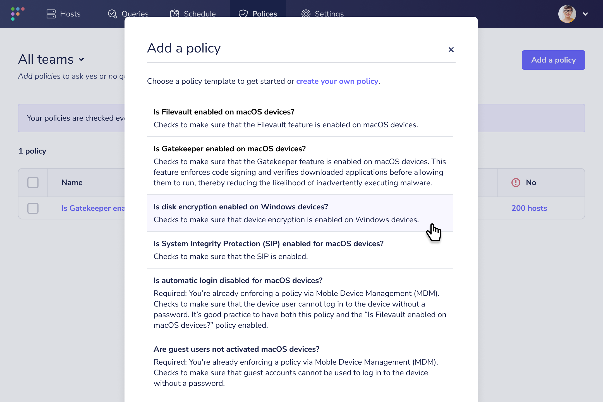

# End-user self remediation: empower your employees to fix security issues with Fleet

Nobody likes nagging their colleagues or scrambling to address urgent requests. Fortunately, there’s a strategy you can use to maintain security standards and reduce operational costs. It’s called end user self-remediation. And Fleet policies with Fleet Desktop make implementation easy.

## Empower without overwhelming

End user self-remediation puts employees in the position to fix common computer problems themselves — from updating browsers and operating systems to enabling firewalls and full disk encryption.

In order for this to work, the employee needs to know what’s wrong with their device and how to fix it. That’s easy enough for an engineer. But how do you make it easy for project managers, marketing coordinators, or sales representatives without taking too much time to do so? Self-remediation provides simple steps to address specific issues as they arise — without intervention from security or IT.

Reducing requests doesn’t have to seem like a dream. Fleet has the tools to make end user self-remediation a reality.

## Find issues and provide instructions with policies

Fleet policies are yes or no questions you can ask your hosts. Osquery, our open-source security agent, defines policies with queries. 

Policies automatically run every hour. A policy will fail if a device hasn’t been configured or if it isn’t behaving as expected.

You can import or [copy and paste policies from our library](https://fleetdm.com/queries). You can also build your own based on our templates. But osquery gives you the power to create custom queries. So you can tailor policies to meet the needs of your company.

Beyond identifying failing hosts, Fleet policies can include steps for bringing hosts into compliance. Here’s how.

## Give end users easy access with Fleet Desktop

	<iframe src="https://www.youtube.com/embed/cI2vDG3PbVo" allowfullscreen></iframe>

Fleet Desktop gives your employees visibility into security issues on their computers.

Selecting Fleet Desktop from the menu bar shows the device’s compliance status. Employees with non-compliant devices can click “My device” to find out which policies are failing.

The Policies tab shows a list of all policies that apply to the device — each accompanied by a pass or fail icon. Selecting a failed policy will open a modal with remediation instructions.

After following the instructions, employees can refetch their computers’ data to see if the policy passes. They can double-check by clicking the Fleet Desktop icon in the menu bar.

## Setting up end user self-remediation with Fleet

### Install Fleet Desktop

If you’re new to Fleet, you’ll want to install osquery and enroll your devices into Fleet. Read our [Deploying documentation](https://fleetdm.com/docs/deploying/introduction) to get started.

When you’re adding hosts to Fleet, make sure the installer includes Fleet Desktop as part of the package. You can do this in the Fleet UI or with the fleetctl CLI.

Once installed on the target host, Fleet Desktop will be managed by Orbit. This will keep osquery and Fleet Desktop up to date on your end users’ hosts.

Read [Including Fleet Desktop](https://fleetdm.com/docs/using-fleet/adding-hosts#including-fleet-desktop) for installer instructions.

### Add policies with resolution instructions

So, you’ve deployed Fleet and installed Fleet Desktop on your hosts (employees’ computers). Now, it’s time to create your policies.

When saving the policy query, you’ll notice a “resolution” field. Completing this field is crucial for end user self-remediation. These will be the remediation instructions that end users see in Fleet Desktop.

Take your time writing these instructions. Remember, employees have different areas of expertise. Try to keep your technical explanations as simple as possible.

Read our documentation about [adding policies](https://fleetdm.com/docs/using-fleet/rest-api#add-policy) to get started.

### Set your enforcement standards

Employees can easily find failing policies and follow steps to fix them. Why should they bother?

Everyone in your organization has unique priorities. Software updates may fall further down the list as deadlines approach. That’s why it helps to have mechanisms in place that encourage end users to follow through.

You can decide how gentle these reminders should be. Fleet’s features let you set up 4 levels of self-remediation enforcement — from easy-going to super strict.

#### 1. Just policies

This is the least intrusive method. When end users check Fleet Desktop, they’ll know if their device is non-compliant. Then all they have to do is follow instructions for failing policies on the My device page.

There are no nudges or lockouts to get in the way of your end users. However, that leaves it up to their discretion whether or not to open Fleet Desktop in the first place.

While security-conscious end users may make it a habit to check Fleet Desktop, less tech-savvy employees will probably focus on the apps that get them through the day. So, several devices could remain non-compliant.

#### 2. Ticket automations

We all need a friendly reminder every now and then. Creating ticket automations for failing policies does just that.

Fleet allows you to set up Jira and ZenDesk ticket automations for any policy. Let’s say you have a policy to [see if full disk encryption is enabled](https://fleetdm.com/queries/full-disk-encryption-enabled-mac-os). You can set an automation that triggers a ticket whenever a device fails this policy.

Your employees will receive the same email update as they would with any ticket created in your organization. This will let them know their device is non-compliant…if they read the email.

#### 3. Webhooks

Sometimes an email isn’t enough. If you’re worried about overflowing inboxes, you can notify end users directly with a Slack message.

Fleet gives you the ability to create custom automations with webhooks. You can write your own script from scratch. Or you can avoid coding altogether by creating webhooks with a tool like [Tines](https://www.tines.com/). Fleet integrates with Tines to help you simplify security workflows with no-code automation.

You can easily build a Slack bot that notifies end users when a policy fails and directs them to Fleet Desktop for self-remediation.

While Slack is more immediate than email, your bot has to compete with questions from co-workers (not to mention workout routines, gardening tips, and contested debates over what is or isn’t a sandwich).  

#### 4. Zero trust

This is the strictest enforcement method. Zero trust denies users access to applications and data if they fail to meet security standards.

A zero trust security posture runs the risk of frustrating employees. Thanks to self-remediation, end users can resolve these roadblocks quickly.

We’ve discussed how pairing policies with Fleet Desktop helps organizations identify non-compliant devices and provide remediation instructions. Fleet can also help you [attain zero trust attestation](https://fleetdm.com/guides/zero-trust-attestation-with-fleet).

The Fleet API lets applications communicate with Fleet, such as your authentication provider. You can set your authenticator to ask the Fleet API to check for policy compliance when users request system access. Your authenticator will grant or deny access based on the results.

## See the benefits of self-remediation

There’s no one-size-fits-all approach for successful end user self-remediation. Security and IT must work together to find the best plan for their organization. Engineers can create strict compliance policies. But admins know how likely employees are to follow these instructions.

The benefits of self-remediation go beyond security. By making computer problems more approachable, you’ll empower employees to be more confident end users. So, they might be more inclined to troubleshoot issues before making a request.

See how easy implementing end user self-remediation can be. [Try `fleetctl preview`](https://fleetdm.com/try-fleet/register) to test Fleet on your device for free.

<meta name="category" value="security">
<meta name="authorFullName" value="Chris McGillicuddy">
<meta name="authorGitHubUsername" value="chris-mcgillicuddy">
<meta name="publishedOn" value="2022-12-15">
<meta name="articleTitle" value="End-user self remediation: empower your employees to fix security issues with Fleet">
