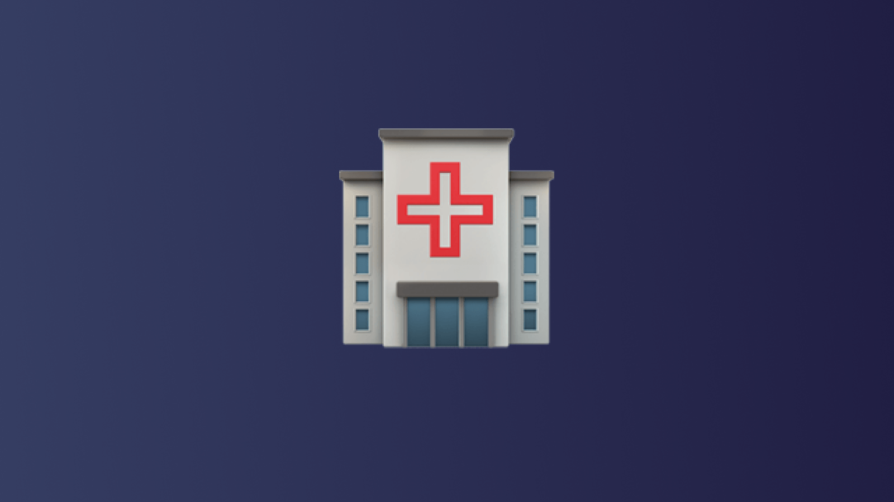

# Endpoint management's crucial role in healthcare

The healthcare industry faces a unique and urgent cybersecurity challenge. Sensitive patient data and increasing reliance on interconnected devices create a prime target for cyberattacks. A large healthcare provider experiencing a data breach could compromise the personal information of millions of patients, underscoring the dire need for robust security measures. Endpoint management emerges as a critical line of defense in this complex landscape. Let's explore why endpoint management is essential for securing healthcare environments.

Firstly, healthcare organizations are experiencing an explosion in the variety of endpoints. Beyond traditional desktops and laptops, numerous mobile devices, medical equipment, printers, and IoT (Internet of Things) gadgets are now connected to the network. Each of these endpoints represents a potential gateway for cyber threats. Effective endpoint management offers a centralized solution to inventory, monitor, and secure these diverse devices, ensuring comprehensive protection across the entire network. Administrators gain real-time visibility, enabling them to consistently identify vulnerabilities and enforce security policies.

In addition to device diversity, another significant challenge is the human element. Accidental clicks on phishing emails or downloaded malware can easily compromise sensitive data. Endpoint management solutions mitigate these risks by deploying application allowlisting and content filtering. Application allowlisting allows only approved software to run on the network, preventing unauthorized programs from executing, while content filtering blocks access to harmful or inappropriate websites. These tools restrict access to malicious websites and prevent unauthorized software installations, thereby safeguarding the healthcare network from user error. For example, one hospital reduced phishing-related incidents by 40% after implementing an endpoint management system with these features.

Moreover, endpoint management streamlines security processes by automating critical tasks. Patch management becomes effortless, ensuring all devices receive the latest security updates promptly. This proactive approach significantly reduces the window of vulnerability that attackers can exploit. Additionally, endpoint management simplifies remote access control, allowing authorized personnel to securely access patient data from any location, an essential feature in today's increasingly mobile workforce.

The importance of endpoint management extends beyond just technical benefits. Robust endpoint security fosters compliance with regulations like HIPAA and HITECH, which mandate strict data protection measures. Healthcare organizations can build trust with patients and stakeholders by committing to endpoint security. A clinic that implements a comprehensive endpoint management strategy will see an increase in patient satisfaction and trust, as patients feel more secure knowing their data is protected.

However, implementing endpoint management requires careful consideration. The specific needs of the healthcare facility must be factored in when choosing a solution. Scalability is crucial, as the number of endpoints is likely to grow. Additionally, the chosen platform should integrate seamlessly with existing healthcare IT infrastructure. While the initial investment might seem daunting, the long-term benefits of security, compliance, and trust far outweigh the costs.

Endpoint management is no longer an optional add-on but a vital component of any healthcare security strategy. By providing centralized control, automating security tasks, and mitigating human error, endpoint management safeguards sensitive patient data, fosters compliance, and builds trust. As the healthcare landscape evolves, endpoint management practices must also ensure a secure environment for patient care and data protection. Investing in advanced endpoint management is not just about protecting data; it's about safeguarding lives and patients' trust in healthcare providers.

As cyber threats grow more sophisticated, the healthcare industry must prioritize endpoint management to protect its most valuable asset: patient data. By staying ahead of the curve with robust endpoint management solutions, healthcare organizations can ensure they are well-equipped to face the challenges of tomorrow. Fleet offers comprehensive tools to inventory, monitor, and secure macOS, Linux, Windows, and Chromebooks, making it an invaluable partner in safeguarding sensitive patient data, fostering compliance, and building trust in healthcare providers. Investing in advanced endpoint management with Fleet is not just about protecting data; it's about safeguarding lives and maintaining patients' trust in their healthcare providers.

 

<meta name="category" value="announcements">
<meta name="authorFullName" value="Alex Mitchell">
<meta name="authorGitHubUsername" value="alexmitchelliii">
<meta name="publishedOn" value="2024-05-24">
<meta name="articleTitle" value="Endpoint management's crucial role in healthcare">
<meta name="articleImageUrl" value="../website/assets/images/articles/endpoint-managements-crucial-role-in-healthcare-1600x900@2x.png">
<meta name="description" value="Discover how robust endpoint management is essential for securing healthcare data, ensuring compliance, and building patient trust.">
