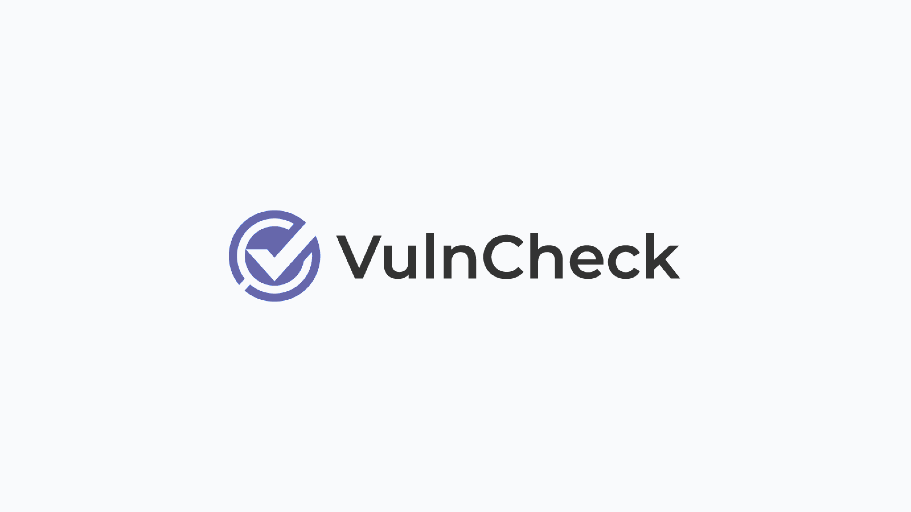

# Enhancing Fleet's vulnerability management with VulnCheck integration 

Staying ahead of threats is paramount. For Fleet users, this means having the right tools and ensuring they are optimized for performance and efficiency. We're excited to include VulnCheck for centralized Common Platform Enumeration (CPE) data.

IT administrators and CISOs have long found managing CPE data across diverse environments challenging. The sheer volume of information and the need for accuracy and timeliness can strain resources and compromise security. Recognizing this, Fleet partnered with VulnCheck for a solution to streamline CPE data management and enhance security workflows.

### CPE data

Common Platform Enumeration is a vital component in identifying and mitigating vulnerabilities. CPEs provide a standardized nomenclature for describing and identifying the software applications and operating systems affected by specific vulnerabilities. With the National Vulnerability Database (NVD) sometimes lagging in attaching CPEs to recent vulnerabilities—some published over a month late—Fleet users face the dilemma of potential blind spots in their vulnerability detection mechanisms. Since Fleet relies on CPEs to match software inventory collected via osquery to CVEs, any delay or absence in CPE data from the NVD directly impacts Fleet's ability to accurately detect and address CVEs, posing significant implications for performance and security.

### Introducing VulnCheck

At its core, VulnCheck acts as a reliable bridge to the NIST National Vulnerability Database (NVD), ensuring persistent and accurate connections to the latest CVE data. Leveraging its high-performance API and downloadable CVE data, VulnCheck offers Fleet users unparalleled access to up-to-date vulnerability information. What sets VulnCheck apart is its integration of NVD++, a community-driven initiative to enhance the reliability and accessibility of NVD data. By tapping into NVD++, VulnCheck provides Fleet users with a comprehensive repository of CPE data, regardless of delays in the official NVD feed. This centralized approach to CPE data management streamlines the vulnerability detection process within Fleet, empowering IT administrators to identify and remediate security threats swiftly. The benefits of integrating VulnCheck into Fleet are manifold: enhanced accuracy in vulnerability detection, improved timeliness of threat response, and, ultimately, strengthened security posture for organizations of all sizes. This strategic partnership fortifies organizations' security posture and empowers administrators with the tools to manage and mitigate potential threats proactively.

### Enhanced Data Reliability with VulnCheck

The integration of VulnCheck significantly bolsters the reliability of the data Fleet uses for vulnerability management. Recently, the National Vulnerability Database (NVD) faced disruptions that affected its ability to enrich CVEs with crucial matching data, leading to potential vulnerabilities remaining undetected. This is where VulnCheck steps in with its NVD++ service. By enriching its feeds independently, VulnCheck offers a more consistent and reliable data source, ensuring that Fleet users do not experience gaps in vulnerability detection. This is especially critical when the NVD data pipeline faces lags or interruptions, as was seen with several CVEs pending analysis and lacking essential software matching data.

### Streamlining Vulnerability Management

The practical implications of integrating VulnCheck's enriched data are profound. For instance, the initial synchronization time for setting up vulnerability management in Fleet has been substantially reduced. Where it previously took about 17 minutes to load NVD data—a considerable delay for new users—this process is now more efficient thanks to enriched data from VulnCheck and pre-processing by Fleet. Moreover, the reliability of data fetch operations has improved with fewer retries needed, mitigating the impact of NVD API's occasional unavailability. This enhancement allows Fleet to offer more immediate value to new users, significantly shortening the time to useful data and enabling faster, more reliable vulnerability scanning.

### Conclusion

Staying ahead of threats with efficient tools and systems is not just an option but a necessity. Fleet and VulnCheck introduce a robust solution tailored to enhance the security frameworks of diverse organizations. This integration alleviates the strains of managing large volumes of security data by centralizing and streamlining CPE data management. It ensures that Fleet users can rely on up-to-date and accurate vulnerability information. Incorporating VulnCheck’s NVD++ service into Fleet’s vulnerability management process significantly advances our ability to offer timely and effective security responses, minimizing potential exposure to threats. As we continue to enhance our capabilities, Fleet remains committed to providing our users with the most reliable and efficient tools necessary to safeguard their digital environments against the ever-changing threat landscape.

<meta name="category" value="announcements">
<meta name="authorFullName" value="JD Strong">
<meta name="authorGitHubUsername" value="spokanemac">
<meta name="publishedOn" value="2024-04-23">
<meta name="articleTitle" value="Enhancing Fleet's vulnerability management with VulnCheck integration">
<meta name="articleImageUrl" value="../website/assets/images/articles/enhancing-fleets-vulnerability-management-with-vulncheck-integration-1600x900@2x.png">
