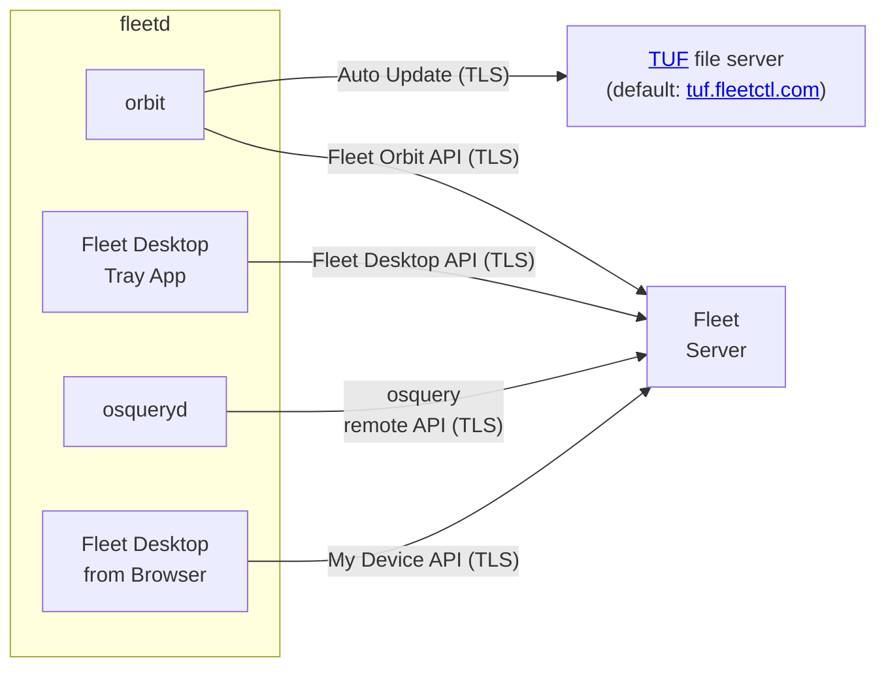

# Enroll hosts

Fleet gathers information from an [osquery](https://github.com/osquery/osquery) agent installed on each of your hosts. The recommended way to install osquery is using fleetd.

You can enroll macOS, Windows or Linux hosts via the [CLI](#cli) or [UI](#ui). To learn how to enroll Chromebooks, see [Enroll Chromebooks](#enroll-chromebooks).

### Supported osquery versions

Fleet supports the [latest version of osquery](https://github.com/osquery/osquery/tags). 

## CLI

> You must have `fleetctl` installed. [Learn how to install `fleetctl`](https://fleetdm.com/guides/fleetctl#installing-fleetctl).

The `fleetctl package` command is used to generate Fleet's agent (fleetd) install package..

The `--type` flag is used to specify the fleetd installer type.

- macOS: .pkg
  - Generating a .pkg on Linux requires [Docker](https://docs.docker.com/get-docker) to be installed and running.
- Windows: .msi
  - Generating a .msi on Windows, Intel Macs, or Linux requires [Docker](https://docs.docker.com/get-docker) to be installed and running. On Windows, you can [use WiX without Docker instead](https://fleetdm.com/guides/enroll-hosts#generating-fleetd-for-windows-using-local-wix-toolset).
  - Generating a .msi on Apple Silicon Macs requires [Wine](https://fleetdm.com/install-wine) to be installed.
- Linux: .deb or .rpm

> `fleetctl` on Windows can only generate MSI packages.

A `--fleet-url` (Fleet instance URL) and `--enroll-secret` (Fleet enrollment secret) must be specified in order to communicate with Fleet instance.

To generate fleetd for an Arm Linux or Windows host, use the `--arch=arm64` flag.

> **Fleetd for Arm Windows is an experimental feature**. This feature is undergoing rapid improvement, which may result in breaking changes to the API or configuration surface. It is not recommended for use in automated workflows.

#### Example

Generate fleetd on macOS (.pkg)

```json
fleetctl package --type pkg --fleet-url=example.fleetinstance.com --enroll-secret=85O6XRG8'!l~P&zWt_'f&$QK(sM8_D4x
```

Tip: To see all options for `fleetctl package` command, run `fleetctl package -h` in your Terminal.

## UI

To generate Fleet's agent (fleetd) in Fleet UI:

1. Go to the **Hosts** page, and select **Add hosts**.
2. Select the tab for your desired platform (e.g. macOS).
3. A CLI command with all necessary flags to generate an install package will be generated. Copy and run the command with [fleetctl](https://fleetdm.com/docs/using-fleet/fleetctl-cli) installed.

### Install fleetd

You can use your tool of choice, like [Munki](https://www.munki.org/munki/) on macOS or a package manager ([APT](https://en.wikipedia.org/wiki/APT_(software)) or [DNF](https://en.wikipedia.org/wiki/DNF_(software))) on Linux, to install fleetd. 

### Enroll hosts to a team

With hosts segmented into teams, you can apply unique queries and give users access to only the hosts in specific teams. [Learn more about teams](https://fleetdm.com/docs/using-fleet/segment-hosts).

To enroll to a specific team: from the **Hosts** page, select the desired team from the menu at the top of the screen, then follow the instructions above for generating Fleet's agent (fleetd). The team's enroll secret will be included in the generated command.

### Fleet Desktop

[Fleet Desktop](https://fleetdm.com/guides/fleet-desktop) is a menu bar icon available on macOS, Windows, and Linux that gives your end users visibility into the security posture of their machine.

You can include Fleet Desktop in Fleet's agent (fleetd) by including `--fleet-desktop` in the `fleetctl package` command.

### Debug TLS certificates and connection to Fleet

You can use `fleetctl debug connection` to troubleshoot issues with server/client TLS certificates, e.g.:
```sh
# Test TLS connection using the CA root file that will be embedded on fleetd packages:
fleetctl debug connection \
  https://fleet.example.com

# Test TLS connection using a custom CA root file:
fleetctl debug connection \
  --fleet-certificate ./your-ca-root.pem \
  https://fleet.example.com
```

## Enroll Chromebooks

> The fleetd Chrome browser extension is supported on ChromeOS operating systems that are managed using [Google Admin](https://admin.google.com). It is not intended for non-ChromeOS hosts with the Chrome browser installed.

### Overview
Google Admin uses organizational units (OUs) to organize devices and users.

One limitation in Google Admin is that extensions can only be configured at the user level, meaning that a user with a MacBook running Chrome, for example, will also get the fleetd Chrome extension.

When deployed on OSs other than ChromeOS, the fleetd Chrome extension will not perform any operation and will not appear in the Chrome toolbar. 
However, it will appear in the "Manage Extensions" page of Chrome.
Fleet admins who are comfortable with this situation can skip step 2 below.

To install the fleetd Chrome extension on Google Admin, there are two steps:

1. Create an OU for all users who have Chromebooks and force-install the fleetd Chrome extension for those users
2. Create an OU for all non-Chromebook devices and block the fleetd Chrome extension on this OU

> More complex setups may be necessary, depending on the organization's needs, but the basic principle remains the same.

### Step 1: OU for Chromebook users
Create an [organizational unit](https://support.google.com/a/answer/182537?hl=en) where the extension should be installed. [Add all the relevant users](https://support.google.com/a/answer/182449?hl=en) to this OU.

In the Google Admin console:

1. In the navigation menu, visit **Devices > Chrome > Apps & Extensions > Users & browsers**.
2. Select the relevant OU where you want the fleetd Chrome extension to be installed.
3. In the bottom right, select the **+** button and select **Add Chrome app or extension by ID**.
4. Go to your Fleet instance and select **Hosts > Add Hosts** and select **ChromeOS** in the popup modal.
5. Enter the **Extension ID**, **Installation URL**, and **Policy for extensions** using the data provided in the modal.
6. Under **Installation Policy**, select **Force install**, and under **Update URL**, select **Installation URL** (see above).

> For the fleetd Chrome extension to have full access to Chrome data, it must be force-installed by enterprise policy as per above

### Step 2: OU to block non-Chromebook devices
Create an [organizational unit](https://support.google.com/a/answer/182537?hl=en) to house devices where the extension should not be installed. [Add all the relevant devices](https://support.google.com/chrome/a/answer/2978876?hl=en) to this OU.

In the Google Admin console:

1. In the navigation menu, select **Devices > Chrome > Managed Browsers**.
2. Select the relevant OU where you want the fleetd Chrome extension to be blocked.
3. In the bottom right, select the **+** button and select **Add Chrome app or extension by ID**.
4. Go to your Fleet instance and select **Hosts > Add Hosts** and select **ChromeOS** in the popup modal.
5. Enter the **Extension ID** and **Installation URL** using the data provided in the modal.
6. Under **Installation Policy**, select **Block**.

### Unenroll

How to unenroll a host from Fleet:

1. Determine if your host has MDM features turned on by looking at the **MDM status** on the host's **Host details** page. 

2. For macOS hosts with MDM turned on, select **Actions > Turn off MDM** to turn MDM off. Instructions for turning off MDM on Windows hosts coming soon.

3. Determine the platform of the host you're trying to unenroll, then follow the [uninstall instructions](https://fleetdm.com/guides/how-to-uninstall-fleetd) for that platform.

4. Select **Actions > Delete** to delete the host from Fleet.

> If an end user wants to switch their workstation's operating system (e.g. Windows to Linux), before they switch, delete the host from Fleet. Then, re-enroll the host.

## Advanced

- [Best practice for dual-boot workstations](#best-partice-for-dual-boot-workstations)
- [Fleet agent (fleetd) components](#fleetd-components)
- [Signing fleetd](#signing-fleetd)
- [Grant full disk access to osquery on macOS](#grant-full-disk-access-to-osquery-on-macos) 
- [Using mTLS](#using-mtls)
- [Using host identity certificates](#using-host-identity-certificates)
- [Specifying update channels](#specifying-update-channels)
- [Testing osquery queries locally](#testing-osquery-queries-locally)
- [Finding fleetd logs](#finding-fleetd-logs)
- [Using system keystore for enroll secret](#using-system-keystore-for-enroll-secret)
- [Generating fleetd for Windows using local WiX toolset](#generating-fleetd-for-windows-using-local-wix-toolset)
- [Config-less fleetd agent deployment](#config-less-fleetd-agent-deployment)
- [Experimental features](#experimental-features)

### Best practice for dual-boot workstations

When end users want to have a dual-boot environment (e.g. Windows and Linux on one computer), the best practice is to install fleetd, that uses `--host-identifier=instance`, on both operating systems. This enrolls two hosts, one per operating system, in Fleet.

### fleetd components



### Signing fleetd

  >**Note:** Currently, the `fleetctl package` command does not support signing Windows fleetd. Windows fleetd can be signed after building.

The `fleetctl package` command supports signing and notarizing macOS fleetd via the
`--sign-identity` and `--notarize` flags.

Check out the example below:

```sh
  AC_USERNAME=appleid@example.com AC_PASSWORD=app-specific-password fleetctl package --type pkg --sign-identity=[PATH TO SIGN IDENTITY] --notarize --fleet-url=[YOUR FLEET URL] --enroll-secret=[YOUR ENROLLMENT SECRET]
```

The above command must be run on a macOS device, as the notarizing and signing of macOS fleetd can only be done on macOS devices.

Also, remember to replace both `AC_USERNAME` and `AC_PASSWORD` environment variables with your Apple ID and a valid [app-specific](https://support.apple.com/en-ca/HT204397) password, respectively. Some organizations (notably those with Apple Enterprise Developer Accounts) may also need to specify `AC_TEAM_ID`. This value can be found on the [Apple Developer "Membership" page](https://developer.apple.com/account/#!/membership) under "Team ID."

### Grant full disk access to osquery on macOS

MacOS does not allow applications to access all system files by default. 

If you are using an MDM solution or Fleet's MDM features, one of which is required to deploy these profiles, you can deploy a "Privacy Preferences Policy Control" policy to grant fleetd or osquery that level of access. 

This is required to query for files located in protected paths as well as to use event
tables that require access to the [EndpointSecurity API](https://developer.apple.com/documentation/endpointsecurity#overview), such as *es_process_events*.

#### Creating the configuration profile

##### Obtaining identifiers

If you use plain osquery, instructions are [available here](https://osquery.readthedocs.io/en/stable/deployment/process-auditing/).

On a system with osquery installed via Fleet's agent (fleetd), obtain the
`CodeRequirement` of fleetd by running:

```sh
codesign -dr - /opt/orbit/bin/orbit/macos/stable/orbit
```

The output should be similar or identical to:

```sh
Executable=/opt/orbit/bin/orbit/macos/edge/orbit
designated => identifier "com.fleetdm.orbit" and anchor apple generic and certificate 1[field.1.2.840.113635.100.6.2.6] /* exists */ and certificate leaf[field.1.2.840.113635.100.6.1.13] /* exists */ and certificate leaf[subject.OU] = "8VBZ3948LU"
```

Note down the **executable path** and the entire **identifier**.

Osqueryd will inherit the privileges from Orbit and does not need explicit permissions.

##### Creating the profile

Depending on your MDM, this might be possible in the UI or require a custom profile. If your MDM has a feature to configure *Policy Preferences*, follow these steps:

1. Configure the identifier type to “path.”
2. Paste the full path to Orbit as the identifier.
3. Paste the full code signing identifier into the Code requirement field. 
4. Allow “Access all files.” Access to Downloads, Documents, etc., is inherited from this.

If your MDM solution does not have built-in support for privacy preferences profiles, you can use
[PPPC-Utility](https://github.com/jamf/PPPC-Utility) to create a profile with those values, then upload it to
your MDM as a custom profile.

##### Test the profile
Link the profile to a test group that contains at least one Mac.
Once the computer has received the profile, which you can verify by looking at *Profiles* in *System
Preferences*, run this query from Fleet:

```sql
SELECT * FROM file WHERE path LIKE '/Users/%/Downloads/%%';
```

If this query returns files, the profile was applied, as **Downloads** is a
protected location. You can now enjoy the benefits of osquery on all system files and start
using the **es_process_events** table!

If this query does not return data, you can look at operating system logs to confirm whether or not full disk
access has been applied.

See the last hour of logs related to TCC permissions with this command:

`log show --predicate 'subsystem == "com.apple.TCC"' --info --last 1h`

You can then look for `orbit` or `osquery` to narrow down results.

### Using mTLS

`Applies only to Fleet Premium`

Fleet's agent (fleetd) and the fleetd Chrome browser extension support mTLS.

#### Fleetd agent

The fleetd agent supports using TLS client certificates for authentication to the Fleet server and [TUF](https://theupdateframework.io/) server.

When generating fleetd, use the following flags:
```sh
fleetctl package \
  [...]
  --fleet-tls-client-certificate=fleet-client.crt \
  --fleet-tls-client-key=fleet-client.key \
  --update-tls-client-certificate=update-client.crt \
  --update-tls-client-key=update-client.key \
  [...]
```
The certificates must be in PEM format.

The client certificates can also be pushed to existing installations by placing them in the following locations:
- For macOS and Linux:
  - `/opt/orbit/fleet_client.crt`
  - `/opt/orbit/fleet_client.key`
  - `/opt/orbit/update_client.crt`
  - `/opt/orbit/update_client.key`
- For Windows:
  - `C:\Program Files\Orbit\fleet_client.crt`
  - `C:\Program Files\Orbit\fleet_client.key`
  - `C:\Program Files\Orbit\update_client.crt`
  - `C:\Program Files\Orbit\update_client.key`

If using Fleet Desktop, you may need to specify an alternative host for the "My device" URL (in the Fleet tray icon).
Such alternative host should not require client certificates on the TLS connection.
```sh
fleetctl package
  [...]
  --fleet-desktop \
  --fleet-desktop-alternative-browser-host=fleet-desktop.example.com \
  [...]
```
If this setting is not used, you will need to configure client TLS certificates on devices' browsers.

#### fleetd Chrome browswer extension

To use mTLS use the [AutoSelectCertificateForUrls policy](https://chromeenterprise.google/policies/?policy=AutoSelectCertificateForUrls) to point Chrome to your client certificates

### Using host identity certificates

`Applies only to Fleet Premium`

Host identity certificates allow Fleet's agent (fleetd) to use hardware-backed client certificates for authentication to the Fleet server. All orbit and osquery requests (except `/api/fleet/orbit/ping` requests) to the Fleet server will include an HTTP message signature for enhanced security.

This feature uses the host's TPM (Trusted Platform Module) to generate and store cryptographic keys, providing strong hardware-based authentication.

This provides a level of security similar to [mTLS](#using-mtls), but the certificate is hardware-backed and managed by the TPM rather than being stored as a file on disk. The TPM ensures the private key cannot be extracted or copied, providing stronger security guarantees.

Currently, host identity certificates are only supported for Linux hosts (`.deb` and `.rpm` fleetd agents) with TPM 2.0 hardware (or vTPM for VMs) and Linux kernel 4.12 or later.

#### Generating fleetd with host identity certificates

To use host identity certificates, generate fleetd with the `--fleet-managed-host-identity-certificate` flag:

```sh
fleetctl package \
  --type deb \
  --fleet-url=https://fleet.example.com \
  --enroll-secret=your-enroll-secret \
  ----fleet-managed-host-identity-certificate
```

#### Important considerations

- Hosts without TPM 2.0 will fail to enroll when this option is enabled
- This feature cannot be combined with other client certificate options (`--fleet-tls-client-certificate`)
- SCEP certificate requests can be throttled by the [osquery_enroll_cooldown](https://fleetdm.com/docs/configuration/fleet-server-configuration#osquery-enroll-cooldown) server option, similar to how fleetd enrollments are throttled
- When a host requests a host identity certificate, the server will expect all future traffic from that host to be signed with HTTP message signatures. This allows mixed environments where some hosts use managed client certificates and others do not
- Fleet administrators can enforce HTTP message signature requirements server-wide using the [auth.require_http_message_signature](https://fleetdm.com/docs/configuration/fleet-server-configuration#auth-require-http-message-signature) server configuration option

### Specifying update channels

Fleetd uses the concept of "update channels" to determine the version of it's components: Orbit, Fleet Desktop, osquery.

Configure update channels for these components with the `--orbit-channel`, `--desktop-channel` and `--osqueryd-channel` flags when running the `fleetctl package command`.

| Channel | Versions |
| ------- | -------- |
| `4`     | 4.x.x    |
| `4.6`   | 4.6.x    |
| `4.6.0` | 4.6.0    |

Additionally, `stable` and `edge` are special channel names. The `stable` channel will provide the most recent osquery version that Fleet deems to be stable. 

When a new version of osquery is released, it's added to the `edge` channel for beta testing. Fleet then provides input to the osquery TSC based on testing. After the version is declared stable by the osquery TSC, Fleet will promote the version to `stable` ASAP.

### Testing osquery queries locally

Fleet comes packaged with `osqueryi` which is a tool for testing osquery queries locally.

With fleetd installed on your host, run `orbit osqueryi` or `orbit shell` to open the `osqueryi`.

### Finding fleetd logs

Fleetd will send stdout/stderr logs to the following directories:

  - macOS: `/private/var/log/orbit/orbit.std{out|err}.log`.
  - Windows: `C:\Windows\system32\config\systemprofile\AppData\Local\FleetDM\Orbit\Logs\orbit-osquery.log` (the log file is rotated).
  - Linux: Orbit and osqueryd stdout/stderr output is sent to syslog (`/var/log/syslog` on Debian systems, `/var/log/messages` on CentOS, and `journalctl -u orbit` on Fedora).

If the `logger_path` agent configuration is set to `filesystem`, fleetd will send osquery's "result" and "status" logs to the following directories:
  - Windows: `C:\Program Files\Orbit\osquery_log`
  - macOS: `/opt/orbit/osquery_log`
  - Linux: `/opt/orbit/osquery_log`

The Fleet Desktop log files can be found in the following directories depending on the platform:

  - Linux: `$XDG_STATE_HOME/Fleet or $HOME/.local/state/Fleet`
  - macOS: `$HOME/Library/Logs/Fleet`
  - Windows: `%LocalAppData%/Fleet`

The log file name is `fleet-desktop.log`.

### Using system keystore for enroll secret

On macOS and Windows, fleetd will add the enroll secret to the system keystore (Keychain on macOS, Credential Manager on Windows) on launch. Subsequent launches will retrieve the enroll secret from the keystore.

System keystore access can be disabled via `--disable-keystore` flag for the `fleetctl package` command. On macOS, subsequent installations of fleetd must be signed by the same organization as the original installation to access the enroll secret in the keychain.

>**Note:** The keychain is not used on macOS when the enroll secret is provided via MDM profile. Keychain support when passing the enroll secret via MDM profile is coming soon.

### Generating fleetd for Windows using local WiX toolset

`Applies only to Fleet Premium`

When generating Fleet's agent (fleetd) for Windows hosts (**.msi**) on a Windows or macOS machine, you can tell `fleetctl package` to
use local installations of the 3 WiX v3 binaries used by this command (`heat.exe`, `candle.exe`, and
`light.exe`) instead of those in a pre-configured container, which is the default behavior. To do
so:
  1. Download the [WiX v3 binaries](https://github.com/wixtoolset/wix3/releases/download/wix3112rtm/wix311-binaries.zip), then unzip the downloaded file.
  2. Find the absolute filepath of the directory containing your local WiX v3 binaries. This will be wherever you saved the unzipped package contents.
  3. Run `fleetctl package`, and pass the absolute path above as the string argument to the
     `--local-wix-dir` flag. For example:
     ```
      fleetctl package --type msi --fleet-url=[YOUR FLEET URL] --enroll-secret=[YOUR ENROLLMENT SECRET] --local-wix-dir "\Users\me\AppData\Local\Temp\wix311-binaries"
     ```
     If the provided path doesn't contain all 3 binaries, the command will fail.

>**Note:** Creating a fleetd agent for Windows (.msi) on macOS also requires Wine. We've built a [Wine installation script](https://fleetdm.com/install-wine) to help you get it.

### Config-less fleetd agent deployment

Config-less deployment allows for Fleet's agent (fleetd) to be installed without embedding configuration settings directly into the package. This approach is ideal for environments requiring flexibility in managing enrollment secrets and server URLs. For detailed instructions, visit the [Config-less fleetd agent deployment guide](https://fleetdm.com/guides/config-less-fleetd-agent-deployment).

>**Warning:** If you remove the configuration profile with the settings from macOS, `fleetd` won't work anymore until a similar profile is installed again. If the profile is delivered via MDM, and MDM is turned off, you might face this scenario.

### Experimental features

> Any features listed here are not recommended for use in production environments

**Using `fleetd` without enrolling Orbit**

*Only available in fleetd v1.15.1 on Linux and macOS*

It is possible to generate a fleetd package that does not connect to Fleet by omitting the `--fleet-url` and `--enroll-secret` flags when building a package.

This can be useful in situations where you would like to test using `fleetd` to manage osquery updates while still managing osquery command-line flags and extensions locally 
but can result in a large volume of error logs. In fleetd v1.15.1, we added an experimental feature to reduce log chatter in this scenario.
 
Applying the environmental variable `"FLEETD_SILENCE_ENROLL_ERROR"=1` on a host will silence fleetd enrollment errors if a `--fleet-url` is not present.
This variable is read at launch and will require a restart of the Orbit service if it is not set before installing `fleetd` v1.15.1.

<meta name="category" value="guides">
<meta name="authorGitHubUsername" value="noahtalerman">
<meta name="authorFullName" value="Noah Talerman">
<meta name="publishedOn" value="2024-08-08">
<meta name="articleTitle" value="Enroll hosts">
<meta name="description" value="Learn how to enroll hosts to Fleet.">
