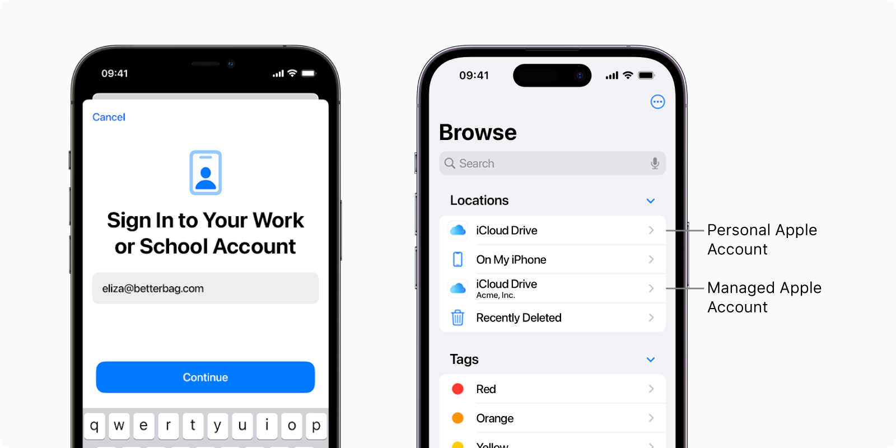

# Account-driven User Enrollment for personal Apple devices (BYOD)



_Available in Fleet Premium._

In Fleet, you can allow your end users to enroll their personal iPhones and iPads to Fleet using [Account-driven User Enrollment](https://support.apple.com/en-gb/guide/deployment/dep23db2037d/web).

With Account-driven User Enrollment, end users can separate work and personal data using their [Managed Apple Account](https://support.apple.com/en-gb/guide/apple-business-manager/axm78b477c81/web). End users retain privacy over their personal information, while IT admins manage work-related OS settings and applications.

- [Step 1: Connect Apple Business Manager (ABM) to Fleet](#step-1-connect-apple-business-manager-abm-to-fleet)
- [Step 2: Add and verify your domain in Apple Business Manager (ABM)](#step-2-add-and-verify-your-domain-in-apple-business-manager-abm)
- [Step 3: Connect (federate) your identity provider (IdP) with Apple Business Manager (ABM)](#step-3-connect-federate-your-identity-provider-idp-with-apple-business-manager-abm)
- [Step 4: Create a team for personal hosts](#step-4-create-a-team-for-personal-hosts)
- [Step 5: Log in on the device to enroll to Fleet (end user's iPhone or iPad)](#step-5-log-in-on-the-device-to-enroll-to-fleet-end-users-iphone-or-ipad)


## Step 1: Connect Apple Business Manager (ABM) to Fleet

1. Follow the [instructions](https://fleetdm.com/guides/macos-mdm-setup#apple-business-manager-abm) to connect ABM to Fleet.
> **Note:** You may skip this if you have already connected ABM to enable automatic enrollment. 
2. For Account-driven User Enrollment to work, ensure that personal (BYOD) iOS and iPadOS hosts are associated with Fleet in the **Default Server Assignment** section in Apple Business Manager. 
> **Note:** If you're trying Fleet and testing Account-driven User Enrollment, [self-host a service discovery file](#self-host-a-service-discovery-file-well-known-resource) instead. That way, hosts keep enrolling to your current MDM solution instead of Fleet.

## Step 2: Add and verify your domain in Apple Business Manager (ABM)

Follow the [Apple documentation](https://support.apple.com/en-gb/guide/apple-business-manager/axm48c3280c0/web#axm2033c47b0) to add and verify your company domain in your ABM. Use the domain name associated with your work email (for example, `yourcompany.com` from `name@yourcompany.com`). This will enable the automatic creation of Apple Managed Accounts from your identity provider (IdP) accounts in the next step.

## Step 3: Connect (federate) your identity provider (IdP) with Apple Business Manager (ABM)

Follow the [Apple documentation](https://support.apple.com/en-gb/guide/apple-business-manager/axmb19317543/web) to connect your identity provider (IdP). This will enable end users to log in to their Managed Apple Account using their existing IdP credentials.

> **Note:** For visual walk-throughs, see [Connect Google Workspace to ABM](https://www.youtube.com/watch?v=CPfO6W67d3A) and [Connect Microsoft Entra ID to ABM](https://www.youtube.com/watch?v=_-PnhMurAVk).

## Step 4: Create a team for personal hosts

Fleet's [best practice](https://fleetdm.com/guides/teams#best-practice) is to create a team, e.g., `📱🔐 Personal mobile devices`, for personal hosts that have access to company resources.

In this team you can add custom OS settings that are compatible with hosts enrolled with Account-driven User Enrollment. To find out which payloads are compatible with User Enrollment, visit the [Apple documentation](https://support.apple.com/en-gb/guide/deployment/dep6ae3f1d5a/1/web/1.0).

## Step 5: Log in on the device to enroll to Fleet (end user's iPhone or iPad)

On their iPhone or iPad, ask end users to:

1. Open the **Settings** app.
2. Go to **General > VPN & Device Management**.
3. Tap **Sign In to Work or School Account**.
4. Sign in with their IdP credentials (e.g., Google Workspace or Microsoft Entra ID).

After signing in, the device will automatically enroll in Fleet.

## Self-host a service discovery file (well-known resource)

>**Note:** 
> - If your iOS/iPadOS hosts are running version 18.2 or later, you can skip this. Fleet manages service discovery automatically for these versions.
> - If your iOS/iPadOS hosts are running a version below 18.2 or you're trying Fleet, you'll need to self-host a [service discovery JSON file](https://support.apple.com/en-gb/guide/deployment/dep4d9e9cd26/web#depcae01b5df).
> - If you're trying Fleet and using a different MDM solution in production, hosting this file will direct only Account-driven User Enrollments to Fleet. iOS/iPadOS hosts purchased in ABM and hosts using an enrollment profile will still enroll to your current MDM solution.

Host the JSON file below at the following URL: `https://<company_domain>/.well-known/com.apple.remotemanagement.`

> **Note:** Make sure to include the trailing dot in the URL when hosting the file.

Make sure the `Content-Type` header is set to `application/json`.

```json
{
  "Servers": [
    {
      "Version": "mdm-byod",
      "BaseURL": "https://<fleet_server_url>/api/mdm/apple/account_driven_enroll"
    }
  ]
}
```

## Host vitals limitations

Apple limits the amount of host vitals Fleet can collect on personal iOS/iPadOS hosts. 

- Fleet can't collect serial numbers from personal iOS/iPadOS hosts.
- Software inventory will only include applications installed by Fleet.

<meta name="articleTitle" value="Account-driven User Enrollment for personal Apple devices (BYOD)">
<meta name="authorFullName" value="Marko Lisica">
<meta name="authorGitHubUsername" value="marko-lisica">
<meta name="category" value="guides">
<meta name="publishedOn" value="2025-08-08">
<meta name="description" value="Enroll personal (BYOD) iPhones and iPads with Managed Apple Account">
