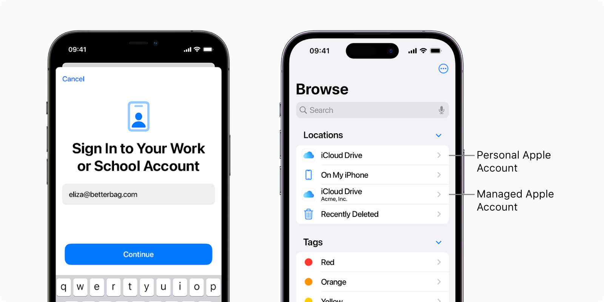

# Enroll personal (BYOD) iPhones and iPads with Managed Apple Account



_Available in Fleet Premium._

In Fleet, you can allow your end users to enroll their personal iPhones and iPads to Fleet using [Account-driven User Enrollment](https://support.apple.com/en-gb/guide/deployment/dep23db2037d/web).

With Account-driven User Enrollment, end users can separate work and personal data using their [Managed Apple Account](https://support.apple.com/en-gb/guide/apple-business-manager/axm78b477c81/web). End users retain privacy over their personal information, while IT admins manage work-related OS settings and applications.

- [Step 1: Connect Apple Business Manager (ABM) to Fleet](#step-1-connect-apple-business-manager-abm-to-fleet)
- [Step 2: Add and verify your domain in Apple Business Manager (ABM)](#step-2-add-and-verify-your-domain-in-apple-business-manager-abm)
- [Step 3: Connect (federate) your identity provider (IdP) with Apple Business Manager (ABM)](#step-3-connect-federate-your-identity-provider-idp-with-apple-business-manager-abm)
- [Step 4: Create a `📱🔐 Personal mobile devices` team](#step-4-create-a-code-personal-mobile-devices-code-team)
- [Step 5: Login to enroll to Fleet (end user experience)](#step-5-login-to-enroll-to-fleet-end-user-experience)


## Step 1: Connect Apple Business Manager (ABM) to Fleet

1. Follow the [instructions](https://fleetdm.com/guides/macos-mdm-setup#apple-business-manager-abm) to connect ABM to Fleet.
2. If you have already connected ABM to enable automatic enrollment, skip the previous step. 
3. For User Enrollment to work, ensure that personal (BYOD) iOS and iPadOS hosts are associated with Fleet in the **Default Server Assignment** section. If you're trying Fleet and testing Account-driven enrollment, [self-host a service discovery file](#self-host-a-service-discovery-file-well-known-resource) instead. That way, hosts keep enrolling to your current MDM solution instead of Fleet.

## Step 2: Add and verify your domain in Apple Business Manager (ABM)

Follow the [Apple documentation](https://support.apple.com/en-gb/guide/apple-business-manager/axm48c3280c0/web#axm2033c47b0) to add and verify your company domain in your ABM. Use the domain name associated with your work email (for example, yourcompany.com from name@yourcompany.com). This will enable the automatic creation of Apple Managed Accounts from your identity provider (IdP) accounts in the next step.

## Step 3: Connect (federate) your identity provider (IdP) with Apple Business Manager (ABM)

Follow the [Apple documentation](https://support.apple.com/en-gb/guide/apple-business-manager/axmb19317543/web) to connect your identity provider (IdP). This will enable end users to log in to their Managed Apple Account using their existing IdP credentials.

You can watch these videos as well:
 - [Connect Google Workspace to ABM](https://www.youtube.com/watch?v=CPfO6W67d3A)
 - [Connect Microsoft Entra ID to ABM](https://www.youtube.com/watch?v=_-PnhMurAVk)

## Step 4: Create a `📱🔐 Personal mobile devices` team.

Fleet's [best practice](https://fleetdm.com/guides/teams#best-practice) is to create team for personal hosts that have access to a company resources.

In this team you can add custom OS settings that are compatible with hosts enrolled with Acount-driven User Enrollment. To find out which payloads are compatible with User Enrollment, visit the [Apple documentation](https://support.apple.com/en-gb/guide/deployment/dep6ae3f1d5a/1/web/1.0).

## Step 5: Login to enroll to Fleet (end user experience)

Ask your end users to go to **Settings > General > VPN & Device Management > Sign In to Work or School Account...** and log in using their IdP credentials.

When they login, their iOS/iPadOS host will enroll to Fleet.

## Self-host a service discovery file (well-known resource)


If your iOS/iPadOS hosts are running iOS 18.2/iPadOS 18.2 and later, you can skip need this. Fleet manages service discovery for hosts running iOS 18.2/iPadOS 18.2 and later. 

If your iOS/iPadOS hosts are below iOS 18.2/iPadOS 18.2 or you're trying Fleet, you have to self-host a [service discovery JSON file](https://support.apple.com/en-gb/guide/deployment/dep4d9e9cd26/web#depcae01b5df).

If you're trying Fleet and using a different MDM solution in production, hosting this file will direct only Account-driven user enrollments to the Fleet. iOS/iPadOS hosts purchased in ABM and hosts that use an enrollment profile will still enroll to your current MDM solution.

Host this JSON file below at the following URL: `https://<company_domain>/.well-known/com.apple.remotemanagement.`

Make sure the `Content-Type` header is set to `application/json`.

```json
{
  "Servers": [
    {
      "Version": "mdm-byod",
      "BaseURL": "https://<fleet_server_url>/api/mdm/apple/account_driven_enroll"
    }
  ]
}
```

## Inventory limitations

- Fleet does not have access to the serial numbers of personal hosts due to Apple's privacy limitations.
- For personal hosts, Fleet can only inventory applications installed by Fleet.

<meta name="articleTitle" value="Enroll personal (BYOD) iPhones and iPads with Managed Apple Account">
<meta name="authorFullName" value="Marko Lisica">
<meta name="authorGitHubUsername" value="marko-lisica">
<meta name="category" value="guides">
<meta name="publishedOn" value="2025-08-01">
<meta name="description" value="Enroll personal iPhones and iPads using Account-driven User Enrollment">