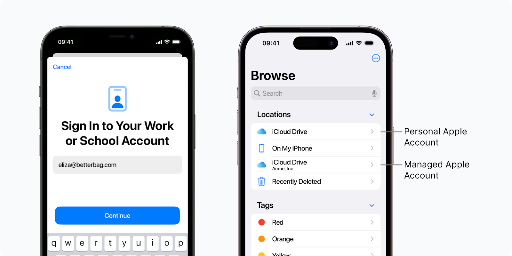

# Account-driven User Enrollment for personal Apple devices (BYOD)



_Available in Fleet Premium._

In Fleet, you can allow your end users to enroll their personal iPhones and iPads to Fleet using [Account-driven User Enrollment](https://support.apple.com/en-gb/guide/deployment/dep23db2037d/web).

With Account-driven User Enrollment, end users can separate work and personal data using their [Managed Apple Account](https://support.apple.com/en-gb/guide/apple-business-manager/axm78b477c81/web). End users retain privacy over their personal information, while IT admins manage work-related OS settings and applications.

- [Step 1: Connect Apple Business (AB) to Fleet](#step-1-connect-apple-business-manager-abm-to-fleet)
- [Step 2: Add and verify your domain in Apple Business (AB)](#step-2-add-and-verify-your-domain-in-apple-business-manager-abm)
- [Step 3: Connect (federate) your identity provider (IdP) with Apple Business (AB)](#step-3-connect-federate-your-identity-provider-idp-with-apple-business-manager-abm)
- [Step 4: Create a fleet for personal hosts](#step-4-create-a-fleet-for-personal-hosts)
- [Step 5: Log in on the device to enroll to Fleet (end user's iPhone or iPad)](#step-5-log-in-on-the-device-to-enroll-to-fleet-end-users-iphone-or-ipad)


## Step 1: Connect Apple Business (AB) to Fleet

1. If you haven't already, follow the [Apple Business (AB) instructions](https://fleetdm.com/guides/macos-mdm-setup#apple-business-manager-abm) to connect it to Fleet.

2. In AB, go to **Devices > Management** and make sure the **Default Device Assignment** for iPads and iPhones is set to Fleet.

If you're testing Account-driven User Enrollment with Fleet, switch the **Default Device Assignment** when no iPads or iPhones are expected to enroll, then switch it back when you're done.

To keep non–Account-driven enrollments on your current MDM while sending only Account-driven enrollments to Fleet, you can [self-host a service discovery file](#self-host-a-service-discovery-file-well-known-resource).

## Step 2: Add and verify your domain in Apple Business (AB)

Follow the [Apple documentation](https://support.apple.com/en-gb/guide/business/axm7909096bf/web) to add and verify your company domain in your AB. Use the domain name associated with your work email (for example, `yourcompany.com` from `name@yourcompany.com`). This will enable the automatic creation of Apple Managed Accounts from your identity provider (IdP) accounts in the next step.

## Step 3: Connect (federate) your identity provider (IdP) with Apple Business (AB)

Follow the [Apple documentation](https://support.apple.com/en-gb/guide/business/axm7909096bf/web) to connect your identity provider (IdP). This will enable end users to log in to their Managed Apple Account using their existing IdP credentials.

> For visual walk-throughs, see [Connect Google Workspace to AB](https://www.youtube.com/watch?v=CPfO6W67d3A) and [Connect Microsoft Entra ID to AB](https://www.youtube.com/watch?v=_-PnhMurAVk). These videos show the old Apple Business Manager interface. Updates [coming soon](https://github.com/fleetdm/fleet/issues/43626). 

## Step 4: Create a fleet for personal hosts

Fleet's [best practice](https://fleetdm.com/guides/fleet#best-practice) is to create a fleet, for personal hosts that have access to company resources.

In this fleet you can add custom OS settings that are compatible with hosts enrolled with Account-driven User Enrollment. To find out which payloads are compatible with User Enrollment, visit the [Apple documentation](https://support.apple.com/en-gb/guide/deployment/dep6ae3f1d5a/1/web/1.0).

## Step 5: Log in on the device to enroll to Fleet (end user's iPhone or iPad)

On their iPhone or iPad, ask end users to:

1. Open the **Settings** app.
2. Go to **General > VPN & Device Management**.
3. Tap **Sign In to Work or School Account**.
4. Sign in with their IdP credentials (e.g., Google Workspace or Microsoft Entra ID).

After signing in, the device will automatically enroll in Fleet.

## Self-host a service discovery file (well-known resource)

- If your iOS/iPadOS hosts are running version 18.2 or later, skip this step. Fleet manages service discovery automatically for these versions.
- If your iOS/iPadOS hosts are running a version below 18.2, self-host a [service discovery JSON file](https://support.apple.com/en-gb/guide/deployment/dep4d9e9cd26/web#depcae01b5df).

> When you self-host the service discovery file, hosts will always enroll to "Unassigned." If you want to automatically assign hosts to specific fleets upon enrollment, use Fleet's default hosting behavior (i.e., skip this step). This means that to support iOS 18.2 and lower **and** have hosts go somewhere other than "Unassigned," you must manually move them after enrollment.

> If you're using another MDM in production, hosting this file sends only Account-driven User Enrollments to Fleet. Devices enrolled through AB or an enrollment profile will continue to enroll in your current MDM.

Host the JSON file below at the following URL: `https://<company_domain>/.well-known/com.apple.remotemanagement.`

> Include the trailing dot in the URL when hosting the file.

Make sure the `Content-Type` header is set to `application/json`.

```json
{
  "Servers": [
    {
      "Version": "mdm-byod",
      "BaseURL": "https://<fleet_server_url>/api/mdm/apple/account_driven_enroll"
    }
  ]
}
```

## Host vitals limitations

Apple limits the amount of host vitals Fleet can collect on personal iOS/iPadOS hosts. 

- Fleet can't collect serial numbers from personal iOS/iPadOS hosts.
- Software inventory will only include applications installed by Fleet.

<meta name="articleTitle" value="Account-driven User Enrollment for personal Apple devices (BYOD)">
<meta name="authorFullName" value="Marko Lisica">
<meta name="authorGitHubUsername" value="marko-lisica">
<meta name="category" value="guides">
<meta name="publishedOn" value="2025-08-08">
<meta name="description" value="Enroll personal (BYOD) iPhones and iPads with Managed Apple Account">
