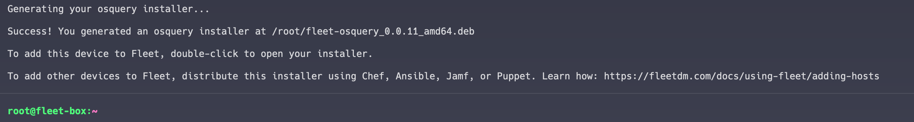
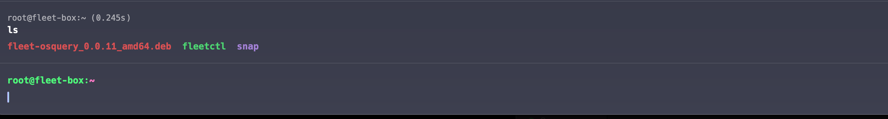
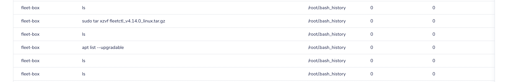

# Enrolling a DigitalOcean Droplet server on a Fleet instance


Here's a scenario: you have an Ubuntu server created as a Droplet on DigitalOcean. You want to deploy an osquery agent on that server and connect to your Fleet Instance.

In this tutorial we'll show you how to do just that.

## Prerequisites

This tutorial assumes the following:

* You're working with an Ubuntu Server on a DigitalOcean Droplet(you can follow this [guide](https://docs.digitalocean.com/products/droplets/how-to/create/) to create a new Droplet).
* You have opted to use SSH to access your Droplet and have added an SSH key from your laptop to the Droplet.

## Connect to your Droplet Server
Assuming you have created a new Droplet on DigitalOcean or have an existing Droplet with SSH access enabled, SSH into the Droplet as the root user by using the following command in your terminal:

```sh
ssh root@126.100.87.100
```

Make sure to replace the IP address above with the IP address of your Droplet. You can reference this [guide](https://docs.digitalocean.com/products/droplets/how-to/connect-with-ssh/) on how to connect to Droplets.


Once you're logged in, download the fleetctl command-line tool with the following command:

```sh
wget https://github.com/fleetdm/fleet/releases/download/fleet-v4.14.0/fleetctl_v4.14.0_linux.tar.gz
```

Next to replace the `v4.14.0` part of the URL with the current version of the fleetctl CLI tool.

Once downloaded, you can run `ls` to see the downloaded file.


## Extracting the file

You can move on to extract that file by running the following commands:

```sh
tar xzvf fleetctl_v4.14.0_linux.tar.gz
```

After the extraction is successful, you can `cd` into the folder that was extracted by running:

```sh
cd fleetctl_v4.14.0_linux/
```

Again, replace the folder with the directory you got when you did the extraction, as you may change if you are doing this setup on a later date with a newer version of the fleetctl tool.

Once you are in the directory, you can run `ls` to see that you have a fleetctl binary that you can execute.

Move this binary to the root directory by running:

```sh
mv fleetctl ~/
```

You can then `cd` back into the root directory of the Droplet server:

```sh
cd ~
```

And when you run `ls`, you'll see the fleetctl binary as well as the folder you extracted and the zipped file. You can now delete the folder and zipped file as we won’t be needing them anymore.

```sh
rm -rf fleetctl_v4.14.0_linux/ fleetctl_v4.14.0_linux.tar.gz
```

With that clean-up out of the way, execute the fleetctl binary and pass the `--version` flag to it.


If you get an output similar to the example above everything you did leading up to this point was successful. You can now move on to create the osquery installer.

## The osquery installer

With fleetctl, you can create an osquery installer for several OSes. Since we are on an Ubuntu server, we can go to our Fleet instance, locate the “Add host” button and click on the Linux(deb) tab. Then copy the command and run it on our Ubuntu machine. The command will look something like this:

```sh
./fleetctl package --type=deb --fleet-url=YOUR_FLEET_INSTANCE_URL --enroll-secret=YOUR_ENROL_SECRET_KEY
```

Once you execute that command and everything is successful, you will see an output similar to the one below.




From the output we know that a .deb file was generated in the root directory of our Droplet server. We can verify that by runnings `ls`



Finally, let’s execute that installer.

```sh
sudo apt install ./fleet-osquery_0.0.11_amd64.deb
```

This will execute the installer which will, in turn, install the osquery agent and connect to your Fleet instance.

If you visit your Fleet instance, and check for hosts, you should see your Droplet listed as one of your added hosts.


That’s it: you’ve successfully deployed an osquery agent on a DigitalOcean Droplet. You will see the name of your Droplet and not fleet-box(the original name). You can now start running queries against that Droplet in your Fleet instance.

To test out things I ran the query below in my Fleet instance with the recently enrolled Droplet as target:

```sql
SELECT * FROM shell_history;
```

Which should return all the commands typed in the shell, and I got an output like this:




<meta name="category" value="guides">
<meta name="authorGitHubUsername" value="DominusKelvin">
<meta name="authorFullName" value="Kelvin Omereshone">
<meta name="publishedOn" value="2022-05-26">
<meta name="articleTitle" value="Enrolling a DigitalOcean Droplet on a Fleet instance">
<meta name="articleImageUrl" value="../website/assets/images/articles/enrolling-a-digitalocean-droplet-server-on-a-fleet-instance-cover-1600x900@2x.jpg">
